<p align="center">
  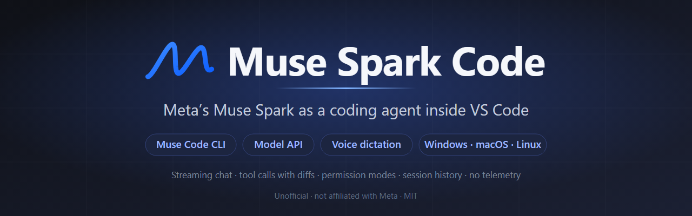
</p>

<p align="center">
  <a href="https://marketplace.visualstudio.com/items?itemName=RandyNorthrup.muse-spark-code"></a>
  <a href="https://marketplace.visualstudio.com/items?itemName=RandyNorthrup.muse-spark-code"></a>
  <a href="https://github.com/RandyNorthrup/muse-spark-code/actions/workflows/ci.yml"></a>
  
  
  <a href="#languages"></a>
  <a href="LICENSE"></a>
  <a href="https://www.paypal.com/donate/?hosted_button_id=Q9VC7B42R7K82"></a>
</p>

**Muse Spark Code** puts Meta's Muse Spark model to work inside VS Code as a
coding agent. A chat panel streams answers, reads and edits your files with
reviewable diffs, runs commands behind permission modes, and delegates to
subagents you can watch and steer. It also remembers past conversations and
takes dictation from your microphone. It runs on your Muse subscription
through the Muse Code CLI, or on a Meta Model API key, and never mixes the
two.

> Unofficial. Not affiliated with or endorsed by Meta. "Muse Spark" and "Muse
> Code" are Meta trademarks. You bring your own credentials.

**Contents:** [What's new](#whats-new-in-080) ·
[Highlights](#highlights) · [Screenshots](#screenshots) ·
[Get started](#get-started) · [Backends](#backends) ·
[Permission modes](#permission-modes) ·
[Rules, skills and memory](#rules-skills-and-memory) ·
[Muse Code's own tools](#muse-codes-own-tools) · [The panel](#the-panel) ·
[Voice dictation](#voice-dictation) · [Paid features](#paid-features) ·
[Languages](#languages) ·
[Limits](#limits) ·
[Commands](#commands-and-keybindings) · [Settings](#settings) ·
[Requirements](#requirements) · [Privacy](#privacy-and-security) ·
[Troubleshooting](#troubleshooting) · [Development](#development)

## What's new in 0.8.0

- **Your language.** The panel, its notices, the Command Palette's commands
  and the settings follow VS Code's display language in fourteen languages,
  from Chinese and Japanese to German and Czech. The translations are
  machine-made; [Languages](#languages) says how to correct one.
- **Numbers and times written your way.** Counts, percentages, money,
  durations and "5 min. ago" follow the display language's conventions.
- **Accessibility, checked in longer languages.** Running the checks on
  translated text found three problems English had hidden, now fixed:
  - the palette's search box pointed at a list that was gone;
  - code block buttons were too small to hit reliably;
  - a menu's highlighted detail line was too faint.

0.7.0 brought `/` as in Claude Code, Muse Code's skills, MCP servers and
hooks in the panel, worktrees, export, and the accessibility gate. 0.7.1 put
the new mark on the listing.

Every change is in the [CHANGELOG](CHANGELOG.md).

## Highlights

- **Streaming chat with tools you can see.** Every read, edit, write and shell
  command is a row in the transcript: green when done, pulsing while running,
  red when refused, grey when a stopped turn cut it off. Edit rows show the
  diff, the path opens the file with the changed lines selected, **Click to
  expand** opens VS Code's diff editor, and any output opens in an editor tab
  with a click.
- **Permission modes, like Claude Code.** Manual, Edit automatically, Plan and
  Auto (Bypass behind a setting), switched from the mode button or
  `Shift+Tab`. Gated commands arrive as approval cards with the CLI's own
  choices; questions from the agent arrive as question cards with radios,
  checkboxes, tabs and an "Other" answer.
- **`/` for everything.** The palette holds the actions, the model, effort
  and thinking, the permission mode and your skills; type a letter after the
  `/` and it narrows to the slash commands, as in Claude Code.
- **Subagents on a map.** When Muse Code delegates, each agent is a row and an
  **N agents** pill opens the Agent map: role, status, tokens, each agent's own
  transcript, and the controls Muse Code offers (interrupt, stop, a note,
  resume, close, a follow-up task).
- **Reply and quote with context.** A reply's ⋯ menu has **Reply to this
  output**; highlight anything in the chat and right-click for **Ask about
  this** or **Comment on this**. The passage, its author and your intent
  travel with the message.
- **Voice dictation at no cost.** Tap or hold the microphone (`Ctrl+D`) and
  speak; the words land at the caret. Windows and macOS use the recogniser
  built into the operating system, so no audio goes to a paid service unless
  you turn on Muse Voice.
- **Paid extras, only if you ask.** On a Model API key: web search with its
  sources, image files made on request, and Meta's Muse Voice for
  dictation. Each is off until you turn it on and accept its price, marked
  paid wherever it is used, and tallied in Account & usage.
- **Two backends, never mixed.** Your Muse subscription through the Muse Code
  CLI, or a Meta Model API key (pay as you go) with the extension's own
  tools. The pasted key is never handed to the CLI.
- **Context the way you work.** `@` mentions with `.gitignore`-aware fuzzy
  search, the open file or selection as a chip, images pasted or dropped, and
  `Alt+K` to mention the editor selection. On the CLI backend the agent can
  also read the Problems panel.
- **History that survives the window.** Every conversation in the workspace,
  searchable, resumable with its full transcript, archivable, with fork and
  rewind on every sent message. The sidebar picks its last conversation back
  up within ten minutes, and an editor-tab conversation comes back after a
  window reload.
- **Account & usage.** On Muse Code, your subscription's current and weekly
  windows; this conversation's tokens (and cache hits, on the Model API); and
  what has been eating your usage (reminder agents, subagents, long
  sessions), from `/usage`.
- **In your language.** Fourteen of VS Code's display languages, with the
  model's side kept in English so it behaves the same everywhere.
- **Accessible and observable.** Checked against WCAG 2.2 AA in every default
  theme, and a log that records what happened without what you wrote.
- **No telemetry, no server of its own.** What leaves your machine and where
  it goes is written down in [PRIVACY.md](docs/PRIVACY.md).

## Screenshots

Rendered from the shipped panel by its own UI harness (`npm run
harness:shots`) against a scripted session, so they match the build.

<table>
  <tr>
    <td align="center" width="50%">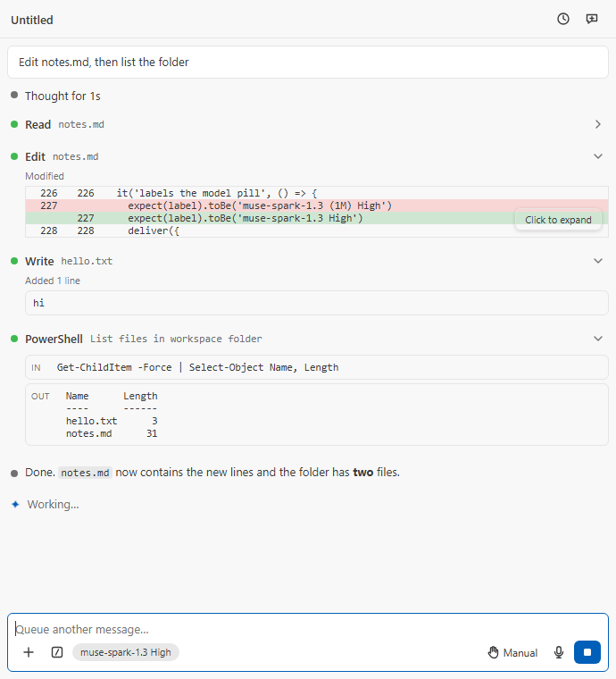<br><sub>A turn: thinking, read, edit with its diff, write, shell, and the reply</sub></td>
    <td align="center" width="50%">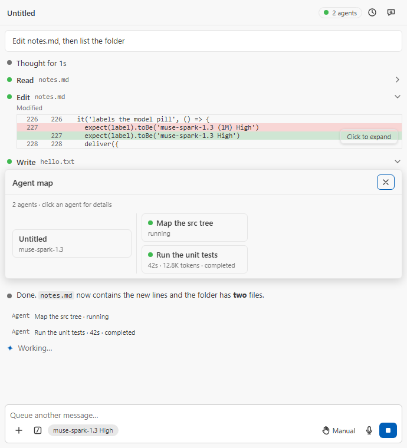<br><sub>Subagents: the <b>2 agents</b> pill and the Agent map</sub></td>
  </tr>
  <tr>
    <td align="center">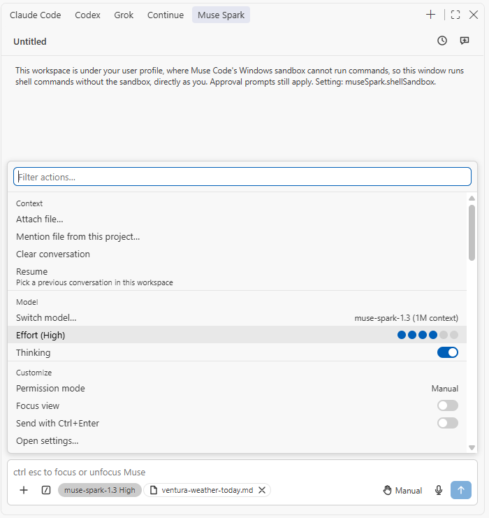<br><sub>Type <code>/</code>: the palette above the prompt</sub></td>
    <td align="center">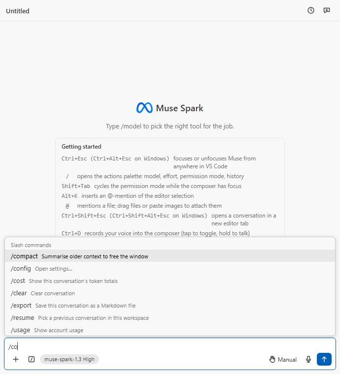<br><sub>A letter more: the slash commands, ranked as you type</sub></td>
  </tr>
  <tr>
    <td align="center">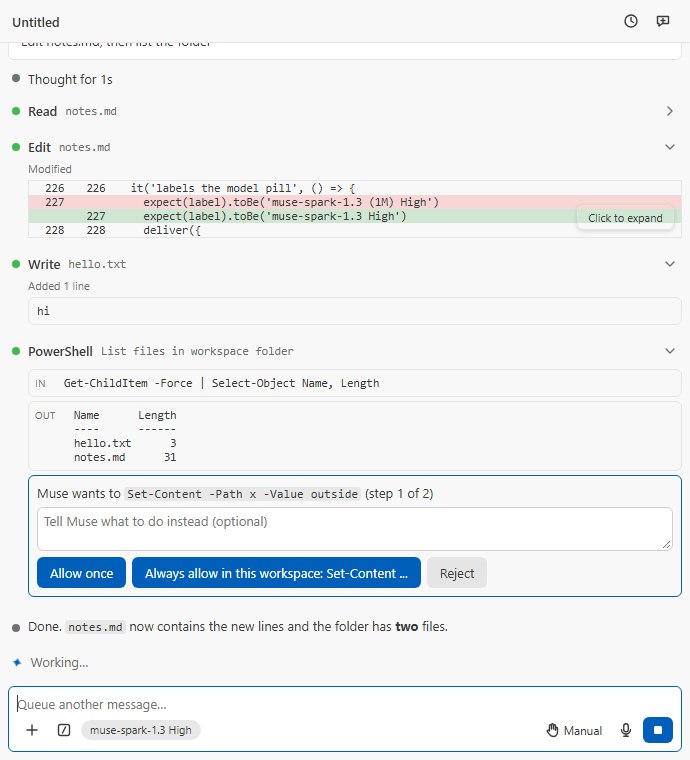<br><sub>An approval card with the CLI's own choices</sub></td>
    <td align="center">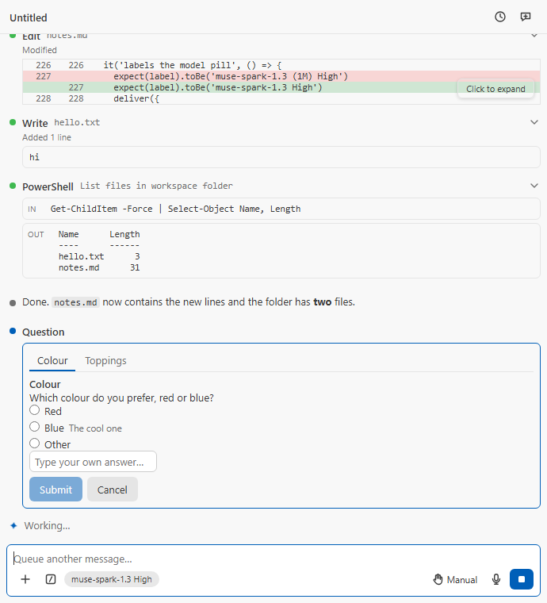<br><sub>A question card: tabs, radios or checkboxes, Other, Submit and Cancel</sub></td>
  </tr>
  <tr>
    <td align="center">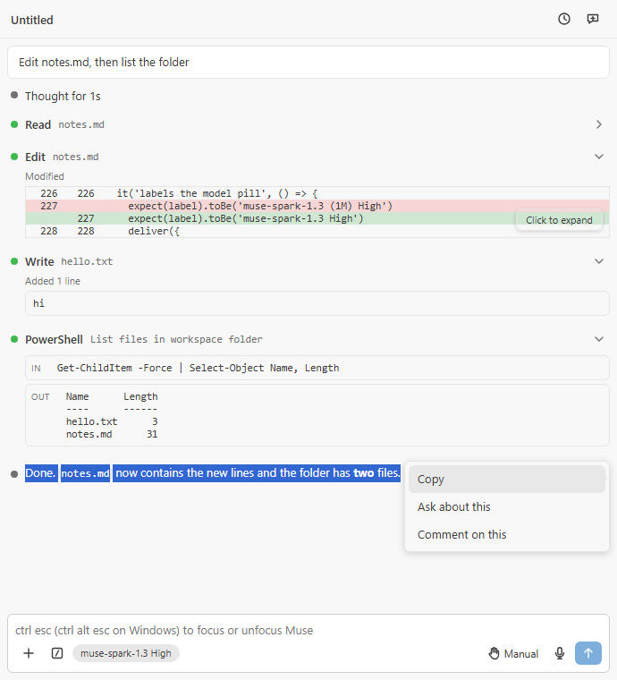<br><sub>Highlight, right-click: <b>Copy</b>, <b>Ask about this</b> or <b>Comment on this</b></sub></td>
    <td align="center">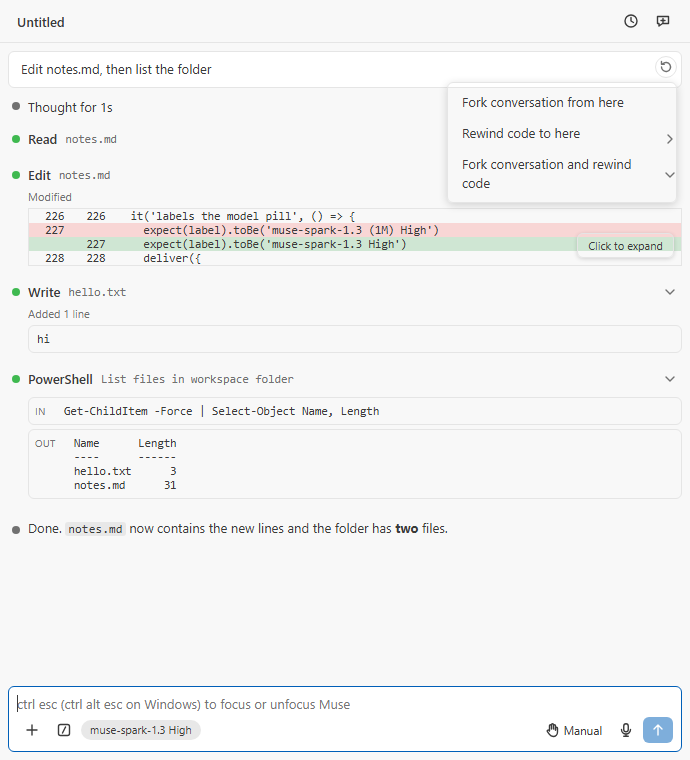<br><sub>Every sent message: fork, rewind the code, or both</sub></td>
  </tr>
  <tr>
    <td align="center">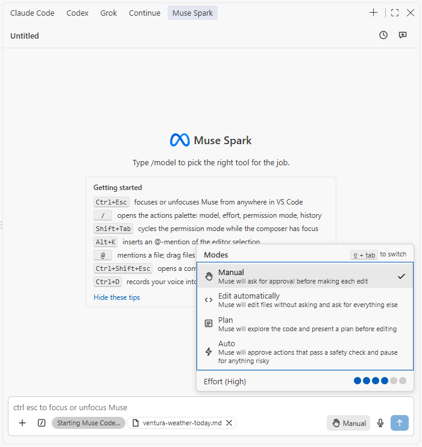<br><sub>Permission modes, one line each, <code>Shift+Tab</code> to cycle</sub></td>
    <td align="center">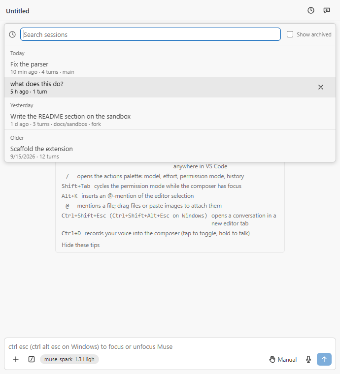<br><sub>History: search, resume, archive</sub></td>
  </tr>
  <tr>
    <td align="center">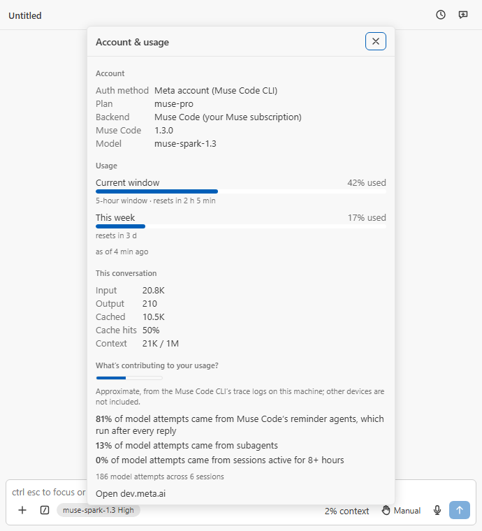<br><sub>Account & usage: windows, tokens, and what is eating the usage</sub></td>
    <td align="center">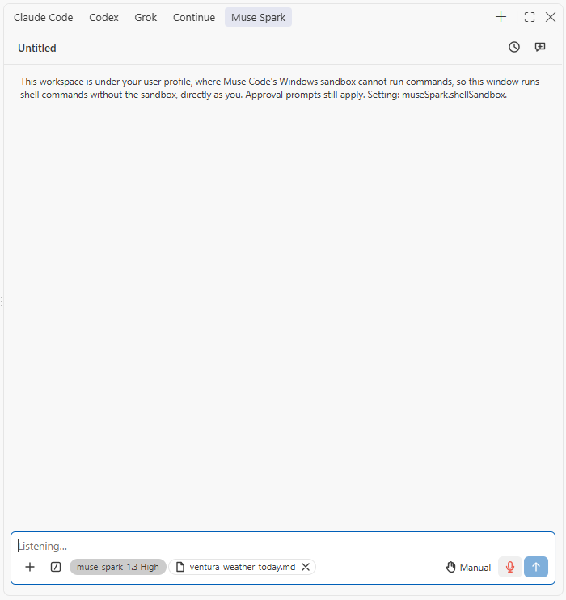<br><sub>Voice dictation: tap or hold, <code>Ctrl+D</code></sub></td>
  </tr>
</table>

## Get started

1. Install **Muse Spark Code** from the
   [Marketplace](https://marketplace.visualstudio.com/items?itemName=RandyNorthrup.muse-spark-code)
   (VS Code 1.99 or newer), or from a `.vsix` attached to a
   [GitHub Release](https://github.com/RandyNorthrup/muse-spark-code/releases):

   ```bash
   code --install-extension muse-spark-code-0.8.0.vsix
   ```

2. Open the **Muse Spark** view from the activity bar (or press
   `Ctrl+Shift+Alt+Esc` on Windows, `Cmd+Shift+Esc` on macOS,
   `Ctrl+Shift+Esc` on Linux for a conversation in an editor tab).
3. Sign in, one of two ways:
   - **Sign in with your Meta account** opens a terminal running `muse login`
     from the [Muse Code CLI](https://dev.meta.ai/products/muse-code/) and
     waits for the browser sign-in to finish. Work is billed to your Muse
     subscription.
   - **Use a Model API key** takes a key shaped like `LLM|<id>|<secret>` from
     dev.meta.ai, stores it in VS Code's secret storage and runs the Model API
     backend with the extension's own tools, pay as you go.
4. Type a message and press `Enter`. `/` shows the palette, `@` mentions a
   file, the microphone dictates.

VS Code opens the extension's four-step walkthrough on install; **Muse
Spark: Open Walkthrough** brings it back.

Each panel is its own conversation, started on the first message with the
standard `muse-spark-1.3` model (never a contributor-tier model by default).
The model pill shows the model as soon as the panel opens.

## Backends

| Backend                                                                      | Sign-in                                                          | Billing                | Tools                                                                                                                                                                                           |
| ---------------------------------------------------------------------------- | ---------------------------------------------------------------- | ---------------------- | ----------------------------------------------------------------------------------------------------------------------------------------------------------------------------------------------- |
| **Muse Code CLI** (`muse serve`, Muse Session Protocol via `@muse-code/sdk`) | The CLI's own browser sign-in (`muse login`)                     | Your Muse subscription | The CLI's, inside its OS sandbox where that works (see `shellSandbox`); its bundled skills, your user rules, its own memory, subagents, and the Problems panel through the extension            |
| **Meta Model API** (`https://api.meta.ai/v1`)                                | A key from dev.meta.ai, kept in SecretStorage, sent only to Meta | Pay as you go          | The extension's own: read, edit, write, search, list, shell, `read_skill`, `ask_user` (question cards) and `todo_write` (the task list), with approvals; the workspace rules, skills and memory |

`museSpark.backend` picks: `auto` (default) uses the CLI when it is installed
and signed in, otherwise the Model API when a key is stored; `museCode` and
`modelApi` force one. The palette's **Backend** row shows which one this
window runs on. The CLI looks for `muse` through `museSpark.museBinaryPath`,
then `PATH`, then the platform's install folder (`%LOCALAPPDATA%\Programs\muse`
on Windows, `~/.local/bin` elsewhere).

Conversations on the Model API backend are saved as they go under VS Code's
workspace storage for the extension, so the History dialog lists them after
a reload, and a resumed one continues with its transcript and its edit
patches. The CLI backend keeps its own session store. If the panel itself
ever fails to render, it shows the error and a **Reload** button instead of
going blank; Reload brings the conversation back as it was, running turn and
waiting cards included.

## Other editors

The same two backends run outside VS Code as `muse-spark-code-acp`, an
agent for editors that speak the Agent Client Protocol (Zed, JetBrains IDEs,
Neovim, Emacs and others), attached to each GitHub Release.
[docs/acp.md](docs/acp.md) covers installing it, where it keeps a Model API
key (the operating system's credential store), and the editor's settings.
VS Code forks built on VS Code 1.99 or later can install the extension
from a `.vsix`, and from Open VSX once a release is published there.
[docs/ide-compatibility/hosts.md](docs/ide-compatibility/hosts.md) records
which editors have been tried: so far VSCodium, code-server and Eclipse
Theia with the extension, and Zed, Emacs (agent-shell), Neovim
(CodeCompanion) and JupyterLab (Jupyter AI) with the agent.

## Permission modes

| Mode                   | Model API backend                                                        | Muse Code backend                                                                                                |
| ---------------------- | ------------------------------------------------------------------------ | ---------------------------------------------------------------------------------------------------------------- |
| **Manual**             | Asks before every edit and every command                                 | The CLI decides: it applies edits inside the workspace without asking (Muse Code 1.3.0) and asks before commands |
| **Edit automatically** | Approves plain file edits, asks before commands                          | As Manual, plus the file approvals the CLI does raise are approved for you                                       |
| **Plan**               | Refuses edits and commands                                               | The CLI plans without editing                                                                                    |
| **Auto**               | Runs edits, asks before commands (no safety-check model on this backend) | The CLI runs its own safety check and asks for anything risky                                                    |
| **Bypass**             | Only with `allowDangerouslySkipPermissions`; nothing asks                | The same                                                                                                         |

"Always allow in this session" on a command allows that exact command line
again, nothing broader. The Model API backend's file tools refuse any path
that leaves the workspace, including through a symbolic link or junction
inside it. Muse Code refuses such a write while its sandbox runs; without
the sandbox (`shellSandbox` set to `off`, or `auto` for a Windows workspace
under your profile) its file tools may write outside the workspace, so
choose the permission mode with that in mind.

**Protected writes.** On the Model API backend, writes to files that
configure or run code always ask, whatever the mode: `.git`, `.husky`,
`.vscode`, `.idea`, `.devcontainer`, `.github/workflows`, `.agents` (the
agent's own skills and memory), `.muse` (Muse Code's hooks), `AGENTS.md`,
`CLAUDE.md`, `.envrc` and `.gitmodules`. Plan refuses them and Bypass skips
the card. On Muse Code the CLI decides which writes are protected, and the
extension never approves one for you.

## Rules, skills and memory

In a trusted workspace the agent follows the same files Muse Code does:

- **Rules:** `AGENTS.md` at the workspace root (`CLAUDE.md` where there is no
  `AGENTS.md`), and the same files in subdirectories, which apply once the
  agent touches a path beneath them; the deeper file wins.
- **Skills:** `.agents/skills/<id>/SKILL.md` in the workspace (project scope)
  and Muse Code's personal root `~/.config/muse/skills`
  (`$XDG_CONFIG_HOME/muse/skills` when set). The palette's **Skills** group
  lists them, `/id arguments` invokes one, and the model loads one itself
  when a task matches its description. `user-invocable: false` in the front
  matter keeps a skill out of the palette.
- **Memory:** the project's `.agents/memory/MEMORY.md` index is read at the
  start of a conversation, and the agent reads and updates the notes there
  with its file tools. On the Model API backend those are protected writes,
  so they always ask.

**Muse Spark: Create AGENTS.md** starts the rules file for a workspace that
has none. `muse init` writes it when the CLI is installed and the workspace
is trusted (the CLI's own scaffold, no model call); otherwise the extension
writes the same layout. An existing file is opened, never overwritten.

On the CLI backend Muse Code loads all of this itself (the extension starts
it with `--trust-workspace`), plus its bundled skills and your user rules.
On the Model API backend the extension loads the files above and nothing
else:

- **Sizes:** a rules file or a `SKILL.md` over 64 KB is skipped with a
  warning in the log; the rules together are cut at 256 KB, and `MEMORY.md`
  at 200 lines or 32 KB.
- **Encodings:** UTF-8, or UTF-16 with a byte-order mark; a file that is not
  text is skipped with a line in the log.
- **Links:** a skill folder may be a symbolic link or junction. In the
  workspace it must lead to a place inside it or it is skipped; links in the
  personal root are followed wherever they lead.
- **The system prompt** also carries the date, the git branch, the number of
  changed files and the latest commit subjects at session start (metadata
  only), and a short set of working rules (read before editing, no commits
  unless asked, `path:line` references).

In VS Code's **Restricted Mode** (an untrusted folder) neither backend loads
rules, skills or memory, no shell command runs, and the extension runs no
`git` (git reads the repository's own config, which can name programs to
run): `@` mentions come from VS Code's file search and the prompt carries no
git facts. Trust the workspace to enable them.

## Muse Code's own tools

These use the Muse Code CLI, except worktrees, which work on both backends.

**What its tools show.** Every tool Muse Code runs has a named row, and
the ones that answer in JSON are shown as what they mean:

- **Memory** (Read memory, Save memory, Edit memory): the note saved or read
  back, where it lives (your memory for this project, the project's shared
  memory, or your memory for every project), and an edit as the text
  replaced beside its replacement.
- **Goals** (Set goal, Check goal, Update goal, Goal progress): the
  objective, its status, a progress bar, what the agent is doing now and
  next, and the tokens spent against any budget.
- **Scheduled prompts** (`/loop` and cron): each prompt with its schedule,
  whether it repeats, its next run and how often it has run.
- **Web search**: the results as links that open in your browser, with
  their snippets. Search rows on the Model API backend look the same.
- **Background work**: a command Muse Code moved to the background shows
  what it printed and that it is still running, and it stays running after
  the turn ends instead of reading "Interrupted".
- **Pictures**: when the agent reads an image, or the Model API backend
  generates one, the row shows it; click it to open the file. Only images
  inside the workspace are shown.
- **MCP tools** read "tool (server)", and any tool the panel has no special
  view for shows its arguments and result as indented JSON.

**Skills.** The palette's Skills group has two more rows on the CLI backend:

- **Manage skills…** is a checklist of every skill Muse Code knows
  (built-in, yours, this project's, plugins); unchecking one turns it off
  (`muse skills disable`).
- **Import skills…** shows what `muse skills import` would copy from Claude
  Code or Codex into your Muse skills folder, imports it once you confirm,
  and reports what was imported, skipped, failed or quarantined.

Muse Code reads skill changes when it starts, so both end by offering to
restart it; the conversation continues on your next message. Where the
session offers Muse Code's `resume-claude` and `resume-codex` skills, the
palette's Context group has **Continue a Claude Code session** and
**Continue a Codex session**.

**MCP servers and hooks.** Muse Code reads both from its own settings file
(`~/.config/muse/settings.json`, or under `XDG_CONFIG_HOME`), and project
hooks from `.muse/hooks.json`. The extension shows them and never edits them:

- **MCP servers…** lists each server:
  - Its transport, where it points (a URL is cut to its scheme and host),
    and whether Muse Code stops when it fails ("required") or skips it.
  - The _names_ of its environment variables and headers. The values stay in
    the file.
  - A remote server can be signed in to or out of. That runs
    `muse mcp login` or `muse mcp logout` in a terminal, with the server's
    name quoted.
  - **Restart Muse Code to load changes**, since Muse Code reads the file
    when it starts.
- **Loud warnings** for the two settings mistakes that make Muse Code load no
  server at all: both `mcpServers` and the older `mcp_servers` in one file,
  or `required` beside `mode` on a server.
- **Hooks…** lists the project's, yours and your administrator's hooks, and
  opens the file behind each. A hook runs through your shell outside Muse
  Code's sandbox and approvals, so read a repository's hooks before you
  trust its folder.

**Worktrees.** **New worktree…** asks for a new branch and its base (the
current commit or any local branch), creates it in a folder of its own, and
offers to open it in a new window, so a conversation there leaves your
checkout alone:

- **Where it goes:** `<repository>.worktrees/<branch>`, beside the
  repository, so the second copy never lands inside your workspace. A `/` in
  the branch name becomes `-` in the folder's.
- **Refused:** a name git rejects, a branch that already exists, and a folder
  that is already there.

**Remove a worktree…** lists the others (never the main checkout or the one
this window is in) and deletes the chosen folder. Its branch stays. A
worktree with uncommitted changes is removed only after a second
confirmation that says the changes will be lost. Both commands need a
trusted workspace, since git does not run in Restricted Mode.

## The panel

**Composer.**

- `Enter` sends and `Shift+Enter` breaks a line (or send with `Ctrl+Enter`
  through a setting). The box grows with your draft up to ten rows, then
  scrolls inside.
- While a turn runs, `Enter` steers it and Stop cancels it; Stop also drops
  messages still queued, which read "Not sent".
- The `+` button uploads images (PNG, JPEG, GIF, WebP; other files become `@`
  mentions) or starts a mention; images also paste and drop. An upload the
  panel cannot take shows a dismissible banner: other files go in as `@`
  mentions, or by absolute path for files outside the workspace.
- A path with a space, `#` or `"` is written in quotes,
  `@"my notes/a b.md"#5-10`, and the menu searches what you type after `@"`.
- The model pill reads `model effort` (effort tiers Minimal to Max, each
  verified per model); the mode button opens the Modes menu; the microphone
  dictates.
- The context indicator is a button: click it to compact now; its tooltip
  carries the pressure level Muse reports.

**`/`: the palette and the slash commands.** A `/` on an empty prompt stays
in the box and shows the palette above it; the `/` button opens the same
palette with a filter box of its own. Its groups:

- **Context:** attach, mention, clear, resume, new and remove worktree, and
  Continue a Claude Code or Codex session (CLI backend).
- **Model:** switch model, effort (Left and Right step it), thinking.
- **Customize:** permission mode, Focus view, Send with Ctrl+Enter, MCP
  servers and hooks (CLI backend), settings, keybindings.
- **Account & usage**, **Skills** (the session's own, plus Manage and Import
  on the CLI backend), **Slash commands** and **Support**.

Type a letter after the `/` and the palette gives way to a flat list of slash
commands narrowed as you type: `/agents`, `/clear`, `/compact`, `/config`,
`/cost`, `/export`, `/logout`, `/model`, `/permissions`, `/resume`, `/usage`,
`/mcp` and `/hooks` (CLI backend), and the session's skills. Names that start
with your letters come first. Up and Down move, `Enter` runs a command (a
skill is completed so you can add its arguments), `Tab` completes the name
and `Esc` closes the list. With nothing matching, `Enter` sends the text as
it is.

**Transcript.**

- Replies render as GitHub-flavoured markdown with highlighted code and
  **Copy**, **Insert at cursor** and **Apply** on every block; a finished
  reply carries **Copy** on hover. A relative link in a reply
  (`src/parser.ts#L12`) opens that workspace file at those lines.
- Tool rows show the diff or the command and its output from the start;
  read rows open on click, and a chevron marks the rows that open. Previews
  show 12 lines or 2,000 characters, with **Show more**. A backgrounded call
  carries a "background" badge.
- The path of an edit or read row opens the file with the changed lines
  selected. Click a tool's output to open it in a read-only editor tab (a
  stored output in full, up to 16 MiB); **Click to expand** on an edit diff
  opens VS Code's diff editor (the file side is editable).
- Thinking rows stream their summary while the model thinks and end as
  "Thought for Ns" (a resumed conversation's read "Thought").
- A reply's ⋯ menu has **Reply to this output**: the next message carries
  that output to the agent as context. Highlight any text in the chat and
  right-click it for **Copy**, **Ask about this** or **Comment on this**; the
  passage, its author and your intent travel with the message. The composer
  shows a chip for either; × drops it.
- Approval cards carry the CLI's own choices (Allow once, Always allow in
  this workspace or Allow for this session, Reject, with optional feedback);
  multi-step shell lines are approved one step at a time. Question cards
  stack radio buttons for one answer and checkboxes for several, put
  multiple questions on tabs, always offer **Other**, and keep **Submit**
  greyed until every question has an answer; **Cancel** declines the prompt.
- The transcript follows new entries while you are at the end; scrolled up,
  it holds still and **New messages** jumps to the newest. The agent's task
  list pins above the composer, and the composer shows how much of the
  context window is used. **Focus view** (`Ctrl+Alt+F`) folds tool and
  reasoning rows behind `Show N steps`.

**Edits and rewind.** Muse applies in-workspace edits as it goes, so review
comes after: the edit row shows the diff, its path opens the file at the
change, and **Click to expand** opens the diff editor. To undo, use the
rewind button on any sent message (on hover):

- **Fork conversation from here**.
- **Rewind code to here** reverts every edit made after that message, the
  conversation's and its subagents', in the reverse of the order they
  landed. A file the edit created goes to the trash, unless you have added
  to it since, in which case your lines stay.
- **Fork conversation and rewind code**.

Each edit is undone only where its own lines (the changed lines and the few
around them) are still exactly as the edit left them. If you added or
removed lines above them since, they are found where they moved to, as long
as they appear in exactly one place. An edit whose lines you changed, or that
could match more than one place, is left alone and says why, rather than
guessed at; your other changes to the file are kept. A file's BOM and line
breaks survive both.

**Unsaved editors.** Muse reads and edits the files on disk. With
`museSpark.autosave` on (the default) every message saves your editors
first; with it off the panel names the files whose unsaved changes Muse will
not see. On the Model API backend the file tools also refuse a file an
editor holds unsaved changes to, keep a file's BOM, line breaks and final
line break, refuse files that are not UTF-8 text rather than rewrite them,
and replace an existing file with `write_file` only after reading it (as
Claude Code does).

**History.** The clock icon lists the workspace's conversations by day with
search, resume (full transcript), archive and **Show archived**. Archive with
the row's × or, while the search box is empty, `Delete` on the highlighted
row, which also restores an archived one. Sessions idle for
`archiveInactiveSessions` days are hidden, not deleted. Click the header's
title to rename the conversation. A hidden panel shows a dot when Muse
finished or needs a decision.

**Export.** `/export` (or **Muse Spark: Export Conversation**) saves the
conversation as Markdown where you choose: messages, thinking, and tool calls
with their arguments and visible output. On the CLI backend **Export session
log…** also saves Muse Code's own JSON record of the session (`muse
export`), which includes everything, stored outputs too; it needs a folder
on this machine. An export asked for while a reply runs is refused until it
finishes, and a conversation too long for Muse Code to replay is pointed to
the session log.

**Subagents.** When Muse Code spawns native subagents they appear as rows and
an **N agents** pill in the header opens the **Agent map** (also `/agents`):
this conversation, its agents with role, objective, status, duration and
tokens, the background tasks, and each agent's own transcript.

- Muse Code hides its subagent tools unless `run.subagent_delegation_mode` is
  `"auto"` in its settings file (`~/.config/muse/settings.json`, or under
  `$XDG_CONFIG_HOME`). The map says so and opens the file for you; the
  extension never edits it.
- Muse Code gates `subagent_spawn` behind an approval: in Manual mode the
  card appears (Allow once / Allow for this session); Plan mode refuses it.
- An agent's own replies and tool calls stay in its transcript in the map,
  and the map's details offer the controls Muse Code provides: Interrupt and
  Stop while it runs, a note to it, Resume, Close, and a follow-up task once
  its result is ready.
- The Model API backend spawns no agents.

**Account & usage** (`/usage`, `/cost`) is a modal over the transcript:

- **Account:** auth method, plan, backend, Muse Code version and model.
- **Usage (Muse Code):** the subscription's current window and week. Muse
  Code reports them only after a reply; until then the modal shows the last
  window it reported, dated "as of".
- **This conversation:** token totals (on Muse Code, prompt tokens as it
  counts them once). On the Model API also the cached tokens, the cache-hit
  rate and a dollar estimate from Meta's published per-token prices
  (standard versus contributor tier, read 2026-09-22; the dev.meta.ai
  dashboard is the bill).
- **What's contributing to your usage**, over the last day or week, read from
  the Muse Code CLI's trace logs on this machine: the share of model attempts
  from Muse's reminder agents (which run after every reply), from subagents,
  and from sessions active for 8+ hours. Approximate, this machine only.

**Prompt caching.** The Model API backend sends a per-session cache key so
repeated prefixes are billed at the cached rate; the CLI caches on its own.
Meta does not publish the cache lifetime, so there is no "warm for N
minutes" countdown; on the Model API the modal shows the cache-hit rate
instead.

**Diagnostics (CLI backend).** The agent can read the Problems panel through a
`getDiagnostics` tool the extension serves on a loopback MCP server, bound to
`127.0.0.1` with a per-window token and started when a session first needs
it. Nothing else is exposed. It reports the workspace's files only (the
first folder), by relative path, each message cut at 1,000 characters, and
past 200 problems a count instead of the rest.

**Accessibility.** Every screen the panel shows is checked against WCAG 2.2
AA's automated rules in Light Modern, Dark Modern and both High Contrast
themes on every change.

- Menus and lists work from the keyboard: the palette and History lists are
  Tab stops, the effort row moves with Left and Right, History rows archive
  with `Delete`, and `Esc` closes whatever is open.
- Screen readers hear when Muse finishes, fails or is stopped, when an
  approval or a question arrives, when a tool fails, and when dictation
  starts and stops.
- The operating system's "reduce motion" setting stops every animation.
- Text in right-to-left scripts reads right to left, and with an input
  method `Enter` commits the candidate instead of sending.

## Voice dictation

Tap the microphone to start and again to stop; hold it (or `Ctrl+D` /
`Cmd+D` in the composer, or Space on the focused button) to record while
held. The placeholder reads "Listening…", the mic pulses red, and each phrase
lands at the caret followed by a space. Recognition runs in a small helper
on the operating system's own engine, kept warm for five minutes after a
recording. Nothing is billed and no third-party engine is involved, unless
you turn on [Muse Voice](#paid-features), the paid engine on a Model API
key.

Dictation is off in a remote window (SSH, WSL, containers, tunnels,
Codespaces): the extension runs on the remote machine, which cannot hear
your microphone.

| Platform | How                                                                                                                                                                                                                                                                                                                                                                                                   |
| -------- | ----------------------------------------------------------------------------------------------------------------------------------------------------------------------------------------------------------------------------------------------------------------------------------------------------------------------------------------------------------------------------------------------------- |
| Windows  | `native/windows/dictate.ps1` under Windows PowerShell 5.1 on the .NET Framework's `System.Speech`, the desktop recogniser that ships with Windows (English always; other languages with Windows speech packs). Audio never leaves the machine. Accuracy is the classic engine's, below Windows 11's voice typing; Windows' Speech Recognition training improves it for your voice.                    |
| macOS    | `native/darwin/muse-dictate`, a Swift helper on Apple's Speech framework, built by CI on a Mac and shipped in the Marketplace package. **Dictation (System Settings > Keyboard) or Siri must be on.** Apple picks on-device recognition when its model is installed, otherwise its servers under Apple's terms at no charge (`--on-device` refuses the servers). See the macOS notes below the table. |
| Linux    | Not available for free: no distribution ships a speech recogniser and the extension adds none. The button is dimmed with that reason as its tooltip. With [Muse Voice](#paid-features) on, the system's `arecord` or `parec` records and Meta transcribes.                                                                                                                                            |

On macOS, two things can stop the helper, and the panel's error says which:

- **A permission.** The first time you dictate, macOS asks for speech
  recognition and the microphone on behalf of the helper itself,
  **muse-dictate**, with its own usage descriptions, rather than for Visual
  Studio Code; the grants are managed under System Settings > Privacy &
  Security > Speech Recognition and > Microphone. The helper asks under its
  own name because Visual Studio Code, which starts it, declares no
  speech-recognition purpose
  ([microsoft/vscode#307364](https://github.com/microsoft/vscode/issues/307364)),
  and macOS would refuse VS Code without asking; to do so it disclaims VS
  Code's responsibility with a private macOS call (the one Chromium, Qt and
  Electron use), and where that call is missing it asks as VS Code and the
  panel's error explains the refusal. The helper is ad-hoc signed, so macOS
  ties the grant to the build: after an update that changes the helper,
  macOS asks again.
- **The helper itself.** The helper is ad-hoc signed, not notarised; VS Code's
  installer does not quarantine it, so Gatekeeper does not stop it. If the
  error names no permission step, macOS refused to run the helper: its file
  carries the quarantine flag, which a copy through a browser download or an
  archive tool can add. This clears it:

```bash
xattr -d com.apple.quarantine ~/.vscode/extensions/randynorthrup.muse-spark-code-*/native/darwin/muse-dictate
```

Diagnosing on Windows: the helper can replay a WAV file instead of the
microphone, which separates a recogniser problem from a microphone one.

```powershell
& "$env:SystemRoot\System32\WindowsPowerShell\v1.0\powershell.exe" -NoProfile -ExecutionPolicy Bypass -File native\windows\dictate.ps1 -InputWav C:\path\to\speech.wav
```

Type `start` and press Enter; phrases print as JSON lines, then `stopped`.
Muse Voice's recorder takes the same `-InputWav` (a 16 kHz, 16-bit mono
file) and prints the audio as `audio` lines instead:
`native\windows\capture.ps1 -InputWav …`.
On macOS the helper takes `--input-device <CoreAudio UID>` to capture from
one specific device; a Mac without any input device reports "no audio input
device is available", and step markers on stderr name where a start failed.

## Paid features

Three extras of Meta's Model API cost money on top of tokens. They are
always billed to your Model API key, never to your Muse Code subscription,
and all three are **off until you turn them on**. All three work on the
Model API backend; images and Muse Voice also work on the Muse Code backend
while a key is stored (web search is Muse Code's own there, on the
subscription):

| Feature          | Price (Meta, read 2026-09-24) | What it does                                                                                                                          |
| ---------------- | ----------------------------- | ------------------------------------------------------------------------------------------------------------------------------------- |
| Web search       | $2.50 per 1,000 searches      | The model may search the web while it answers; the reply lists the pages it cites                                                     |
| Image generation | $0.01 per image               | The model may create a PNG file in the workspace with `muse-image-1.0`, or edit workspace images into a new one, asking you each time |
| Muse Voice       | $0.18 per hour of audio       | The microphone uses Meta's Muse Voice Transcribe instead of your computer's own recogniser                                            |

Turn one on from the palette (**Account & usage** group, where the backend
can use it) or with its setting (`museSpark.modelApiWebSearch`,
`modelApiImageGeneration`, `modelApiVoice`). Either way a confirmation
names the price first; declining it turns the setting back off, and turning
a setting off means the next time asks again. The settings are
machine-scoped, so a repository cannot turn one on.

While one is on, you can always tell:

- **The composer's badge** names every paid feature that is on ("Paid: Web
  search, Images"), with the prices in its tooltip; it opens Account &
  usage.
- **Every use is its own row** marked _paid_: each search, with its query
  and results, and each image, with its path.
- **Every image asks first**, in every permission mode, Bypass included,
  with the prompt, the images an edit starts from, and the price on the
  card and no "always allow". Plan refuses it (it writes a file), and a
  path that is taken, outside the workspace, or not a `.png`, or a source
  that is missing, outside the workspace, not a PNG, JPEG or WebP image, or
  over 10 MB, is refused before anything is asked or billed.
- **On the Muse Code backend**, images come from the extension itself: its
  `ide` tool server, which every Muse Code session loads, offers Muse Code
  an image and an image-edit tool while image generation is on and a key is
  stored. Muse Code's own permission mode decides whether it may use the
  tool; then a dialog names the image, its prompt and its price, billed to
  your key and not to the subscription, before every one. The key never
  leaves the extension, and the row is marked paid as on the Model API.
- **The microphone says so**: ringed, and named "Record voice with Muse
  Voice (paid)" with the price in its tooltip.
- **Account & usage keeps the tally**: this window's searches, images and
  seconds of audio, each with its estimated cost at the published prices.
  The dev.meta.ai dashboard is the bill.

Web search's count errs high: Meta does not say how it bills a search with
several queries, so each query counts. Muse Voice counts the whole seconds
sent, as Meta bills them.

<table>
  <tr>
    <td align="center" width="50%">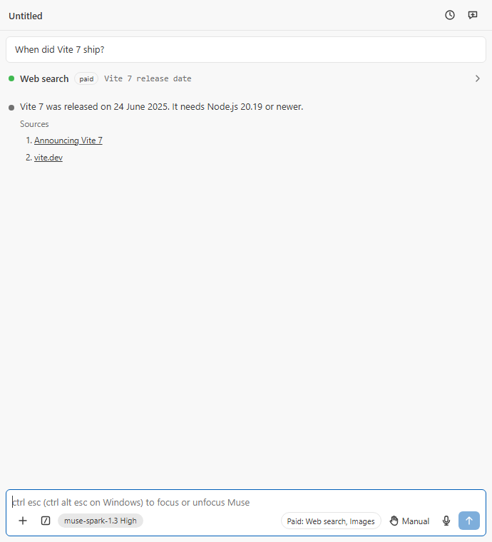<br><sub>A search marked paid, the reply's sources, and the badge</sub></td>
    <td align="center" width="50%">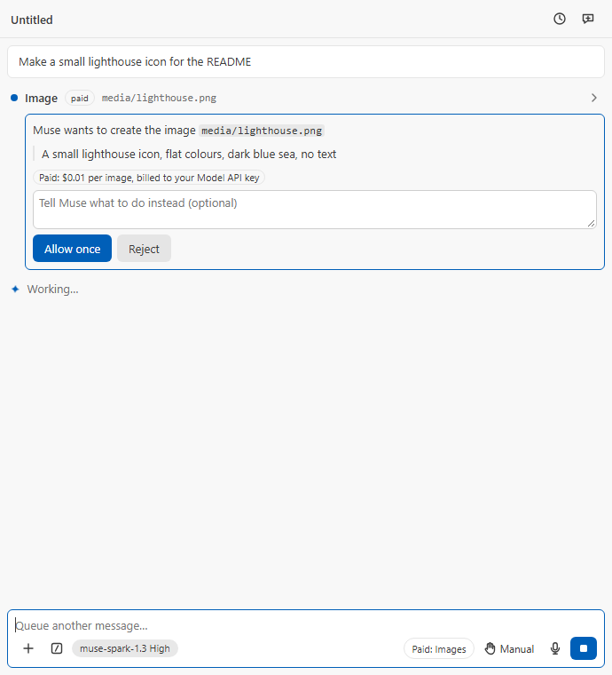<br><sub>Every image asks first, with its prompt and price</sub></td>
  </tr>
</table>

Muse Voice records the same way as free dictation (tap or hold), and the
transcript lands at the caret when you stop. The recording is made by a
helper that only records: `native/windows/capture.ps1` on Windows (the
waveIn API that ships with Windows), the macOS helper's capture mode (which
asks for the microphone only), and on Linux the system's `arecord` or
`parec`, so Linux gets a microphone on this engine. Audio leaves the machine
only while it records, and only to Meta.

## Languages

The panel, its notices, the Command Palette's commands and the settings
follow VS Code's display language:

- Simplified and Traditional Chinese
- Japanese and Korean
- German, French, Spanish, Italian and Brazilian Portuguese
- Russian, Polish, Czech, Hungarian and Turkish

Any other display language gets English. Change it with **Configure Display
Language** in the Command Palette and reload the window.

<p align="center">
  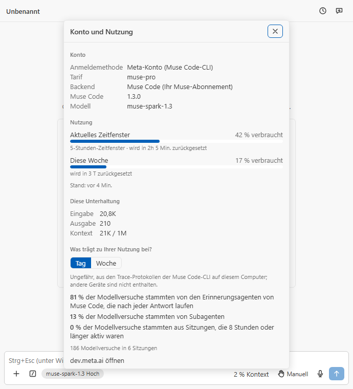<br>
  <sub>Account &amp; usage in German, with its numbers written the German way</sub>
</p>

**The translations are machine-made**, by the same AI that wrote the code,
and checked by a gate rather than by native speakers. That gate checks that
every string is present, every value and code span is kept, and every count
uses the language's own plural forms. If a translation reads wrong,
[open an issue](https://github.com/RandyNorthrup/muse-spark-code/issues)
naming the language and the text; a correction is one line in
`l10n/ui.<language>.json` or `package.nls.<language>.json`.

What stays in English:

- **Text sent to the model**: the context notes, the compaction prompt and
  the tool errors. The model behaves the same in every language.
- **What Muse and the tools write**: replies, tool output, and Muse Code's own
  approval choices.
- **The walkthrough's pages**: VS Code translates the step titles, not the
  pages.
- **Log lines no one sees in the panel**, and the names of commands, files
  and settings.

## Limits

| What                             | Limit                                                                                                            |
| -------------------------------- | ---------------------------------------------------------------------------------------------------------------- |
| Images                           | 10 MB each, 20 per message                                                                                       |
| A message to Muse Code           | 10 MiB, images counting a third more than their file size                                                        |
| Model API: tool rounds           | 50 per turn                                                                                                      |
| Model API: shell commands        | 2 minutes by default, 10 at most                                                                                 |
| Model API: retries               | Up to 5 attempts on 429, 500 and 503, honouring `Retry-After`, shown in the transcript; Stop cuts the wait short |
| Model API: a silent reply stream | Ended after 5 minutes with nothing from the server; send again to retry                                          |
| Model API: file tools            | Files up to 10 MiB; the search tool skips files over 1 MiB                                                       |
| Opened tool outputs              | 16 MiB each; the latest 20, and 32 million characters together                                                   |

## Commands and keybindings

| Command                                             | Default keybinding                                                                   | What it does                                                                                                                                              |
| --------------------------------------------------- | ------------------------------------------------------------------------------------ | --------------------------------------------------------------------------------------------------------------------------------------------------------- |
| Muse Spark: Open in Sidebar                         | —                                                                                    | Focus the chat view in the activity bar                                                                                                                   |
| Muse Spark: New Conversation                        | `Ctrl+N` (`Cmd+N`) when `enableNewConversationShortcut` is on, Muse focused          | Clear the active panel to a new conversation, or open one where `preferredLocation` says                                                                  |
| Muse Spark: Sign Out                                | —                                                                                    | Forget the stored Model API key and run `muse logout` when the CLI is signed in                                                                           |
| Muse Spark: Open in Terminal                        | —                                                                                    | Run the Muse Code CLI's own interactive interface in a VS Code terminal at the workspace root                                                             |
| Muse Spark: Create AGENTS.md                        | —                                                                                    | Write the rules file with `muse init` (or the same template without the CLI) and open it; an existing file is opened                                      |
| Muse Spark: Open Walkthrough                        | —                                                                                    | Open the four-step Get Started walkthrough                                                                                                                |
| Muse Spark: Open in New Tab                         | `Ctrl+Shift+Alt+Esc` on Windows, `Cmd+Shift+Esc` on macOS, `Ctrl+Shift+Esc` on Linux | Open an independent conversation as an editor tab (also the `+` in the view title); the panel header's own button starts a new conversation in place      |
| Muse Spark: Toggle Focus                            | `Ctrl+Alt+Esc` on Windows, `Cmd+Esc` on macOS, `Ctrl+Esc` on Linux                   | Move keyboard focus between the editor and the composer                                                                                                   |
| Muse Spark: Insert @-Mention for Selection          | `Alt+K`, editor focused                                                              | Insert `@path#start-end` for the active editor selection into the composer                                                                                |
| Muse Spark: Toggle Focus View                       | `Ctrl+Alt+F`, Muse focused                                                           | Flip the `museSpark.focusView` setting (hides tool calls and reasoning)                                                                                   |
| Muse Spark: Toggle Thinking                         | `Ctrl+Alt+T` (macOS `Option+T`, Linux `Ctrl+Alt+O`), composer only                   | Turn reasoning on or off for this conversation. Claude Code uses `Alt+T`; on Windows that opens the Terminal menu, on GNOME `Ctrl+Alt+T` opens a terminal |
| Muse Spark: Set Up Shell Sandbox                    | —                                                                                    | Windows: run Muse Code's one-time `muse sandbox windows setup` through a UAC prompt and report the result; elsewhere reports that no setup is needed      |
| Muse Spark: Show Logs                               | —                                                                                    | Open the "Muse Spark" log channel (keys redacted)                                                                                                         |
| Muse Spark: Diagnostics                             | —                                                                                    | Write the versions, the backend and CLI facts, credential presence (as yes/no) and the dictation state to the log and open it: what a bug report needs    |
| Muse Spark: Manage Skills                           | —                                                                                    | Turn Muse Code's skills on or off (`muse skills enable`/`disable`), then offer to restart it so the change takes effect                                   |
| Muse Spark: Import Skills from Claude Code or Codex | —                                                                                    | Preview what `muse skills import` would copy, import it once you confirm, report what was imported, skipped or failed                                     |
| Muse Spark: Export Conversation                     | —                                                                                    | Save the conversation in front of you as Markdown where you choose, and open it                                                                           |
| Muse Spark: MCP Servers                             | —                                                                                    | Show the MCP servers Muse Code will load, sign in to or out of a remote one, open the settings file                                                       |
| Muse Spark: Hooks                                   | —                                                                                    | Show where Muse Code's hooks come from (project, yours, managed) and open each file                                                                       |
| Muse Spark: New Worktree…                           | —                                                                                    | Ask for a new branch and its base, create it in its own folder beside the repository, then offer to open it in a new window                               |
| Muse Spark: Remove Worktree…                        | —                                                                                    | Delete another worktree's folder (its branch stays), asking again before discarding uncommitted changes                                                   |
| (composer) Record voice                             | `Ctrl+D` (`Cmd+D`), composer only                                                    | Tap to start or stop voice dictation, hold to record while held                                                                                           |

Windows keeps `Ctrl+Esc` for Start and `Ctrl+Shift+Esc` for Task Manager,
which is why its two shortcuts add `Alt`. Seven commands appear in the
Command Palette only where they can act: Insert @-Mention with an editor
open, Toggle Thinking and Export Conversation with a Muse panel in view,
Set Up Shell Sandbox on Windows (or in a remote window), Create AGENTS.md
and the two worktree commands with a folder open.

## Settings

All settings live under `museSpark.*`; changes apply to open panels
immediately. The settings that choose what runs and what is billed
(`initialPermissionMode`, `backend`, `shellSandbox`,
`allowDangerouslySkipPermissions`, `museBinaryPath`, `environmentVariables`
and the three paid features) are machine-scoped: they take effect from your user settings only, never from
a repository's `.vscode/settings.json`. In a remote window (SSH, WSL, a dev
container) machine settings live on the remote side, where a dev container
definition can set them; there the extension never starts a conversation in
Bypass permissions and asks you once before entering it. Turning
`allowDangerouslySkipPermissions` off moves every open conversation out of
Bypass at once.

| Setting                           | Default  | Purpose                                                                                                                                                                                                                                                                                                                                |
| --------------------------------- | -------- | -------------------------------------------------------------------------------------------------------------------------------------------------------------------------------------------------------------------------------------------------------------------------------------------------------------------------------------- |
| `preferredLocation`               | `panel`  | Where new conversations open: `sidebar` or `panel` (editor tab)                                                                                                                                                                                                                                                                        |
| `initialPermissionMode`           | `manual` | `manual`, `acceptEdits`, `plan`, `auto` or `bypassPermissions` for new conversations; `bypassPermissions` applies only while `allowDangerouslySkipPermissions` is on, otherwise the conversation starts in `manual`                                                                                                                    |
| `autosave`                        | `true`   | Save all dirty editors before every turn                                                                                                                                                                                                                                                                                               |
| `attachOpenFile`                  | `true`   | Show the open-file chip and send the active file / selection with each message                                                                                                                                                                                                                                                         |
| `useCtrlEnterToSend`              | `false`  | Send with Ctrl/Cmd+Enter instead of Enter                                                                                                                                                                                                                                                                                              |
| `enableNewConversationShortcut`   | `false`  | `Ctrl+N` / `Cmd+N` starts a new conversation while a Muse panel is focused                                                                                                                                                                                                                                                             |
| `hideOnboarding`                  | `false`  | Hide the getting-started tips                                                                                                                                                                                                                                                                                                          |
| `focusView`                       | `false`  | Show only prompts and responses                                                                                                                                                                                                                                                                                                        |
| `respectGitIgnore`                | `true`   | Exclude `.gitignore` patterns from file searches and `@`-mentions                                                                                                                                                                                                                                                                      |
| `confidentialWorkspace`           | `false`  | Block contributor-tier models (Meta may train on their traffic) in this workspace                                                                                                                                                                                                                                                      |
| `allowDangerouslySkipPermissions` | `false`  | List Bypass permissions in the Modes menu and the Shift+Tab cycle (sandboxes only)                                                                                                                                                                                                                                                     |
| `archiveInactiveSessions`         | `14`     | Hide sessions idle for this many days from the History dialog (`1`, `2`, `7`, `14`, or `0` for never); they stay on disk and **Show archived** lists them                                                                                                                                                                              |
| `cleanupPeriodDays`               | `30`     | Delete Model API conversations idle for more than this many days when a window lists them (`0` keeps them); Muse Code's own sessions are the CLI's to keep                                                                                                                                                                             |
| `backend`                         | `auto`   | `auto`: Muse Code when the CLI is signed in, else the Model API when a key is stored; `museCode` / `modelApi` force one. The pasted key never reaches the CLI. Changing it restarts the host                                                                                                                                           |
| `shellSandbox`                    | `auto`   | `auto`: Muse Code's OS sandbox, except for Windows workspaces under your profile where it cannot run commands; `muse`: always the sandbox; `off`: commands run directly as you, gated by approvals (Claude Code style). Without the sandbox Muse Code's file tools may also write outside the workspace. Changing it restarts the host |
| `museBinaryPath`                  | `""`     | Absolute path to the Muse Code executable (a relative one is refused); empty discovers it on `PATH` or the install dir. Changing it restarts the host                                                                                                                                                                                  |
| `modelApiWebSearch`               | `false`  | [Paid](#paid-features): web search on the Model API backend, $2.50 per 1,000 searches; asks you to confirm the price when turned on                                                                                                                                                                                                    |
| `modelApiImageGeneration`         | `false`  | [Paid](#paid-features): image files on the Model API backend, $0.01 per image; every image asks first, in every mode                                                                                                                                                                                                                   |
| `modelApiVoice`                   | `false`  | [Paid](#paid-features): Muse Voice as the microphone's engine on the Model API backend, $0.18 per hour of audio                                                                                                                                                                                                                        |
| `environmentVariables`            | `[]`     | `{ name, value }` pairs for the Muse Code process (an `XDG_CONFIG_HOME` here is where the extension looks for the CLI's sign-in and settings too). Never put API keys here; use Sign in. Changing it restarts the host                                                                                                                 |

Muse Code also gets VS Code's `http.proxy` (and `http.noProxy`) as
`HTTPS_PROXY` / `HTTP_PROXY` / `NO_PROXY` when neither its environment nor
`environmentVariables` sets one, in either case. The Model API backend's
shell tool applies `terminal.integrated.env.*` the way VS Code's terminal
does. A restart of Muse Code, for a setting, trust granted, a sign-in or a
crash, keeps the conversation: the running turn is stopped and the next
message resumes the same session.

## Requirements

- VS Code 1.99.0 or newer, on Windows, macOS or Linux, or an editor built
  on it: VSCodium 1.99.3 and 1.135, code-server 4.99.4 and Theia 1.75 were
  tested (see [hosts.md](docs/ide-compatibility/hosts.md)). On 1.99 and 1.100, whose
  extension host is Node 20, Muse Voice is unavailable.
- The [Muse Code CLI](https://dev.meta.ai/products/muse-code/) signed in with
  a Meta account (subscription), or a Meta Model API key (pay as you go).
- `git` on `PATH` for `.gitignore`-aware `@` mentions, worktrees and the
  Model API prompt's git facts (optional; VS Code's file search is used
  without it). The extension runs git only in a trusted workspace and only
  from an absolute `PATH` entry, never a copy inside the workspace.
- Voice dictation: Windows, or macOS with Dictation or Siri enabled, in a
  local window.
- A trusted workspace for rules, skills, memory and shell commands; in
  Restricted Mode the panel chats and edits under approval, nothing more.
  The first workspace folder is the root: the open-file chip, `@` mentions,
  drops, the Problems panel the agent reads and relative file links all
  belong to it (a folder added inside it counts as part of it); a file in
  another folder is mentioned by its absolute path. Virtual workspaces are
  not supported.

## Privacy and security

- Your prompts, attachments, mentioned files and tool output go to Meta, and
  nowhere else, only when you press Send. By default each message also
  carries the open file's path and any selected text (`attachOpenFile`); on
  the CLI backend each turn carries a short hidden note asking the model to
  offer choices through the question card. The extension has no telemetry
  and no server of its own. Details: [PRIVACY.md](docs/PRIVACY.md).
- A pasted Model API key lives only in VS Code's SecretStorage, is sent only
  to `api.meta.ai`, is never passed to any child process, and never reaches
  settings, logs or the CLI.
- Contributor-tier models (Meta may train on their traffic) are opt-in with
  one confirmation per conversation, and refused outright with
  `museSpark.confidentialWorkspace`. Resuming a contributor-tier
  conversation asks again, or in a confidential workspace moves it to a
  standard model.
- Voice audio stays on the machine on Windows; on macOS Apple recognises on
  the device or on its servers under Apple's terms. With Muse Voice on (paid,
  off by default), the recording goes to Meta's Muse Voice Transcribe while
  you record, and nowhere else.
- The paid features (web search, images, Muse Voice) are off until you turn
  one on and accept its price; a repository's settings cannot turn one on.
- Model API conversations are stored, per workspace, in VS Code's storage
  directory for the extension (not in the repository); ones idle longer than
  `museSpark.cleanupPeriodDays` (30 days by default) are deleted, and
  removing that directory deletes them all. The History dialog archives, it
  does not delete.
- The log records what happened (sessions, turns and their times, approvals,
  failures) and never your prompts, files, dictated words or the model's
  output; keys are redacted.
- The usage insights read the Muse Code CLI's trace logs on this machine and
  send nothing anywhere.
- Workspace rules, skill files and the memory index are read only in a
  trusted workspace; on the Model API backend their text is part of what
  goes to Meta with each request, on the CLI backend Muse Code sends them
  under its own terms.
- The Model API backend's file tools resolve every path through the file
  system before touching it: a path that leaves the workspace, directly or
  through a link, is refused, and Windows names that would be reinterpreted
  (alternate data streams, device names, trailing dots) are refused too.
  Its shell tool starts PowerShell or bash by absolute path with the
  environment VS Code's own terminal would give (the editor's internal
  variables removed). Stop and a timeout end everything a command started:
  its process group on macOS and Linux; on Windows the job object each
  command runs in, through a small helper the extension compiles once into
  its own storage with PowerShell's `Add-Type` (where policy forbids that,
  the log says so and a sweep of the process table stands in).
- The webview runs under a strict CSP (`default-src 'none'`, per-load script
  nonce, no remote origins, no inline styles); every message between host and
  webview is validated with a zod schema.

## Troubleshooting

- **What happened, in order** — **Muse Spark: Show Logs** opens the log.
  - **What it records:** every failure the panel or a popup showed, and
    anything that failed unseen, including an error inside the panel itself.
  - **With ids and times:** each session as it started, resumed or forked;
    each turn with its result, its duration and when its first output came;
    approvals; sign-in changes; and why the backend restarted.
  - **Kept out:** your prompts, files, dictated words and the model's output.
    Keys are redacted.
  - **More detail:** set the channel's level to **Trace** (the gear in the
    Output view) to see how long each Muse Code command and Model API
    request took.
- **A Model API reply ends with "sent nothing for 300 s"** — the stream
  stalled, so the turn was ended rather than left running until **Stop**.
  Send the message again to retry.
- **The agent says a file is too large (Model API backend)** — the file tools
  read and edit files up to 10 MiB, and the search tool skips files over
  1 MiB. The agent can read part of a larger file with a shell command.
- **Every shell command fails with `sandbox enforcement unavailable`** — Muse
  Code runs commands inside an OS sandbox that needs a one-time administrator
  setup on Windows. The panel offers it in a notification ("Set up now"
  relaunches `muse sandbox windows setup` through the UAC prompt); the same
  flow is **Muse Spark: Set Up Shell Sandbox**. Start a new conversation
  afterwards. Linux and macOS need no setup.
- **Shell commands run in `C:\Windows\System32\WindowsPowerShell\v1.0`
  instead of the project, and the first one takes ages** — Muse Code 1.3.0's
  Windows sandbox cannot enter folders under `C:\Users\<you>`
  ([meta-models/muse-code-sdk#26](https://github.com/meta-models/muse-code-sdk/issues/26)).
  With `museSpark.shellSandbox` at `auto` the extension starts Muse Code
  without the sandbox for such workspaces: commands run directly as you, in
  the project, still gated by the approval cards, and the panel says so once
  per conversation. `muse` keeps the sandbox regardless; `off` never sandboxes.
- **No Rename in the header, no Fork in a message's menu (Windows)** — Muse
  Code 1.3.0 refuses `session/rename` and `session/fork` on Windows
  ([#30](https://github.com/meta-models/muse-code-sdk/issues/30),
  [#31](https://github.com/meta-models/muse-code-sdk/issues/31)), so the
  panel does not offer them there; **Rewind code to here** still works. A
  newer Muse Code gets both back, and the Model API backend has both.
- **A warning that "Muse Code reported an error for the decision (the tool
  may have run anyway): … approval ledger durability fence …"** — Muse Code
  1.3.0 on Windows sometimes fails its own ledger write after applying your
  decision ([#29](https://github.com/meta-models/muse-code-sdk/issues/29)).
  The tool row shows what happened; nothing needs redoing.
- **Model API charges while using the CLI** — the extension never hands your
  pasted key to the CLI (the "muse serve credentials" line in the Muse Spark
  log says which credential it started with). If the CLI itself holds a
  pay-as-you-go key (`muse auth set`) or `META_API_KEY` is exported in your
  environment, the CLI uses it, exactly as Meta documents.
- **The Agent map says delegation is off** — Muse Code hides its subagent
  tools until `run.subagent_delegation_mode` is `"auto"` in its own settings
  file; the map's button opens that file. The extension never edits it.
- **The Muse Spark sidebar is blank in Eclipse Theia** — Theia 1.75 does not
  start an extension when its webview view opens, so the view waits until
  something else starts it. Press **Ctrl+Esc** or run any Muse Spark command
  (**Open in New Tab**, **Show Logs**) and the sidebar fills in; it works
  from then on in that window.
- **The microphone says "Voice dictation failed: No microphone is available"**
  — Windows sees no recording device from this session (Remote Desktop hides
  the host's devices unless the client redirects a microphone). On macOS,
  "Siri and Dictation are disabled" means Dictation must be switched on in
  System Settings > Keyboard.

## Development

```bash
git clone https://github.com/RandyNorthrup/muse-spark-code.git
cd muse-spark-code
npm ci          # also installs the pre-commit hook (lint-staged + gitleaks)
```

Press **F5** to launch the Extension Development Host with a fresh build.
[CONTRIBUTING.md](CONTRIBUTING.md) has the rules for a pull request;
[SECURITY.md](SECURITY.md) the way to report a vulnerability.

**Prerequisites.**

- Node 22 or newer (`.npmrc` enforces `engine-strict`).
- [gitleaks](https://github.com/gitleaks/gitleaks) on `PATH` for the hook and
  `npm run security:secrets`.
- semgrep for `npm run security:sast`, at CI's version:
  `pip install -r .github/semgrep/requirements.txt`.
- Google Chrome (or `CHROME_PATH`) for `test:a11y`, `harness:shots` and
  `images`.
- On Windows, PSScriptAnalyzer 1.25.0 for `npm run lint`
  (`Install-Module PSScriptAnalyzer -RequiredVersion 1.25.0 -Scope CurrentUser`).

**Stack.** TypeScript 6.0.3 (pinned: `typescript-eslint` does not yet
support TS 7); the extension host bundled with esbuild to CommonJS; the
webview is React 19 bundled to one IIFE with its stylesheet; `zod/mini`
validates every host ⇄ webview message; the voice helpers are Windows
PowerShell and Swift with no dependencies.

| Command                                   | What it does                                                                                                                                                                                                                                                                                                                                                                                                                                                                         |
| ----------------------------------------- | ------------------------------------------------------------------------------------------------------------------------------------------------------------------------------------------------------------------------------------------------------------------------------------------------------------------------------------------------------------------------------------------------------------------------------------------------------------------------------------ |
| `npm run build:dev`                       | Dev bundles for the extension, the search worker, the webview and the integration tests, with source maps                                                                                                                                                                                                                                                                                                                                                                            |
| `npm run watch`                           | Rebuild the extension, the search worker and the webview on change                                                                                                                                                                                                                                                                                                                                                                                                                   |
| `npm run harness:shots`                   | Screenshots of the webview in headless Chrome behind a fake host (`test/harness/`), every scenario or the names you pass; needs `build:dev`. The README's screenshots are the `tools`, `agents`, `slash-palette`, `slash-commands`, `approval`, `question`, `quote-menu`, `rewind`, `modes`, `history`, `usage` and `dictation` renders, and the Languages section's is `usage --lang=de`; `--lang=<id>` renders them in a table from `l10n/` (`--lang=pseudo` in the pseudo-locale) |
| `npm run harness:pseudo`                  | Write the pseudo-locale (`test/harness/l10n/ui.pseudo.json`): every string accented, bracketed and lengthened by about a third, with its slots kept, so English left outside the table and text that overflows stand out in `harness:shots --lang=pseudo`                                                                                                                                                                                                                            |
| `npm run test:a11y`                       | The accessibility gate: axe-core checks every harness scenario in VS Code's four default themes against WCAG 2.2 AA and fails on any violation, on anything axe leaves undecided, and on a page without a result or whose scenario threw; needs a build. `node scripts/capture-themes.mjs` refreshes the theme colours from a real VS Code; `--lang=<id>` checks the scenarios in a table from `l10n/`                                                                               |
| `npm run images`                          | Render the Marketplace icon, the README banner and the social preview from their SVGs (headless Chrome)                                                                                                                                                                                                                                                                                                                                                                              |
| `npm run build`                           | Minified production bundles, then enforces the size budgets in `scripts/check-bundle-size.mjs`, fails if a host bundle reads `navigator`, and checks `THIRD_PARTY_NOTICES.txt` against the bundled packages                                                                                                                                                                                                                                                                          |
| `npm run notices`                         | Regenerates `THIRD_PARTY_NOTICES.txt` from the production bundles                                                                                                                                                                                                                                                                                                                                                                                                                    |
| `npm run format` / `npm run format:check` | Prettier write / check                                                                                                                                                                                                                                                                                                                                                                                                                                                               |
| `npm run lint`                            | `eslint --max-warnings=0` (type-aware), `stylelint --max-warnings=0`, and PSScriptAnalyzer 1.25.0 over `native/windows` (Windows only; a reported skip elsewhere)                                                                                                                                                                                                                                                                                                                    |
| `npm run typecheck`                       | `tsc --noEmit` for the host, webview, unit-test, e2e-test and integration-test projects                                                                                                                                                                                                                                                                                                                                                                                              |
| `npm run deadcode`                        | `knip`: unused files, exports, dependencies (no `--strict`; see `knip.jsonc`)                                                                                                                                                                                                                                                                                                                                                                                                        |
| `npm run cycles`                          | `dpdm` circular-import check from the three entry points (extension, webview, ACP agent)                                                                                                                                                                                                                                                                                                                                                                                             |
| `npm run duplication`                     | `jscpd` copy-paste detection (threshold 0)                                                                                                                                                                                                                                                                                                                                                                                                                                           |
| `npm run test:unit`                       | vitest with coverage thresholds (90 % statements/lines/functions, 85 % branches); includes `test/e2e/`, where a fake Muse Code CLI is spawned as a real child process (a compiled stub on Windows) and driven through the real backend manager                                                                                                                                                                                                                                       |
| `npm run test:e2e:live`                   | One real turn on the installed Muse Code CLI, opt-in with `MUSE_LIVE_E2E=1`; bills the signed-in subscription (25 to 45 model attempts measured for a reply-only turn: one for the answer, the rest for Muse Code's bundled reminder agents, which loop a varying number of times; budget 60, counted from the CLI's trace log); never in CI                                                                                                                                         |
| `npm run test:integration`                | Builds, downloads VS Code stable and the `engines.vscode` floor into `.vscode-test/`, runs `test/integration/**` in each; after `npm run build:dev`, `npm run test:integration:run -- --label stable` (or `minimum`) runs one                                                                                                                                                                                                                                                        |
| `npm run test`                            | Unit then integration                                                                                                                                                                                                                                                                                                                                                                                                                                                                |
| `npm run security:audit`                  | `scripts/audit.mjs`: fails on a high or critical advisory without a dated, reviewed entry in `.github/audit-exceptions.json`                                                                                                                                                                                                                                                                                                                                                         |
| `npm run security:sast`                   | `semgrep scan --config auto --error` through `scripts/sast.mjs`, which also finds a semgrep that pip put in Python's user Scripts folder when that folder is not on the shell's PATH                                                                                                                                                                                                                                                                                                 |
| `npm run security:secrets`                | `gitleaks git` over the repository history                                                                                                                                                                                                                                                                                                                                                                                                                                           |
| `npm run check:l10n`                      | The localization gate: every table in `l10n/` has every key of the English one (`src/shared/l10n/en.ts`) with the same `{slots}`, code spans and bold markers, exactly the plural forms its language uses, and nothing left in English but the names `l10n/untranslated.json` allows; every string `package.json` shows is a `%key%` of `package.nls.json`; and nothing reads `UI_TEXT` while its module loads                                                                       |
| `npm run check:host-api`                  | The host API gate (PLAN.md D60): checks `docs/ide-compatibility/host-api.md`, the record of every VS Code API the extension uses and where, the files that import `vscode`, the Node built-ins and what the webview needs from its host, against the source; fails when it is stale (`-- --write` regenerates it) and when the engine, the protocol, the webview or a portable host module reaches `vscode`                                                                          |
| `npm run quality:gates`                   | `format:check`, `lint`, `typecheck`, `check:l10n`, `check:host-api`, `deadcode`, `cycles`, `duplication`, `test:unit`, `build`, `security:audit`: what CI runs on all three platforms                                                                                                                                                                                                                                                                                                |
| `npm run quality`                         | `quality:gates`, then `test:a11y`, `security:secrets` and `security:sast`; **exits non-zero on any finding**                                                                                                                                                                                                                                                                                                                                                                         |
| `npm run quality:ci`                      | `quality:gates`, `test:a11y`, then `test:integration` (no secrets or SAST); CI itself runs these as separate steps, see Releases                                                                                                                                                                                                                                                                                                                                                     |
| `npm run package`                         | `vsce package --no-dependencies` (after `vscode:prepublish` runs `npm run build`) → `.vsix`; it carries the macOS helper only if `bash native/darwin/build.sh` built it first, on a Mac                                                                                                                                                                                                                                                                                              |
| `npm run package:acp`                     | Production build, then `scripts/package-acp.mjs` → `dist/muse-spark-code-acp-<version>.tgz`, the ACP agent's npm package (`docs/acp.md`), with its own third-party notices                                                                                                                                                                                                                                                                                                           |
| `npm run clean`                           | Remove `dist/` and `coverage/`                                                                                                                                                                                                                                                                                                                                                                                                                                                       |

**Tests.** Unit tests (`test/unit/**`) run under vitest with `vscode` aliased
to `test/unit/mocks/vscode.ts` and webview components under jsdom; the fakes
in `test/unit/helpers/` implement the full VS Code interfaces. The e2e tests
(`test/e2e/**`) drive the real backend manager against a fake Muse Code CLI
that answers the Muse Session Protocol, including approvals, questions and
subagents. Integration tests (`test/integration/**`) run under mocha inside a
real VS Code launched by `@vscode/test-cli` (on Linux under `xvfb-run -a`),
against `test/fixtures/workspace/`. The host checks (`test/hosts/`, CI's
Hosts workflow) run the packaged extension in VSCodium, code-server and
Eclipse Theia, and the packaged ACP agent in JupyterLab, Emacs and
Neovim, each against the fake CLI; `sh test/hosts/run-<host>.sh` runs
one locally, with the arguments its header gives.

**Quality gates.** Every gate fails the build rather than printing, and each
was seen to fail on a deliberate break before being trusted; the records are
in [`docs/certification/`](docs/certification/), one file per milestone.
Accessibility is a gate too: every screen the harness shows passes axe-core's
WCAG 2.2 AA rules in Light Modern, Dark Modern and both High Contrast themes
(PLAN.md D32); CI runs it on Linux and Windows. So is localization
(PLAN.md D33): text the user reads goes in the English table
`src/shared/l10n/en.ts`, read as `UI_TEXT.key` when the code runs. A
sentence around a value is a `{slot}` template filled with `fill`, and a
count is `forms({ one, other })` read with `plural`. Numbers and times go
through the `Intl` helpers beside them. Text for the model is `MODEL_TEXT`
and stays English. Escape hatches
(`eslint-disable`, `@ts-expect-error`, casts) need an inline reason and a row
in `PLAN.md` §8. Bundle budgets: 600 KiB for the extension, 50 KiB for the
search worker, 900 KiB for the webview.

**Environment variables.** Credentials live in SecretStorage, never in
files. `.env.example` documents the single variable tooling may read:
`META_API_KEY`, which the Muse Code CLI inherits untouched if you export it
yourself (and prefers over its sign-in, as Meta documents). The extension
never sets it.

**Project structure.**

```
src/extension.ts            activation: the view, the panel, the commands, the output and file openers
src/host/                   VS Code-facing code: views and webview wiring, conversation, backend managers and the search worker, commands, auth, settings, mentions, editor tracking, usage trace logs, voice, the diagnostics MCP server
src/core/                   backend-agnostic logic, no `vscode` import: MSP host, Model API client and tools, rules/skills/memory, export, worktrees, usage insights, dictation driver
src/shared/                 constants + zod message protocol shared with the webview
src/shared/l10n/            the English table (en.ts), the fill, plural and Intl helpers, and the table checks
l10n/                       the translated tables (ui.<language>.json) and the gate's list of names left in English
package.nls.json            the manifest's text: commands, settings, the walkthrough
src/webview/                React app (own tsconfig, browser libs)
native/windows/             dictate.ps1: the Windows dictation helper (System.Speech)
native/darwin/              Dictation.swift, Info.plist, build.sh, check-disclaim.sh: the macOS helper (built and checked in CI)
resources/walkthrough/      the Get Started walkthrough
test/unit/                  vitest tests, vscode mock, fakes
test/e2e/                   the fake Muse Code CLI and the tests that drive the real backend through it; the opt-in live drill
test/integration/           @vscode/test-cli suites
test/fixtures/workspace/    the workspace the integration tests open
test/harness/               the webview behind a fake host, for screenshots and the accessibility gate; themes/ holds VS Code's four default themes
test/hosts/                 the extension and the ACP agent in other editors (VSCodium, code-server, Theia, JupyterLab, Emacs, Neovim), one script per host
scripts/                    esbuild build; bundle-size, host-globals, notices, audit, PSScriptAnalyzer, accessibility and localization gates; the pseudo-locale; theme capture, harness screenshots, image rendering; CHANGELOG notes and VS Code versions for the workflows
docs/                       PRIVACY.md, and certification/: per-milestone gate-fire records
media/                      icons, banner, social preview, README screenshots
.github/                    workflows (ci, build, release), audit exceptions, pinned semgrep, CODEOWNERS, Dependabot
```

**Releases.** CI (`ci.yml`, every push to `main` and every pull request) calls
`build.yml`:

- `quality:gates` on Ubuntu, Windows and macOS;
- the accessibility gate and the integration tests (VS Code stable and the
  `engines.vscode` floor) on Ubuntu and Windows;
- gitleaks over the full history and semgrep, as jobs of their own;
- a `native-darwin` job that compiles the macOS helper and checks its
  disclaim;
- a `package` job (Ubuntu) that packs the `.vsix` with both helpers as the
  `muse-spark-code-vsix` artifact.

A tag `v1.2.3` runs `release.yml`. It checks that the tag matches the
manifest and is on `main`, runs the same build, creates a GitHub Release with
that `.vsix` and the CHANGELOG section as its notes, and publishes it to the
Marketplace (publisher `RandyNorthrup`) from the `marketplace` environment,
which only version tags reach; without `VSCE_PAT` the publish is skipped and
reported. A `.vsix` packed locally has no macOS helper, so only CI's is
published.

**Build troubleshooting.**

- **`npm ci` fails with an engine error** — Node 22+ is required.
- **Pre-commit hook says `gitleaks: command not found`** — install gitleaks
  (Windows: `winget install Gitleaks.Gitleaks`).
- **Type-aware lint rules stop reporting** — `npm ls typescript` must show
  6.0.x; TypeScript 7 is outside `typescript-eslint`'s peer range.
- **`npm run test:integration` cannot download VS Code** — the download goes
  to `.vscode-test/`; on a restricted network set `VSCODE_TEST_VERSION` or
  pre-populate the folder from another machine.
- **Webview is blank after a change** — run `npm run build:dev` (F5 does this
  via the pre-launch task) and reload the window.

## Support this project

If Muse Spark Code saves you time, you can
[buy me a coffee](https://www.paypal.com/donate/?hosted_button_id=Q9VC7B42R7K82)
via PayPal. Thank you!

## More

- [CHANGELOG.md](CHANGELOG.md): what shipped, version by version.
- [PLAN.md](PLAN.md): decisions, research, milestones and their certification.
- [docs/PRIVACY.md](docs/PRIVACY.md): what leaves your machine.
- [SECURITY.md](SECURITY.md) and [CONTRIBUTING.md](CONTRIBUTING.md).
- [Issues](https://github.com/RandyNorthrup/muse-spark-code/issues).
