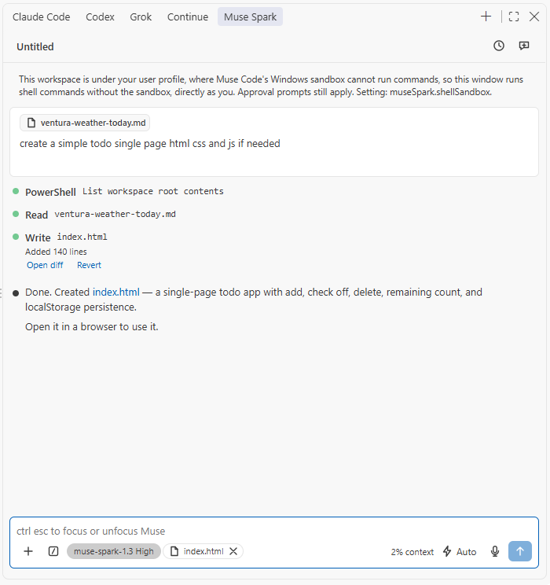
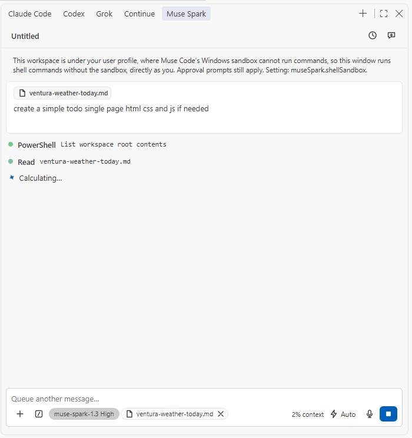

<p align="center">
  
</p>

<p align="center">
  <a href="https://marketplace.visualstudio.com/items?itemName=RandyNorthrup.muse-spark-code"></a>
  <a href="https://marketplace.visualstudio.com/items?itemName=RandyNorthrup.muse-spark-code"></a>
  <a href="https://github.com/RandyNorthrup/muse-spark-code/actions/workflows/ci.yml"></a>
  
  <a href="LICENSE"></a>
</p>

**Muse Spark Code** puts Meta's Muse Spark model to work inside VS Code as a
coding agent: a chat panel that streams answers, reads and edits your files
with reviewable diffs, runs commands behind permission modes, remembers past
conversations, and takes dictation from your microphone. It runs on your Muse
subscription through the Muse Code CLI, or on a Meta Model API key, and never
mixes the two.

> Unofficial. Not affiliated with or endorsed by Meta. "Muse Spark" and "Muse
> Code" are Meta trademarks. You bring your own credentials.

## Highlights

- **Streaming chat with tools you can see.** Every read, edit, write and shell
  command is a row in the transcript: green when done, pulsing while running,
  red when refused. Edits show `Added 140 lines` with **Open diff** and
  **Revert**.
- **Permission modes, like Claude Code.** Manual, Edit automatically, Plan and
  Auto (Bypass behind a setting), switched from the mode button or
  `Shift+Tab`. Gated commands arrive as approval cards; questions from the
  agent arrive as question cards.
- **Voice dictation at no cost.** Tap or hold the microphone (`Ctrl+D`) and
  speak; the words land at the caret. Windows and macOS use the recogniser
  built into the operating system, so no audio ever goes to a paid service.
- **Two backends, never mixed.** Your Muse subscription through the Muse Code
  CLI, or a Meta Model API key (pay as you go) with the extension's own
  tools. The pasted key is never handed to the CLI.
- **Context the way you work.** `@` mentions with `.gitignore`-aware fuzzy
  search, the open file or selection as a chip, images pasted or dropped,
  `Alt+K` to mention the editor selection, and the Problems panel readable by
  the agent.
- **History that survives the window.** Every conversation in the workspace,
  searchable, resumable with its full transcript, archivable; the sidebar
  picks its last conversation back up within ten minutes.
- **Account & usage.** Your subscription's current and weekly windows, this
  conversation's tokens, and a link to the dev.meta.ai dashboard, from
  `/usage`.
- **No telemetry, no server of its own.** What leaves your machine and where
  it goes is written down in [PRIVACY.md](docs/PRIVACY.md).

## Screenshots

<table>
  <tr>
    <td align="center" width="50%"><br><sub>A turn with tool rows, a reviewable edit and the reply</sub></td>
    <td align="center" width="50%"><br><sub>While it runs: Stop, context use, and steering by typing</sub></td>
  </tr>
  <tr>
    <td align="center"><br><sub>The <code>/</code> palette: context, model, effort, thinking, modes</sub></td>
    <td align="center"><br><sub>Permission modes, one line each, <code>Shift+Tab</code> to cycle</sub></td>
  </tr>
  <tr>
    <td align="center"><br><sub>History: search, resume, archive</sub></td>
    <td align="center"><br><sub>Voice dictation: tap or hold, <code>Ctrl+D</code></sub></td>
  </tr>
</table>

<p align="center"><br><sub>A new conversation, with the keyboard tips until you hide them</sub></p>

## Get started

1. Install **Muse Spark Code** from the
   [Marketplace](https://marketplace.visualstudio.com/items?itemName=RandyNorthrup.muse-spark-code)
   (VS Code 1.125 or newer), or from a `.vsix`:

   ```bash
   code --install-extension muse-spark-code-0.1.1.vsix
   ```

2. Open the **Muse Spark** view from the activity bar (or press
   `Ctrl+Shift+Esc` for a conversation in an editor tab).
3. Sign in, one of two ways:
   - **Sign in with your Meta account** opens a terminal running `muse login`
     from the [Muse Code CLI](https://dev.meta.ai/products/muse-code/) and
     waits for the browser sign-in to finish. Work is billed to your Muse
     subscription.
   - **Use a Model API key** takes a key shaped like `LLM|<id>|<secret>` from
     dev.meta.ai, stores it in VS Code's secret storage and runs the Model API
     backend with the extension's own tools, pay as you go.
4. Type a message and press `Enter`. `/` opens the palette, `@` mentions a
   file, the microphone dictates.

Each panel is its own conversation, started on the first message with the
standard `muse-spark-1.3` model (never a contributor-tier model by default).

## Backends

| Backend                                                                      | Sign-in                                                          | Billing                | Tools                                                                                                                                   |
| ---------------------------------------------------------------------------- | ---------------------------------------------------------------- | ---------------------- | --------------------------------------------------------------------------------------------------------------------------------------- |
| **Muse Code CLI** (`muse serve`, Muse Session Protocol via `@muse-code/sdk`) | The CLI's own browser sign-in (`muse login`)                     | Your Muse subscription | The CLI's, inside its OS sandbox where that works (see `shellSandbox`); its bundled skills, your user rules and its own memory          |
| **Meta Model API** (`https://api.meta.ai/v1`)                                | A key from dev.meta.ai, kept in SecretStorage, sent only to Meta | Pay as you go          | The extension's own: read, edit, write, search, list, shell, `read_skill`, with approvals; the workspace rules, skills and memory below |

`museSpark.backend` picks: `auto` (default) uses the CLI when it is installed
and signed in, otherwise the Model API when a key is stored; `museCode` and
`modelApi` force one. The palette's **Backend** row shows which one this
window runs on. The CLI looks for `muse` through `museSpark.museBinaryPath`,
then `PATH`, then the platform's install folder (`%LOCALAPPDATA%\Programs\muse`
on Windows, `~/.local/bin` elsewhere).

## Rules, skills and memory

In a trusted workspace the agent follows the same files Muse Code does:

- **Rules**: `AGENTS.md` at the workspace root (`CLAUDE.md` where there is no
  `AGENTS.md`), and the same files in subdirectories, which apply once the
  agent touches a path beneath them; the deeper file wins.
- **Skills**: `.agents/skills/<id>/SKILL.md` in the workspace (project scope)
  and Muse Code's personal root `~/.config/muse/skills`
  (`$XDG_CONFIG_HOME/muse/skills` when set). The palette's **Skills** group
  lists them, `/id arguments` invokes one, and the model loads one itself
  when a task matches its description. `user-invocable: false` in the
  front matter keeps a skill out of the palette.
- **Memory**: the project's `.agents/memory/MEMORY.md` index is read at the
  start of a conversation; the agent reads and updates the notes there with
  its file tools, under the permission mode.

On the CLI backend Muse Code loads all of this itself (the extension starts
it with `--trust-workspace`), plus its bundled skills and your user rules.
On the Model API backend the extension loads the files above and nothing
else; a file over 64 KB is skipped with a warning in the log. In VS Code's
**Restricted Mode** (an untrusted folder) neither backend loads rules, skills
or memory and no shell command runs; trust the workspace to enable them.

## The panel

**Composer.** `Enter` sends, `Shift+Enter` breaks a line (or send with
`Ctrl+Enter` through a setting). `/` on an empty draft opens the palette:
Context (attach, mention, clear, resume), Model (switch model, effort,
thinking), Customize (permission mode, Focus view, settings, keybindings),
Account & usage, Skills (the session's own), slash commands (`/compact`,
`/clear`, `/logout`, `/usage`, `/cost`) and Support. The `+` button uploads
images (PNG, JPEG, GIF, WebP; other files become `@` mentions) or starts a
mention; images also paste and drop. The model pill reads `model effort`
(effort tiers Minimal to Max, each verified per model); the mode button opens
the Modes menu; the microphone dictates. While a turn runs, `Enter` steers it
and Stop cancels it.

**Transcript.** Replies render as GitHub-flavoured markdown with highlighted
code and **Copy**, **Insert at cursor** and **Apply** on every block. Tool
rows open to show the diff, the command and its output, or the file read.
Reasoning folds to `Thought for Ns`. Approval cards carry the CLI's choices
(allow once, always allow in this workspace, reject with feedback); multi-step
shell lines are approved one step at a time. The agent's task list pins above
the composer, the session name replaces "Untitled" once allocated, and the
composer shows how much of the context window is used. **Focus view**
(`Ctrl+Alt+F`) folds tool and reasoning rows behind `Show N steps`.

**Edit review.** Muse Code applies in-workspace edits as it goes, so review
comes after: **Open diff** shows the file before and after in VS Code's diff
editor, **Revert** puts the previous text back (a created file goes to the
trash). If the file changed since, both say so rather than guess.

**History.** The clock icon lists the workspace's conversations by day with
search, resume (full transcript), archive and **Show archived**. Sessions
idle for `archiveInactiveSessions` days are hidden, not deleted. A hidden
panel shows a dot when Muse finished or needs a decision.

**Diagnostics.** The agent can read the Problems panel through a
`getDiagnostics` tool the extension serves on a loopback MCP server, bound to
`127.0.0.1` with a per-window token. Nothing else is exposed.

## Voice dictation

Tap the microphone to start and again to stop; hold it (or `Ctrl+D` /
`Cmd+D` in the composer, or Space on the focused button) to record while
held. The placeholder reads "Listening…", the mic pulses red, and each phrase
lands at the caret followed by a space. Recognition runs in a small helper
on the operating system's own engine, kept warm for five minutes after a
recording. Nothing is billed and no third-party engine is involved.

| Platform | How                                                                                                                                                                                                                                                                                                                                                                                                                             |
| -------- | ------------------------------------------------------------------------------------------------------------------------------------------------------------------------------------------------------------------------------------------------------------------------------------------------------------------------------------------------------------------------------------------------------------------------------- |
| Windows  | `native/windows/dictate.ps1` under Windows PowerShell 5.1 on the .NET Framework's `System.Speech`, the desktop recogniser that ships with Windows (English always; other languages with Windows speech packs). Audio never leaves the machine. Accuracy is the classic engine's, below Windows 11's voice typing; Windows' Speech Recognition training improves it for your voice.                                              |
| macOS    | `native/darwin/muse-dictate`, a Swift helper on Apple's Speech framework, built by CI on a Mac and shipped in the Marketplace package. **Dictation (System Settings > Keyboard) or Siri must be on.** macOS asks once for the microphone and for speech recognition. Apple picks on-device recognition when its model is installed, otherwise its servers under Apple's terms at no charge (`--on-device` refuses the servers). |
| Linux    | Not available: no distribution ships a speech recogniser and the extension adds none. The button is dimmed with that reason as its tooltip.                                                                                                                                                                                                                                                                                     |

Diagnosing on Windows: the helper can replay a WAV file instead of the
microphone, which separates a recogniser problem from a microphone one.

```powershell
& "$env:SystemRoot\System32\WindowsPowerShell\v1.0\powershell.exe" -NoProfile -ExecutionPolicy Bypass -File native\windows\dictate.ps1 -InputWav C:\path\to\speech.wav
```

Type `start` and press Enter; phrases print as JSON lines, then `stopped`.
On macOS the helper takes `--input-device <CoreAudio UID>` to capture from
one specific device; a Mac without any input device reports "no audio input
device is available", and step markers on stderr name where a start failed.

## Commands and keybindings

| Command                                    | Default keybinding                                                 | What it does                                                                                                                                              |
| ------------------------------------------ | ------------------------------------------------------------------ | --------------------------------------------------------------------------------------------------------------------------------------------------------- |
| Muse Spark: Open in Sidebar                | —                                                                  | Focus the chat view in the activity bar                                                                                                                   |
| Muse Spark: Open in New Tab                | `Ctrl+Shift+Esc` (`Cmd+Shift+Esc`)                                 | Open an independent conversation as an editor tab (also the `+` in the view title); the panel header's own button starts a new conversation in place      |
| Muse Spark: Toggle Focus                   | `Ctrl+Esc` (`Cmd+Esc`)                                             | Move keyboard focus between the editor and the composer                                                                                                   |
| Muse Spark: Insert @-Mention for Selection | `Alt+K`                                                            | Insert `@path#start-end` for the active editor selection into the composer                                                                                |
| Muse Spark: Toggle Focus View              | `Ctrl+Alt+F`                                                       | Flip the `museSpark.focusView` setting (hides tool calls and reasoning)                                                                                   |
| Muse Spark: Toggle Thinking                | `Ctrl+Alt+T` (macOS `Option+T`, Linux `Ctrl+Alt+O`), composer only | Turn reasoning on or off for this conversation. Claude Code uses `Alt+T`; on Windows that opens the Terminal menu, on GNOME `Ctrl+Alt+T` opens a terminal |
| Muse Spark: Set Up Shell Sandbox           | —                                                                  | Windows: run Muse Code's one-time `muse sandbox windows setup` through a UAC prompt and report the result; elsewhere reports that no setup is needed      |
| (composer) Record voice                    | `Ctrl+D` (`Cmd+D`), composer only                                  | Tap to start or stop voice dictation, hold to record while held                                                                                           |

## Settings

All settings live under `museSpark.*`; changes apply to open panels immediately.

| Setting                           | Default  | Purpose                                                                                                                                                                                                                                               |
| --------------------------------- | -------- | ----------------------------------------------------------------------------------------------------------------------------------------------------------------------------------------------------------------------------------------------------- |
| `preferredLocation`               | `panel`  | Where new conversations open: `sidebar` or `panel` (editor tab)                                                                                                                                                                                       |
| `initialPermissionMode`           | `manual` | `manual`, `acceptEdits`, `plan`, `auto` or `bypassPermissions` for new conversations                                                                                                                                                                  |
| `autosave`                        | `true`   | Save all dirty editors before every turn                                                                                                                                                                                                              |
| `attachOpenFile`                  | `true`   | Show the open-file chip and send the active file / selection with each message                                                                                                                                                                        |
| `useCtrlEnterToSend`              | `false`  | Send with Ctrl/Cmd+Enter instead of Enter                                                                                                                                                                                                             |
| `hideOnboarding`                  | `false`  | Hide the getting-started tips                                                                                                                                                                                                                         |
| `focusView`                       | `false`  | Show only prompts and responses                                                                                                                                                                                                                       |
| `respectGitIgnore`                | `true`   | Exclude `.gitignore` patterns from file searches and `@`-mentions                                                                                                                                                                                     |
| `confidentialWorkspace`           | `false`  | Block contributor-tier models (Meta may train on their traffic) in this workspace                                                                                                                                                                     |
| `allowDangerouslySkipPermissions` | `false`  | List Bypass permissions in the Modes menu and the Shift+Tab cycle (sandboxes only)                                                                                                                                                                    |
| `archiveInactiveSessions`         | `14`     | Hide sessions idle for this many days from the History dialog (`1`, `2`, `7`, `14`, or `0` for never); they stay on disk and **Show archived** lists them                                                                                             |
| `backend`                         | `auto`   | `auto`: Muse Code when the CLI is signed in, else the Model API when a key is stored; `museCode` / `modelApi` force one. The pasted key never reaches the CLI                                                                                         |
| `shellSandbox`                    | `auto`   | `auto`: Muse Code's OS sandbox, except for Windows workspaces under your profile where it cannot run commands; `muse`: always the sandbox; `off`: commands run directly as you, gated by approvals (Claude Code style). Changing it restarts the host |
| `museBinaryPath`                  | `""`     | Absolute path to the Muse Code executable; empty discovers it on `PATH` or the install dir                                                                                                                                                            |
| `environmentVariables`            | `[]`     | `{ name, value }` pairs for the Muse Code process. Never put API keys here; use Sign in                                                                                                                                                               |

## Requirements

- VS Code 1.125.0 or newer, on Windows, macOS or Linux.
- The [Muse Code CLI](https://dev.meta.ai/products/muse-code/) signed in with
  a Meta account (subscription), or a Meta Model API key (pay as you go).
- `git` on `PATH` for `.gitignore`-aware `@` mentions (optional; VS Code's
  file search is used without it).
- Voice dictation: Windows, or macOS with Dictation or Siri enabled.
- A trusted workspace for rules, skills, memory and shell commands; in
  Restricted Mode the panel chats and edits under approval, nothing more.
  The first workspace folder is the root; virtual workspaces are not
  supported.

## Privacy and security

- Your prompts, attachments, mentioned files and tool output go to Meta, and
  nowhere else, only when you press Send. The extension has no telemetry and
  no server of its own. Details: [PRIVACY.md](docs/PRIVACY.md).
- A pasted Model API key lives only in VS Code's SecretStorage, is sent only
  to `api.meta.ai`, is never passed to any child process, and never reaches
  settings, logs or the CLI.
- Contributor-tier models (Meta may train on their traffic) are opt-in with
  one confirmation per conversation, and refused outright with
  `museSpark.confidentialWorkspace`.
- Voice audio stays on the machine on Windows; on macOS Apple recognises on
  the device or on its servers under Apple's terms.
- Workspace rules, skill files and the memory index are read only in a
  trusted workspace; on the Model API backend their text is part of what
  goes to Meta with each request, on the CLI backend Muse Code sends them
  under its own terms.
- The webview runs under a strict CSP (`default-src 'none'`, per-load script
  nonce, no remote origins, no inline styles); every message between host and
  webview is validated with a zod schema.

## Development

```bash
git clone https://github.com/RandyNorthrup/muse-spark-code.git
cd muse-spark-code
npm ci          # also installs the pre-commit hook (lint-staged + gitleaks)
```

Press **F5** to launch the Extension Development Host with a fresh build.
Node 22 or newer and npm 11 (`.npmrc` enforces `engine-strict`);
[gitleaks](https://github.com/gitleaks/gitleaks) on `PATH` for the hook and
`npm run security:secrets`; `pip install semgrep` for `npm run security:sast`.

**Stack.** TypeScript 6.0.3 (pinned: `typescript-eslint` does not yet
support TS 7); the extension host bundled with esbuild to CommonJS; the
webview is React 19 bundled to one IIFE with its stylesheet; `zod/mini`
validates every host ⇄ webview message; the voice helpers are Windows
PowerShell and Swift with no dependencies.

| Command                                   | What it does                                                                                                     |
| ----------------------------------------- | ---------------------------------------------------------------------------------------------------------------- |
| `npm run build:dev`                       | Dev bundles for the extension, the webview and the integration tests, with source maps                           |
| `npm run watch`                           | Rebuild extension + webview on change                                                                            |
| `npm run harness:shots`                   | Screenshots of the webview in headless Chrome behind a fake host (`test/harness/`); needs `build:dev` and Chrome |
| `npm run images`                          | Render the Marketplace icon, the README banner and the social preview from their SVGs (headless Chrome)          |
| `npm run build`                           | Minified production bundles, then enforces the size budgets in `scripts/check-bundle-size.mjs`                   |
| `npm run format` / `npm run format:check` | Prettier write / check                                                                                           |
| `npm run lint`                            | `eslint --max-warnings=0` (type-aware), `stylelint --max-warnings=0`, PSScriptAnalyzer over `native/windows`     |
| `npm run typecheck`                       | `tsc --noEmit` for the host, webview, unit-test and integration-test projects                                    |
| `npm run deadcode`                        | `knip`: unused files, exports, dependencies (no `--strict`; see `knip.jsonc`)                                    |
| `npm run cycles`                          | `dpdm` circular-import check from both entry points                                                              |
| `npm run duplication`                     | `jscpd` copy-paste detection (threshold 0)                                                                       |
| `npm run test:unit`                       | vitest with coverage thresholds (90 % statements/lines/functions, 85 % branches)                                 |
| `npm run test:integration`                | Builds, downloads VS Code stable into `.vscode-test/`, runs `test/integration/**` inside it                      |
| `npm run test`                            | Unit then integration                                                                                            |
| `npm run security:audit`                  | `npm audit --audit-level=high`                                                                                   |
| `npm run security:sast`                   | `semgrep scan --config auto --error`                                                                             |
| `npm run security:secrets`                | `gitleaks git` over the repository history                                                                       |
| `npm run quality`                         | Every gate above except integration tests, plus secrets and SAST; **exits non-zero on any finding**              |
| `npm run quality:ci`                      | What CI runs: all gates plus integration tests                                                                   |
| `npm run package`                         | `vsce package --no-dependencies` → `.vsix` (without the macOS helper unless built on a Mac)                      |
| `npm run clean`                           | Remove `dist/` and `coverage/`                                                                                   |

**Tests.** Unit tests (`test/unit/**`) run under vitest with `vscode` aliased
to `test/unit/mocks/vscode.ts` and webview components under jsdom; the fakes
in `test/unit/helpers/` implement the full VS Code interfaces. Integration
tests (`test/integration/**`) run under mocha inside a real VS Code launched
by `@vscode/test-cli` (on Linux under `xvfb-run -a`).

**Quality gates.** Every gate fails the build rather than printing, and each
was seen to fail on a deliberate break before being trusted; the records are
in [`docs/certification/`](docs/certification/), one file per milestone.
Escape hatches (`eslint-disable`, `@ts-expect-error`, casts) need an inline
reason and a row in `PLAN.md` §8. Bundle budgets: 600 KiB for the extension,
900 KiB for the webview.

**Environment variables.** Credentials live in SecretStorage, never in
files. `.env.example` documents the single variable tooling may read:
`META_API_KEY`, which the Muse Code CLI inherits untouched if you export it
yourself (and prefers over its sign-in, as Meta documents). The extension
never sets it.

**Project structure.**

```
src/extension.ts            activation: registers the view, panel, commands
src/host/                   VS Code-facing code (webview wiring, auth, conversation, mentions, voice)
src/core/                   backend-agnostic logic (MSP host, Model API client, tools, dictation driver)
src/shared/                 constants + zod message protocol shared with the webview
src/webview/                React app (own tsconfig, browser libs)
native/windows/             dictate.ps1: the Windows dictation helper (System.Speech)
native/darwin/              Dictation.swift + build.sh: the macOS helper (built in CI)
test/unit/                  vitest tests, vscode mock, fakes
test/integration/           @vscode/test-cli suites
test/harness/               the webview behind a fake host, for screenshots
scripts/                    esbuild build, bundle-size gate, PSScriptAnalyzer gate, image rendering
docs/certification/         per-milestone gate-fire records
media/                      icons, banner, social preview, README screenshots
```

**Releases.** CI (`.github/workflows/ci.yml`) runs the quality gates on
Ubuntu, Windows and macOS, the integration tests, gitleaks over the full
history, semgrep, a `native-darwin` job that compiles the macOS dictation
helper, and a `package` job that uploads the complete `.vsix` as the
`muse-spark-code-vsix` artifact. Releases are published from that artifact
(`npx vsce publish --packagePath <file>.vsix`, publisher `RandyNorthrup`),
never from a Windows or Linux `npm run package`, or Mac users would get a
panel without a microphone.

## Troubleshooting

- **Every shell command fails with `sandbox enforcement unavailable`** — Muse
  Code runs commands inside an OS sandbox that needs a one-time administrator
  setup on Windows. The panel offers it in a notification ("Set up now"
  relaunches `muse sandbox windows setup` through the UAC prompt); the same
  flow is **Muse Spark: Set Up Shell Sandbox**. Start a new conversation
  afterwards. Linux and macOS need no setup.
- **Shell commands run in `C:\Windows\System32\WindowsPowerShell\v1.0`
  instead of the project, and the first one takes ages** — Muse Code 1.3.0's
  Windows sandbox cannot enter folders under `C:\Users\<you>`
  ([meta-models/muse-code-sdk#26](https://github.com/meta-models/muse-code-sdk/issues/26)).
  With `museSpark.shellSandbox` at `auto` the extension starts Muse Code
  without the sandbox for such workspaces: commands run directly as you, in
  the project, still gated by the approval cards, and the panel says so once
  per conversation. `muse` keeps the sandbox regardless; `off` never sandboxes.
- **"Could not rename the conversation … UnsupportedPlatform" / "Could not
  fork the conversation … WriteFailed"** — Muse Code 1.3.0 refuses
  `session/rename` and `session/fork` on Windows. The panel shows the refusal
  and leaves the conversation as it was.
- **Model API charges while using the CLI** — the extension never hands your
  pasted key to the CLI (the "muse serve credentials" line in the Muse Spark
  output log says which credential it started with). If the CLI itself holds
  a pay-as-you-go key (`muse auth set`) or `META_API_KEY` is exported in your
  environment, the CLI uses it, exactly as Meta documents.
- **The microphone says "Voice dictation failed: No microphone is available"**
  — Windows sees no recording device from this session (Remote Desktop hides
  the host's devices unless the client redirects a microphone). On macOS,
  "Siri and Dictation are disabled" means Dictation must be switched on in
  System Settings > Keyboard.
- **`npm ci` fails with an engine error** — Node 22+ is required.
- **Pre-commit hook says `gitleaks: command not found`** — install gitleaks
  (Windows: `winget install Gitleaks.Gitleaks`).
- **Type-aware lint rules stop reporting** — `npm ls typescript` must show
  6.0.x; TypeScript 7 is outside `typescript-eslint`'s peer range.
- **`npm run test:integration` cannot download VS Code** — the download goes to
  `.vscode-test/`; on a restricted network set `VSCODE_TEST_VERSION` or
  pre-populate the folder from another machine.
- **Webview is blank after a change** — run `npm run build:dev` (F5 does this
  via the pre-launch task) and reload the window.

## More

- [CHANGELOG.md](CHANGELOG.md): what shipped, version by version.
- [PLAN.md](PLAN.md): decisions, research, milestones and their certification.
- [docs/PRIVACY.md](docs/PRIVACY.md): what leaves your machine.
- [Issues](https://github.com/RandyNorthrup/muse-spark-code/issues).
