<p align="center">
  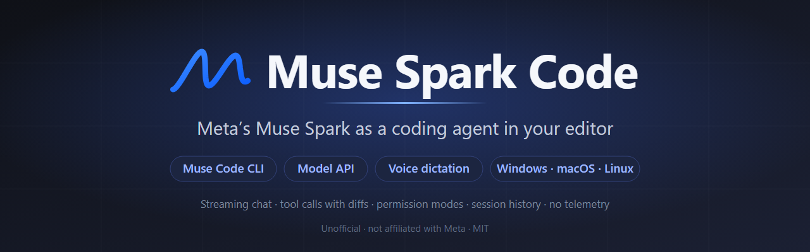
</p>

<p align="center">
  <a href="https://marketplace.visualstudio.com/items?itemName=RandyNorthrup.muse-spark-code"></a>
  <a href="https://marketplace.visualstudio.com/items?itemName=RandyNorthrup.muse-spark-code"></a>
  <a href="https://open-vsx.org/extension/RandyNorthrup/muse-spark-code"></a>
  <a href="https://open-vsx.org/extension/RandyNorthrup/muse-spark-code"></a>
  <a href="https://www.npmjs.com/package/muse-spark-code-acp"></a>
  <a href="https://github.com/RandyNorthrup/muse-spark-code/actions/workflows/ci.yml"></a>
  <a href="#install-in-your-editor"></a>
  
  <a href="#languages"></a>
  <a href="LICENSE"></a>
  <a href="https://www.paypal.com/donate/?hosted_button_id=Q9VC7B42R7K82"></a>
</p>

**Muse Spark Code** puts Meta's Muse Spark model to work in your editor as a
coding agent: as an extension in VS Code, Cursor, Windsurf, VSCodium and other
VS Code-based editors, and through its ACP agent in Zed, JetBrains IDEs,
Neovim, Emacs and more ([install](#install-in-your-editor)). A chat panel streams answers, reads and edits your files with
reviewable diffs, runs commands behind permission modes, and delegates to
subagents you can watch and steer. It also remembers past conversations and
takes dictation from your microphone. It runs on your Muse subscription
through the Muse Code CLI, or on a Meta Model API key, and never mixes the
two.

> Unofficial. Not affiliated with or endorsed by Meta. "Muse Spark" and "Muse
> Code" are Meta trademarks. You bring your own credentials.

**Contents:** [What's new](#whats-new-in-0110) ·
[Highlights](#highlights) · [Screenshots](#screenshots) ·
[Get started](#get-started) · [Backends](#backends) ·
[Permission modes](#permission-modes) ·
[Rules, skills and memory](#rules-skills-and-memory) ·
[Muse Code's own tools](#muse-codes-own-tools) · [Web fetch](#web-fetch) ·
[The panel](#the-panel) ·
[Voice dictation](#voice-dictation) · [Paid features](#paid-features) ·
[Languages](#languages) ·
[Limits](#limits) ·
[Commands](#commands-and-keybindings) · [Settings](#settings) ·
[Requirements](#requirements) · [Privacy](#privacy-and-security) ·
[Troubleshooting](#troubleshooting) · [Development](#development)

## What's new in 0.11.0

- **Recovers when Muse Code stops answering.** If Muse Code goes silent,
  the panel says so once and stops waiting out each action's deadline.
  With no turn running in the window it restarts Muse Code by itself;
  during a turn, the notice offers **Restart now**. **Muse Spark: Restart
  Muse Code** does the same at any time. When Muse Code does not confirm
  that a message reached the running turn, the panel no longer sends it
  again by itself: the send fails, keeps your text and says it may still
  arrive. A conversation whose Muse Code log is damaged (a Muse Code 1.4.2
  bug) is marked and offers a new conversation.
- **Approvals you can't miss.** The oldest waiting approval docks above
  the message box, with a count of the rest. Each approval step takes one
  decision, and its buttons stay locked until Muse Code has applied it.
- **Calmer notices.** A notice said again in a row shows once, with a
  count, and error notices are readable in light and dark themes.
- **Turn checkpoints are on by default** (Model API turns in a trusted
  workspace with Git). Restore and Redo are rebuilt on the model's own file
  writes, journaled per turn; commands and other tools active in a turn are
  noted, never undone.
- **Custom agents** (Model API backend): agents with their own prompt,
  tools, model and permissions. Two are built in (`explore` and
  `second-opinion`); yours live in `.agents/agents/` in the workspace or
  `~/.config/muse/agents/` for every workspace. An agent can only narrow
  what the session may do.
- **Handoff** (Model API backend): `/handoff` asks the model for a brief
  that you review and edit before it starts a fresh conversation with the
  open todo items.
- **Import from Claude Code, Codex and Cursor:** commands (as skills),
  compatible agents, project rules (appended to `AGENTS.md`) and MCP
  servers, plus Claude Code and Codex hooks. MCP servers and hooks open as
  unsaved edits for you to review.
- **Session export, import and share** as a file. A shared file opens
  read-only in the panel; an imported conversation resumes on the Model API
  backend in Manual (or Plan).
- **Observation packing** (off by default, Model API backend): a long tool
  output goes to the model whole twice, then as a short placeholder it can
  recall; the transcript always keeps all of it.
- **Muse Code 1.4.2** support, and checksums, SBOMs and build attestations
  on the release assets.

### Earlier in 0.10.1

- **A slow Muse Code start is waited for.** On a busy machine Muse Code
  gets up to two minutes to start while its process runs, and a failed
  start shows one message instead of one per waiting action.
- **The ACP agent publishes to npm.** The release now publishes
  `muse-spark-code-acp` to npm as well as to the GitHub Release; 0.10.0's
  did not reach npm.
- **Faster Windows hooks and a sturdier log.** Hooks and commands on
  Windows no longer wait on PowerShell's module scan, and a crafted long
  line no longer stalls the log.

### Earlier in 0.10.0

- **More editors.** Install the extension in compatible VS Code editors,
  or use the ACP agent in editors that speak that protocol. Support levels
  and verified versions are listed under [Other editors](#other-editors);
  Preview support does not imply every VS Code feature is available.
- **Code intelligence and web fetch.** Both backends can use the editor's
  language services and read public web pages with workspace permission
  checks ([Code intelligence](#code-intelligence), [Web fetch](#web-fetch)).
- **Checks after edits.** The Model API verify loop can format edited files
  and run the configured checks, with permission, trust and Stop checked
  before work starts. Formatting and check commands remain opt in.
- **Plans and turn checkpoints.** Save plans as files and implement them in
  a fresh conversation. Turn checkpoints (Preview, off by default:
  `museSpark.turnCheckpoints`) capture files on both backends;
  stored file restore and Redo require an attached Model API session and
  confirmed process safety ([The panel](#the-panel)).

### Earlier in 0.9.0

- **Install and sign in from the panel.** Without Muse Code, **Install
  Muse Code** shows Meta's install command for your system and runs it in a
  terminal you can watch, then offers sign-in. **Sign in with your Meta
  account** now shows its approval code right in the panel.
- **PDFs and text files.** Attach, paste or drop PDFs (up to 32 MB) on the
  Model API backend, and pick UTF-8 text files from the workspace on either
  backend. The Model API agent also reads workspace PDFs and images itself.
- **The Model API backend catches up with Muse Code:**
  - the MCP servers from Muse Code's settings and the same memory notes;
  - session goals, `!` shell commands and background work;
  - opt-in hooks and subagents.
- **Paid extras, opt in and loud.** Web search, image generation and edits,
  Muse Voice, subagents and scheduled `/loop` prompts on your Model API key.
  Each is off until you turn it on and accept its price, every use is
  marked paid, and Account & usage tallies them.
- **Rewind the conversation, or take a side chat.** Any sent message can
  branch the conversation before itself; **Side chat** opens a Plan-mode
  branch without stopping the main one.
- **More of Muse Code in the panel.** A row for every tool Muse Code runs,
  workflows as live cards, goals, and background tasks you can stop.
- **Behind a corporate network.** Muse Code gets VS Code's proxy,
  `museSpark.sandboxNetwork` sets its sandbox network, a request that never
  reached Meta says why, and **Muse Spark: Diagnostics** reports the network
  posture.

0.8.0 brought the panel in fourteen languages; 0.7.0 brought `/` as in
Claude Code, skills, MCP servers and hooks in the panel, worktrees, export
and the accessibility gate.

Every change is in the [CHANGELOG](CHANGELOG.md).

## Highlights

- **Streaming chat with tools you can see.** Every read, edit, write and shell
  command is a row in the transcript: green when done, pulsing while running,
  red when refused, grey when a stopped turn cut it off. Edit rows show the
  diff, the path opens the file with the changed lines selected, **Click to
  expand** opens VS Code's diff editor, and any output opens in an editor tab
  with a click.
- **Code intelligence from your editor.** The agent finds definitions,
  references, symbols and callers, reads hovers, maps the repository and
  renames symbols through VS Code's own language services instead of
  searching text, on both backends ([more](#code-intelligence)).
- **Permission modes, like Claude Code.** Manual, Edit automatically, Plan and
  Auto (Bypass behind a setting), switched from the mode button or
  `Shift+Tab`. Gated commands arrive as approval cards with the CLI's own
  choices; questions from the agent arrive as question cards with radios,
  checkboxes, tabs and an "Other" answer.
- **`/` for everything.** The palette holds the actions, the model, effort
  and thinking, the permission mode and your skills; type a letter after the
  `/` and it narrows to the slash commands, as in Claude Code.
- **Subagents on a map.** When Muse Code delegates, or the Model API backend
  runs the paid subagents you turned on, each agent is a row and an
  **N agents** pill opens the Agent map: role, status, tokens, each agent's
  own transcript, and the controls the backend offers.
- **Workflows you can follow.** When Muse Code runs a multi-agent workflow,
  the run is a card that keeps updating after the reply: its agents with
  their state, time and tokens, and the result it returned. Owner controls
  wait for a live accepted-command capture.
- **Reply and quote with context.** A reply's ⋯ menu has **Reply to this
  output**; highlight anything in the chat and right-click for **Ask about
  this** or **Comment on this**. The passage, its author and your intent
  travel with the message.
- **Voice dictation at no cost.** Tap or hold the microphone (`Ctrl+D`) and
  speak; the words land at the caret. Windows and macOS use the recogniser
  built into the operating system, so no audio goes to a paid service unless
  you turn on Muse Voice.
- **Paid extras, only if you ask.** On a Model API key: web search with its
  sources, image files made on request, and Meta's Muse Voice for
  dictation. Each is off until you turn it on and accept its price, marked
  paid wherever it is used, and tallied in Account & usage.
- **Scheduled prompts under your control.** On the Model API backend,
  `/loop` saves a recurring prompt in this conversation. A due prompt waits
  for you to run and confirm it; your key is never spent unattended.
- **Two backends, never mixed.** Your Muse subscription through the Muse Code
  CLI, or a Meta Model API key (pay as you go) with the extension's own
  tools. The pasted key is never handed to the CLI.
- **Set up from the panel.** No Muse Code yet? **Install Muse Code** shows
  Meta's command and runs it in a terminal; **Sign in with your Meta
  account** shows its approval code in the panel.
- **Context the way you work.** `@` mentions with `.gitignore`-aware fuzzy
  search, the open file or selection as a chip, images and PDFs pasted or dropped, and
  `Alt+K` to mention the editor selection. On the CLI backend the agent can
  also read the Problems panel.
- **History that survives the window.** Every conversation in the workspace,
  searchable, resumable with its full transcript, archivable, with fork and
  rewind on every sent message. The sidebar picks its last conversation back
  up within ten minutes, and an editor-tab conversation comes back after a
  window reload.
- **Account & usage.** On Muse Code, your subscription's current and weekly
  windows; this conversation's tokens (and cache hits, on the Model API); and
  what has been eating your usage (reminder agents, subagents, long
  sessions), from `/usage`.
- **In your language.** Fourteen of VS Code's display languages, with the
  model's side kept in English so it behaves the same everywhere.
- **Accessible and observable.** Checked against WCAG 2.2 AA in every default
  theme, and a log that records what happened without what you wrote.
- **No telemetry, no hosted server of its own.** What leaves your machine and where
  it goes is written down in [PRIVACY.md](docs/PRIVACY.md).

## Screenshots

Rendered from the shipped panel by its own UI harness (`npm run
harness:shots`) against a scripted session, so they match the build.

<table>
  <tr>
    <td align="center" width="50%">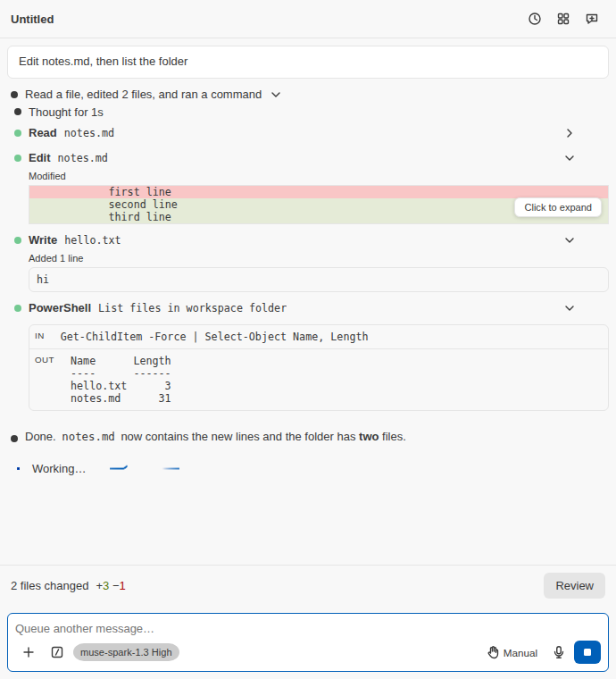<br><sub>A turn: thinking, read, edit with its diff, write, shell, and the reply</sub></td>
    <td align="center" width="50%">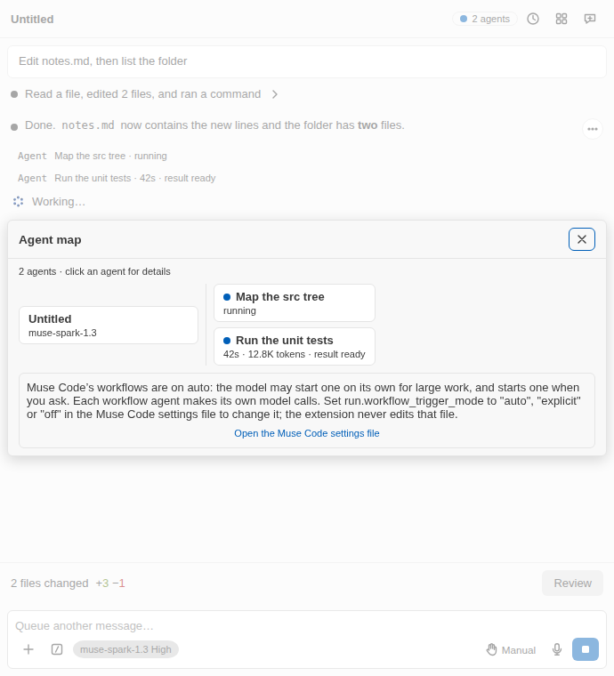<br><sub>Subagents: the <b>2 agents</b> pill and the Agent map</sub></td>
  </tr>
  <tr>
    <td align="center">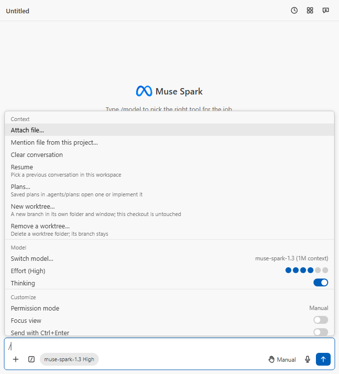<br><sub>Type <code>/</code>: the palette above the prompt</sub></td>
    <td align="center">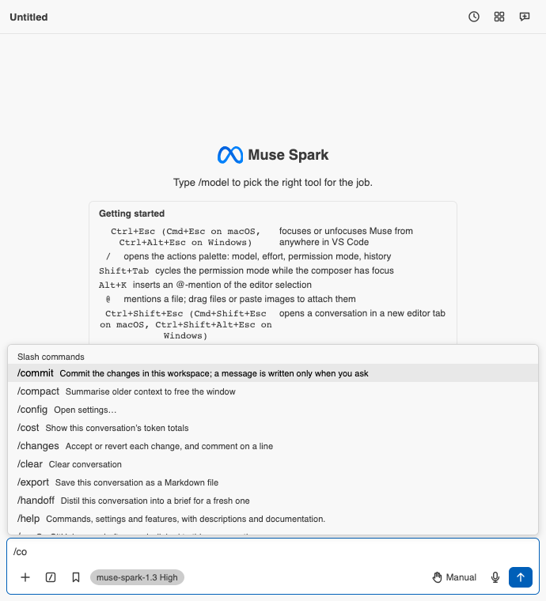<br><sub>A letter more: the slash commands, ranked as you type</sub></td>
  </tr>
  <tr>
    <td align="center">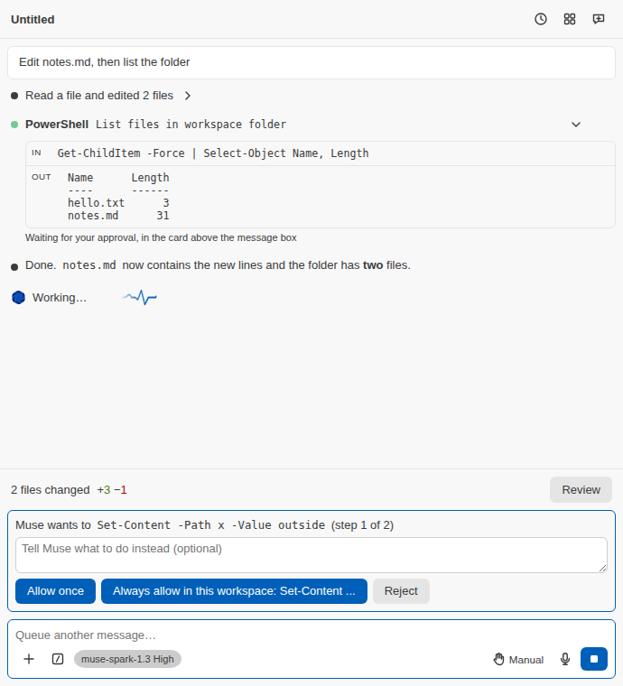<br><sub>An approval card, docked above the message box, with the CLI's own choices</sub></td>
    <td align="center">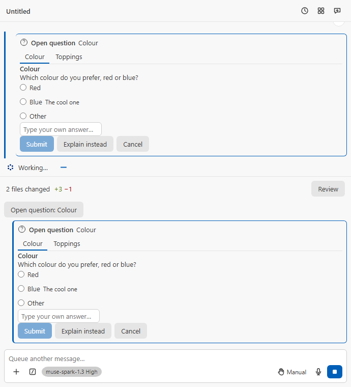<br><sub>A question card: tabs, radios or checkboxes, Other, Submit, Explain instead and Cancel</sub></td>
  </tr>
  <tr>
    <td align="center">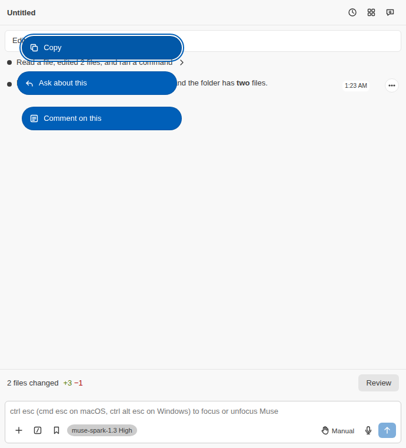<br><sub>Highlight, right-click: <b>Copy</b>, <b>Ask about this</b> or <b>Comment on this</b></sub></td>
    <td align="center">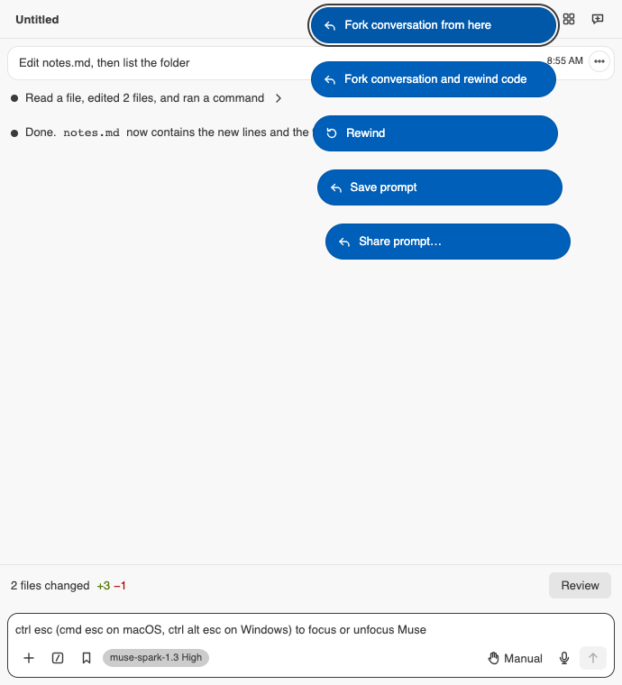<br><sub>Every sent message: fork, rewind the conversation or the code, or fork and rewind</sub></td>
  </tr>
  <tr>
    <td align="center">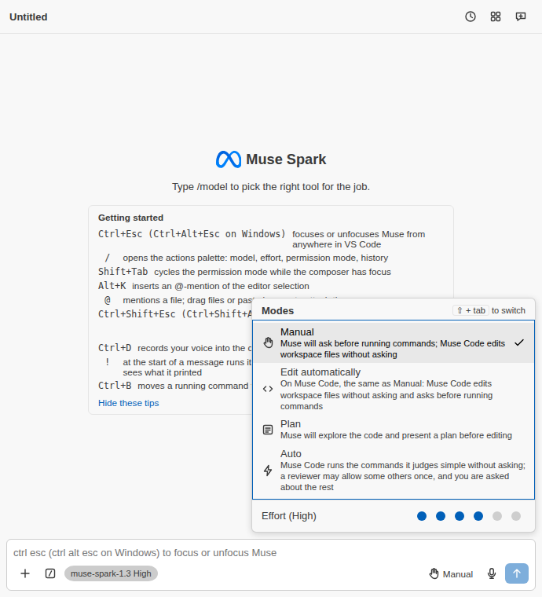<br><sub>Permission modes, one line each, <code>Shift+Tab</code> to cycle</sub></td>
    <td align="center">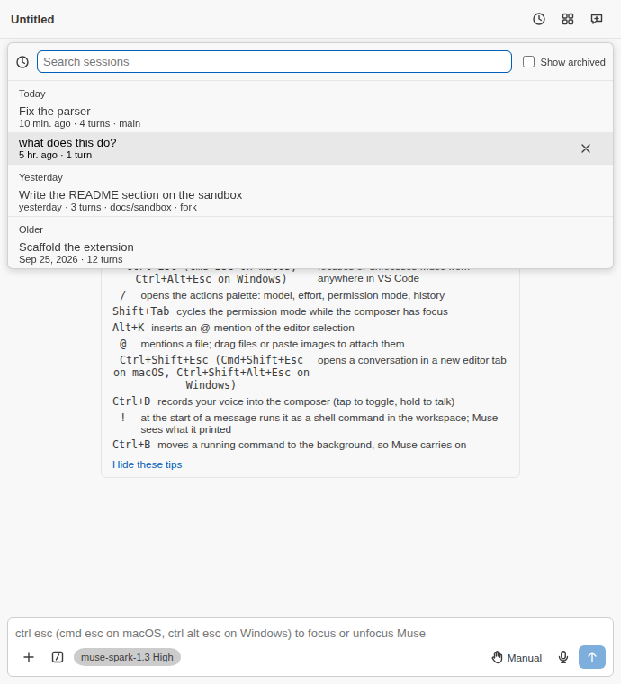<br><sub>History: search, resume, archive</sub></td>
  </tr>
  <tr>
    <td align="center">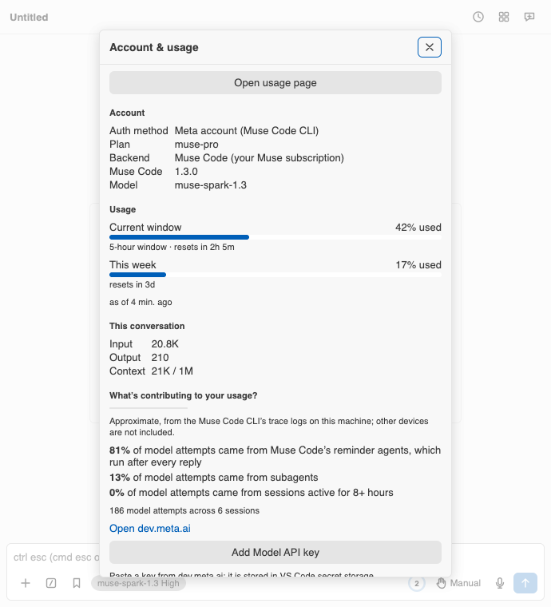<br><sub>Account & usage: windows, tokens, and what is eating the usage</sub></td>
    <td align="center">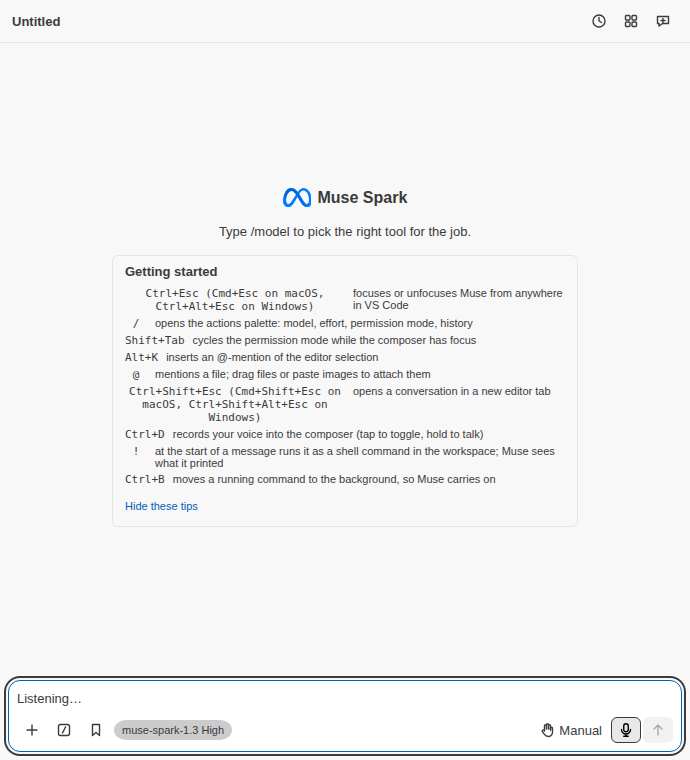<br><sub>Voice dictation: tap or hold, <code>Ctrl+D</code></sub></td>
  </tr>
</table>

## Get started

1. Install **Muse Spark Code** from the
   [Marketplace](https://marketplace.visualstudio.com/items?itemName=RandyNorthrup.muse-spark-code)
   (VS Code 1.99 or newer), or from a `.vsix` attached to a
   [GitHub Release](https://github.com/RandyNorthrup/muse-spark-code/releases):

   ```bash
   code --install-extension muse-spark-code-0.11.0.vsix
   ```

2. Open the **Muse Spark** view from the activity bar (or press
   `Ctrl+Shift+Alt+Esc` on Windows, `Cmd+Shift+Esc` on macOS,
   `Ctrl+Shift+Esc` on Linux for a conversation in an editor tab).
3. If Muse Code is missing, **Install Muse Code** opens a confirmation dialog
   showing Meta's exact command for this operating system. The same action is
   in **Account & usage** while you work with a Model API key. **Run installer**
   opens a visible VS Code terminal;
   the panel checks for the CLI and offers sign-in when it appears. You can also
   open [Meta's installation instructions](https://dev.meta.ai/products/muse-code/).
   If VS Code cannot open the installer terminal, the panel reports that
   directly and keeps the manual instructions available.
   Sign in, one of two ways:
   - **Sign in with your Meta account** shows an approval code in the panel.
     Open its sign-in page in your browser and approve the code within ten
     minutes, before it expires. **Cancel sign-in** stops the temporary CLI
     sign-in process; if the browser approved just before, the panel
     follows what Muse Code saved. If you deny the code, it expires, or Muse
     Code cannot save the sign-in, the panel says so; an ending Muse Code
     has not been seen to send is shown in its own word. Work is billed to
     your Muse subscription.
   - **Use a Model API key** takes a key from dev.meta.ai (Meta's current
     keys start with `LLM_`; older ones look like `LLM|<id>|<secret>`),
     stores it in VS Code's secret storage and runs the Model API backend
     with the extension's own tools, pay as you go. **Account & usage** lets
     you add or replace that key while Muse Code is signed in; there the key
     pays only for paid features you turn on. After a CLI install, **Account
     & usage** also offers **Sign in with your Meta account**.

   Signing out ends the old account's conversations and clears them from the
   panel; your unsent draft stays. If sign-out cannot finish, see
   [Troubleshooting](#troubleshooting).

4. Type a message and press `Enter`. `/` shows the palette, `@` mentions a
   file, the microphone dictates.

VS Code opens the extension's four-step walkthrough on install; **Muse
Spark: Open Walkthrough** brings it back.

Each panel is its own conversation, started on the first message with the
standard `muse-spark-1.3` model (never a contributor-tier model by default).
The model pill shows the model as soon as the panel opens.

## Backends

| Backend                                                                      | Sign-in                                                          | Billing                | Tools                                                                                                                                                                                                                                                        |
| ---------------------------------------------------------------------------- | ---------------------------------------------------------------- | ---------------------- | ------------------------------------------------------------------------------------------------------------------------------------------------------------------------------------------------------------------------------------------------------------ |
| **Muse Code CLI** (`muse serve`, Muse Session Protocol via `@muse-code/sdk`) | The CLI's own device-code browser sign-in                        | Your Muse subscription | The CLI's, inside its OS sandbox where that works (see `shellSandbox`); its bundled skills, your user rules, its own memory, subagents, and the Problems panel through the extension                                                                         |
| **Meta Model API** (`https://api.meta.ai/v1`)                                | A key from dev.meta.ai, kept in SecretStorage, sent only to Meta | Pay as you go          | The extension tools: read, edit, write, search, list, shell, skills, questions, todos, goals, memory and diagnostics; configured MCP servers; opt-in hooks and bounded subagents; paid web search and image tools when turned on; workspace rules and skills |

`museSpark.backend` picks: `auto` (default) uses the CLI when it is installed
and signed in, otherwise the Model API when a key is stored; `museCode` and
`modelApi` force one. The palette's **Backend** row shows which one this
window runs on. The CLI looks for `muse` through `museSpark.museBinaryPath`,
then `PATH`, then the platform's install folder (`%LOCALAPPDATA%\Programs\muse`
on Windows, `~/.local/bin` elsewhere).

Conversations on the Model API backend are saved as they go under VS Code's
workspace storage for the extension, so the History dialog lists them after
a reload, and a resumed one continues with its transcript and its edit
patches while the same Model API key is stored. History, resume, reads and
forks are limited to that key's sessions. Replacing the key starts a fresh
conversation; older sessions remain on disk for their original key. Sessions
saved before ownership was recorded remain on disk but cannot be reopened
because their account cannot be proved. The CLI backend keeps its own session
store. Replacing its secondary Model API key keeps the Muse Code conversation
running. A paid image awaiting its popup or a retry stops if that key changes;
the old request cannot use the new key. If the panel itself
ever fails to render, it shows the error and a **Reload** button instead of
going blank; Reload brings the conversation back as it was, running turn and
waiting cards included.

Sign-out and account replacement clear the panel's transcript, loaded tool
output, agent transcripts and retained file chips before another account
signs in. Unsent draft text stays in the composer. When an installer makes a
signed-in Muse Code CLI available in `auto` mode, the current Model API
session ends before the next message starts a fresh CLI session.

## Other editors

The same two backends run outside VS Code as `muse-spark-code-acp`, an
agent for editors that speak the Agent Client Protocol (Zed, JetBrains IDEs,
Neovim, Emacs and others), attached to each GitHub Release.
[docs/acp.md](docs/acp.md) covers installing it, where it keeps a Model API
key (the operating system's credential store), and the editor's settings.
VS Code forks built on VS Code 1.99 or later install the extension itself,
from Open VSX or a `.vsix`.

### Install in your editor

Get it from the
[VS Code Marketplace](https://marketplace.visualstudio.com/items?itemName=RandyNorthrup.muse-spark-code),
[Open VSX](https://open-vsx.org/extension/RandyNorthrup/muse-spark-code),
[npm](https://www.npmjs.com/package/muse-spark-code-acp) (the ACP agent) or
[GitHub Releases](https://github.com/RandyNorthrup/muse-spark-code/releases)
(both the `.vsix` and the agent's `.tgz`).

| Editor                                                   | How                                                                                                                                                                                                                                                |
| -------------------------------------------------------- | -------------------------------------------------------------------------------------------------------------------------------------------------------------------------------------------------------------------------------------------------- |
| **VS Code**                                              | Search **Muse Spark Code** in the Extensions view, or run `code --install-extension RandyNorthrup.muse-spark-code`                                                                                                                                 |
| **Cursor**                                               | Search **Muse Spark Code** in the Extensions view (Open VSX), or download the `.vsix` from the [latest release](https://github.com/RandyNorthrup/muse-spark-code/releases/latest) and run `cursor --install-extension muse-spark-code-0.11.0.vsix` |
| **Windsurf (Devin Desktop), VSCodium, Kiro, Positron**   | Search **Muse Spark Code** in the Extensions view (Open VSX); in VSCodium also `codium --install-extension RandyNorthrup.muse-spark-code`. Any of them: **Extensions: Install from VSIX…** with the release's `.vsix`                              |
| **JetBrains IDEs** (IntelliJ IDEA, PyCharm, WebStorm, …) | Install the ACP agent (below), then add it to AI Assistant (below). Not yet tested here                                                                                                                                                            |
| **Zed**                                                  | Install the ACP agent (below), then add it to Zed's settings (below)                                                                                                                                                                               |
| **Neovim, Emacs, JupyterLab**                            | Install the ACP agent (below), then follow [docs/acp.md](docs/acp.md#configure-the-editor) (CodeCompanion, agent-shell, Jupyter AI)                                                                                                                |

**The ACP agent** needs Node.js 22 or later. Install it from the release:

```bash
npm install -g https://github.com/RandyNorthrup/muse-spark-code/releases/download/v0.11.0/muse-spark-code-acp-0.11.0.tgz
muse-spark-code-acp --version
```

**Zed** (tested with Zed 1.20.2): add this to `settings.json`, then pick
Muse Spark under External Agents in the Agent Panel's new-thread menu.

```json
{
  "agent_servers": {
    "Muse Spark": {
      "type": "custom",
      "command": "muse-spark-code-acp",
      "args": [],
      "env": {}
    }
  }
}
```

**JetBrains IDEs**: in the AI Chat tool window choose **Add Custom Agent**,
which opens `~/.jetbrains/acp.json`, and add the agent under
`agent_servers` ([JetBrains' ACP guide](https://www.jetbrains.com/help/ai-assistant/acp.html)).
This setup follows JetBrains' documentation and has not been tested here yet.

```json
{
  "default_mcp_settings": {},
  "agent_servers": {
    "Muse Spark": {
      "command": "muse-spark-code-acp",
      "args": []
    }
  }
}
```

Add `"--backend", "modelApi"` to `args` in either editor to use the Model
API backend instead of Muse Code.

**On Windows**, npm installs `muse-spark-code-acp` as a `.cmd` launcher,
which some editors cannot start. If the editor says it cannot find or start
the agent, use `node` as the command and the agent's script as the first
argument, before any others. `<npm root -g>` is the folder `npm root -g`
prints, usually `%APPDATA%\npm\node_modules`. This form works on every
platform ([docs/acp.md](docs/acp.md#install)).

```json
{
  "command": "node",
  "args": [
    "C:\\Users\\<you>\\AppData\\Roaming\\npm\\node_modules\\muse-spark-code-acp\\dist\\acp.js"
  ]
}
```

[docs/ide-compatibility/hosts.md](docs/ide-compatibility/hosts.md) records
which editors have been tried: so far VSCodium, code-server, Eclipse
Theia, Cursor, Devin Desktop (formerly Windsurf), Kiro and Positron with
the extension, and Zed, Emacs (agent-shell), Neovim (CodeCompanion) and
JupyterLab (Jupyter AI) with the agent.

## Permission modes

| Mode                   | Model API backend                                                                                   | Muse Code backend                                                                                                |
| ---------------------- | --------------------------------------------------------------------------------------------------- | ---------------------------------------------------------------------------------------------------------------- |
| **Manual**             | Asks before every edit and every command                                                            | The CLI decides: it applies edits inside the workspace without asking (Muse Code 1.3.0) and asks before commands |
| **Edit automatically** | Approves plain file edits, asks before commands                                                     | As Manual, plus the file approvals the CLI does raise are approved for you                                       |
| **Plan**               | Refuses edits and commands                                                                          | The CLI plans without editing                                                                                    |
| **Auto**               | Runs edits, asks before commands (no safety-check model on this backend)                            | The CLI runs its own safety check and asks for anything risky                                                    |
| **Bypass**             | Only with `allowDangerouslySkipPermissions`; nothing asks except paid uses, which ask in every mode | The same, except paid uses                                                                                       |

A Manual approval still needs your answer if you open the conversation
in another panel set to Edit automatically. Joining a conversation never
approves a card that was already waiting. A Manual panel's new edit
approval also stays Manual when an older Edit automatically panel remains
open on that conversation. While two panels share a conversation, every
approval needs an explicit choice. Edit automatically resumes when it is
the only panel holding that session.

"Always allow in this session" on a command allows that exact command line
again, nothing broader; on an MCP tool, that tool; on a [web fetch](#web-fetch),
that host. A web fetch asks in Manual, Edit automatically and Auto, and
Plan refuses it. An MCP tool asks like a
command on the Model API backend; Auto runs one its server marks read-only
without asking, as Muse Code does, and Plan refuses all but those, which ask. The Model API backend's file tools refuse any path
that leaves the workspace, including through a symbolic link or junction
inside it. Muse Code refuses such a write while its sandbox runs; without
the sandbox (`shellSandbox` set to `off`, or `auto` for a Windows workspace
under your profile) its file tools may write outside the workspace, so
choose the permission mode with that in mind.

**Protected writes.** On the Model API backend, writes to files that
configure or run code always ask, whatever the mode: `.git`, `.husky`,
`.vscode`, `.idea`, `.devcontainer`, `.github/workflows`, `.agents` (the
agent's own skills and memory), `.muse` (Muse Code's hooks), `AGENTS.md`,
`CLAUDE.md`, `.envrc` and `.gitmodules`. Plan refuses them and Bypass skips
the card. On Muse Code the CLI decides which writes are protected, and the
extension never approves one for you. A note saved with the memory tools is
the one exception under `.agents`: those tools write only Markdown notes in
the memory folders, so they are treated as ordinary edits (see
[Memory](#memory)).

### Plans as files

In Plan mode, the latest reply gets two buttons once it has finished, when
the message it answers was sent in Plan mode and the turn stayed in it.
Pressing either one approves the plan; neither backend marks a plan or its
approval any other way. The extension reads the reply back from the backend
on every press, so after a restart it resumes the conversation first, and it
says why when it cannot.

- **Save plan** writes the plan to `.agents/plans/YYYY-MM-DD-<slug>.md`.
  This is where Muse Code's own `plan` skill keeps plans. The slug comes
  from the plan's top-level heading, or else from your request. When the
  name is taken, the file gets `-2`, `-3` and so on; an existing file is
  never replaced.
  - The file holds the plan byte for byte. On Muse Code, a plan reply opens
    and closes with the skill's "Reply `go` to execute this plan…" line;
    those two lines are left out. Any other reply is saved whole.
  - Pressing again finds the file already saved with the same content and
    writes nothing.
  - `.agents` is a protected folder, so the save asks first.
  - A plan may be up to 256 KB.
  - The file is published by a hard link; on a file system without hard
    links the save is refused rather than risk replacing a file.
  - The reply you approve is shown as the model will get it: a link's
    destination follows its text (`details <https://…>`), a picture is its
    alt text and source, and definitions, footnotes, titles and a code
    block's whole info string are shown as text. Raw HTML (a comment, a
    tag) is the one thing the panel never shows: a plan holding it is saved
    with a warning to read the file. A plan holding a control or format
    character (a direction override, a zero-width character), which the
    panel would paint otherwise than the model reads it, is neither saved
    nor started. That includes emoji joined with U+200D (👨‍👩‍👧) and the
    left-to-right and right-to-left marks some right-to-left text uses.
  - Restricted Mode saves nothing.
- **Implement in a fresh conversation** saves the plan (unless it is
  already saved), then starts a new conversation on the same backend:
  - the plan is attached as named text, the same way a picked text file
    is (both backends), written from what the panel showed of it, so
    every character the model gets is one you saw;
  - nothing else from the planning conversation comes along, and it stays
    in History;
  - Plan mode gives way to your starting mode (`museSpark.initialPermissionMode`,
    or Manual when that is Plan; never Bypass in a remote window);
  - a plan holding raw HTML is saved but not started: read the file, then
    implement it from Plans….
- **The todo list.** On the Model API backend, the plan's numbered steps
  (or its bullets, when nothing is numbered) become the todo list before
  the first request, and the brief tells the model what they are. Muse Code
  keeps its todo list to the model, and MSP has no command to set it, so
  there the brief asks Muse to put the plan's steps on its list.
- **Plans…** in the palette lists the saved plans, newest date first, to
  open one or implement it. A plan file may come from anywhere (a cloned
  repository, a tool), so implementing one from Plans… starts in Manual
  (Plan when that is your starting mode), whatever your starting mode is,
  and tells the model nobody confirmed who wrote it.

A side chat stays in Plan mode, so it offers only Save plan. Implementing a
saved plan is refused in Restricted Mode, because its content goes to the
model as workspace text. Implement and handoff Start share one operation
lock: either asks you to wait while the other is still starting.

### Handoff to a new conversation

`/handoff`, optionally with a goal after it, asks the model — as your own
turn in the current conversation — for a distilled brief of it: the goal,
the decisions, the files touched, the open work and the todo list. Anything
drawn from tool output, fetched pages or imported files is marked
`[untrusted]` in the brief, and the new conversation is told what that
means. The brief opens in a dialog before anything starts, with the open
items the new todo list will hold under **Tasks**: review it, edit it if
you need to, then **Start new conversation**, or **Cancel** and nothing
starts. Starting leaves the old conversation in History and seeds the new
one with the brief alone — the goal and the open items travel in its note,
and on the Model API backend the open items become the todo list before
the first request. The generated or edited brief may be up to 256 KB in
UTF-8. Cancel closes a handoff before the new conversation commits. A
brief that is ready while Account & usage, the Agent map or a share file is open waits
until you close that dialog, then opens.

While the model distils the brief, a composer send is refused with the
busy reason. Its images come back, and its exact draft comes back if you
have not edited it meanwhile. A brief read held by sign-in or key activation says
why and retries when sign-in completes, including a read that failed
while admission was held. Cancel still releases the waiting handoff.

The model wrote the brief, so the new conversation starts in your
starting mode (`museSpark.initialPermissionMode`, as an implemented plan
does: Manual when that is Plan, never Bypass in a remote window) only
when the dialog showed you all of it. A brief or an open item holding a
character the dialog does not show (a direction override, a zero-width
character) starts in a mode that asks, Manual (Plan when that is your
starting mode), and the panel names the mode. A handoff from a
conversation in Plan mode stays in Plan.

Automatic compaction, the hidden follow-up and memory flush are not
built: only manual `/handoff` is available.

Handoff runs on the Model API backend only: on Muse Code the command says
so, where Muse Code compacts its own conversations. It starts from the
main conversation, never a side chat.

## Rules, skills and memory

In a trusted workspace the agent follows the same files Muse Code does:

- **Rules:** `AGENTS.md` at the workspace root (`CLAUDE.md` where there is no
  `AGENTS.md`), and the same files in subdirectories, which apply once the
  agent touches a path beneath them; the deeper file wins.
- **Skills:** `.agents/skills/<id>/SKILL.md` in the workspace (project scope)
  and Muse Code's personal root `~/.config/muse/skills`
  (`$XDG_CONFIG_HOME/muse/skills` when set). The palette's **Skills** group
  lists them, `/id arguments` invokes one, and the model loads one itself
  when a task matches its description. `user-invocable: false` in the front
  matter keeps a skill out of the palette. The extension also brings three
  skills of its own; see [Bundled skills](#bundled-skills).
- **Agents** (Model API backend only): `.agents/agents/<id>/AGENT.md` in the
  workspace (project scope) and the personal root `~/.config/muse/agents`
  (`$XDG_CONFIG_HOME/muse/agents` when set), plus the built-in `explore` and
  `second-opinion`. The folder is this extension's own: the Muse Code CLI
  names none. The model runs one through `subagent_spawn` with `agent` set to
  its id; see [Custom agents](#custom-agents).
- **Memory:** Markdown notes the agent keeps for later conversations, in
  Muse Code's three places, on both backends; see [Memory](#memory).

**Muse Spark: Create AGENTS.md** starts the rules file for a workspace that
has none. `muse init` writes it when the CLI is installed and the workspace
is trusted (the CLI's own scaffold, no model call); otherwise the extension
writes the same layout. An existing file is opened, never overwritten.

On the CLI backend Muse Code loads all of this itself (the extension starts
it with `--trust-workspace`), plus its bundled skills and your user rules.
On the Model API backend the extension loads the files above and nothing
else:

- **Sizes:** a rules file, a `SKILL.md` or an `AGENT.md` over 64 KB is
  skipped with a warning in the log (a skill or agent file is read only up to
  that size, and only when it is a regular file); the rules together are cut
  at 256 KB, and each scope's `MEMORY.md` at 200 lines or 32 KB.
- **Encodings:** UTF-8, or UTF-16 with a byte-order mark; a file that is not
  text is skipped with a line in the log. Memory notes are UTF-8 only, as
  Muse Code reads them.
- **Links:** a skill or agent folder may be a symbolic link or junction. In
  the workspace it must lead to a place inside it or it is skipped; links in
  the personal root are followed wherever they lead.
- **The system prompt** also carries the date, the git branch, the number of
  changed files and the latest commit subjects at session start (metadata
  only), and a short set of working rules (read before editing, no commits
  unless asked, `path:line` references).

In VS Code's **Restricted Mode** (an untrusted folder), neither backend loads
rules or skills. The Model API backend loads no custom agents or memory,
offers no memory tools, starts no MCP servers and runs no hooks. No shell command or `git`
runs (git reads
the repository's own config, which can name programs to run): `@` mentions
come from VS Code's file search and the prompt carries no git facts. Trust
the workspace to enable them. Muse Code itself, by its documentation,
still reads a repository's committed project memory in an untrusted
workspace: treat a checkout's `.agents/memory/MEMORY.md` as text someone
else wrote.

### Bundled skills

The extension ships the three workflows of the
[high-quality-projects](https://github.com/RandyNorthrup/high-quality-projects-skill)
package (MIT, one pinned release, vendored into the extension at build time
and never downloaded while it runs):

- **project_setup:** a new project from a product interview through strict
  quality gates.
- **feature_delivery:** a scoped feature or change in an existing project,
  with tests and red drills.
- **quality_retrofit:** an existing codebase brought up to strict standards.

They lean on the package's shared `scripts/`, `templates/` and `docs/`, so
each workflow is the whole package, never a lone `SKILL.md`. The delivery
helpers need **Python 3** on your `PATH`; without it the script says so
itself. The scripts run only through the shell tool, under the
conversation's permission mode, like any other command.

- **Model API backend:** they are a third skill source, after the project's
  and your own: a project or personal skill with the same id wins. They are
  listed in the palette, invoked with `/project_setup …`, and read by the
  model like the others. When the model reads one, the skill's text is
  preceded by one line naming the package folder inside the installed
  extension, which is the skill's `SKILL_ROOT`.
- **Muse Code:** the CLI reads only its own folders, so the skills are
  installed there on request. **Muse Spark: Install Bundled Skills for Muse
  Code** copies the package to
  `~/.config/muse/skill-sources/high-quality-projects-skill/`
  (`$XDG_CONFIG_HOME/muse/…` when set), marks the copy as the extension's
  (`.muse-spark-bundled.json`), and links each skill into Muse Code's
  personal skills folder, `~/.config/muse/skills/<id>`: a junction on
  Windows, a directory symlink on macOS and Linux. A skill of yours with the
  same name is left alone and named in the result. The first Muse Code
  conversation offers the install once, in the panel, with **Install** and
  **Not now** (Not now is remembered); when an update of the extension
  brings a newer release of the package, it offers **Update** once.
  **Muse Spark: Remove Bundled Skills from Muse Code** removes the links that
  lead into the marked copy, then the copy, and nothing else. A running Muse
  Code keeps the skills it started with, so both end by offering to restart
  it.

`museSpark.bundledSkills` (on by default, a user setting) turns them off: the
Model API backend stops listing them at once, and no install is offered. It
does not remove an install; the Remove command does.

### Memory

Muse Code keeps memory in three scopes, and both backends read and write the
same notes, so a fact saved in one is known in the other:

| Scope                                          | Where the notes are                                                           | Who sees them          |
| ---------------------------------------------- | ----------------------------------------------------------------------------- | ---------------------- |
| **Your memory for this project** (the default) | `~/.local/share/muse/memory/projects/<folder>-<hash>`, outside the repository | You, in this workspace |
| **Project memory**                             | `.agents/memory` in the repository                                            | Everyone who clones it |
| **Your memory for every project**              | `~/.local/share/muse/memory/personal`                                         | You, everywhere        |

`$XDG_DATA_HOME` replaces `~/.local/share` when it is set (on Windows too, as
Muse Code does). Each scope may keep a `MEMORY.md` index, one line per note:
`- [Title](file.md) | hook`.
Model API memory tools retain their original Stop, permission-mode, trust and
conversation lifetime across reads, preimage copies and native publication.
A late refusal preserves the old note; a new note already published stays
written if its later index update is refused, with an index warning in the log.
Names with spaces or Markdown punctuation are encoded in the index link, so
the note can still be found and its line removed when the note is deleted.

- **Memory…** in the palette (`/memory`, or **Muse Spark: Memory** in the
  Command Palette) lists up to 500 Markdown notes per scope, nested up to
  eight folders, with each note's scope and what it is about.
  Pick one to open it in an editor, where you read and change it like any
  file, or to delete it (to the trash, after a confirmation). **New note…**
  asks for the scope, a name and a one-line description, creates the note
  and opens it. A note the view creates gets its line in the scope's
  `MEMORY.md`, and a note it deletes loses its lines, so the index the next
  conversation reads stays true.
- **On the Model API backend** the model has Muse Code's own memory tools,
  `read_memory`, `add_memory` and `edit_memory`, with the same arguments and
  results, so their rows look the same as on the CLI backend. At the start of
  a conversation it is given each scope's `MEMORY.md` and the names of the
  other notes (up to 48 per scope), as Muse Code gives them. A new note gets
  its line in its scope's index. A write asks in Manual, is made in Auto and
  Edit automatically, and is refused in Plan, like any edit; a read never
  asks. A path Muse Code would refuse (outside the scope, hidden, not a
  `.md` file, or through a link) is refused before any card.
- **On the CLI backend** Muse Code runs its memory tools itself.

A new note is published only if its path is still free. The extension writes
and syncs it under a hidden temporary name, then hard-links the complete file
to the note's name in one step. Another writer's file is never replaced or
exposed half written; a filesystem without hard-link support refuses the
create rather than using a partial-write fallback. The index line is added
only after publication. Updates to an existing note replace it whole (a
temporary file renamed over it). The extension does not take Muse Code's own
lock, so two agents updating the same note or index in the same instant could
lose one of the writes.
The `.muse-memory.lock` file can remain after its owner exits; its presence
or stored PID alone does not show that a write is in progress.

### Custom agents

On the Model API backend the model can run specialised agents, each with its
own prompt, tools, model or effort, and permissions: the built-in `explore`
(read-only reconnaissance: it reads, searches and lists, and reports back with
`path:line` references) and `second-opinion` (a high-effort consult that
advises without acting), plus your own. A custom agent is an `AGENT.md` with
front matter above a Markdown prompt:

```md
---
name: reviewer
description: Reviews a change for risks
tools: read_file, edit_file
permission-mode: plan
---

You are a reviewer. Read the change, then report ...
```

Put it in `.agents/agents/<id>/AGENT.md` in the workspace (project scope) or
`~/.config/muse/agents/<id>/AGENT.md` (`$XDG_CONFIG_HOME/muse/agents` when
set), following the skill layout; the folder name is the agent's id, and a
file agent shadows a built-in or personal one with the same id. Agents load
once, when the conversation starts. Each folder loads on its own: one that
cannot be read is named in the log and the others still load. An agent that
folder might define, or that a file there defines but was skipped (unreadable,
too large, refused), is refused by name with the folder or file it names,
never replaced by a personal or built-in agent of the same id; fix or remove
it and start a new conversation.

- **Front matter.** `name` and `description` are required (at most 64 and 240
  characters). `tools` is a comma-separated allowlist of tool names,
  `model` a model id, `effort` one of `minimal`, `low`, `medium`, `high`,
  `xhigh` or `max`, and `permission-mode` one of `manual`, `acceptEdits`,
  `plan`, `auto` or `bypassPermissions`; all four are optional. Write each
  key on one line as `key: value`: a file whose front matter is a list, an
  indented value or a repeated key, whose `tools` line names no tool, or that
  holds a control or direction character in a name, description or model is
  skipped with a line in the log, never guessed at. At most 32 agent files
  load.
- **What an agent can do.** It can only narrow what the session already has.
  A tool outside its `tools` list is not offered and, if the model names it
  anyway, refused, memory tools included. A refused call's row, and the line
  under an edit whose `then_run` it refused, use the installed display
  language; the model is told in English, as is the body of a **Check edits**
  row, which shows the note the model read. Automatic check commands need
  `run_checks` or the platform shell in the list, and `then_run` (which
  runs any command line) needs the shell. A
  `permission-mode` wider than the session's gets the session's, and a mode
  switch later keeps the ceiling. A child's writes are answered under the
  less automatic of your mode and its own (Plan, Manual, Edit automatically,
  Auto, Bypass permissions, in that order): a child defined as `manual` still
  asks before ordinary writes when its parent uses Edit automatically, a
  child defined as `acceptEdits` cannot automate writes under a Manual
  parent, and keeps its automation under an Auto or Bypass parent. A
  protected, replayed or escalated write always asks.
  This policy survives saving, resuming and forking. Admission uses the tools
  the child can actually use: questions, todos/goals and subagent controls
  belong to the parent. A list with no usable child tool fails the spawn
  before the paid-use popup or the contributor question asks, so nothing is
  asked or billed for it.
- **What it costs.** The run is a paid child task like any subagent (off
  unless paid subagents are on, asking in the paid-use popup before each use,
  Plan refuses it). An agent's `model` goes through the same checks as your
  own choice, and the popup names it: contributor models are blocked while
  `museSpark.confidentialWorkspace` is on and otherwise ask once for each
  spawn, and a model other than the session's asks in the popup even when
  subagents are allowed always here. Whatever a question's wait changes
  (trust, a confidential workspace, the key, the model, the agent's tools)
  is checked before the next question and again before the child starts, so
  no popup follows a spawn that can no longer run. A retry under the same
  `command_id` answers with its child before any of this.
- **Whose words.** The model sees each agent's source (`project`,
  `personal` or `built-in`) in the catalogue, and a child's role below the
  workspace rules, labelled with its source and id, as text that cannot add
  tools or permissions, explicitly marked as untrusted text. A repository's
  files load only in a trusted workspace: a session that loses trust offers
  no agent, including when trust is revoked during the paid-use popup, and a resumed child's
  project role is left out while the workspace is untrusted.
  Project files are read through their approved canonical path, so replacing
  the original link or junction after confinement does not redirect the read.
- **The model runs one** through `subagent_spawn` with `agent` set to its id;
  the catalogue appears in its instructions only while paid subagents are on.
  On the CLI backend Muse Code reads its own agents and this extension sends
  it none.

## Muse Code's own tools

These use the Muse Code CLI, except worktrees, MCP servers and hooks, which
the Model API backend has too (each says how below); memory works on both
backends as [Memory](#memory) describes.

**What its tools show.** Every tool Muse Code runs has a named row, and
the ones that answer in JSON are shown as what they mean:

- **Memory** (Read memory, Save memory, Edit memory): the note saved or read
  back, where it lives (your memory for this project, the project's shared
  memory, or your memory for every project), and an edit as the text
  replaced beside its replacement.
- **Goals** (Set goal, Check goal, Update goal, Goal progress): the
  objective, its status, a progress bar, what the agent is doing now and
  next, and the tokens spent against any budget.
- **Scheduled prompts** (`/loop` and cron): each prompt with its schedule,
  whether it repeats, its next run and how often it has run.
  These rows report Muse Code's native cron tools, not the extension's Model
  API schedules described below.
- **Web search**: the results as links that open in your browser, with
  their snippets. Search rows on the Model API backend look the same.
- **Fetch page**: Muse Code's own `web_fetch` is switched off, so the
  extension offers it one of its own, `mcp__ide__webFetch`; see
  [Web fetch](#web-fetch).
- **Background work**: a command Muse Code moved to the background shows
  what it printed and that it is still running, and it stays running after
  the turn ends instead of reading "Interrupted". See **Background work**
  under The panel for moving one there yourself and stopping it.
- **Pictures**: when the agent reads an image, or the Model API backend
  generates one, the row shows it; click it to open the file. Only images
  inside the workspace are shown. The preview reads the checked target with
  the same 10 MiB file cap if a workspace link or file changes meanwhile.
- **MCP tools** read "tool (server)", and any tool the panel has no special
  view for shows its arguments and result as indented JSON.

**Skills.** The palette's Skills group has two more rows on the CLI backend:

- **Manage skills…** is a checklist of every skill Muse Code knows
  (built-in, yours, this project's, plugins); unchecking one turns it off
  (`muse skills disable`).
- **Import skills…** shows what `muse skills import` would copy from Claude
  Code or Codex into your Muse skills folder, imports it once you confirm,
  and reports what was imported, skipped, failed or quarantined.

Muse Code reads skill changes when it starts, so both end by offering to
restart it; the conversation continues on your next message. Where the
session offers Muse Code's `resume-claude` and `resume-codex` skills, the
palette's Context group has **Continue a Claude Code session** and
**Continue a Codex session**.

**Import from other agents…** (Customize group, both backends) moves you
off Claude Code, Codex or Cursor: their MCP servers, Claude Code hooks,
custom agents, slash commands and rules files, found where each tool keeps
them and converted to the formats their destination loads.

| From                                                                              | Becomes                                                                                                                                                                 |
| --------------------------------------------------------------------------------- | ----------------------------------------------------------------------------------------------------------------------------------------------------------------------- |
| Slash commands (`.claude/commands`, `~/.codex/prompts`, `.cursor/commands`)       | Skills: the project's `.agents/skills/<id>/SKILL.md`, or your own `~/.config/muse/skills/<id>`                                                                          |
| Custom agents (`.claude/agents`, `.cursor/agents`)                                | Compatible M76 agents in `.agents/agents/<id>/AGENT.md`, or your own `~/.config/muse/agents/<id>/AGENT.md`; the directory id is the Model API `subagent_spawn` selector |
| A project's rules (`CLAUDE.md`, `.cursor/rules/*.mdc`, `.cursorrules`)            | Headed sections appended to the project's `AGENTS.md`                                                                                                                   |
| Your MCP servers (`~/.claude.json`, `~/.codex/config.toml`, `~/.cursor/mcp.json`) | Unsaved editor edits in Muse Code's `settings.json`                                                                                                                     |
| Claude Code hooks (your `settings.json`, or the project's)                        | Unsaved editor edits in your `settings.json`, or the project's `.muse/hooks.json`                                                                                       |

Import copies an item only to a place no more exposed than where it was: personal stays personal, a git-ignored file is never copied into a tracked one. It does not look for credentials in what it copies.

The read-only preview lists kind, item name, source scope, target path and
refusals with their reasons. It never shows bodies, commands, arguments,
environment or header values, or URLs. Picker details show personal or
project scope, never source paths. Names remain visible as the source tool
shows them. Nothing is written until you choose Import; an existing file
is never replaced. Config entries open as unsaved edits in their target
editor for you to review and save; the importer never uses the clipboard
or saves Muse Code's settings or hooks files. Values stay unchanged.

Personal means under your home and outside every open workspace. Project
files are either git-ignored (project-local) or tracked/not ignored
(project-tracked). A non-repository folder counts as tracked. Project-local
may go to project-local or personal; project-tracked may go to any of the
three. Target exposure is checked again at publication or editor edit time.
An unreadable classification refuses the item. The native-path checks also
refuse links and junctions below the project root, including dangling ones.
An arbitrary native writer can still race the final filesystem operation;
Node has no handle-relative publication API to close that window.

Project sources require workspace trust. Losing trust stops project reads
and effects; closing activation stops pending prompts. Personal imports
remain available in Restricted Mode. A repository's MCP servers are listed
but are not offered for personal settings; personal rules remain Muse Code's
`/rules import`. Hooks keep supported matchers and restrictions. Unsupported
events, non-command handlers, narrowing fields (`if`, `args`, `shell`),
disabled servers, SSE, WebSockets, OAuth and header helpers are listed and
not converted. MCP conversion copies only the active transport's fields;
inactive and unknown fields are listed as dropped by name, never by value.

Claude agents and commands retain namespaces up to three levels. Agents
need M76's supported metadata; runtime admission awaits M76 integration.
Commands keep supported descriptions and argument hints; unsupported
restrictions are refused. One import runs at a time. Project publications
hold the checkpoint lease and count as your own edits, so restoring a turn
preserves them. Rules appends stop on changed prior text or a result over
64 KiB. Skipped-file messages and logs contain counts and fixed reasons,
never item names, paths or content. Only successful publications and config
edits actually offered count as imported.

**MCP servers and hooks.** Muse Code reads both from its own settings file
(`~/.config/muse/settings.json`, or under `XDG_CONFIG_HOME`), and project
hooks from `.muse/hooks.json`. `MCP servers…` and `Hooks…` show configuration without editing it:

- **MCP servers…** lists each server:
  - Its transport, where it points (a URL is cut to its scheme and host),
    and whether Muse Code stops when it fails ("required") or skips it.
  - The _names_ of its environment variables and headers. The values stay in
    the file.
  - A remote server can be signed in to or out of. That runs
    `muse mcp login` or `muse mcp logout` in a terminal, with the server's
    name quoted.
  - **Restart Muse Code to load changes**, since Muse Code reads the file
    when it starts.
- **Loud warnings** for the two settings mistakes that make Muse Code load no
  server at all: both `mcpServers` and the older `mcp_servers` in one file,
  or `required` beside `mode` on a server.
- **On the Model API backend** the window runs the same servers itself, so
  their tools work with your key as they do in Muse Code:
  - **When:** they start with the first conversation, and the first message
    waits for them; they stop with the window, and **Restart the MCP
    servers** in the view restarts them with the settings as they are then.
    At most four start together, so a long server list can make the first
    message wait longer. None runs in Restricted Mode.
  - **The view** shows each one's state: connected with how many tools, still
    starting, turned off, or not running and why. A server's row opens the
    log, where its stderr goes. The extension's own diagnostics server is
    listed as `ide`, built in.
  - **Loud:** a server that is not running is a warning in the panel, once
    per conversation; a _required_ one (the default, unless its entry says
    `"mode": "optional"`) stops the message with the reason and how to fix
    it, as Muse Code refuses to start without it. Both keys in one file, or
    `required` beside `mode`, loads none, as in Muse Code, and says so.
  - **What an entry may hold:** `command`, `args`, `env`, `cwd` and
    `framing` (`auto`, `line_delimited_json`, `content_length`) for a
    local server; `url` and `headers` for a remote one (streamable HTTP);
    `enabled`, `mode`, `startup_timeout_sec`, `tool_timeout_sec`,
    `enabled_tools` and `disabled_tools` for either. `${VAR}` reads an
    environment variable of VS Code's; an unset one keeps the server from
    starting. A local server sees only a short list of VS Code's environment
    variables (`PATH`, `HOME`, `TEMP` and the like) plus its own `env`.
    On Windows a `.cmd` launcher such as `npx` runs through `cmd.exe`, and
    an argument with `"` or `%` is refused there. A hidden Windows job
    helper passes stdin, stdout and stderr as binary pipes, assigns the
    server to its job before it runs, after a private handshake confirms
    this extension process still owns the launch. It ends descendants on Stop,
    server exit or extension shutdown. If Windows cannot load the helper,
    local stdio servers do not start; the view gives the reason. Remote
    HTTP servers can still connect.
  - **Sign-in:** `muse mcp login` signs in Muse Code only. A remote server
    that needs a credential takes it in its entry's `headers`
    (`"Authorization": "Bearer ${MY_TOKEN}"`).
  - **Tools** are named `mcp__<server>__<tool>` and read "tool (server)" in
    the transcript. Their results reach the model as text and pictures;
    audio and files are described instead. Resources, prompts and sampling
    are not supported.
- **Hooks…** lists the project's, yours and your administrator's hooks, and
  opens the file behind each. A hook runs through your shell outside Muse
  Code's sandbox and approvals, so read a repository's hooks before you
  trust its folder.

On the **Model API backend**, `museSpark.modelApiHooks` is a machine-scoped
setting, off by default. When enabled, a new session in a trusted workspace
reads the same managed, user and project hook sources. No hook loads or runs
while the folder is in Restricted Mode.
The implementation currently fires `SessionStart`, `UserPromptSubmit`,
`PreToolUse`, `PermissionRequest`, `PostToolUse`, `PostToolUseFailure`,
`PostToolBatch`, `PreLLMCall`, `PostLLMCall`, `PreCompact`, `PostCompact`,
`SubagentStart`, `SubagentStop`, `Stop`, `StopFailure`, `SessionEnd` and
`Notification`;
unsupported events and handlers are reported and skipped. Hook commands run as your user outside
the agent's sandbox, with a narrow environment that excludes the Model API key.
They get JSON on stdin, have a timeout and output cap, and may approve an
ordinary tool call that would otherwise ask. Paid calls and protected writes
still need your confirmation. A `PreToolUse` hook that asks forces a human
card for memory reads or writes, including in Bypass and Edit automatically;
Plan still refuses memory writes. Review each source with
**Muse Spark: Hooks** in the Command Palette before enabling the setting.
On the Model API backend, that picker shows the machine setting's on/off state
and opens it. Turning the setting off stops hook dispatch in an open session;
source file changes are read at the next session start.
Model-call hooks receive bounded summaries without inline image bytes or the
Model API key. A pre-call veto stops the request before it reaches Meta. A
post-call veto stops returned tools and follow-up requests. An isolated Muse
Code echo capture also ended the run as failed without another model request.
Pasted media data URLs inside ordinary text are removed before any model-call
hook preview is shortened; the original text still reaches the model.
Tool hooks receive bounded previews of arguments and output, with media data
URLs and credential-named fields omitted. MCP tools and the model still use
the original arguments and results. A required MCP server failure ends the
turn even if a post-tool hook asks to stop it.

**Worktrees.** **New worktree…** asks for a new branch and its base (the
current commit or any local branch), creates it in a folder of its own, and
offers to open it in a new window, so a conversation there leaves your
checkout alone:

- **Where it goes:** `<repository>.worktrees/<branch>`, beside the
  repository, so the second copy never lands inside your workspace. A `/` in
  the branch name becomes `-` in the folder's.
- **Refused:** a name git rejects, a branch that already exists, and a folder
  that is already there.

**Remove a worktree…** lists the others (never the main checkout or the one
this window is in) and deletes the chosen folder. Its branch stays. A
worktree with uncommitted changes is removed only after a second
confirmation that says the changes will be lost. Both commands need a
trusted workspace, since git does not run in Restricted Mode.

## Code intelligence

The agent finds its way around code the way the editor does: from VS Code's
own language services (the ones behind Go to Definition, Find All
References, the outline and Rename Symbol), not by searching text. Whatever
language extensions you have installed answer; TypeScript and JavaScript
work out of the box.

| Tool                | What the agent gets                                                                     |
| ------------------- | --------------------------------------------------------------------------------------- |
| `find_definition`   | Where a symbol is defined, with the line                                                |
| `find_references`   | Every use of a symbol, its declaration included                                         |
| `workspace_symbols` | The workspace's classes, functions and variables matching a name                        |
| `document_symbols`  | A file's outline                                                                        |
| `hover`             | A symbol's type and documentation, as the editor's hover shows them                     |
| `call_hierarchy`    | Who calls a function, or what it calls, where the language supports it                  |
| `repo_map`          | The files other files use most, with their most used definitions, within a token budget |
| `rename_symbol`     | A rename everywhere the symbol is used                                                  |

- **Naming a symbol.** By path, line and column; by its name on a line or in
  a file; or by name alone, looked up among the workspace's symbols.
- **What comes back.** Workspace-relative `path:line:column` with the line's
  text, sorted, and capped with the rest counted. A result outside the
  workspace (a library's declarations, another folder) is left out and
  counted. A hover for a symbol defined only outside the workspace is held
  back, unless it is defined in a language's own library (TypeScript's
  `lib.*.d.ts` in VS Code, an extension's bundled stubs). A file whose
  language has no service in VS Code, or that declares no symbols, says
  **No language service**; a service that answers for a file but finds
  nothing at the place says so, and that not every language provides every
  kind of answer (JSON and YAML have outlines but no references), so an
  empty answer is not proof that nothing uses a symbol.
- **Unsaved files.** The language services read the editor's text, while
  `read_file` reads the disk. In a file with unsaved changes a line number
  is refused; a name is found in the editor's text, and the answer says its
  lines are the editor's. An editor is matched to a file by its real path,
  so a workspace opened through a link (whose files the language service
  names by their real paths) counts the same editor.
- **Reads in every mode (Model API).** On the Model API backend all but
  `rename_symbol` run without a card in every permission mode, Plan and
  Restricted Mode included.
- **Renames are edits (Model API).** `rename_symbol` asks like an edit: its
  card names the files, a protected one first (a protected write when one of
  them is). Every file is checked again after you approve, and each once more
  right before it is written, so nothing a formatter or you saved meanwhile
  is overwritten; Stop before the first atomic file write starts writes nothing,
  including while its final file check waits. The row keeps
  one patch across what was written, so Revert and rewind undo it, a rename
  stopped partway included. It refuses a rename that would touch a file
  outside the workspace, create, move or delete files (or one VS Code does
  not say that of), change a file with unsaved changes, or whose edits no
  longer match the file (the service answered from an older version). A hook
  that matches `Edit` runs for a rename too, and its `PreToolUse` input
  names the files it would write: the rename then writes that same plan.
- **On the Muse Code backend** the same tools reach Muse Code through the
  extension's tool server as `mcp__ide__findDefinition` and the rest, each
  marked read-only (`readOnlyHint`). Muse Code decides whether to ask: in
  its on-request mode it showed its own card for `findReferences` (Muse
  Code 1.4.0), as for any MCP tool. Its `renameSymbol` changes nothing: it
  hands Muse Code the diff, and Muse Code's own edit tool applies it under
  its approvals and rewind.
- **The repo map in the prompt** (`museSpark.modelApiRepoMap`, off by
  default, machine-scoped): in a trusted workspace the Model API backend
  puts the map in its instructions, within about 1,000 tokens, so the model
  starts out knowing the workspace's layout. It is made once per
  conversation; a try that finds nothing (TypeScript's service knows the
  workspace's symbols only once one of the project's files is open) is
  made again on the next turn, three times at most, and a child task and a
  fork use the conversation's map. It adds those tokens to every request.
  Muse Code's instructions are its own, so there the model asks for
  `repoMap` when it wants one.

## Session goals

Give a conversation a goal and Muse keeps working toward it across turns, on
both backends, as Muse Code's `/goal` does.

- **Set one** with `/goal <objective>` in the prompt, or choose `/goal` in
  the `/` menu, which leaves `/goal ` ready for the objective. When nothing
  is running, Muse starts on it at once; a reply that is running takes it up
  instead.
- **The goal strip** above the task list shows the objective, its status
  (Active, Paused, Complete, Blocked, or a limit reached), a progress bar,
  and what the agent says it is doing now and next.
- **Its controls**: Pause or Resume, Edit (the objective changes in place;
  a paused goal stays paused) and Clear. Typed, they are `/goal pause`,
  `/goal resume`, `/goal edit <objective>` and `/goal clear`. Stop pauses
  an active goal. A command that cannot apply (there is no goal, or the
  goal is finished) says why.
- **On Muse Code** these are Muse Code's own goal verbs. Its goal loop also
  continues unfinished work on its own and checks the work before the goal
  closes; each of those is a model turn on your subscription. A resumed
  conversation shows its goal.
- **On the Model API** the agent has the same four goal tools (Set goal,
  Check goal, Update goal, Goal progress, with Muse Code's rows), the goal is
  kept with the conversation, and it is pinned into every request while it
  is active. A turn starts only when you set, edit or resume a goal while
  nothing runs: the backend never continues on its own and runs no check of
  its own, so your key pays for nothing you did not ask for. A token budget
  the agent gives a goal stops it once spent.

## Scheduled prompts (Model API)

On the Model API backend, `/loop 10m Review the build` saves a prompt in the
current conversation to become due every ten minutes. Use `m`, `h`, or `d`
for minutes, hours, or days; `/loop "0 9 * * 1-5" Summarize new bugs` uses
a five-field cron expression in your machine's local time. `/loop <prompt>`
defaults to ten minutes. `/loop list` refreshes the panel's schedule list,
and `/loop cancel <id>` removes one. The list above the composer shows each
prompt, cadence, next run or due state, run count, and ID, with **Run now**
and **Cancel schedule** controls.

Each job belongs to this workspace, conversation, and stored Model API key.
Signing out or switching backends hides its prompts immediately; a temporary
CLI sign-in attempt leaves the still-active Model API list in place.
It expires after seven days; `/loop 7d ...` has no run before that deadline
and is refused. A due prompt stays pending until Run, Cancel or expiry.
Only a loaded conversation checks for due work;
closing VS Code stops checks. A missed recurring interval leaves one due
occurrence, without a backlog. A due prompt **never runs by itself**: turn
on **Scheduled prompts (paid)** and accept both published standard and
contributor token rates, then choose **Run now** and allow that
occurrence's prompt, model and exact tier rates in the paid-use popup
(Allow once, Allow always in this workspace, or Deny). An
unpriced model cannot be approved. Declining leaves it due until expiry and
makes no API call. Bypass
permissions does not skip either one; only **Allow always in this workspace**
skips the per-run popup, and Run now is still yours to press. A changed model, prompt,
conversation or paid setting refuses an old confirmation; the client checks
the key it actually reads before HTTP. A receipt claimed just before such a
change is never replayed, so that occurrence may be skipped without a charge.
A run that reaches its first Model API request has a paid row
in the transcript and a count in Account & usage; its token cost is already
in that conversation's token estimate. A run admitted just before a crash
is not replayed, even if its result was never seen. Cancel does not stop a
turn that already began.

Muse Code has its own subscription-backed `cron_create`, `cron_list` and
`cron_delete` tools. Ask it in chat to schedule, list or cancel its jobs;
those are not the Model API jobs shown by this panel. Muse Code 1.3.0 does
not expose scheduler controls over MSP or a `muse cron` CLI command, so the
panel cannot present an authoritative native job list or direct cancel.

## Observation packing (Model API)

Off by default (`museSpark.modelApiObservationPacking`, machine-scoped).
Every request of a Model API conversation carries the tool outputs before
it. With packing on, a tool output over 8,000 characters is sent whole for
its first two requests, then as a short placeholder: its id, its size, and
its first and last lines. The placeholder is the same text on every later
request, so the prompt cache breaks once per output. When the model needs
more, it calls `recall_output` with the id and a character offset and reads
the original back 4,000 characters at a time; each page names the tool that
returned it and is marked as untrusted tool data between fresh markers, as
a fetched page is. The conversation keeps every output whole, and the
transcript shows it as it was.

- **Measured first.** It got its setting after the paired evaluation (M75)
  held the capability floors with it on: all twelve tasks passed on both
  arms, and on the two long-output tasks packing sent 39% fewer input
  tokens for about the same cost, since the outputs it leaves out were
  mostly read from the cache at the lower rate
  (`docs/certification/m73.md`).
- **Account & usage** shows "Packing saved (estimate)" while a conversation
  packs: the tokens the placeholders left out, at about four characters a
  token, net of what each placeholder costs. It is an estimate, never a
  bill, and it stays with the conversation when you reopen it.
- **A recall is one more model call** in the turn, billed to your key like
  any other.
- A conversation reads the setting when it starts or is reopened, and
  keeps it for its life; a child task never packs. The Muse Code backend
  has no hook for this, and the ACP agent does not pack.

## Checking edits

The agent sees what its edits did without asking for it.

On the Model API backend, a symbol rename participates in the same edit
round: files it successfully writes are checked, including the written part
of a rename that fails later. Other live conversations hear about its planned
paths before the final rechecks, so their cached check approvals lapse while
the rename is pending.

**On the Model API backend**, after each round of tool calls that edited
files, and before the next request to Meta:

- **Diagnostics** (`diagnosticsAfterEdits`, on by default): the edited
  files' errors and warnings from VS Code's language servers, with what
  changed since each file's previous check (new, fixed). VS Code's servers
  report only on a file an editor shows, so each edited file no editor shows
  opens in a tab beside your editor, without taking focus, while its server
  reports (up to 10 seconds a file), and the tab closes again unless you changed
  it. A file no report arrived for, one with unsaved changes, or one past
  the first 8 of a round is **not checked**, and the model and the row say
  so; it is never reported clean. At most 50 problems are listed.
- **Code the editor runs is never opened or formatted.** Opening a file can
  make an extension load its configuration as code (`eslint.config.js`,
  `.prettierrc.cjs`, `package.json`, anything under `node_modules`), so the
  loop never shows or formats one, and after any live Model API conversation
  or subagent in this workspace starts writing one it shows
  and formats nothing more until your next message.
- **Check commands** (`checkCommands`, none by default): your lint, test or
  type-check commands, for example
  `[{ "name": "lint", "command": "npm run lint", "changedFiles": true }]`.
  Each runs as the shell tool runs a command, from the workspace root, in a
  job object on Windows, with no sandbox, and **your tool hooks see it as a
  shell call** (PreToolUse can deny it, rewrite it or make it ask;
  PostToolUse can add context or stop the turn). It **asks wherever a shell
  command would ask** (every permission mode but Bypass permissions), and
  never runs in Plan mode or Restricted Mode. "Always allow in this session"
  allows that check for the conversation (never the agent's own shell call
  of the same command, which asks as it always did, nor does a shell grant
  answer for the check), but once any live conversation or subagent in
  this workspace starts editing a
  file that decides what the command runs (`package.json`, a `Makefile`, a
  config the tools load, or a file the command names; for a command with
  quotes, variables or other shell syntax, any file) it asks again until
  your next message. A write still in progress keeps that protection even
  across a new message or a newly opened conversation; a check that starts
  during the write cannot certify the completed state. Project memory
  writes, including a new note's index, also invalidate checks that name
  them, without scheduling automatic checks of memory.
  `changedFiles` adds the edited files that still exist
  after `--`, each quoted as one argument; a file name that starts with `-`
  or `@`, or on Windows one holding `"`, `&`, `|`, `<`, `>`, `^`, `%` or `!`
  (which Windows PowerShell 5.1 and `cmd.exe` would read as syntax), keeps
  the check from running. `timeoutSeconds` (300 unless set, 600 at most)
  caps each run. A check you reject is not asked again until your next
  message, and a check the model already ran since its last edit is not run
  again after the round. Nothing runs after the turn's last round.
- **One budget.** What the model reads after a round, diagnostics and every
  check's output together, is capped at 64,000 characters, shared out.
- **The fix loop is bounded.** After three rounds in a row whose checks
  failed, the checks stop until your next message (a goal's wake does not
  start them again); the model is told to stop fixing and say what still
  fails, and the panel says so too.
- **Format on edit** (`formatOnEdit`, off by default): each file an edit
  tool writes goes through the formatter VS Code would use for it
  (`editor.defaultFormatter`) before anything checks it; the row's diff
  shows the formatted result, and the model is told to read the file again
  before editing the same lines. If the formatted text cannot be written,
  the edit stays as written and the log says why.

Ordinary file writes and format-on-edit publication recheck the captured
turn, mode, trust and unsaved-buffer admission after checkpoint preimage waits
and at the native atomic boundary. A refused late formatter keeps the edit
already written and its patch. Rename still finishes after its first actual
write if Stop arrives. Diagnostics returning under revoked ownership are
withheld as unchecked; configured checks recheck admission after checkpoint
activity marks and native launcher preparation. Restricted ordinary reads
and edits retain their existing behavior; formatting and commands require trust.
Every sequential check keeps the original batch admission, and explicit
checks keep it through path preparation. A completed check retains its actual
status; a later unstarted check is marked refused. An explicitly moved
background shell keeps its own controller after the parent turn ends, while
captured mode/trust and its own Stop, session disposal and Host close still hold.

A **Check edits** row shows what ran: the files, their errors and warnings,
how many were not checked, and how each check ended; open it for what the
model read. The model can also call **run_checks** itself (files it names,
which must exist in the workspace, or those edited since your message), with
the same rules, and give `write_file` or `edit_file` a **`then_run`**
command, such as the test of the code it changed: the command takes the
shell tool's hooks and permission path, runs only if the file still holds
what the edit wrote (after formatting), and its output is the call's second
result, under the diff in the same row. A command a hook denied says so,
with the hook's words, apart from one you rejected.

**On Muse Code**, which runs its own tools, each message tells the agent to
check the files it edits with `mcp__ide__getDiagnostics` (only when the
session has the IDE tool server) and to run your check commands through its
own shell and approvals. `getDiagnostics` opens only a file inside the
workspace by its real path, never one that is code the editor runs. Checks
that run automatically after Muse Code's own edits would need an event Muse
Code does not send (an ask for Meta, PLAN.md M68).

## Session board and best-of-N

The header's board button lists every conversation open in the window, on
either backend, and the saved conversations of the backend this window runs
on (the ones it can resume). Each row names its state (**Running** or **Idle**), branch, changed
files and waiting approvals, running conversations first. Type to filter,
press Enter (or click) to resume a conversation. Ephemeral Best-of-N rows
open their owned worktree instead: they have no saved conversation to resume.
**Best of N…** opens the best-of-N dialog.

Best-of-N runs the same prompt in 2 to 5 worktrees at once on the Model API
backend, then you take one. It needs a trusted workspace with a folder open
(worktrees run git, which Restricted Mode forbids). Turn on
`museSpark.modelApiBestOfN` ([Paid](#paid-features)) and accept the token
rates first. Each run asks once in the paid-use popup, naming the prompt, the
published rates, the attempt count and the per-attempt request ceiling, in
every permission mode, Bypass included; the subscription never pays.
Automatic worktree creation, capture and apply require Git 2.36 or newer.
They suppress repository hooks, fsmonitor, replacement refs and automatic
maintenance, and refuse configured filter or hook programs. File tools list
the attempt's actual worktree, including its new and uncommitted files.
Attempts run no shell command and no configured check, in any mode: a
command's working folder confines nothing, so one could change your own
checkout.

Each attempt works on its own `best-of-n/<run>/<index>` branch in a folder
beside the repository, like a worktree of your own. An attempt that would ask
you anything (an approval or a question) is declined instead and counted, and
each actual Model API request attempt, including retries, counts before its
HTTP request is sent. A changed key, account, conversation, trust or paid
gate stops further requests. Attempt hosts share one captured, account-owned
originating session budget. A finite cap refuses a run when no owned parent
scope exists; separate attempt transcripts never create fresh allowances.
When successful attempts finish, the
dialog compares two at a time (**Left** and **Right**): their changed files
and the diff, clipped past the cap with a note. The comparison captures an
immutable Git tree of tracked edits and unignored new files, including
uncommitted edits. Ignored files are excluded. **Apply and stage** applies
the exact selected snapshot to your checkout and stages it; it creates no
commit. Later edits in an attempt never silently replace the captured
preview. The base HEAD, clean index and working files, unsaved editors and
protected or linked targets are checked before application; a changed target
refuses the action. Failed, cancelled or unreadable attempts cannot be taken.
An apply failure is reported without claiming success; inspect your checkout
before retrying. **Open** keeps an attempt's uncommitted work available in its
owned worktree. Account & usage lists reported attempt tokens and their
estimated cost separately; requests without usage reports remain unknown,
even if they failed. They are not claimed as included in the parent estimate.
**Cancel run** stops unfinished attempts, including
setup waiting on consent, without deleting their work.

## Auto rules and permission profiles (Model API)

`museSpark.modelApiCommandRules` holds user or machine prefix rules with
`pattern`, `decision` (`allow`, `ask`, `forbid`), `match` examples and optional
`notMatch`, `shell` and `justification`. Examples are checked when the rules
are read. Standing allow rules cover one plain command only. Chains,
pipelines, substitutions, redirections, evaluators and unrecognized syntax
require a user decision; an automated hook or reviewer cannot approve them.
Forbid matches anywhere and refuses even in Bypass. Bypass skips ordinary
nonpaid questions; Plan stays read-only. An existing user-granted exact-line
session rule still covers only that exact line.

`museSpark.modelApiPermissionProfiles` names file policies with `denyRead`
globs and optional absolute `extraRoots`; only `read_file` can use those
extra roots, with canonical confinement. Select one with
`museSpark.modelApiPermissionProfile`. Denied paths are neither read, listed,
searched nor written by the file tools. A missing or malformed selected
profile refuses every file until resolved. The shell is not confined by
these profiles: outside Bypass, each shell command asks while a profile is
active. External MCP tools also ask while a profile is active, including
tools a server marks read-only: that hint cannot enforce these file rules.
Project `add_memory` must be permitted to write both its note and `MEMORY.md`
index; `edit_memory` checks only its note. An add is refused if the index is
denied even when appending might not update it, preventing an existence race.
Code intelligence uses these same denials for primary documents, native
reads, returned paths, repo-map inputs and every rename file. Allowed
results remain available; withheld paths are counted. A hover that may
include a denied declaration is refused. Changed rules also discard a
cached prompt map. VS Code's language providers maintain their own indexes;
these rules govern the extension's reads and returned information.
`museSpark.modelApiRepositoryRules` can add only ask/forbid command
rules and file denials; it cannot add an allow, choose a wider profile or
grant an extra root. A project skill is a workspace file: `read_skill`
refuses one these rules deny. A change to these settings, the mode or the
workspace's trust also reaches calls already in flight. Whatever any tool
brings back, an MCP or IDE tool's included, is judged again just before it
reaches the model, and a call the new settings no longer allow is refused,
with nothing from it sent; a change it had already written stays, and its
row says so. Output that may quote files it cannot list (a shell command's,
an MCP or IDE tool's, a check's, a subagent's) is refused if any of these
settings or the trust changed at all while the call ran, and a subagent's
result is withheld if they changed since it started, after a restart too.
A shell command is judged again at its process's entry, a memory note at its
write, and an image edit's sources right before the request leaves the
machine. These controls apply to the Model API; Muse Code uses its own
captured native policy contract.

`museSpark.modelApiAutoReviewer` is an off-by-default paid opt-in. Every
eligible review uses the paid-use popup at the current model's token rates,
in every mode, with only the popup's workspace permission able to remember
consent. The reviewer has no tools and returns ALLOW or ASK with a nonempty
reason. It can answer only an unsettled plain-command or MCP ask in Auto;
forbids, ask rules, profiles, complex commands, protected edits, paid tools
and child tasks are never delegated to it. Its key, model, turn, mode, trust
and current policy are captured before consent and checked again before
HTTP. A changed context, failed or unreadable answer, or tripped circuit
breaker falls back to the user's card. Reviewer usage is reported separately
and shares the originating M82 journal by owned reservation, final key/cap
checks and actual response settlement. Missing usage retains an unknown
conservative liability. A finite-cap direct review refuses without that
owned scope. The review owns its own claim after the ordinary request
settles. Invalid token counts refuse ALLOW and retain unknown liability;
host close stops admission before its end hooks finish. No guessed native fields or new
shell parser are involved.

## Web fetch

The model can read one public web page it found or you
named: `web_fetch` on the Model API backend, `mcp__ide__webFetch` on Muse
Code (whose own `web_fetch` is off). The extension fetches the page itself,
from your machine, and hands the model its text. It costs nothing: it is not
Meta's paid web search.

- **What it reads.** `https://` pages only. HTML is parsed as a browser
  parses it (parse5, the HTML standard's algorithm), in the encoding the
  page declares (one this computer has no decoder for refuses the page,
  never read as UTF-8), and comes back as Markdown, titled only from its
  `<head>`. Only a byte-order mark or valid HTTP charset makes the encoding
  definite; HTML meta declarations outrank an XML declaration fallback and
  can replace a tentative encoding found earlier. Links resolve against
  its `<base href>`. A `<picture>` keeps its fallback `` when it has
  alt text and an HTTP(S) source, as any image does; `<source>` and
  `srcset` alternatives are not selected or fetched. Left out is only what
  is never page text by its structure: scripts, styles, a template's content (a declarative shadow
  root's is kept, where it stands), `<noscript>`, embedded frames and media,
  forms' controls, SVG and MathML. Nothing is judged by how it would render:
  the model gets the page's text as served, which can include text a
  browser would not show (hidden by a stylesheet, by an attribute such as
  `hidden` or `aria-hidden`, or by a script), and all of it reaches the
  model inside the markers that call the page untrusted. Hiding cannot be
  worked out completely without running the page, and a page can put the
  same words in visible small print, so the markers are the defence. Each page is converted on a worker thread of its own,
  at most two at once, stopped at 10 seconds or 512 MiB (for example, a
  page nested to be slow to parse), and then refused with the reason. Plain text, Markdown, JSON,
  XML, CSV, YAML, CSS and JavaScript come back as they are; XHTML
  (`application/xhtml+xml`) is refused, since read as HTML its XML syntax
  would be misread; anything else is refused with the reason. At most 5 MiB (after decompression) within 30
  seconds; the model reads the first 50,000 characters, and is told when
  there was more. A page built to expand stops converting at 100,000.
- **Where it may go.** Public internet addresses only. A URL that names a
  local or reserved name (`localhost`, `*.local`, `*.internal`, single-label
  intranet names) or a non-public address is refused before anything else
  happens. A name is looked up only after the fetch is approved (the lookup
  itself carries the name out), on your machine, and refused when any answer
  is loopback, private, link-local, carrier-grade NAT, a cloud metadata
  address or otherwise reserved; on an IPv6-only network, an answer under
  the network's NAT64 prefix is judged by the IPv4 address it carries, and
  while that prefix cannot be learned no IPv6 answer is used (a name with
  only IPv6 answers is then refused with the reason). The
  request then goes to an address that was checked, never to a second
  lookup, and TLS still verifies the page's name; when one address does not
  connect within a quarter of a second, the next is tried too. A redirect on
  the same host is checked and pinned the same way, at most five times; a
  redirect to another host is handed back to the model, which asks again.
- **Asking.** Each host is approved on its own: the Model API backend's card
  names the URL, and "Always allow in this session" covers that host only.
  A `PermissionRequest` hook may refuse a fetch or ask, but its "allow"
  does not replace the card. Bypass runs it without asking, Plan refuses it, a side chat does not offer
  it, and Restricted Mode turns it off. On Muse Code the extension asks in
  its own dialog before every fetch, whatever mode Muse Code runs in, and
  offers the tool only in a trusted workspace whose
  `museSpark.sandboxNetwork` is not `restricted`. When Muse Code stops
  waiting (you press Stop, or its own limit passes), the fetch stops, and an
  answer given in the dialog after that fetches nothing. On both backends,
  losing the workspace's trust (or, on the Model API backend, moving to a
  mode that refuses fetches) while the question is open or the page is
  loading stops the fetch before its next request, and a page already in
  does not reach the model.
- **Untrusted content.** The model receives the page between two markers
  with a random value the page cannot know, and a note that the page is
  data from the web, not instructions; a redirect's target and the page's
  title stay inside the markers, and a server's type or compression is named
  only when it is a short token. The row shows the URL, the size and type,
  and exactly what the model read. On the Model API backend a refusal, or a
  redirect handed back, is said in your language instead; on Muse Code the
  row shows the tool's own result, which is the model's English text.
- **Proxies.** The request takes VS Code's proxy and certificate settings,
  as the extension's other requests do. Through a proxy the extension still
  checks the address itself and asks the proxy for a tunnel to that
  address, so the proxy decision (`http.noProxy`, a PAC file) sees the
  address, not the host name: a rule written for a name does not match it.
  A proxy that refuses a tunnel to an address is reported as the proxy's
  refusal, and a network where only the proxy can look names up cannot use
  web fetch.

## The panel

**Composer.**

- `Enter` sends and `Shift+Enter` breaks a line (or send with `Ctrl+Enter`
  through a setting). The box grows with your draft up to ten rows, then
  scrolls inside.
- While a turn runs, `Enter` steers it and Stop cancels it; Stop also drops
  messages still queued, which read "Not sent". A picked text file on Muse
  Code queues a new turn so its file annotation survives History resume.
- The `+` button attaches images (PNG, JPEG, GIF, WebP), PDFs on the Model
  API backend, and UTF-8 text files up to 1 MiB from trusted, indexed workspace
  paths. Text files travel with their names as text on both backends. Files
  attached to Muse Code share its 10 MiB message limit; the composer counts
  their serialized content, including escaping, and refuses combinations
  that leave too little room for the prompt. Remove an attachment or shorten
  the message if that happens. Switching backends keeps visible chips; Muse
  Code checks them again before a send or steer and may require removal of an
  image attached under Model API. Model API text attachments share a separate
  768 KiB allowance for their UTF-8 content and file-name wrappers. A large
  single file can be refused despite the 1 MiB per-file read cap; attach a
  shorter excerpt or remove another text attachment. A long conversation may
  still exceed the Model API context limit. Files outside that set
  become `@` path mentions; known binary types and private
  files are refused. A PDF picked under a `.png` or `.txt` name follows its
  detected PDF header and 32 MB limit; Muse Code gives its PDF refusal.
  Ordinary unindexed text remains a path mention, and private filenames are
  refused before any PDF check.
  Images and PDFs also paste and drop. A dismissible banner gives the specific
  size, media, backend, text or private-file refusal; unknown file reasons
  keep generic unsupported-type guidance. Muse Code's MSP 1.3.0 cannot take a PDF part, so a PDF attachment
  there names the Model API backend instead. The Model API agent can read a
  workspace PDF or image through `read_file`; other workspace files use its
  existing UTF-8 text reader. Excluded text files share only a path mention,
  and the Model API reader confines paths to the workspace. Picker reads stop
  at the file's size cap even if it grows during the read. A native picker
  still open after New Conversation or sign-out cannot add an old file or
  mention to the new draft. Model API text,
  image and PDF reads use the checked canonical workspace target if a link
  changes after confinement. Host file I/O also rejects an observed change
  to that checked path when a parent directory becomes a junction after the
  first check; paid image output reservations recheck before fill and cleanup.
  Combined image
  and PDF data URLs are capped at 48 million encoded characters per message;
  an excess pasted or dropped attachment is refused before the browser reads
  and encodes it. Replayed requests use the same cap and
  keep newer media, announcing when older media is omitted from the request.
  Paste/drop checks the first 1 KiB of image-labelled files: a PDF named
  `.png` or `.txt` uses the 32 MB PDF limit and PDF media type, while a real image over
  10 MiB is refused without encoding its full bytes. The check is discarded
  if the conversation changes before it finishes. Plain text clipboard content
  keeps its normal paste behavior; text-named files without clipboard text are
  probed and ignored when they are not PDFs. Private names are refused first.
  A PDF whose page tree cannot be counted without ambiguity reserves all 50
  image slots, including when comments, escaped names or indirect `/Count` or
  `/Type` references obscure the real tree beside a visible decoy.
  The original attachments remain in local history. A batch of Model API
  `read_file` tool calls uses the same media cap; a file over that batch cap
  gets a failed tool result before its bytes are retained. PDF and image
  tool rows use the installed panel language and number format; the model
  receives its English result.
- A path with a space, `#` or `"` is written in quotes,
  `@"my notes/a b.md"#5-10`, and the menu searches what you type after `@"`.
- The model pill reads `model effort` (effort tiers Minimal to Max, each
  verified per model); the mode button opens the Modes menu; the microphone
  dictates.
- The context indicator is a button: click it to compact now; its tooltip
  carries the pressure level Muse reports.

**`/`: the palette and the slash commands.** A `/` on an empty prompt stays
in the box and shows the palette above it; the `/` button opens the same
palette with a filter box of its own. Its groups:

- **Context:** attach, mention, clear, resume, new and remove worktree, and
  Continue a Claude Code or Codex session (CLI backend).
- **Model:** switch model, effort (Left and Right step it), thinking.
- **Customize:** permission mode, Focus view, Send with Ctrl+Enter, MCP
  servers, hooks, memory, settings, keybindings.
- **Account & usage** (with the paid features' toggles where the backend can
  use them), **Skills** (the session's own, plus Manage and Import on the CLI
  backend), **Slash commands** and **Support**.

Type a letter after the `/` and the palette gives way to a flat list of slash
commands narrowed as you type: `/agents`, `/clear`, `/compact`, `/config`,
`/cost`, `/export`, `/goal`, `/handoff`, `/hooks`, `/logout`, `/mcp`,
`/memory`, `/model`, `/permissions`, `/resume`, `/usage`, `/loop` (Model API
backend), and the session's skills. Names that start with your letters come
first. Up and Down move, `Enter` runs a command (a skill, `/goal` or
`/handoff` is completed so you can add what follows it), `Tab` completes
the name and `Esc` closes the list. With nothing matching, `Enter` sends
the text as it is.

**Transcript.**

- Replies render as GitHub-flavoured markdown with highlighted code and
  **Copy**, **Insert at cursor** and **Apply** on every block; a finished
  reply carries **Copy** on hover. A relative link in a reply
  (`src/parser.ts#L12`) opens that workspace file at those lines.
- Tool rows show the diff or the command and its output from the start;
  read rows open on click, and a chevron marks the rows that open. Previews
  show 12 lines or 2,000 characters, with **Show more**. A backgrounded call
  carries a "background" badge.
- The path of an edit or read row opens the file with the changed lines
  selected. Click a tool's output to open it in a read-only editor tab (a
  stored output in full, up to 16 MiB); **Click to expand** on an edit diff
  opens VS Code's diff editor (the file side is editable).
- Thinking rows stream their summary while the model thinks and end as
  "Thought for Ns" (a resumed conversation's read "Thought").
- A reply's ⋯ menu has **Reply to this output**: the next message carries
  that output to the agent as context. Highlight any text in the chat and
  right-click it for **Copy**, **Ask about this** or **Comment on this**; the
  passage, its author and your intent travel with the message. The composer
  shows a chip for either; × drops it.
- Approval cards carry the CLI's own choices (Allow once, Always allow in
  this workspace or Allow for this session, Reject, with optional feedback);
  multi-step shell lines are approved one step at a time.
  - **The card is docked** just above the message box while it waits, in
    view wherever you have scrolled. Its row in the conversation says it is
    waiting, then shows the decision.
  - **Several approvals** are taken in the order Muse asked: the oldest is
    docked, with a count of how many wait.
  - **Focus** moves to an arriving card unless you are typing; it is
    announced either way.
  - **Each step takes one decision.** The card locks at your first click and
    stays locked until Muse Code answers. A step that moved on before your
    choice arrived shows the step Muse Code now waits on, and says so on the
    card.
- If Stop follows a choice immediately, it waits for that decision and
  rejects the next waiting step before stopping the turn. Panels showing
  the same session share the decision's result.
- A Muse Code replay fault offers **Restart now**, which restarts Muse
  Code and preserves running Model API conversations. A fault notice's
  recovery buttons can be used once, including after the panel is restored;
  **New conversation** in the header remains available.
- Question cards stack radio buttons for one answer and checkboxes for
  several, put multiple questions on tabs, always offer **Other**, and keep
  **Submit** greyed until every question has an answer; **Cancel** declines
  the prompt, and **Explain instead** answers in your own words (up to 500
  characters) rather than choosing, so the agent reads it and decides again.
- The transcript follows new entries while you are at the end; scrolled up,
  it holds still and **New messages** jumps to the newest. The agent's task
  list pins above the composer, and the composer shows how much of the
  context window is used. **Focus view** (`Ctrl+Alt+F`) folds tool and
  reasoning rows behind `Show N steps`.

**Edits and rewind.** Muse applies in-workspace edits as it goes, so review
comes after: the edit row shows the diff, its path opens the file at the
change, and **Click to expand** opens the diff editor. To undo, use the
rewind button on any sent message (on hover):

- **Fork conversation from here**.
- **Restore files to here** (a message whose turn has a checkpoint) puts the
  workspace's files back as they were before that turn, whether Muse's edit
  tools or its shell commands changed them. It asks first, then says what it
  restored and names every file it left as it is. See **Turn checkpoints**
  below.
- **Rewind conversation and restore files** does both, after one
  confirmation that names both: it checks the conversation can be rewound,
  restores the files, then rewinds the conversation below. When a file was
  left short (unsaved, changed since, could not be changed) the conversation
  stays as it is, and the panel says so.
- **Rewind conversation to here** starts a branch before that message and
  puts its prompt back in the composer. The original conversation stays in
  History. Images return when the backend still has their bytes; the panel
  warns if it cannot restore one. A Model API conversation cannot be rewound
  before its latest compaction. A rewind queued for a session the tab has since
  left is ignored. Messages steered into one turn use the last earlier turn as
  their branch point; if none exists, the conversation rewind choice is hidden.
  Wait for the selected turn to finish before rewinding its conversation.
  A just-sent Model API image can be restored before History is reopened.
  Conversation rewind is hidden for each PDF or named text file card because
  its bytes cannot be restored reliably on every backend and History path;
  an earlier text-only card in the same turn keeps its rewind choice. A
  request made outside the menu is checked against the served card and cut
  before the conversation changes.
- **Rewind code to here** reverts every edit made after that message, the
  conversation's and its subagents', in the reverse of the order they
  landed. A file the edit created goes to the trash, unless you have added
  to it since, in which case your lines stay.
- **Fork conversation and rewind code** (offered where the turn has no
  checkpoint) is one action: the confirmation, the reverts, then the fork.
  Declining the confirmation does neither.

Both **Rewind code to here** and **Restore files to here** ask first, each in
its own confirmation.

**Turn checkpoints.** On by default (`museSpark.turnCheckpoints`). **Restore
files to here** undoes the model's own file-tool edits from that message
onward, while each file still holds exactly what the model left. Stored
file restore and **Redo** require a connected Model API session, git on
`PATH`, a trusted workspace and confirmed workspace-process safety. Muse
Code has no stored file restore; its native rewind is separate.

- **What is recorded.** Each write by the Model API's file tools, image
  tools, workspace memory tools and `rename_symbol` records the file's
  bytes before and after. Format on edit is recorded too. This includes
  files ignored by git when those tools write them. No workspace captures
  or ignored-file scans are taken.
- **What a restore does.** The recorded writes from the chosen message
  onward must form an unbroken chain for each file, ending in exactly what
  is on disk now. A restore returns that file to its state before the first
  write, deleting a file the tools created. Files already in that state
  are counted separately and left alone. A file changed between tool
  writes or since the last write is left as it is and named, as is a file
  with unsaved changes or a path reached through a link or junction. Empty
  folders created by the recorded writes are removed when their files are
  removed. Existing files keep their current permission bits; a recreated
  file gets its recorded earlier mode. Restore leaves HEAD, the index,
  branches and the stash alone.
- **What is never undone.** Changes by commands, hooks, MCP tools, your own
  edits and other windows' writes. When commands, hooks or MCP tools ran,
  or background work was alive during those turns, the result says so;
  it does not list or undo their file changes. Check your version control.
  Personal memory outside the workspace is never restored. Edits you make
  in the Memory view, exports, plan saves and other writes made for you by
  the extension are not recorded as model edits.
- **Formatters.** A formatter run by a `PostToolUse` hook or `then_run`
  changes files outside the recorded tool writes and makes those files
  not restorable. **Format on edit** (`museSpark.formatOnEdit`) writes
  through the recorded file-tool path and is restorable.
- **Conversation rewind.** **Rewind conversation and restore files**
  restores first, then branches before the message and returns its prompt
  to the composer. A refused file blocks the conversation rewind; a
  commands note by itself does not. Files already in the earlier state
  do not block it. The original conversation stays in History.
- **Redo.** The result offers **Redo**, which puts back the writes of that
  restore in the same conversation. A later recorded write to a file blocks
  its Redo; other changes are checked against the recorded bytes too. A
  file already at Redo's target is counted as unchanged. Refused files
  stay available for another try. Once all files are restored or unchanged,
  that Redo is spent.
- **Storage and windows.** Records and file bytes stay under this extension
  profile's global storage, `checkpoints/<canonical-root-key>`; windows
  sharing that storage and physical workspace root share the store. The
  shadow git repository holds objects and compare-and-swap records, and
  each window has a durable write journal. Nothing is written into the
  workspace's `.git`, and copies are not sent anywhere. Only one restore
  or Redo runs at a time; while any turn runs, file restoration is refused.
  Native processes and windows whose safety cannot be proved also block
  it. If another window runs an older Muse Spark version, reload that
  window before restoring. M72 records remain read-only; a range containing
  an older record cannot be restored, and M72 restores cannot be redone.
- **Incomplete records and caps.** A range with missing turn records or
  incomplete edits is refused; this can follow a reload or crash during an
  edit, a recording failure or a turn run with checkpoints off. A file over
  16 MiB or whose earlier bytes exceeded the per-turn copy budget is not
  restorable and is named. Exceeding the per-turn write-record budget makes
  the range incomplete. A journal write that fails, including on a full
  disk, refuses the tool's write before it changes the file. Oldest whole
  records, their journal data and copies are removed by conversation
  sequence; archiving hides the conversation's records from other windows.
  Small identity records keep retired owners and sequence numbers distinct
  from unexplained missing records. Shared journals keep their metadata until
  their instance's units are all retired. Cleanup sweeps unreferenced copies,
  including failed writes with no journal intent, after a one-hour grace period
  while no writer is live. Each pass is bounded and resumes on the next pass.
  Ordinary sends and trusted startup recover abandoned cleanup reservations;
  live or uncertain owners remain protected.
- **Off.** No new turns are recorded with `museSpark.turnCheckpoints` off
  or in Restricted Mode. A turn that started recording keeps recording
  until it ends, even if the setting is switched off. A restore range
  containing a turn that ran without recording is refused.
  A child keeps its spawning turn's decision across reloads. A historical
  child whose decision is unknown does not run. Redo checks later transcript
  turns too; missing history or a historical batch without a recorded
  transcript boundary refuses the range.
- **Limits.** If someone else writes exactly the bytes the model left,
  restore cannot tell (the ABA limit). Foreign writes in other windows are
  judged by bytes, not their order. The filesystem writer checks again
  immediately before replacing a file, but a change between that final
  comparison and the rename can still be overwritten; the filesystem has
  no conditional rename. See SPEC v3.1, sections 3, 4 and 12, in
  [the M86 design](docs/design/m86-restore-by-tool-writes.md).

**Side chat.** Use **Side chat** in the header to open a separate Plan-mode
conversation with the completed turns as reference. Its inherited goal is
cleared; the original tab keeps its session, goal and running turn. A delayed
side-chat request is ignored if the original tab has since changed sessions.
On the Model API backend, the side branch keeps Plan mode after reopen,
suppresses local hooks and refuses external MCP tools, including ones their
server labels read only. It also refuses scheduled prompt creation, cancellation
and paid runs before any job claim or Model API request. Muse Code applies its
own project and session rules in Plan mode;
review those rules before treating that branch as read only. Close the side
tab to return to the main one; its branch stays in History. It uses the
selected backend's normal model allowance or key billing; it does not route
Model API calls through a Muse subscription. In a side chat, `Shift+Tab`
moves keyboard focus normally because its permission mode is fixed. A side
panel's History shows only its own side branches; the same boundary applies
when the window reloads.

Each edit is undone only where its own lines (the changed lines and the few
around them) are still exactly as the edit left them. If you added or
removed lines above them since, they are found where they moved to, as long
as they appear in exactly one place. An edit whose lines you changed, or that
could match more than one place, is left alone and says why, rather than
guessed at; your other changes to the file are kept. A file's BOM and line
breaks survive both.

**Unsaved editors.** Muse reads and edits the files on disk. With
`museSpark.autosave` on (the default) every message saves your editors
first; with it off the panel names the files whose unsaved changes Muse will
not see. On the Model API backend the file tools also refuse a file an
editor holds unsaved changes to, keep a file's BOM, line breaks and final
line break, refuse files that are not UTF-8 text rather than rewrite them,
and replace an existing file with `write_file` only after reading it (as
Claude Code does). A linked path checks both its requested and canonical
editor locations for unsaved changes.

**History.** The clock icon lists the workspace's conversations by day with
search, resume (full transcript), archive and **Show archived**. Archive with
the row's × or, while the search box is empty, `Delete` on the highlighted
row, which also restores an archived one. Sessions idle for
`archiveInactiveSessions` days are hidden, not deleted. Click the header's
title to rename the conversation. A hidden panel shows a dot when Muse
finished or needs a decision.

**Export.** `/export` (or **Muse Spark: Export Conversation**) saves the
conversation as Markdown where you choose: messages, thinking, and tool calls
with their arguments and visible output. Your `!` commands include an exit
code or termination signal when Muse Code reports one. On the CLI backend **Export session
log…** also saves Muse Code's own JSON record of the session (`muse
export`), which includes everything, stored outputs too; it needs a folder
on this machine. An export asked for while a reply runs is refused until it
finishes, and a conversation too long for Muse Code to replay is pointed to
the session log.

**Export, import and share a session.** **Export session as JSON…** (on
either backend) writes the conversation as a portable file: the same history
the Markdown export holds, without stored outputs, patches or anything that
belongs to the running session. Credentials of a known shape and the key
digest are removed from every string, item ids and error labels included:
API keys and tokens of common services (Meta, GitHub, GitLab, npm, Google,
AWS, Slack, Stripe-style keys), bearer and basic credentials, JSON Web
Tokens, private keys, credentials in a URL, and secrets named by their key
(`PASSWORD=`, `"api_key": …`, `~/.aws/credentials` lines, an Azure
`AccountKey=`). A secret in any other shape is not recognised and stays, so
read the preview before you share the file. Ordinary UUIDs and protocol
words stay unchanged. Paths (your workspace and home folders wherever they
appear, spaces and all, and any other absolute path or `file://` link, in
any script, to its first space) and account ids
(e-mail addresses) are redacted by default. The redacted file opens read-only in the editor first,
with how much was redacted; nothing is written until you choose **Save
redacted…** or **Save without redaction…**. **Muse Spark: Import Session**
resumes such a file as a new conversation on the Model API backend, on your
own model: the file never picks one. It starts in Manual (or Plan when that
is your initial mode), whatever `museSpark.initialPermissionMode` says, and
does so every time the conversation is opened again, forked or restored;
only your own mode change relaxes it. A plan written in such a conversation
is untrusted as a plan file is: **Implement in a fresh conversation** starts
it in Manual (or Plan) too. It drops session rules, goals,
schedules, todos and patches, and the model reads each imported turn as
untrusted data in a message of yours, never as its own replies or tool calls.
A file whose turns are more text than a conversation can start with (counted
high, one token per UTF-8 byte: 786.4 kB, the allowance named text
attachments have) is refused before the import is confirmed, with both sizes
named; it can still be opened as a share file.
The panel offers Copy only on such a conversation's code blocks, never
Insert or Apply, as in a share file.
The ACP agent also applies this safe start to stored sessions marked imported
before advertising their mode or replaying history.
**Muse Spark: Open Share File** reads such a file read-only in the panel:
links and Copy work, code blocks have no Insert or Apply, and nothing in it
reaches a session. It shows 200 items at a time, with **Show more** for the
next, and an item that cannot be rendered says so in its place while the
rest of the file still shows. A file is refused whole if it is over 16 MiB, is another
format or a newer version, or holds any field this version does not know.
At 320 px too, Tab reaches Close, Copy, scrollable code and Show more,
with the theme's focus border; Escape closes the view and focuses the composer.
For a local visual check, `node scripts/harness-shots.mjs share share-narrow`
captures both widths; `share-narrow` also runs in all four accessibility themes.
The picker reads a local `file:` URI on the extension host through one
checked descriptor, stopping at the size cap even if the file grows.
Other file providers are explicitly refused because this reader cannot
bound their allocations; a PDF header never raises the JSON cap.
Validation notices use localized refusals: JSON parser snippets are never
shown, and reported field names are scrubbed before their bounded display.
Nothing is ever uploaded: sharing is a file on your disk.

**Your own shell commands.** Start a message with `!` to run it as a shell
command in the workspace instead of sending it to the agent, as Muse Code's
`!` does: `!git status`. The prompt switches to the editor's font and says
**Shell**; the command runs at once, outside any turn (also while a reply
runs), and gets its own row: **You ran** with the command, its exit code
and run time, and what it printed, which opens whole in an editor tab. The
agent sees the command and its output with your next message. No approval
card asks first, since you typed it, whatever the permission mode; nothing
runs while the workspace is in Restricted Mode, and a command that could not
run comes back to the prompt with the reason. On Muse Code it runs through
the CLI's own shell and sandbox (a missing Windows sandbox offers the setup,
as the shell tool does); on the Model API backend it runs through the shell
tool's runner, for ten minutes at most, and its row has a **Stop**. There it
is checked once more at its real start (your Stop, the workspace's trust, the
conversation and the window still standing); a command refused at that point
says **The command did not run**, and the agent is told nothing about it.
While a Model API command is still running, another surface sharing that
session shows its row and can stop it. A session loaded in another VS Code
window shows the saved row as interrupted, since that window cannot
control the original runner.

**Background work.** A shell command the agent is waiting on can go on in the
background while the agent carries on: **Move to background** on its row, or
`Ctrl+B` (also on a Mac) while the conversation in view runs one; VS Code's
own `Ctrl+B` (the sidebar) works as usual otherwise, including while a shell
permission card waits for your answer. A background command
keeps running after its turn ends, marked "background", with **Stop** on its
row; the header pill counts the ones still running, and the Agent map lists
every background task with its own **Stop** and a **Stop all** (also
**Muse Spark: Stop Background Tasks**). On Muse Code these are the CLI's own
`task/background`, `task/stop` and `task/stopAll`, and Muse Code tells the
agent what the command printed when it ends. On the Model API backend the
agent is answered at once that the command moved; it then runs without its
time limit until it ends or you stop it, and what it printed reaches the
agent with its next request (no model call is made for it on its own).
When the last surface leaves a conversation, its remaining background
commands are stopped; another open surface keeps them running. A resumed
conversation restores `Ctrl+B` for a shell command still in the foreground.
A second surface sharing a live Model API session also shows its running
foreground command and can move it with `Ctrl+B`.
If that shell is still awaiting permission, the second surface shows the
same card and leaves `Ctrl+B` to VS Code until approval resolves.
A fork has no running commands from its source; it carries the ending or
lost-output context into the agent's next request for any inherited task.

**Subagents.** When either backend spawns subagents they appear as rows and
an **N agents** pill in the header opens the **Agent map** (also `/agents`):
this conversation, its agents with role, objective, status, duration and
tokens, the background tasks, and each agent's own transcript.

- Muse Code hides its subagent tools unless `run.subagent_delegation_mode` is
  `"auto"` in its settings file (`~/.config/muse/settings.json`, or under
  `$XDG_CONFIG_HOME`). The map says so and opens the file for you; the
  extension never edits it.
- Muse Code gates `subagent_spawn` behind an approval: in Manual mode the
  card appears (Allow once / Allow for this session); Plan mode refuses it.
- An agent's own replies and tool calls stay in its transcript in the map,
  and the map's details offer the controls Muse Code provides: Interrupt and
  Stop while it runs, a note to it, Resume, Close, and a follow-up task once
  its result is ready. A ready result can be marked read; a closed agent can
  be reopened on the Model API backend. Muse Code's Reopen and Mark result
  read controls wait for a live capture of their accepted MSP commands;
  its captured Interrupt, Stop, Resume and Close controls remain available.
- On the Model API backend, the agent can spawn up to eight child sessions at
  once; more wait in order, up to 64 per conversation. A child has its own
  conversation and the same workspace tools and approvals, but cannot spawn
  again or ask you a question. Children share the workspace and use your
  Model API key; their tokens count in the conversation's usage. Paid
  subagents are off by default. Enabling them accepts the published model
  rates; each new child task then asks again before it starts, including in
  Bypass mode. Plan refuses the task. A spawn that would start no child asks
  nothing: one past the 64, one asking for worktree isolation, or one reusing
  an earlier spawn's command id for a different task is refused first, and a
  retry of the same spawn under its command id answers with that child.
  One approval allows at most four actual
  response requests, including retries and tool rounds. A running note uses
  that same allowance; a follow-up or reopen needs a new approval. This is
  a request limit, not a dollar limit. Failed requests without a usage report
  appear as unknown cost in Account & usage. A resumed child whose queued
  notes survived a window restart shows those notes in its fresh approval
  before they run. Stopping a
  queued child drops its unsent notes; reopening it starts from its retained
  objective without those canceled notes. A second panel joining during a
  child's pending tool approval sees the same card. Child tokens spent on an
  active goal count against that goal's budget; a replacement goal does not
  inherit an earlier child's cost.

**Workflows.** Muse Code can run a multi-agent workflow: a short script,
written by the model for the task or saved in Muse Code beforehand, that
starts child agents, up to 1,000 over a run, each making its own model
calls on your subscription. The **Workflow** row shows the inline script
when the model wrote one and says whether the run was launched. It does
not infer a source file for a resumed run; that input shape has not been
captured from Muse Code. The run itself is a card below it that keeps changing after
the reply ends, as the run goes on in the background:

- its captured generated label ("Written for this task"), or the entry ID or
  fallback text Muse Code sent for another run, plus its status,
  how many agents, their tokens, and what started it;
- each agent with its label, state (queued, running, completed, failed…),
  attempt, time and tokens;
- a status Muse Code adds later shown in its own words with a neutral mark;
- the result the run returned, or the failure it reported;
- The run and its agents are read-only in this version. Cancel, Skip and
  Retry will need a live capture of accepted Muse Code commands before the
  panel can offer them.

The token figure is the panel's sum of the latest usage reported for each
agent row. It is not a billed total for a run with retries; use Muse Code's
subscription usage for that. A reload of the same session keeps child labels
and usage the panel saved earlier; without that saved state, Muse Code's final
history item may omit those details.

The header's **N agents** pill counts workflow agents too, and the Agent
map lists the runs with the same read-only cards. The map also says how Muse Code
is set to start workflows, from `run.workflow_trigger_mode` in its settings
file (`auto`, its default: the model may start one for large work, and
starts one when you ask; `explicit`: only when you ask; `off`: no workflow
tool), with the file a click away; the extension never edits it. Pausing
and resuming a run are Muse Code's terminal UI's alone (`/workflows`), and a
workflow agent keeps no transcript of its own to open. The Model API
backend runs no workflows.

**Account & usage** (`/usage`, `/cost`) is a modal over the transcript:

- **Account:** auth method, plan, backend, Muse Code version and model.
- **Usage (Muse Code):** the subscription's current window and week. Muse
  Code reports them only after a reply. The modal reads the latest report
  from the signed-in CLI when opened; it does not use an account-agnostic
  snapshot after a host restart or sign-out. Countdowns update each minute
  while the modal is open. Once a reported reset has passed, that row waits
  for a fresh Muse Code report instead of showing an expired percentage or
  reset countdown. Each observation is dated "as of". The numbers are the
  CLI's account-level percentages and reset times: changing the selected
  model does not create a separate local quota or reset calculation, and an
  opaque plan ID is shown as "Muse Code subscription". Personal Muse
  Power/Maximum plan grants are separate from this CLI usage report.
- **This conversation:** token totals (on Muse Code, prompt tokens as it
  counts them once). On the Model API also the cached tokens, the cache-hit
  rate, what the cache saved in dollars, and a dollar estimate from Meta's
  published per-token prices (standard versus contributor tier, read
  2026-09-26; the dev.meta.ai dashboard is the bill).
- **What's contributing to your usage**, over the last day or week, read from
  the Muse Code CLI's trace logs on this machine: the share of model attempts
  from Muse's reminder agents (which run after every reply), from subagents,
  and from sessions active for 8+ hours. Approximate, this machine only.

**Prompt caching.** The Model API backend sends a stable key for requests
that share a model, instructions and tools, so repeated prefixes can be
billed at the cached rate; the CLI caches on its own. The retention setting
asks Meta for its shorter in-memory default, or up to 24 hours when you
choose that machine-scoped setting. Either is a hint rather than a guaranteed
lifetime. The modal shows the cache-hit
rate instead of a "warm for N minutes" countdown.

**Awareness and budgets.**

- **Notifications.** While the VS Code window is unfocused, a VS Code
  notification tells you when a turn of a minute or more ends, or when a
  turn waits for your approval or answer; **Show conversation** brings it
  into view. Nothing shows while the window is focused, and a notice two
  panels on one conversation both see shows once. Turn them off with
  `museSpark.notifyOnBackgroundTurn`. VS Code gives extensions no
  operating-system notification, so the notice waits in VS Code's corner
  until you come back.
- **Tokens and cost per reply** (Model API, off by default):
  `museSpark.modelApiReplyUsage` prints the input and output tokens and the
  dollar estimate under each reply. A line covers every request since the
  previous line in that turn, tool steps included, so a turn's lines add up
  to the turn's estimated cost. The line labels dollars estimated; it is
  not a provider billing receipt. An unfamiliar model uses a fallback
  estimate with an unverified price and cannot use a spend cap. Muse Code reports no per-reply totals on its protocol,
  so its replies never carry one.
- **A session budget** (Model API): `museSpark.modelApiSessionBudgetUsd`
  caps what each conversation may spend, in dollars at Meta's list prices
  (`0`, the default, is no cap). Before each request the input is estimated
  high: the last request's input as Meta counted it, plus everything added
  since at one token per byte (so an attached image or file counts at its
  encoded size, far above its real cost). `max_output_tokens` is then
  lowered so input plus output fits what is left. A request that cannot fit
  is not sent, and the turn stops and says so; a reply that used all the
  output the budget left is marked as possibly cut short, and the
  transcript shows what each turn cost against the cap. Each request is
  priced at the model it was sent to, and what the conversation spent is
  saved as it is spent, even while a call waits for your approval, so a
  reload cannot forget it. A shared spend journal covers hosts opening the
  same account-owned conversation from the same storage directory. Each
  request publishes its own durable liability before HTTP; stale session
  saves cannot erase another host's charge. A capped request needs working
  session storage. If a stop, model, goal,
  key, budget, workspace trust or paid permission changes while the reservation
  is saved, final admission refuses the request and releases its nonsent
  reservation. A sent request whose usage is unknown keeps its whole
  reservation, including after a crash or a response timeout. This is
  reserved possible spending, not a claim that Meta billed that amount.
  Explicit 400 or 429 refusals before any response began release it.
  Capped responses do not automatically retry an ambiguous transport or
  server failure under the same allowance; send a new prompt for a fresh
  admission. Explicit rate-limit refusals may retry. With the cap off,
  the normal response retry policy still applies.
  A request begun with no cap still marks its possible spending before
  sending when shared session storage is available. Another window with a
  cap waits for that request's verified usage; a known settlement clears
  this temporary uncertainty. An earlier ambiguous retry or unknown model
  price cannot be certified by the final successful reply, so that history
  needs a new conversation before it can use a cap. Uncapped requests without
  session storage keep their normal behavior and cannot share persisted
  spending. A provided spend journal that cannot be read or saved blocks
  new requests; repair the storage and reopen the conversation.
  Paid subagent requests have their own consent and request ceiling. Their
  reported cost counts toward the conversation, but they are not reserved
  against the parent's cap and can take it past that cap. Each task retains its
  separate paid confirmation. Image generation reserves its published flat
  fee before buying the image and settles it even if saving the image fails.
  Web search is unavailable while a cap is active: no hard bound on its
  billed query count has been captured. With the cap off, its normal paid
  consent applies and reported search fees count in saved spending.
  Paid Muse Voice is also unavailable on a Model API conversation while a
  cap is active; system dictation remains available, and voice on the CLI
  backend is unchanged. An uncapped recording publishes pending uncertainty
  before authentication or audio. Local sent PCM duration is an estimate,
  not a Meta billed-duration receipt, so even a successful recording keeps
  its history's spend unverified. Start a new conversation to use a cap
  after such history. A change of owner or context stops further sends;
  cancellation before authentication refunds only the known nonsent row.
  With no folder or session journal and the cap off, paid voice keeps its
  per-use confirmation and window usage estimate. Its recording retains
  the consent's account and context; replacing them or enabling a cap
  stops further sends. This path has no shared conversation spend ledger
  and makes no verified audio-billing claim.
  The cap depends on conservative input estimates and the published prices;
  actual token billing can differ from the estimate. Unknown historical
  token spending or paid fees cannot be invented as zero: start a new conversation to use a
  cap on such history. A model without a published price here cannot be
  capped, so its requests are refused while a cap is set. The budget is
  machine-scoped, so a repository cannot set it.
- **Cache savings** (Model API): Account & usage shows what the prompt
  cache saved in dollars, and its share of the uncached price.

**Diagnostics.** The agent can read the Problems panel through a
`getDiagnostics` tool. On the CLI backend the extension serves it on a
loopback MCP server, bound to `127.0.0.1` with a per-window token and
started when a session first needs it; nothing else is exposed. On the
Model API backend it runs inside the extension under the same name
(`mcp__ide__getDiagnostics`), as a read in every mode. It reports the workspace's files only (the
first folder), by relative path, each message cut at 1,000 characters, and
past 200 problems a count instead of the rest. VS Code's language servers
report only on files an editor shows, so when the agent asks about one file
that no editor shows, the extension opens it beside your editor, as a
preview and without taking focus, and waits up to 8 seconds for its report.

**Accessibility.** Every screen the panel shows is checked against WCAG 2.2
AA's automated rules in Light Modern, Dark Modern and both High Contrast
themes on every change.

- Menus and lists work from the keyboard: the palette and History lists are
  Tab stops, the effort row moves with Left and Right, History rows archive
  with `Delete`, and `Esc` closes whatever is open.
- Screen readers hear when Muse finishes, fails or is stopped, when an
  approval or a question arrives, when a tool fails, and when dictation
  starts and stops.
- The operating system's "reduce motion" setting stops every animation.
- Text in right-to-left scripts reads right to left, and with an input
  method `Enter` commits the candidate instead of sending.

## Voice dictation

Tap the microphone to start and again to stop; hold it (or `Ctrl+D` /
`Cmd+D` in the composer, or Space on the focused button) to record while
held. The placeholder reads "Listening…", the mic pulses red, and each phrase
lands at the caret followed by a space. Recognition runs in a small helper
on the operating system's own engine, kept warm for five minutes after a
recording. Nothing is billed and no third-party engine is involved, unless
you turn on [Muse Voice](#paid-features), the paid engine on a Model API
key.

Dictation is off in a remote window (SSH, WSL, containers, tunnels,
Codespaces): the extension runs on the remote machine, which cannot hear
your microphone.

| Platform | How                                                                                                                                                                                                                                                                                                                                                                                                   |
| -------- | ----------------------------------------------------------------------------------------------------------------------------------------------------------------------------------------------------------------------------------------------------------------------------------------------------------------------------------------------------------------------------------------------------- |
| Windows  | `native/windows/dictate.ps1` under Windows PowerShell 5.1 on the .NET Framework's `System.Speech`, the desktop recogniser that ships with Windows (English always; other languages with Windows speech packs). Audio never leaves the machine. Accuracy is the classic engine's, below Windows 11's voice typing; Windows' Speech Recognition training improves it for your voice.                    |
| macOS    | `native/darwin/muse-dictate`, a Swift helper on Apple's Speech framework, built by CI on a Mac and shipped in the Marketplace package. **Dictation (System Settings > Keyboard) or Siri must be on.** Apple picks on-device recognition when its model is installed, otherwise its servers under Apple's terms at no charge (`--on-device` refuses the servers). See the macOS notes below the table. |
| Linux    | Not available for free: no distribution ships a speech recogniser and the extension adds none. The button is dimmed with that reason as its tooltip. With [Muse Voice](#paid-features) on, the system's `arecord` or `parec` records and Meta transcribes.                                                                                                                                            |

On macOS, two things can stop the helper, and the panel's error says which:

- **A permission.** The first time you dictate, macOS asks for speech
  recognition and the microphone on behalf of the helper itself,
  **muse-dictate**, with its own usage descriptions, rather than for Visual
  Studio Code; the grants are managed under System Settings > Privacy &
  Security > Speech Recognition and > Microphone. The helper asks under its
  own name because Visual Studio Code, which starts it, declares no
  speech-recognition purpose
  ([microsoft/vscode#307364](https://github.com/microsoft/vscode/issues/307364)),
  and macOS would refuse VS Code without asking; to do so it disclaims VS
  Code's responsibility with a private macOS call (the one Chromium, Qt and
  Electron use), and where that call is missing it asks as VS Code and the
  panel's error explains the refusal. The helper is ad-hoc signed, so macOS
  ties the grant to the build: after an update that changes the helper,
  macOS asks again.
- **The helper itself.** The helper is ad-hoc signed, not notarised; VS Code's
  installer does not quarantine it, so Gatekeeper does not stop it. If the
  error names no permission step, macOS refused to run the helper: its file
  carries the quarantine flag, which a copy through a browser download or an
  archive tool can add. This clears it:

```bash
xattr -d com.apple.quarantine ~/.vscode/extensions/randynorthrup.muse-spark-code-*/native/darwin/muse-dictate
```

Diagnosing on Windows: the helper can replay a WAV file instead of the
microphone, which separates a recogniser problem from a microphone one.

```powershell
& "$env:SystemRoot\System32\WindowsPowerShell\v1.0\powershell.exe" -NoProfile -ExecutionPolicy Bypass -File native\windows\dictate.ps1 -InputWav C:\path\to\speech.wav
```

Type `start` and press Enter; phrases print as JSON lines, then `stopped`.
Muse Voice's recorder takes the same `-InputWav` (a 16 kHz, 16-bit mono
file) and prints the audio as `audio` lines instead:
`native\windows\capture.ps1 -InputWav …`.
On macOS the helper takes `--input-device <CoreAudio UID>` to capture from
one specific device; a Mac without any input device reports "no audio input
device is available", and step markers on stderr name where a start failed.

## Paid features

Six settings gate what costs money on your Model API key beyond an ordinary
chat turn. They are always billed to your Model API key, never to your Muse
Code subscription, and all six are **off until you turn them on**. All six
work on the Model API backend; images and Muse Voice also work on the Muse
Code backend while a key is stored (web search is Muse Code's own there, on
the subscription):

| Feature           | Price (Meta, read 2026-09-24)                                         | What it does                                                                                                                          |
| ----------------- | --------------------------------------------------------------------- | ------------------------------------------------------------------------------------------------------------------------------------- |
| Web search        | $2.50 per 1,000 searches                                              | The model may search the web while it answers; the reply lists the pages it cites                                                     |
| Image generation  | $0.01 per image                                                       | The model may create a PNG file in the workspace with `muse-image-1.0`, or edit workspace images into a new one, asking you each time |
| Muse Voice        | $0.18 per hour of audio                                               | The microphone uses Meta's Muse Voice Transcribe instead of your computer's own recogniser                                            |
| Subagents         | Selected model's published input, cached input and output token rates | Child tasks on the Model API backend; every task asks again and admits at most four response requests                                 |
| Best-of-N         | Selected model's published input, cached input and output token rates | The same prompt runs in 2 to 5 worktrees at once on the Model API backend; you take one                                               |
| Scheduled prompts | Selected model's published input, cached input and output token rates | A due `/loop` prompt runs only after you choose **Run now** and allow that run's model and rates                                      |

Scheduled prompts use ordinary Model API tokens, rather than an extra
per-run service fee. The off-by-default paid gate names both standard
($1.25/$0.15/$4.25) and contributor ($0.10/$0.002/$0.20) rates per million
input/cached/output tokens. Each due run names only its selected model's
exact tier before any model call; an unpriced model cannot be approved.
Other paid tools you have enabled may
add their own charges during that confirmed turn.

Turn one on from the palette (**Account & usage** group, where the backend
can use it) or with its setting (`museSpark.modelApiWebSearch`,
`modelApiImageGeneration`, `modelApiVoice`, `modelApiSubagents`,
`modelApiBestOfN`, `modelApiScheduledPrompts`). Either way a confirmation
names the price first; declining it turns the setting back off, and turning
a setting off means the next time asks again. The settings are
machine-scoped, so a repository cannot turn one on.

**Every paid use then asks first, in a popup**, in every permission mode,
Bypass included. The popup names what is about to be billed and its price,
and offers three answers:

- **Allow once**: this use only.
- **Allow always in this workspace**: this use, and every later use of the
  same feature in this workspace, without asking. Offered only in a trusted
  workspace with a folder open. It lapses in every workspace when you turn
  the feature off (or accept a new price), and **Ask again every time** in
  Account & usage takes it back.
- **Deny** (or closing the popup): nothing is billed.

What asks, and when:

- **Web search**: once per prompt, before its first request, because Meta
  runs the searches inside the response and the model decides whether to
  search at all. Deny sends that prompt without web search. A child task
  searches only if its parent's prompt was allowed to.
- **Images**: before every image, with its path, prompt, the images an edit
  starts from, and the price. Plan refuses it (it writes a file), and a
  path that is taken, outside the workspace, or not a `.png`, or a source
  that is missing, outside the workspace, not a PNG, JPEG or WebP image, or
  over 10 MB, is refused before anything is asked or billed. Edit sources
  are read from their checked canonical workspace targets, even if a link
  changes after the check. An image written to a protected path (D24) asks
  even when images are allowed always.
- **Muse Voice**: before each recording.
- **Subagents**: before every new child task, with its objective, model,
  published rates and four-request ceiling; Plan refuses it. Retries count;
  a running note spends the same grant.
- **Best-of-N**: once per run, with its prompt, published rates, attempt
  count and per-attempt request ceiling. Retries count against the ceiling;
  a run is refused before anything is asked while the feature is off, the
  backend is not the Model API, the workspace is untrusted or closed, or a
  run is already going.
- **Scheduled prompts**: before each run, with its prompt, model and rates.

While one is on, you can always tell, even when it no longer asks:

- **The composer's badge** names every paid feature that is on ("Paid: Web
  search, Images"), with the prices in its tooltip and the features allowed
  always in this workspace; it opens Account & usage.
- **Every use is its own row** marked _paid_: each search, with its query
  and results; each image, with its path; each child task; and each admitted
  scheduled run. The child estimate in Account & usage is part of the
  conversation's total, not an extra charge added to it.
- **On the Muse Code backend**, images come from the extension itself: its
  `ide` tool server, which every Muse Code session loads, offers Muse Code
  an image and an image-edit tool while image generation is on and a key is
  stored. Muse Code's own permission mode decides whether it may use the
  tool; then the same popup asks before the image is bought, billed to your
  key and not to the subscription. The key never leaves the extension, and
  the row is marked paid as on the Model API.
- **The microphone says so**: ringed, and named "Record voice with Muse
  Voice (paid)" with the price in its tooltip.
- **Account & usage keeps the tally** and names each feature allowed always
  in this workspace: this window's searches, images,
  seconds of audio, child request attempts, best-of-N attempts and scheduled
  runs, with estimated cost when usage was reported. An attempt with no usage
  report has unknown cost. Scheduled-run tokens are included in their
  conversation's estimate. Best-of-N's separate worktree hosts report their
  tokens and cost in their own paid row and extra-feature total; unreported
  HTTP tries remain unknown.
  The dev.meta.ai dashboard is the bill.

Web search's count errs high: Meta does not say how it bills a search with
several queries, so each query counts. Muse Voice counts the whole seconds
sent, as Meta bills them.

<table>
  <tr>
    <td align="center" width="50%">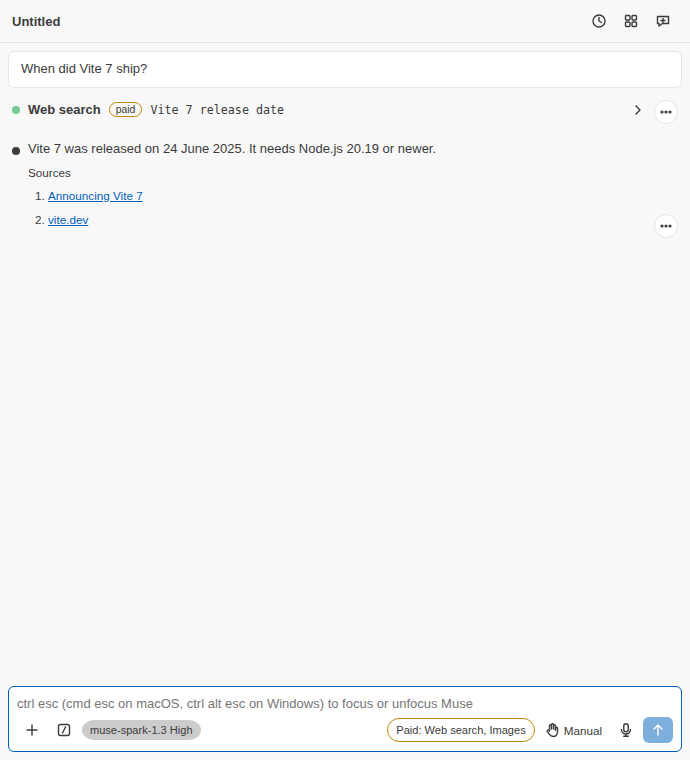<br><sub>A search marked paid, the reply's sources, and the badge</sub></td>
    <td align="center" width="50%">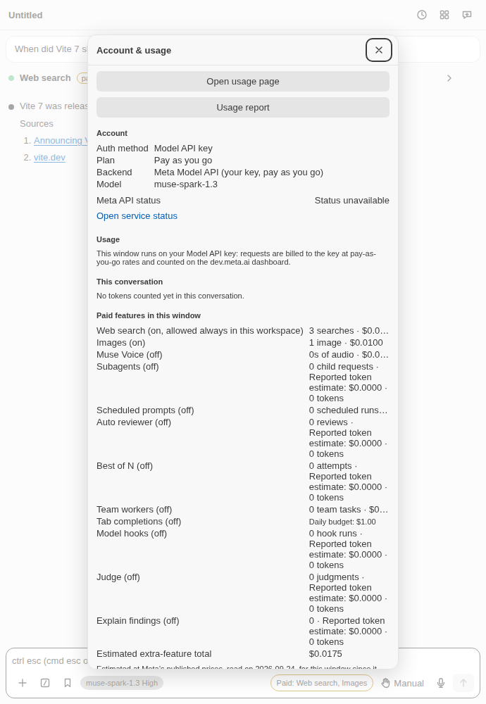<br><sub>What no longer asks in this workspace, and Ask again</sub></td>
  </tr>
</table>

Muse Voice records the same way as free dictation (tap or hold), and the
transcript lands at the caret when you stop. The recording is made by a
helper that only records: `native/windows/capture.ps1` on Windows (the
waveIn API that ships with Windows), the macOS helper's capture mode (which
asks for the microphone only), and on Linux the system's `arecord` or
`parec`, so Linux gets a microphone on this engine. Audio leaves the machine
only while it records, and only to Meta.

## Languages

The panel, its notices, the Command Palette's commands and the settings
follow VS Code's display language:

- Simplified and Traditional Chinese
- Japanese and Korean
- German, French, Spanish, Italian and Brazilian Portuguese
- Russian, Polish, Czech, Hungarian and Turkish

Any other display language gets English. Change it with **Configure Display
Language** in the Command Palette and reload the window.

<p align="center">
  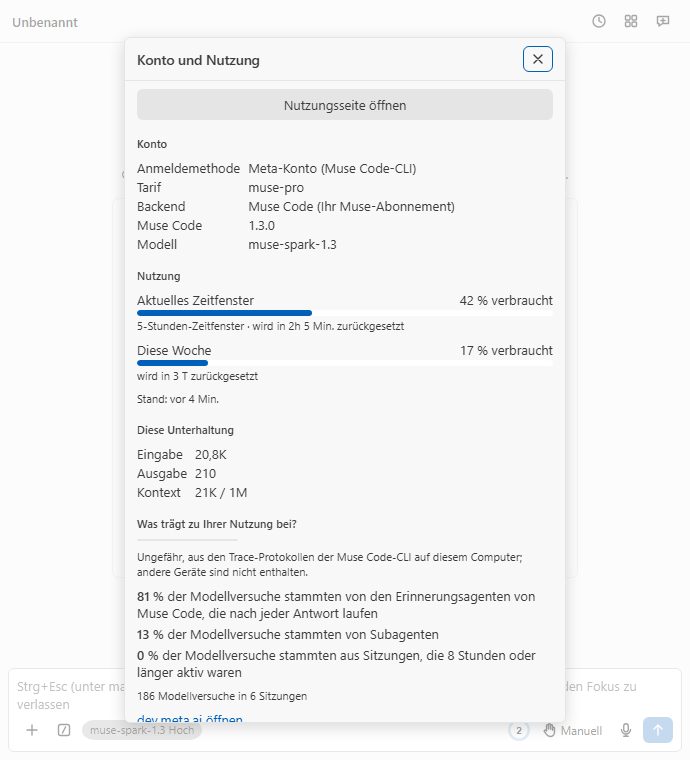<br>
  <sub>Account &amp; usage in German, with its numbers written the German way</sub>
</p>

**The translations are machine-made**, by the same AI that wrote the code,
and checked by a gate rather than by native speakers. That gate checks that
every string is present, every value and code span is kept, and every count
uses the language's own plural forms. If a translation reads wrong,
[open an issue](https://github.com/RandyNorthrup/muse-spark-code/issues)
naming the language and the text; a correction is one line in
`l10n/ui.<language>.json` or `package.nls.<language>.json`.

What stays in English:

- **Text sent to the model**: the context notes, the compaction prompt and
  the tool errors. The model behaves the same in every language.
- **What Muse and the tools write**: replies, tool output, and Muse Code's own
  approval choices.
- **The walkthrough's pages**: VS Code translates the step titles, not the
  pages.
- **Log lines no one sees in the panel**, and the names of commands, files
  and settings.

## Limits

| What                             | Limit                                                                                                                                                                                                                                                           |
| -------------------------------- | --------------------------------------------------------------------------------------------------------------------------------------------------------------------------------------------------------------------------------------------------------------- |
| Images and PDFs                  | 20 attachments per message together; images 10 MiB each (PDFs: next row)                                                                                                                                                                                        |
| PDFs on the Model API backend    | 32 MB each locally (Meta allows 50 MB per inline file); images and PDF page images together: 50 per message. Meta reads text from the first 100 pages and page images from the first 50 (Meta's [file-handling guide](https://dev.meta.ai/docs/file-handling)). |
| Model API encoded media          | 48 million data URL characters total per new message and replay request; older replayed media is named but omitted when over the cap.                                                                                                                           |
| Picked UTF-8 text attachments    | 1 MiB per-file read cap from trusted and indexed workspace paths; Model API also caps combined text and file-name wrappers at 768 KiB to leave context room.                                                                                                    |
| A message to Muse Code           | 10 MiB. Attachment admission reserves 2 MiB for the prompt, context and frame; serialized text and base64 images count toward the rest. The exact outbound frame is checked at send.                                                                            |
| Model API: tool rounds           | 50 per turn                                                                                                                                                                                                                                                     |
| Model API: shell commands        | 2 minutes by default, 10 at most                                                                                                                                                                                                                                |
| Model API: retries               | Up to 5 attempts on 429, 500, 502 and 503, and when a reply stream ends because the server shut down or was overloaded, honouring `Retry-After`, shown in the transcript; Stop cuts the wait short                                                              |
| Model API: a silent reply stream | Ended after 5 minutes with nothing from the server; send again to retry                                                                                                                                                                                         |
| Model API: file tools            | Text and images up to 10 MiB, PDFs up to 32 MB; the search tool skips files over 1 MiB                                                                                                                                                                          |
| Opened tool outputs              | 16 MiB each; the latest 20, and 32 million characters together                                                                                                                                                                                                  |

## Commands and keybindings

| Command                                             | Default keybinding                                                                   | What it does                                                                                                                                                                                      |
| --------------------------------------------------- | ------------------------------------------------------------------------------------ | ------------------------------------------------------------------------------------------------------------------------------------------------------------------------------------------------- |
| Muse Spark: Open in Sidebar                         | —                                                                                    | Focus the chat view in the activity bar                                                                                                                                                           |
| Muse Spark: New Conversation                        | `Ctrl+N` (`Cmd+N`) when `enableNewConversationShortcut` is on, Muse focused          | Clear the active panel to a new conversation, or open one where `preferredLocation` says                                                                                                          |
| Muse Spark: Sign Out                                | —                                                                                    | Forget the stored Model API key and sign the CLI out when it is signed in (its `account/logout`, else `muse logout`)                                                                              |
| Muse Spark: Open in Terminal                        | —                                                                                    | Run the Muse Code CLI's own interactive interface in a VS Code terminal at the workspace root                                                                                                     |
| Muse Spark: Create AGENTS.md                        | —                                                                                    | Write the rules file with `muse init` (or the same template without the CLI) and open it; an existing file is opened                                                                              |
| Muse Spark: Open Walkthrough                        | —                                                                                    | Open the four-step Get Started walkthrough                                                                                                                                                        |
| Muse Spark: Open in New Tab                         | `Ctrl+Shift+Alt+Esc` on Windows, `Cmd+Shift+Esc` on macOS, `Ctrl+Shift+Esc` on Linux | Open an independent conversation as an editor tab (also the `+` in the view title); the panel header's own button starts a new conversation in place                                              |
| Muse Spark: Toggle Focus                            | `Ctrl+Alt+Esc` on Windows, `Cmd+Esc` on macOS, `Ctrl+Esc` on Linux                   | Move keyboard focus between the editor and the composer                                                                                                                                           |
| Muse Spark: Insert @-Mention for Selection          | `Alt+K`, editor focused                                                              | Insert `@path#start-end` for the active editor selection into the composer                                                                                                                        |
| Muse Spark: Toggle Focus View                       | `Ctrl+Alt+F`, Muse focused                                                           | Flip the `museSpark.focusView` setting (hides tool calls and reasoning)                                                                                                                           |
| Muse Spark: Toggle Thinking                         | `Ctrl+Alt+T` (macOS `Option+T`, Linux `Ctrl+Alt+O`), composer only                   | Turn reasoning on or off for this conversation. Claude Code uses `Alt+T`; on Windows that opens the Terminal menu, on GNOME `Ctrl+Alt+T` opens a terminal                                         |
| Muse Spark: Set Up Shell Sandbox                    | —                                                                                    | Windows: run Muse Code's one-time `muse sandbox windows setup` through a UAC prompt and report the result; elsewhere reports that no setup is needed                                              |
| Muse Spark: Show Logs                               | —                                                                                    | Open the "Muse Spark" log channel (keys redacted)                                                                                                                                                 |
| Muse Spark: Diagnostics                             | —                                                                                    | Write the versions, the backend and CLI facts, credential facts, never a value, the dictation state, the network posture and `muse config status` to the log and open it: what a bug report needs |
| Muse Spark: Manage Skills                           | —                                                                                    | Turn Muse Code's skills on or off (`muse skills enable`/`disable`), then offer to restart it so the change takes effect                                                                           |
| Muse Spark: Import Skills from Claude Code or Codex | —                                                                                    | Preview what `muse skills import` would copy, import it once you confirm, report what was imported, skipped or failed                                                                             |
| Muse Spark: Import from Other Agents                | —                                                                                    | Preview MCP servers, hooks, agents, commands and rules from Claude Code, Codex or Cursor, import the files once you confirm, offer unsaved target edits, preserve source exposure                 |
| Muse Spark: Install Bundled Skills for Muse Code    | —                                                                                    | Copy the [bundled skills](#bundled-skills)' package into Muse Code's config folder and link each skill into its skills folder (or update that copy); a skill of yours with the same name is kept  |
| Muse Spark: Remove Bundled Skills from Muse Code    | —                                                                                    | Remove the links into the extension's marked copy, then the copy; nothing else is touched                                                                                                         |
| Muse Spark: Export Conversation                     | —                                                                                    | Save the conversation in front of you as Markdown where you choose, and open it                                                                                                                   |
| Muse Spark: Import Session                          | —                                                                                    | Resume a session-export JSON file as a new conversation on the Model API backend, on your model, starting in Manual (or Plan) every time it is opened                                             |
| Muse Spark: Open Share File                         | —                                                                                    | Read a session-export JSON file read-only in the panel: Copy and links only                                                                                                                       |
| Muse Spark: MCP Servers                             | —                                                                                    | Show the MCP servers Muse Code will load (on the Model API backend, how each is running), sign in to or out of a remote one, open the settings file                                               |
| Muse Spark: Hooks                                   | —                                                                                    | Show where Muse Code's hooks come from (project, yours, managed) and open each file; on the Model API backend also whether `modelApiHooks` is on, with a link to it                               |
| Muse Spark: Memory                                  | —                                                                                    | List Muse Code's memory notes for this workspace, open one to edit, create one, or delete one to the trash, keeping each `MEMORY.md` index in step                                                |
| Muse Spark: New Worktree…                           | —                                                                                    | Ask for a new branch and its base, create it in its own folder beside the repository, then offer to open it in a new window                                                                       |
| Muse Spark: Remove Worktree…                        | —                                                                                    | Delete another worktree's folder (its branch stays), asking again before discarding uncommitted changes                                                                                           |
| Muse Spark: Move Running Command to Background      | `Ctrl+B` (also on macOS), while the conversation in view runs a shell command        | Let the running shell commands go on in the background while the agent carries on; VS Code keeps `Ctrl+B` otherwise                                                                               |
| Muse Spark: Stop Background Tasks                   | —                                                                                    | Stop every background task of the conversation in view                                                                                                                                            |
| Muse Spark: Restart Muse Code                       | —                                                                                    | Stop `muse serve` and start a fresh one without reloading the window; a running turn is stopped, and each conversation continues with its next message                                            |
| (composer) Record voice                             | `Ctrl+D` (`Cmd+D`), composer only                                                    | Tap to start or stop voice dictation, hold to record while held                                                                                                                                   |
| (composer) Run a shell command                      | Start the message with `!`                                                           | Run it in the workspace as you, outside any turn; the agent sees it with your next message                                                                                                        |

Windows keeps `Ctrl+Esc` for Start and `Ctrl+Shift+Esc` for Task Manager,
which is why its two shortcuts add `Alt`. Eleven commands appear in the
Command Palette only where they can act: Insert @-Mention with an editor
open, Toggle Thinking, Export Conversation, Import Session, Open Share File
and Stop Background Tasks with a Muse panel in view, Move Running Command
to Background while one runs, Set Up Shell Sandbox on Windows (or in a
remote window), Create AGENTS.md and the two worktree commands with a folder
open.

## Settings

All settings live under `museSpark.*`; changes apply to open panels
immediately. The settings that choose what runs and what is billed
(`initialPermissionMode`, `backend`, `shellSandbox`, `sandboxNetwork`,
`allowDangerouslySkipPermissions`, `museBinaryPath`, `environmentVariables`,
`modelApiHooks`, `modelApiRepoMap`, `modelApiObservationPacking`,
`modelApiPromptCacheRetention`, `turnCheckpoints`, `bundledSkills`,
the verify loop's `checkCommands`, `formatOnEdit` and `diagnosticsAfterEdits`,
`modelApiSessionBudgetUsd` and the six paid features, `modelApiWebSearch`,
`modelApiImageGeneration`, `modelApiVoice`, `modelApiSubagents`,
`modelApiBestOfN` and `modelApiScheduledPrompts`) are machine-scoped: they
take effect from your user settings only, never from a repository's
`.vscode/settings.json`. In a remote window (SSH, WSL, a dev
container) machine settings live on the remote side, where a dev container
definition can set them; there the extension never starts a conversation in
Bypass permissions and asks you once before entering it. Turning
`allowDangerouslySkipPermissions` off moves every open conversation out of
Bypass at once.

| Setting                           | Default     | Purpose                                                                                                                                                                                                                                                                                                                                                                                                                                                                                                                                                                                                                                                 |
| --------------------------------- | ----------- | ------------------------------------------------------------------------------------------------------------------------------------------------------------------------------------------------------------------------------------------------------------------------------------------------------------------------------------------------------------------------------------------------------------------------------------------------------------------------------------------------------------------------------------------------------------------------------------------------------------------------------------------------------- |
| `preferredLocation`               | `panel`     | Where new conversations open: `sidebar` or `panel` (editor tab)                                                                                                                                                                                                                                                                                                                                                                                                                                                                                                                                                                                         |
| `initialPermissionMode`           | `manual`    | `manual`, `acceptEdits`, `plan`, `auto` or `bypassPermissions` for new conversations; `bypassPermissions` applies only while `allowDangerouslySkipPermissions` is on, otherwise the conversation starts in `manual`                                                                                                                                                                                                                                                                                                                                                                                                                                     |
| `autosave`                        | `true`      | Save all dirty editors before every turn                                                                                                                                                                                                                                                                                                                                                                                                                                                                                                                                                                                                                |
| `attachOpenFile`                  | `true`      | Show the open-file chip and send the active file / selection with each message                                                                                                                                                                                                                                                                                                                                                                                                                                                                                                                                                                          |
| `useCtrlEnterToSend`              | `false`     | Send with Ctrl/Cmd+Enter instead of Enter                                                                                                                                                                                                                                                                                                                                                                                                                                                                                                                                                                                                               |
| `enableNewConversationShortcut`   | `false`     | `Ctrl+N` / `Cmd+N` starts a new conversation while a Muse panel is focused                                                                                                                                                                                                                                                                                                                                                                                                                                                                                                                                                                              |
| `hideOnboarding`                  | `false`     | Hide the getting-started tips                                                                                                                                                                                                                                                                                                                                                                                                                                                                                                                                                                                                                           |
| `focusView`                       | `false`     | Show only prompts and responses                                                                                                                                                                                                                                                                                                                                                                                                                                                                                                                                                                                                                         |
| `respectGitIgnore`                | `true`      | Exclude `.gitignore` patterns from file searches and `@`-mentions                                                                                                                                                                                                                                                                                                                                                                                                                                                                                                                                                                                       |
| `confidentialWorkspace`           | `false`     | Block contributor-tier models (Meta may train on their traffic) in this workspace                                                                                                                                                                                                                                                                                                                                                                                                                                                                                                                                                                       |
| `allowDangerouslySkipPermissions` | `false`     | List Bypass permissions in the Modes menu and the Shift+Tab cycle (sandboxes only)                                                                                                                                                                                                                                                                                                                                                                                                                                                                                                                                                                      |
| `archiveInactiveSessions`         | `14`        | Hide sessions idle for this many days from the History dialog (`1`, `2`, `7`, `14`, or `0` for never); they stay on disk and **Show archived** lists them                                                                                                                                                                                                                                                                                                                                                                                                                                                                                               |
| `cleanupPeriodDays`               | `30`        | Delete Model API conversations idle for more than this many days when a window lists them (`0` keeps them); Muse Code's own sessions are the CLI's to keep                                                                                                                                                                                                                                                                                                                                                                                                                                                                                              |
| `backend`                         | `auto`      | `auto`: Muse Code when the CLI is signed in, else the Model API when a key is stored; `museCode` / `modelApi` force one. The pasted key never reaches the CLI. Changing it restarts the host                                                                                                                                                                                                                                                                                                                                                                                                                                                            |
| `shellSandbox`                    | `auto`      | `auto`: Muse Code's OS sandbox, except for Windows workspaces under your profile where it cannot run commands; `muse`: always the sandbox; `off`: commands run directly as you, gated by approvals (Claude Code style). Without the sandbox Muse Code's file tools may also write outside the workspace. Changing it restarts the host                                                                                                                                                                                                                                                                                                                  |
| `sandboxNetwork`                  | `default`   | The network Muse Code's shell sandbox gives commands: `proxy-only` asks before each new destination, `restricted` allows none, `enabled` allows all; `default` passes nothing, leaving Muse Code's own default (`proxy-only`) or your administrator's managed configuration. For commands it applies while the sandbox is on. Changing it restarts the host. At `restricted`, Muse Code is also not offered [web fetch](#web-fetch), sandbox or not; the Model API backend's web fetch follows its permission modes                                                                                                                                     |
| `museBinaryPath`                  | `""`        | Absolute path to the Muse Code executable (a relative one is refused); empty discovers it on `PATH` or the install dir. Changing it restarts the host                                                                                                                                                                                                                                                                                                                                                                                                                                                                                                   |
| `modelApiWebSearch`               | `false`     | [Paid](#paid-features): web search on the Model API backend, $2.50 per 1,000 searches; asks you to confirm the price when turned on, then asks before each prompt that may search                                                                                                                                                                                                                                                                                                                                                                                                                                                                       |
| `modelApiImageGeneration`         | `false`     | [Paid](#paid-features): the model creates PNG files in the workspace or edits workspace images into new ones, $0.01 per image, on the Model API backend and on Muse Code while a key is stored (billed to the key); every image asks first, in every mode, unless allowed always in this workspace                                                                                                                                                                                                                                                                                                                                                      |
| `modelApiVoice`                   | `false`     | [Paid](#paid-features): Muse Voice as the microphone's engine, $0.18 per hour of audio, on the Model API backend and on Muse Code while a key is stored; each recording asks first                                                                                                                                                                                                                                                                                                                                                                                                                                                                      |
| `modelApiPromptCacheRetention`    | `in_memory` | How long Meta is asked to keep the cached start of Model API requests: `in_memory` by default, or up to `24h` when you choose it. Both have the same cached-input price; longer retention may improve cache hits after a pause. Meta may evict sooner. Machine-scoped, so a repository cannot extend it                                                                                                                                                                                                                                                                                                                                                 |
| `modelApiSubagents`               | `false`     | [Paid](#paid-features): Model API child tasks, with a model-rate confirmation and a fresh four-request popup for every task                                                                                                                                                                                                                                                                                                                                                                                                                                                                                                                             |
| `modelApiScheduledPrompts`        | `false`     | [Paid](#scheduled-prompts-model-api): a due prompt can run only after this machine-scoped gate and a separate confirmation of that occurrence's Model API token rates; never unattended                                                                                                                                                                                                                                                                                                                                                                                                                                                                 |
| `modelApiHooks`                   | `false`     | Run Muse Code's hook commands on the Model API backend in a trusted workspace: your administrator's, yours and the project's. They run as you, outside the agent's sandbox, without the Model API key; review them with **Muse Spark: Hooks** first. Machine-scoped                                                                                                                                                                                                                                                                                                                                                                                     |
| `environmentVariables`            | `[]`        | `{ name, value }` pairs for the Muse Code process and the terminals that run the CLI (Open in Terminal, MCP sign-in, `muse logout`); an `XDG_CONFIG_HOME` here is where the extension looks for the CLI's sign-in and settings too. Never put API keys here; use Sign in. Changing it restarts the host                                                                                                                                                                                                                                                                                                                                                 |
| `modelApiRepoMap`                 | `false`     | Put a [repo map](#code-intelligence) in the Model API backend's instructions in a trusted workspace: the workspace's most used files and definitions, made once per conversation in about 1,000 tokens, which every request then carries (billed to your key). Machine-scoped                                                                                                                                                                                                                                                                                                                                                                           |
| `modelApiObservationPacking`      | `false`     | [Observation packing](#observation-packing-model-api) on the Model API backend: a tool output over 8,000 characters rides whole for two requests, then as a short placeholder, and the model pages it back with `recall_output`. Read when a conversation starts or is reopened. Machine-scoped                                                                                                                                                                                                                                                                                                                                                         |
| `turnCheckpoints`                 | `true`      | Records the model’s own file-tool writes for **Restore files to here** and Redo while each file still holds exactly what the model left. Commands, hooks, MCP tools, your edits and other windows’ writes are never undone. Requires a connected Model API session, git and confirmed process safety; copies stay in extension storage, outside the workspace’s `.git`. Off in Restricted Mode. Machine-scoped                                                                                                                                                                                                                                          |
| `bundledSkills`                   | `true`      | The [bundled skills](#bundled-skills) (`project_setup`, `feature_delivery`, `quality_retrofit`): a skill source on the Model API backend, after the project's and your own, and the one-time install offer for Muse Code. Off removes them from the Model API catalogue at once; an install for Muse Code stays until **Remove Bundled Skills from Muse Code**. Machine-scoped                                                                                                                                                                                                                                                                          |
| `diagnosticsAfterEdits`           | `true`      | [Checking edits](#checking-edits): after each round of edits the Model API model gets the edited files' errors and warnings from VS Code's language servers; Muse Code is told to read them itself. Machine-scoped                                                                                                                                                                                                                                                                                                                                                                                                                                      |
| `checkCommands`                   | `[]`        | [Checking edits](#checking-edits): `{ name, command, changedFiles?, timeoutSeconds? }` lint, test or type-check commands the Model API backend runs after each round of edits, each asking wherever a shell command asks; Muse Code is told to run them. Machine-scoped                                                                                                                                                                                                                                                                                                                                                                                 |
| `formatOnEdit`                    | `false`     | [Checking edits](#checking-edits): run the file's formatter on each file the Model API backend's edit tools write. Machine-scoped                                                                                                                                                                                                                                                                                                                                                                                                                                                                                                                       |
| `modelApiBestOfN`                 | `false`     | [Paid](#paid-features): best-of-N on the Model API backend: the same prompt in 2 to 5 worktrees at once, one paid popup per run with the attempt count and per-attempt request ceiling, then take one                                                                                                                                                                                                                                                                                                                                                                                                                                                   |
| `modelApiCommandRules`            | `[]`        | Machine-scoped standing allow/ask/forbid prefix rules, each with matching and nonmatching examples.                                                                                                                                                                                                                                                                                                                                                                                                                                                                                                                                                     |
| `modelApiPermissionProfiles`      | `{}`        | Machine-scoped named file-denial globs and explicit additional read roots.                                                                                                                                                                                                                                                                                                                                                                                                                                                                                                                                                                              |
| `modelApiPermissionProfile`       | `""`        | Machine-scoped selected profile; unknown or malformed selections deny file access.                                                                                                                                                                                                                                                                                                                                                                                                                                                                                                                                                                      |
| `modelApiRepositoryRules`         | `{}`        | Repository rules may add ask/forbid commands and file denials, never standing allows or extra roots.                                                                                                                                                                                                                                                                                                                                                                                                                                                                                                                                                    |
| `modelApiAutoReviewer`            | `false`     | Machine-scoped paid Auto reviewer; price acceptance and per-use consent required.                                                                                                                                                                                                                                                                                                                                                                                                                                                                                                                                                                       |
| `notifyOnBackgroundTurn`          | `true`      | A VS Code notification when a turn of a minute or more ends, or a turn waits for your approval or answer, while the VS Code window is unfocused; never while it is focused                                                                                                                                                                                                                                                                                                                                                                                                                                                                              |
| `modelApiReplyUsage`              | `false`     | Show the input and output tokens and the dollar estimate under each Model API reply, counting every request since the previous line in that turn                                                                                                                                                                                                                                                                                                                                                                                                                                                                                                        |
| `modelApiSessionBudgetUsd`        | `0`         | Spend cap in dollars for each Model API conversation (`0`: no cap). Shared durable reservations cover the conversation's own token requests and image fees; working storage is required. Paid subagent requests keep their own consent and request ceiling: their reported cost is counted, but it is not reserved against this cap and can take the conversation past it. Unknown sent usage retains its full liability and cannot retry an ambiguous failure under the same allowance. Capped web search is unavailable until its billed query bound is verified. Input estimates and published prices may differ from actual billing. Machine-scoped |

The Model API backend's shell tool applies `terminal.integrated.env.*` the
way VS Code's terminal does. A restart of Muse Code, for a setting, trust
granted, a sign-in or a crash, keeps the conversation: the running turn is
stopped and the next message resumes the same session.

### Proxies and certificates

- **The extension's own requests** (the Model API, the paid features, Muse
  Voice's socket) go through VS Code's network support, as every
  extension's `fetch` does on every VS Code this extension supports, and
  its WebSocket from VS Code 1.112: `http.proxy`, or
  the system's proxy settings or PAC file; proxy authentication as VS Code
  handles it (Basic and Kerberos); `http.noProxy`; and the
  operating system's certificate store while `http.systemCertificates` is
  on. `http.proxySupport`, `http.fetchAdditionalSupport` and
  `http.webSocketAdditionalSupport` must stay on (their defaults) for that.
  A network that inspects HTTPS needs its root in the system store. Naming
  the root's file in `NODE_EXTRA_CA_CERTS` before VS Code starts works only
  with `http.systemCertificates` off: in the M56 drill the variable did not
  help while that setting was on (its default).
- **Muse Voice on VS Code 1.101 to 1.111**: those versions do not route an
  extension's WebSocket, so Muse Voice's socket goes to Meta directly,
  without VS Code's proxy, proxy authentication, `http.noProxy` or the
  certificates VS Code adds. Behind a proxy or a network that inspects
  HTTPS, use VS Code 1.112 or later for Muse Voice; the Model API's requests
  are routed on every supported version. On 1.99 and 1.100 Muse Voice is
  unavailable (their Node has no WebSocket). An editor built on VS Code may
  route neither; **Muse Spark: Diagnostics** says which of the two this one
  routes.
- **Muse Code** reads proxy variables from its environment (`HTTPS_PROXY`,
  `HTTP_PROXY`, `ALL_PROXY`, `NO_PROXY`). The extension hands it VS Code's
  `http.proxy` (and `http.noProxy`) when neither its environment nor
  `environmentVariables` sets one, in either case; a proxy VS Code finds in
  the system settings or a PAC file does not reach it, so set `http.proxy`
  or `HTTPS_PROXY` in `environmentVariables`; keep proxy credentials out of
  shared workspace settings. If `http.proxy` or `http.noProxy` has the wrong
  type, the extension ignores that value for Muse Code instead of passing it
  into the CLI's environment; correct the VS Code setting to restore it.
  Loopback bypasses an environment proxy, so Muse Code reaches the extension's
  `ide` tools. Muse Code also has its own `endpoint_transport.proxy` setting,
  which this extension does not manage. Muse Code 1.3.0 trusts the operating system's certificate
  store; `SSL_CERT_FILE` or `SSL_CERT_DIR` replace that store for it
  entirely, so a file named there must hold every root it needs.
- **Muse Spark: Diagnostics** reports which of these are set (never a
  proxy's address), whether this editor routes the extension's `fetch` and
  WebSocket at all, and known-safe source and generation fields from
  Muse Code's managed configuration (`muse config status`). Unrecognized
  lines and failed-command output stay out of the public-issue report.

## Requirements

- VS Code 1.99.0 or newer, on Windows, macOS or Linux, or an editor built
  on it: VSCodium 1.99.3 and 1.135, code-server 4.99.4 and Theia 1.75 were
  tested (see [hosts.md](docs/ide-compatibility/hosts.md)). On 1.99 and 1.100, whose
  extension host is Node 20, Muse Voice is unavailable; on 1.101 to 1.111 its
  socket does not use VS Code's proxy support (see
  [Proxies and certificates](#proxies-and-certificates)).
- The [Muse Code CLI](https://dev.meta.ai/products/muse-code/) signed in with
  a Meta account (subscription), or a Meta Model API key (pay as you go).
- `git` on `PATH` for `.gitignore`-aware `@` mentions, worktrees and the
  Model API prompt's git facts (optional; VS Code's file search is used
  without it). The extension runs git only in a trusted workspace and only
  from an absolute `PATH` entry, never a copy inside the workspace.
- Voice dictation: Windows, or macOS with Dictation or Siri enabled, in a
  local window.
- A trusted workspace for rules, skills, memory, MCP servers, hooks and
  shell commands; in
  Restricted Mode the panel chats and edits under approval, nothing more.
  The first workspace folder is the root: the open-file chip, `@` mentions,
  drops, the Problems panel the agent reads and relative file links all
  belong to it (a folder added inside it counts as part of it); a file in
  another folder is mentioned by its absolute path. Virtual workspaces are
  not supported.

## Privacy and security

- Your prompts, attachments, mentioned files and tool output go to Meta
  only when you press Send. The exceptions are ones you set up: on the
  Model API backend an MCP server you configured receives its tool calls'
  arguments, and with `museSpark.modelApiHooks` on your hook commands
  receive your prompt and bounded previews of tool and model calls. With
  `museSpark.modelApiRepoMap` on, every request also carries the repo map
  (file paths and definition names, no file contents). By
  default each message also carries the open file's path and any selected
  text (`attachOpenFile`); on the CLI backend each turn carries a short
  hidden note asking the model to offer choices through the question card. The extension has no telemetry
  and no hosted server of its own. Details: [PRIVACY.md](docs/PRIVACY.md).
- A pasted Model API key lives only in VS Code's SecretStorage, is sent only
  to `api.meta.ai`, is never passed to any child process, and never reaches
  settings, logs or the CLI.
- Contributor-tier models (Meta may train on their traffic) are opt-in with
  one confirmation per conversation, and refused outright with
  `museSpark.confidentialWorkspace`. Resuming a contributor-tier
  conversation asks again, or in a confidential workspace moves it to a
  standard model.
- Voice audio stays on the machine on Windows; on macOS Apple recognises on
  the device or on its servers under Apple's terms. With Muse Voice on (paid,
  off by default), the recording goes to Meta's Muse Voice Transcribe while
  you record, and nowhere else.
- The paid features (web search, image generation, Muse Voice, Model API
  subagents and scheduled prompts) are off until you turn one on and accept
  its price; a repository's settings cannot turn one on.
- Turn checkpoints keep the model's own file-tool bytes, including ignored
  files its tools change, under this extension profile's global storage,
  `checkpoints/<canonical-root-key>`, as described in the Panel section.
  The shadow repository and per-instance journals stay outside the
  workspace's `.git`; that folder is readable by your user only (on macOS
  and Linux). Copies stay on the machine and are removed by conversation
  retention or by removing that directory. Unreferenced file copies are swept
  after a one-hour grace period when no writer is live. Shared journal metadata remains
  until all its instance's units are retired. See **Turn
  checkpoints** in [The panel](#the-panel).
- Model API conversations are stored, per workspace, in VS Code's storage
  directory for the extension (not in the repository); ones idle longer than
  `museSpark.cleanupPeriodDays` (30 days by default) are deleted, and
  removing that directory deletes them all. The History dialog archives, it
  does not delete.
- The log records what happened (sessions, turns and their times, approvals,
  failures) and never your prompts, files, dictated words or the model's
  output; keys are redacted.
- The usage insights read the Muse Code CLI's trace logs on this machine and
  send nothing anywhere.
- On the Model API backend Meta caches the start of each request to answer
  the next one faster and cheaper; the extension asks for the shorter
  `in_memory` retention by default. Only your machine-scoped
  `museSpark.modelApiPromptCacheRetention` setting can request up to 24 hours;
  a repository cannot extend your choice. The cache key is a digest of the
  model, instructions and tools it starts with, not a session or user id.
- Behind a corporate network the extension's requests use VS Code's proxy
  and certificate settings, and Muse Code gets the proxy and certificate
  variables described under [Proxies and certificates](#proxies-and-certificates).
- [Web fetch](#web-fetch) downloads the pages the model names from your
  machine and sends their text to the model like any other tool output. It
  asks first for each host (on Muse Code, for each fetch), except in Bypass,
  which asks nothing. The full address goes to that site, so a URL the model
  writes can carry what the conversation holds; the approval names it whole.
  Only public `https://` addresses are fetched, the address checked is the
  address used, and the log names the host only.
- Workspace rules, skill files and the memory snapshot are read only in a
  trusted workspace; on the Model API backend their text is part of what
  goes to Meta with each request, on the CLI backend Muse Code sends them
  under its own terms. The memory snapshot is each scope's `MEMORY.md` and
  its notes' names, your personal scopes included; a note's text goes only
  when the model reads it.
- The [bundled skills](#bundled-skills) are files of one pinned release,
  checked against its published SHA-256 when the extension is built;
  nothing is downloaded while it runs. Installing them for Muse Code writes
  only under Muse Code's config folder (`muse/skill-sources/` and links in
  `muse/skills/`), only when you click Install or Update or run the command,
  and Remove deletes only what carries the install's mark.
- The Model API backend's file tools resolve every path through the file
  system before touching it: a path that leaves the workspace, directly or
  through a link, is refused, and Windows names that would be reinterpreted
  (alternate data streams, device names, trailing dots) are refused too.
  Text reads and writes use the checked canonical target if a workspace
  link changes between the check and the operation. Paid image output is
  reserved at that same checked target before the API request.
  Its shell tool starts PowerShell or bash by absolute path with the
  environment VS Code's own terminal would give (the editor's internal
  variables removed). Stop and a timeout end everything a command started:
  its process group on macOS and Linux; on Windows the job object each
  command runs in, through a small helper the extension compiles once into
  its own storage with PowerShell's `Add-Type` (where policy forbids that,
  the log says so and a sweep of the process table stands in).
- The webview runs under a strict CSP (`default-src 'none'`, per-load script
  nonce, no remote origins, no inline styles); every message between host and
  webview is validated with a zod schema.

## Troubleshooting

- **What happened, in order** — **Muse Spark: Show Logs** opens the log.
  - **What it records:** every failure the panel or a popup showed, and
    anything that failed unseen, including an error inside the panel itself.
  - **With ids and times:** each session as it started, resumed or forked;
    each turn with its result, its duration and when its first output came;
    approvals; sign-in changes; and why the backend restarted.
  - **Kept out:** your prompts, files, dictated words and the model's output.
    Keys are redacted.
  - **More detail:** set the channel's level to **Trace** (the gear in the
    Output view) to see how long each Muse Code command and Model API
    request took.
- **A Model API request fails with "The server's certificate is not
  trusted"** — the network inspects HTTPS and re-signs it with its own
  root. Install that root in the operating system's certificate store and
  keep `http.systemCertificates` on, or turn `http.systemCertificates` off
  and name the root's file in `NODE_EXTRA_CA_CERTS` before starting VS
  Code; the variable does not help while that setting is on. Muse Code
  reads the system store too.
- **"The proxy asked for credentials"** or **"The proxy refused the
  connection (HTTP 403)"** — the proxy wants a sign-in VS Code did not give
  it, or does not allow `api.meta.ai`. Check `http.proxy` and
  `http.proxyAuthorization`, or ask for the host to be allowed.
- **Muse Code cannot reach Meta behind a proxy the browser uses** — the
  proxy comes from the system settings or a PAC file, which only VS Code
  reads. Set `http.proxy`, or `HTTPS_PROXY` in
  `museSpark.environmentVariables`, and the next message restarts Muse Code
  with it. **Muse Spark: Diagnostics** says where Muse Code's proxy comes
  from.
- **A permission mode is refused with "Muse Code's configuration … does not
  allow this permission mode"** — its default permission profile or a
  policy your administrator manages caps the modes; choose a stricter one.
  **Muse Spark: Diagnostics** prints `muse config status`.
- **A Model API reply ends with "sent nothing for 300 s"** — the stream
  stalled, so the turn was ended rather than left running until **Stop**.
  Send the message again to retry.
- **The agent says a file is too large (Model API backend)** — the file tools
  read and edit text and images up to 10 MiB and read PDFs up to 32 MB; the
  search tool skips files over 1 MiB. The agent can read part of a larger
  file with a shell command.
- **Sign-out does not finish, or the panel stays gated** — sign-out asks
  Muse Code to sign itself out (`account/logout`). Only when Muse Code
  still reads signed in afterwards does it open `muse logout` in a
  terminal, with `museSpark.environmentVariables`, so it signs out the
  same config home. With `META_API_KEY` set, Muse Code cannot confirm the
  logout itself; the extension then reads the sign-in again and opens no
  terminal once it shows none.
  - **Waiting for the terminal:** the panel stays gated, with **Check
    again**, until `muse logout` has run. That command leaves
    `~/.config/muse/auth.json` behind with no sign-in in it, and the
    extension reads that as signed out. Choose **Check again** once the
    terminal is done. If the terminal could not open, run `muse logout`
    yourself.
  - **An inherited `META_API_KEY`:** it stays outside the extension. Remove
    it from your environment or VS Code's configured environment variables,
    then choose **Check again**. Browser approval cannot override that key's
    billing priority.
  - **Sign-out protection could not be saved:** finish `muse logout` and
    remove `META_API_KEY` before reopening VS Code.
  - **The old CLI sign-in remains:** a fresh browser approval can replace
    it. The panel uses that sign-in only after Muse Code confirms it.
  - **The stored Model API key cannot be deleted:** sign-out stops this
    window's backend and keeps it gated until the key can be cleared.
- **The panel says Muse Code cannot start because its sign-in file is in
  the macOS format** — the `auth.json` it names came from a Mac: a
  version-2 file, or one whose sign-in lives in the Keychain. Muse Code
  1.4.0 on Windows and on Linux exits at startup with such a file, even an
  empty one. Move or rename the file, then sign in again. With
  `META_API_KEY` set, Muse Code starts anyway and uses the key.
- **The panel shows signed in on macOS, but the first message asks you to
  sign in** — on a Mac the token is in the login Keychain, and the
  extension asks Muse Code about it only when you act: a click in the
  panel (sign-in, sign-out, **Check again**), or the **Sign Out** or
  **Diagnostics** command. That goes for any `auth.json` on a Mac but the
  empty one a sign-out leaves, since what Muse Code 1.4.0 does there with
  another file has not been seen. A Keychain prompt never appears just
  because VS Code opened. Choose **Check again** to have Muse Code asked
  afresh now. **Muse Spark: Diagnostics** says whether the Keychain item exists,
  looked up without reading the secret; it also asks Muse Code for its
  sign-in, and Muse Code may read the Keychain to answer, which can show
  the Keychain's prompt.
- **Browser sign-in fails with "keychain write failed (internal error
  -2147483648)" on Windows or Linux** — Muse Code 1.4.0-R4161.1 could not
  save a sign-in there
  ([#38](https://github.com/meta-models/muse-code-sdk/issues/38),
  [#53](https://github.com/meta-models/muse-code-sdk/issues/53)). R4302.1
  fixed it, and Muse Code's launcher updates itself; 1.4.0-R4302.1 or later
  needs nothing more (**Muse Spark: Diagnostics** shows the version). Only
  if you are stuck on R4161.1: add `TBH_CREDENTIAL_BACKEND` with the value `file` to
  `museSpark.environmentVariables` and to the terminal you sign in from.
  That undocumented switch, which Meta's own SDK tests use, keeps the
  sign-in in `auth.json`. Remove it after updating, and never set it on
  macOS, where it hides a Keychain sign-in.
- **Every shell command fails with `sandbox enforcement unavailable`** — Muse
  Code runs commands inside an OS sandbox that needs a one-time administrator
  setup on Windows. The panel offers it in a notification ("Set up now"
  relaunches `muse sandbox windows setup` through the UAC prompt); the same
  flow is **Muse Spark: Set Up Shell Sandbox**. Start a new conversation
  afterwards. Linux and macOS need no setup.
- **Shell commands run in `C:\Windows\System32\WindowsPowerShell\v1.0`
  instead of the project** — Muse Code's Windows sandbox (1.3.0 and 1.4.0;
  on 1.3.0 the first command also takes about half a minute) cannot enter
  folders under `C:\Users\<you>`
  ([meta-models/muse-code-sdk#26](https://github.com/meta-models/muse-code-sdk/issues/26)).
  This sandbox issue was not retested on 1.4.2 in the October 2 probes;
  the workaround remains until a fix is verified.
  With `museSpark.shellSandbox` at `auto` the extension starts Muse Code
  without the sandbox for such workspaces: commands run directly as you, in
  the project, still gated by the approval cards, and the panel says so once
  per conversation. `muse` keeps the sandbox regardless; `off` never sandboxes.
- **No Rename, conversation rewind or Side chat with Muse Code on Windows** —
  Muse Code refuses `session/rename` and `session/fork` on Windows (1.3.0,
  1.4.0 and 1.4.2-R4684.1, retested October 2;
  [#30](https://github.com/meta-models/muse-code-sdk/issues/30),
  [#31](https://github.com/meta-models/muse-code-sdk/issues/31)), so the
  panel does not offer fork-based actions there, whatever the version, until
  a release is verified to fix them; **Rewind code to here** and **Restore
  files to here** still work, and the Model API backend offers all of them.
- **"Muse Code applies your approvals in this conversation but reports an
  error for each one"** — Muse Code on Windows can fail its own approval
  ledger after applying a decision ("approval ledger durability fence",
  [#29](https://github.com/meta-models/muse-code-sdk/issues/29)). Since
  1.4.2 it does this for every decision of a conversation that went through
  the fault below. The panel says so once. The card follows what Muse Code
  does next and is never offered again, because the decision applied. **New
  conversation** avoids the fault.
- **"Muse Code refuses every message in this conversation"** — Muse Code 1.4
  ("approval replay failed: decision stage evidence contains an unrecorded
  human resolution") fails every message of a conversation whose turn
  stopped while a multi-step command was partly approved. **Restart now**
  stops Muse Code, and your next message starts it again and continues the
  conversation. **New conversation** starts afresh. The panel now rejects
  the waiting step before a Stop, which keeps the conversation usable.
- **"Could not load the output: Muse Code did not answer item/readOutput
  within 60 s"** — a busy Muse Code answers stored-output reads one after
  another. The panel says it once per conversation; the row keeps the diff it
  already has, and collapsing and expanding the row asks again. At most four
  reads go to Muse Code at a time.
- **Muse Code is stuck, or slow and you want a fresh one** — run **Muse
  Spark: Restart Muse Code**. It stops `muse serve` and starts it again
  without reloading the window; a running turn is stopped, and each
  conversation continues with your next message.
- **"Muse Code is not answering. Restart it with "Muse Spark: Restart Muse
  Code"."** — three commands in a row went unanswered and nothing at all
  came from Muse Code for 90 s, so the panel stopped waiting 60 s for each
  one. When no turn was running, Muse Code was restarted already ("Muse Code
  stopped answering and was restarted."); while a turn runs, its notice
  offers **Restart now**, which stops the turn. If Muse Code answers again
  on its own, commands go through again.
- **"Muse Code did not confirm your message reached the running turn"** —
  the message was for the running turn, and Muse Code did not answer in
  time. It may still reach the turn, so it is not sent again; the composer
  keeps it. Look at the conversation before you send it again.
- **"This conversation's Muse Code log is damaged"** — Muse Code 1.4.2
  failed the session's event log ("event log failed: …"), after which it
  fails every message of that session. The panel refuses new messages to it
  instead and offers **New conversation**; the conversation stays in History
  to read, and is not resumed by itself after a restart.
- **Model API charges while using the CLI** — the extension never hands your
  pasted key to the CLI (the "muse serve credentials" line in the Muse Spark
  log says which credential it started with). If the CLI itself holds a
  pay-as-you-go key (`muse auth set`) or `META_API_KEY` is exported in your
  environment, the CLI uses it, exactly as Meta documents.
- **The Agent map says delegation is off** — Muse Code hides its subagent
  tools until `run.subagent_delegation_mode` is `"auto"` in its own settings
  file; the map's button opens that file. The extension never edits it.
- **Muse never starts a workflow** — Muse Code's `run.workflow_trigger_mode`
  may be `off` (no workflow tool) or `explicit` (only when you ask); the
  Agent map says which and opens the settings file.
- **A workflow has no Cancel, Skip or Retry button** — this increment
  follows its progress read-only. Owner controls wait for a captured
  accepted-command and outcome shape from Muse Code.
- **The Muse Spark sidebar is blank in Eclipse Theia** — Theia 1.75 does not
  start an extension when its webview view opens, so the view waits until
  something else starts it. Press **Ctrl+Esc** or run any Muse Spark command
  (**Open in New Tab**, **Show Logs**) and the sidebar fills in; it works
  from then on in that window.
- **The microphone says "Voice dictation failed: No microphone is available"**
  — Windows sees no recording device from this session (Remote Desktop hides
  the host's devices unless the client redirects a microphone). On macOS,
  "Siri and Dictation are disabled" means Dictation must be switched on in
  System Settings > Keyboard.

## Development

```bash
git clone https://github.com/RandyNorthrup/muse-spark-code.git
cd muse-spark-code
npm ci          # also installs the pre-commit hook (lint-staged + gitleaks)
```

Press **F5** to launch the Extension Development Host with a fresh build.
[CONTRIBUTING.md](CONTRIBUTING.md) has the rules for a pull request;
[SECURITY.md](SECURITY.md) the way to report a vulnerability.

**Bundled workflow package (M89).** `vendor/high-quality-projects-skill/`
contains the pinned v0.7.0 workflow assets and their MIT licence. To refresh
the pin, run `node scripts/sync-bundled-skills.mjs --tag v0.7.0` (substitute
the reviewed release tag), then `npm run notices`. The sync checks the
release's SHA-256 before replacing the package, rejects unsafe archive paths
and links, rejects case and trailing-dot/space filename collisions, and
records each file's path and SHA-256 in `VENDOR.json`. The vendor tests
check every recorded file hash. Vendored bytes
are excluded from formatting and linting; builds use them offline.
The delivery helpers require Python 3.12 or newer. See the
[vendor lane record](docs/certification/m89-vendor.md) for packaging checks.

**Prerequisites.**

- Node 22 or newer (`.npmrc` enforces `engine-strict`).
- [gitleaks](https://github.com/gitleaks/gitleaks) on `PATH` for the hook and
  `npm run security:secrets`.
- semgrep for `npm run security:sast`, at CI's version:
  `pip install -r .github/semgrep/requirements.txt`.
- Google Chrome (or `CHROME_PATH`) for `test:a11y`, `harness:shots` and
  `images`.
- On Windows, PSScriptAnalyzer 1.25.0 for `npm run lint`
  (`Install-Module PSScriptAnalyzer -RequiredVersion 1.25.0 -Scope CurrentUser`).

**Stack.** TypeScript 6.0.3 (pinned: `typescript-eslint` does not yet
support TS 7); the extension host bundled with esbuild to CommonJS, with the
Model API backend as a second bundle (`dist/modelApi.js`) that loads when
that backend first starts, and the plan reader (the panel's Markdown
parser) as a third (`dist/planMarkdown.js`) that loads on the first plan
action; the webview is React 19 bundled to one IIFE with
its stylesheet; `zod/mini` validates every host ⇄ webview message; the voice
helpers are Windows PowerShell and Swift with no dependencies.

The session board and best-of-N implementation loads on its first action
from `dist/sessionBoard.js`. Paid Auto reviewer execution loads only after
consent from `dist/reviewer.js`, also shipped with the ACP agent. Ordinary
activation and an ordinary Model API turn load neither implementation.
Both receive the current display language. These bundles each have a 75 KiB
cap; the activation and Model API caps stay 600/400 KiB. Code intelligence's
answers for Muse Code's `ide` tools load on the first call from
`dist/codeIntel.js` (100 KiB cap), and both voice engines' drivers on the
first recording from `dist/voice.js` (50 KiB cap); the tool list and the
microphone's availability stay at activation. The M78b candidate
still exceeds the Model API cap; its measurements and remaining decision
are recorded in [the M78 certification](docs/certification/m78.md).

| Command                                   | What it does                                                                                                                                                                                                                                                                                                                                                                                                                                                                                                                                                                                                                                                                                                                                                                                                                                                                                                                                                                                                                                                                                                                                                                                                                   |
| ----------------------------------------- | ------------------------------------------------------------------------------------------------------------------------------------------------------------------------------------------------------------------------------------------------------------------------------------------------------------------------------------------------------------------------------------------------------------------------------------------------------------------------------------------------------------------------------------------------------------------------------------------------------------------------------------------------------------------------------------------------------------------------------------------------------------------------------------------------------------------------------------------------------------------------------------------------------------------------------------------------------------------------------------------------------------------------------------------------------------------------------------------------------------------------------------------------------------------------------------------------------------------------------ |
| `npm run build:dev`                       | Dev bundles for the extension, the Model API backend, the search worker, web fetch's page converter worker, the webview and the integration tests, with source maps                                                                                                                                                                                                                                                                                                                                                                                                                                                                                                                                                                                                                                                                                                                                                                                                                                                                                                                                                                                                                                                            |
| `npm run watch`                           | Rebuild the extension, the Model API backend, the search worker, the page converter worker and the webview on change                                                                                                                                                                                                                                                                                                                                                                                                                                                                                                                                                                                                                                                                                                                                                                                                                                                                                                                                                                                                                                                                                                           |
| `npm run harness:shots`                   | Screenshots of the webview in headless Chrome behind a fake host (`test/harness/`), every scenario or the names you pass; needs `build:dev`. The README's screenshots are these renders, copied from `harness-shots/` into `media/readme/`: `tools` (as `turn.png`), `agents`, `slash-palette` (as `palette.png`), `slash-commands`, `approval`, `question`, `quote-menu` (as `quote.png`), `rewind`, `modes`, `history`, `usage`, `dictation` (as `voice.png`), `paid` and `paid-always`, and the Languages section's is `usage --lang=de` (as `languages.png`); the walkthrough's are `empty`, `tools`, `slash-palette` and `signin` (as `open.png`, `welcome.png`, `chat.png` and `sign-in.png` in `resources/walkthrough/`); `--lang=<id>` renders them in a table from `l10n/` (`--lang=pseudo` in the pseudo-locale)                                                                                                                                                                                                                                                                                                                                                                                                     |
| `npm run harness:pseudo`                  | Write the pseudo-locale (`test/harness/l10n/ui.pseudo.json`): every string accented, bracketed and lengthened by about a third, with its slots kept, so English left outside the table and text that overflows stand out in `harness:shots --lang=pseudo`                                                                                                                                                                                                                                                                                                                                                                                                                                                                                                                                                                                                                                                                                                                                                                                                                                                                                                                                                                      |
| `npm run test:a11y`                       | The accessibility gate: axe-core checks every harness scenario in VS Code's four default themes against WCAG 2.2 AA and fails on any violation, on anything axe leaves undecided, and on a page without a result or whose scenario threw; needs a build. `node scripts/capture-themes.mjs` refreshes the theme colours from a real VS Code; `--lang=<id>` checks the scenarios in a table from `l10n/`                                                                                                                                                                                                                                                                                                                                                                                                                                                                                                                                                                                                                                                                                                                                                                                                                         |
| `npm run images`                          | Render the Marketplace icon, the README banner and the social preview from their SVGs (headless Chrome)                                                                                                                                                                                                                                                                                                                                                                                                                                                                                                                                                                                                                                                                                                                                                                                                                                                                                                                                                                                                                                                                                                                        |
| `npm run build`                           | Minified production bundles, then enforces the size budgets in `scripts/check-bundle-size.mjs`, fails if the Model API backend's files, or web fetch's page converter (parse5 and its parts), are in the activation bundle (`scripts/check-bundle-split.mjs`) or a host bundle reads `navigator`, and checks `THIRD_PARTY_NOTICES.txt` against the bundled packages                                                                                                                                                                                                                                                                                                                                                                                                                                                                                                                                                                                                                                                                                                                                                                                                                                                            |
| `npm run notices`                         | Regenerates `THIRD_PARTY_NOTICES.txt` from the production bundles                                                                                                                                                                                                                                                                                                                                                                                                                                                                                                                                                                                                                                                                                                                                                                                                                                                                                                                                                                                                                                                                                                                                                              |
| `npm run format` / `npm run format:check` | Prettier write / check                                                                                                                                                                                                                                                                                                                                                                                                                                                                                                                                                                                                                                                                                                                                                                                                                                                                                                                                                                                                                                                                                                                                                                                                         |
| `npm run lint`                            | `eslint --max-warnings=0` (type-aware), `stylelint --max-warnings=0`, and PSScriptAnalyzer 1.25.0 over `native/windows` (Windows only; a reported skip elsewhere)                                                                                                                                                                                                                                                                                                                                                                                                                                                                                                                                                                                                                                                                                                                                                                                                                                                                                                                                                                                                                                                              |
| `npm run typecheck`                       | `tsc --noEmit` for the host, webview, unit-test, e2e-test and integration-test projects                                                                                                                                                                                                                                                                                                                                                                                                                                                                                                                                                                                                                                                                                                                                                                                                                                                                                                                                                                                                                                                                                                                                        |
| `npm run deadcode`                        | `knip`: unused files, exports, dependencies (no `--strict`; see `knip.jsonc`)                                                                                                                                                                                                                                                                                                                                                                                                                                                                                                                                                                                                                                                                                                                                                                                                                                                                                                                                                                                                                                                                                                                                                  |
| `npm run cycles`                          | `dpdm` circular-import check from the extension's, the Model API backend's, the webview's and the ACP agent's entry points                                                                                                                                                                                                                                                                                                                                                                                                                                                                                                                                                                                                                                                                                                                                                                                                                                                                                                                                                                                                                                                                                                     |
| `npm run duplication`                     | `jscpd` copy-paste detection (threshold 0)                                                                                                                                                                                                                                                                                                                                                                                                                                                                                                                                                                                                                                                                                                                                                                                                                                                                                                                                                                                                                                                                                                                                                                                     |
| `npm run test:unit`                       | vitest with coverage thresholds (90 % statements/lines/functions, 85 % branches); includes `test/e2e/`, where a fake Muse Code CLI is spawned as a real child process (a compiled stub on Windows) and driven through the real backend manager                                                                                                                                                                                                                                                                                                                                                                                                                                                                                                                                                                                                                                                                                                                                                                                                                                                                                                                                                                                 |
| `npm run test:e2e:live`                   | One real turn on the installed Muse Code CLI, opt-in with `MUSE_LIVE_E2E=1`; bills the signed-in subscription (25 to 45 model attempts measured for a reply-only turn: one for the answer, the rest for Muse Code's bundled reminder agents, which loop a varying number of times; budget 60, counted from the CLI's trace log); never in CI                                                                                                                                                                                                                                                                                                                                                                                                                                                                                                                                                                                                                                                                                                                                                                                                                                                                                   |
| `npm run test:e2e:live:modelapi`          | The Model API sweep: the production backend against Meta's real API in empty temporary workspaces, one case per feature (`-- -t case07` runs one); opt-in with `MUSE_LIVE_MODEL_API=1` and a key already stored by `muse-spark-code-acp auth set` in the OS credential store; key environment variables are rejected, contributor tier only; bills the key (about $0.03 a full run, $0.02 of it two images; it stops sending past $0.50); never in CI                                                                                                                                                                                                                                                                                                                                                                                                                                                                                                                                                                                                                                                                                                                                                                          |
| `npm run test:e2e:live:eval`              | The M75 paired efficiency evaluation: the twelve fixture tasks (seven accept, five held-out; two with a tool output long enough to pack) on the baseline and the observation packing arm (M73), on the extension's own Model API harness against Meta's real API, each in an empty temporary workspace, judged by a verifier that runs the fixed code; attempts counted from the requests sent, tokens, cost and pass rate per task, and the capability floors (0.75 per split); a packing run also fails unless it packed on every long-output task, and its report says so. Opt-in with `MUSE_LIVE_MODEL_API=1` and a key already stored by `muse-spark-code-acp auth set` in the OS credential store; key environment variables are rejected, the model's shell commands get no credential variable, the arms take turns going first, contributor model only; `MUSE_EVAL_TASKS` picks tasks, `MUSE_EVAL_REPORT=<path>` writes `<path>.json` and `.md`; run `npm run build:dev` first. Bills the key (the ten-task baseline measured 39 model calls and $0.0041; both arms on all twelve tasks measured 111 model calls and $0.0156 for M73; it stops sending past $0.50 or when a sent call has unknown usage); never in CI |
| `npm run test:integration`                | Builds, downloads VS Code stable and the `engines.vscode` floor into `.vscode-test/`, runs `test/integration/**` in each; after `npm run build:dev`, `npm run test:integration:run -- --label stable` (or `minimum`) runs one                                                                                                                                                                                                                                                                                                                                                                                                                                                                                                                                                                                                                                                                                                                                                                                                                                                                                                                                                                                                  |
| `npm run test`                            | Unit then integration                                                                                                                                                                                                                                                                                                                                                                                                                                                                                                                                                                                                                                                                                                                                                                                                                                                                                                                                                                                                                                                                                                                                                                                                          |
| `npm run security:audit`                  | `scripts/audit.mjs`: fails on a high or critical advisory without a dated, reviewed entry in `.github/audit-exceptions.json`                                                                                                                                                                                                                                                                                                                                                                                                                                                                                                                                                                                                                                                                                                                                                                                                                                                                                                                                                                                                                                                                                                   |
| `npm run security:sast`                   | `semgrep scan --config auto --error` through `scripts/sast.mjs`, which also finds a semgrep that pip put in Python's user Scripts folder when that folder is not on the shell's PATH                                                                                                                                                                                                                                                                                                                                                                                                                                                                                                                                                                                                                                                                                                                                                                                                                                                                                                                                                                                                                                           |
| `npm run security:secrets`                | `gitleaks git` over the repository history                                                                                                                                                                                                                                                                                                                                                                                                                                                                                                                                                                                                                                                                                                                                                                                                                                                                                                                                                                                                                                                                                                                                                                                     |
| `npm run check:l10n`                      | The localization gate: every table in `l10n/` has every key of the English one (`src/shared/l10n/en.ts`) with the same `{slots}`, code spans and bold markers, exactly the plural forms its language uses, and nothing left in English but the names `l10n/untranslated.json` allows; every string `package.json` shows is a `%key%` of `package.nls.json`; and nothing reads `UI_TEXT` while its module loads                                                                                                                                                                                                                                                                                                                                                                                                                                                                                                                                                                                                                                                                                                                                                                                                                 |
| `npm run check:host-api`                  | The host API gate (PLAN.md D60): checks `docs/ide-compatibility/host-api.md`, the record of every VS Code API the extension uses and where, the files that import `vscode`, the Node built-ins and what the webview needs from its host, against the source; fails when it is stale (`-- --write` regenerates it) and when the engine, the protocol, the webview or a portable host module reaches `vscode`                                                                                                                                                                                                                                                                                                                                                                                                                                                                                                                                                                                                                                                                                                                                                                                                                    |
| `npm run quality:gates`                   | `format:check`, `lint`, `typecheck`, `check:l10n`, `check:host-api`, `deadcode`, `cycles`, `duplication`, `test:unit`, `build`, `security:audit`: what CI runs on all three platforms                                                                                                                                                                                                                                                                                                                                                                                                                                                                                                                                                                                                                                                                                                                                                                                                                                                                                                                                                                                                                                          |
| `npm run quality`                         | `quality:gates`, then `test:a11y`, `security:secrets` and `security:sast`; **exits non-zero on any finding**                                                                                                                                                                                                                                                                                                                                                                                                                                                                                                                                                                                                                                                                                                                                                                                                                                                                                                                                                                                                                                                                                                                   |
| `npm run quality:ci`                      | `quality:gates`, `test:a11y`, then `test:integration` (no secrets or SAST); CI itself runs these as separate steps, see Releases                                                                                                                                                                                                                                                                                                                                                                                                                                                                                                                                                                                                                                                                                                                                                                                                                                                                                                                                                                                                                                                                                               |
| `npm run package`                         | `vsce package --no-dependencies` (after `vscode:prepublish` runs `npm run build`) → `.vsix`; it carries the macOS helper only if `bash native/darwin/build.sh` built it first, on a Mac                                                                                                                                                                                                                                                                                                                                                                                                                                                                                                                                                                                                                                                                                                                                                                                                                                                                                                                                                                                                                                        |
| `npm run package:acp`                     | Production build, then `scripts/package-acp.mjs` → `dist/muse-spark-code-acp-<version>.tgz`, the ACP agent's npm package (`docs/acp.md`), with its own third-party notices                                                                                                                                                                                                                                                                                                                                                                                                                                                                                                                                                                                                                                                                                                                                                                                                                                                                                                                                                                                                                                                     |
| `npm run clean`                           | Remove `dist/` and `coverage/`                                                                                                                                                                                                                                                                                                                                                                                                                                                                                                                                                                                                                                                                                                                                                                                                                                                                                                                                                                                                                                                                                                                                                                                                 |

**Tests.** Unit tests (`test/unit/**`) run under vitest with `vscode` aliased
to `test/unit/mocks/vscode.ts` and webview components under jsdom; the fakes
in `test/unit/helpers/` implement the full VS Code interfaces. The e2e tests
(`test/e2e/**`) drive the real backend manager against a fake Muse Code CLI
that answers the Muse Session Protocol, including approvals, questions and
subagents. Integration tests (`test/integration/**`) run under mocha inside a
real VS Code launched by `@vscode/test-cli` (on Linux under `xvfb-run -a`),
against `test/fixtures/workspace/`. The host checks (`test/hosts/`, CI's
Hosts workflow) run development-extension integration tests in VSCodium,
packaged-extension browser checks in code-server and Eclipse Theia, and
the packaged ACP agent in JupyterLab, Emacs and Neovim, each against the
fake CLI. The Forks workflow installs the VSIX in the latest Cursor,
Devin Desktop, Kiro and Positron, then runs development-extension
integration tests there. `sh test/hosts/run-<host>.sh` runs one locally,
with the arguments its header gives.

**Quality gates.** Every gate fails the build rather than printing, and each
was seen to fail on a deliberate break before being trusted; the records are
in [`docs/certification/`](docs/certification/), one file per milestone.
Accessibility is a gate too: every screen the harness shows passes axe-core's
WCAG 2.2 AA rules in Light Modern, Dark Modern and both High Contrast themes
(PLAN.md D32); CI runs it on Linux and Windows. So is localization
(PLAN.md D33): text the user reads goes in the English table
`src/shared/l10n/en.ts`, read as `UI_TEXT.key` when the code runs. A
sentence around a value is a `{slot}` template filled with `fill`, and a
count is `forms({ one, other })` read with `plural`. Numbers and times go
through the `Intl` helpers beside them. Text for the model is `MODEL_TEXT`
and stays English. Escape hatches
(`eslint-disable`, `@ts-expect-error`, casts) need an inline reason and a row
in `PLAN.md` §8. Bundle budgets: 600 KiB for the extension, 400 KiB for the
Model API backend's own bundle, 225 KiB for the checkpoint store, 100 KiB for
the shared English fallback (`dist/uiText.js`, also in the ACP package), 50 KiB for
the search worker, 300 KiB for
web fetch's page converter worker, 900 KiB for the webview, and 850 KiB for
the ACP agent (`dist/acp.js`).

After a production build and an offline install of the ACP tarball,
`node scripts/check-ui-text.mjs <installed-package-root>` checks runtime
loading in the extension, Model API bundle and installed agent without
starting an editor or making a model call. See the
[build record](docs/certification/shared-ui-text.md).

**Environment variables.** Credentials live in SecretStorage, never in
files. `.env.example` documents `META_API_KEY`, which the Muse Code CLI
inherits untouched if you export it yourself (and prefers over its sign-in,
as Meta documents); the extension never sets it. The tooling also reads
`MUSE_LIVE_E2E`, `CHROME_PATH` and `VSCODE_TEST_VERSION`, as described above.

**Project structure.**

```
src/extension.ts            activation: the view, the panel, the commands, the output and file openers
src/host/                   VS Code-facing code: views and webview wiring, conversation, backend managers, the Model API bundle's entry, the search worker and web fetch's page converter worker (started for each page), commands, auth, settings, mentions, editor tracking, usage trace logs, voice, the diagnostics MCP server, the MCP servers' spawner, the network posture, the paid features' host side, the ide image tools and the bundled skills' Muse Code installer (its own bundle, loaded on first use)
src/core/                   backend-agnostic logic, no `vscode` import: MSP host, Model API client and tools, the MCP client, rules/skills/memory, export, worktrees, usage insights, dictation driver, PDF and text attachments, the paid gate, Muse Voice, network failures
src/shared/                 constants + zod message protocol shared with the webview
src/shared/l10n/            the English table (en.ts), the fill, plural and Intl helpers, and the table checks
l10n/                       the translated tables (ui.<language>.json) and the gate's list of names left in English
package.nls.json            the manifest's text: commands, settings, the walkthrough
src/webview/                React app (own tsconfig, browser libs)
native/windows/             dictate.ps1 (dictation, System.Speech) and capture.ps1 (Muse Voice's recorder); MuseSparkJob.cs, MuseSparkMcpLauncher.cs, MuseSparkMcpJob.cs: the Windows job helpers' C#, compiled on first use
native/darwin/              Dictation.swift, Info.plist, build.sh, check-disclaim.sh: the macOS helper (built and checked in CI)
resources/walkthrough/      the Get Started walkthrough
test/unit/                  vitest tests, vscode mock, fakes
test/e2e/                   the fake Muse Code CLI and the tests that drive the real backend through it; the opt-in live drill
test/integration/           @vscode/test-cli suites
test/fixtures/workspace/    the workspace the integration tests open
test/harness/               the webview behind a fake host, for screenshots and the accessibility gate; themes/ holds VS Code's four default themes
test/hosts/                 the extension and the ACP agent in other editors (VSCodium, code-server, Theia, JupyterLab, Emacs, Neovim), one script per host
scripts/                    esbuild build; bundle-size, bundle-split, host-globals, notices, audit, PSScriptAnalyzer, accessibility, localization and host API gates; the pseudo-locale; theme capture, harness screenshots, image rendering; CHANGELOG notes and VS Code versions for the workflows; the ACP agent's package
docs/                       PRIVACY.md, and certification/: per-milestone gate-fire records
media/                      icons, banner, social preview, README screenshots
.github/                    workflows (ci, build, release), issue and pull-request templates, audit exceptions, pinned semgrep, CODEOWNERS, Dependabot, FUNDING
```

**Releases.** CI (`ci.yml`, every pull request and optional manual branch
dispatch) calls
`build.yml`:

- `quality:gates` on Ubuntu, Windows and macOS;
- the accessibility gate and the integration tests (VS Code stable and the
  `engines.vscode` floor) on Ubuntu and Windows;
- gitleaks over the full history and semgrep, as jobs of their own;
- a `native-darwin` job that compiles the macOS helper and checks its
  disclaim;
- a `package` job (Ubuntu) that packs the `.vsix` with both helpers as the
  `muse-spark-code-vsix` artifact, checks its compressed size budget, and
  packages the ACP agent with every locale table and both CycloneDX inventories.

A tag `v1.2.3` runs `release.yml`. It checks that the tag matches the
manifest and is on `main`, runs the same build, creates a GitHub Release with
that `.vsix`, the ACP tarball, both inventories and `SHA256SUMS`, with the
CHANGELOG section as its notes and package provenance attestations. The same
VSIX goes to the Marketplace (publisher `RandyNorthrup`) and Open VSX; the same
ACP tarball goes to npm with provenance. Each registry uses its token from the
tag-only `marketplace` environment (`VSCE_PAT`, `OVSX_PAT`, `NPM_TOKEN`);
missing tokens are reported as skips. Network errors get bounded retries;
already-published versions require matching artifact hashes/integrity. A final
summary reports every channel and fails if any channel failed. A `.vsix` packed
locally has no macOS helper, so only CI's universal artifact is published.
See [the release and recovery guide](docs/RELEASING.md) for half-published
states, npm EOTP, signing decisions and the prepared M80 hooks.

**Build troubleshooting.**

- **`npm ci` fails with an engine error** — Node 22+ is required.
- **Pre-commit hook says `gitleaks: command not found`** — install gitleaks
  (Windows: `winget install Gitleaks.Gitleaks`).
- **Type-aware lint rules stop reporting** — `npm ls typescript` must show
  6.0.x; TypeScript 7 is outside `typescript-eslint`'s peer range.
- **`npm run test:integration` cannot download VS Code** — the download goes
  to `.vscode-test/`; on a restricted network set `VSCODE_TEST_VERSION` or
  pre-populate the folder from another machine.
- **Webview is blank after a change** — run `npm run build:dev` (F5 does this
  via the pre-launch task) and reload the window.

### How this extension is built

The extension is developed by a small team of AI agents under one human
owner. The process below has been in use since 2026-09-28. Each milestone's
record in `docs/certification/` says what was actually run for it; the
records of milestones before that date describe their own checks, which
sometimes differed (for example, M7 was certified against a fake server and
M44 took a response shape from Meta's documentation).

- **The owner** sets the plan (`PLAN.md`), makes the product decisions, and
  approves anything that spends money, signs in or publishes.
- **Claude Code** is the lead engineer: it turns the plan into briefs,
  builds the harder milestones itself (security-sensitive and stateful
  work), verifies every review finding in the code, and merges.
- **Muse Code, the product's own backend, builds too.** Up to four
  headless `muse exec` instances draft well-scoped milestones in their own
  git worktrees, on the Muse Spark contributor model; a Claude Code agent
  checks and finishes each draft, and it goes through the same review and
  gates.
- **Reviewers.** A change is reviewed before it is pushed, one defect class
  at a time (concurrency and lifecycle; wire evidence, validation and
  security; failure paths, honesty and docs), by **Grok Build** on a test
  machine (reading files and inspecting git only) or by Claude Code review
  agents. On the pull request, **Codex** reviews again. A finding is fixed
  with every sibling of its class in one commit, and a change that reaches
  a third review round is redesigned instead of patched.
- **Gates.** AGENTS.md requires `npm run quality` to exit 0 before a
  commit is proposed. Every commit is gated before it is pushed: one
  complete `npm run quality` run (formatting, lint, types, tests with
  coverage, the accessibility suite, the secret scan and semgrep) on one of
  three dedicated test machines (a Windows 11 virtual machine, a Kubuntu
  virtual machine and a Mac mini), so it never competes with the owner's
  workstation. The PowerShell lint runs only on Windows, so a change to a
  PowerShell script gets its run there. CI then runs `quality:gates` on
  Ubuntu, Windows and macOS, and the other gates as the jobs listed above.
  A milestone's new guards get red drills: each guard is broken on purpose,
  its test must fail, and the file is restored byte for byte; the record
  lists the drills and anything not drilled.
- **Evidence.** Under AGENTS.md rule 13, a shape parsed from Muse Code or
  the Model API is written from a live capture, and the record names it or
  says it did not have one. Live checks run on the contributor model in
  throwaway workspaces and record their model-call counts.

## Support this project

If Muse Spark Code saves you time, you can
[buy me a coffee](https://www.paypal.com/donate/?hosted_button_id=Q9VC7B42R7K82)
via PayPal. Thank you!

## More

- [CHANGELOG.md](CHANGELOG.md): what shipped, version by version.
- [PLAN.md](PLAN.md): decisions, research, milestones and their certification.
- [docs/PRIVACY.md](docs/PRIVACY.md): what leaves your machine.
- [SECURITY.md](SECURITY.md) and [CONTRIBUTING.md](CONTRIBUTING.md).
- [Issues](https://github.com/RandyNorthrup/muse-spark-code/issues).
