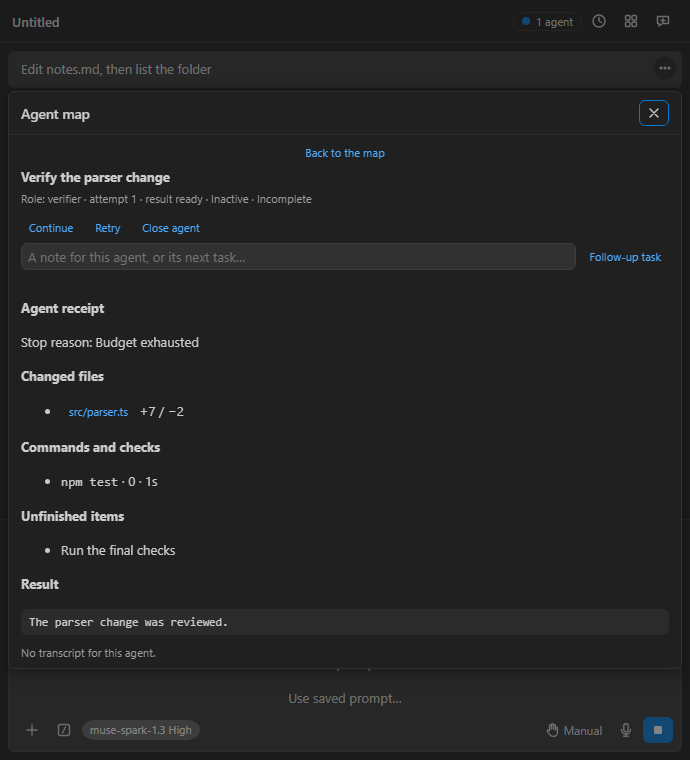
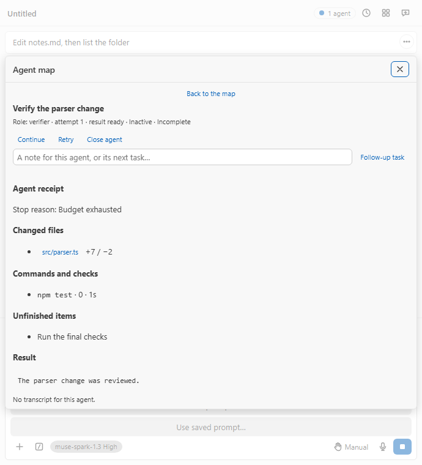
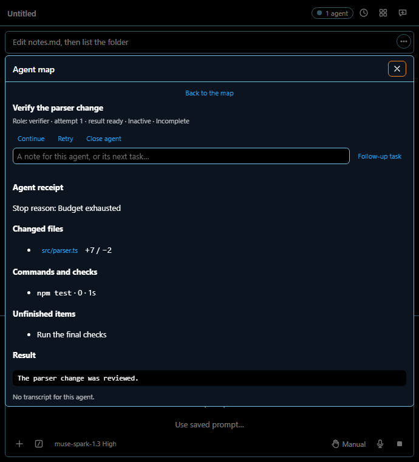
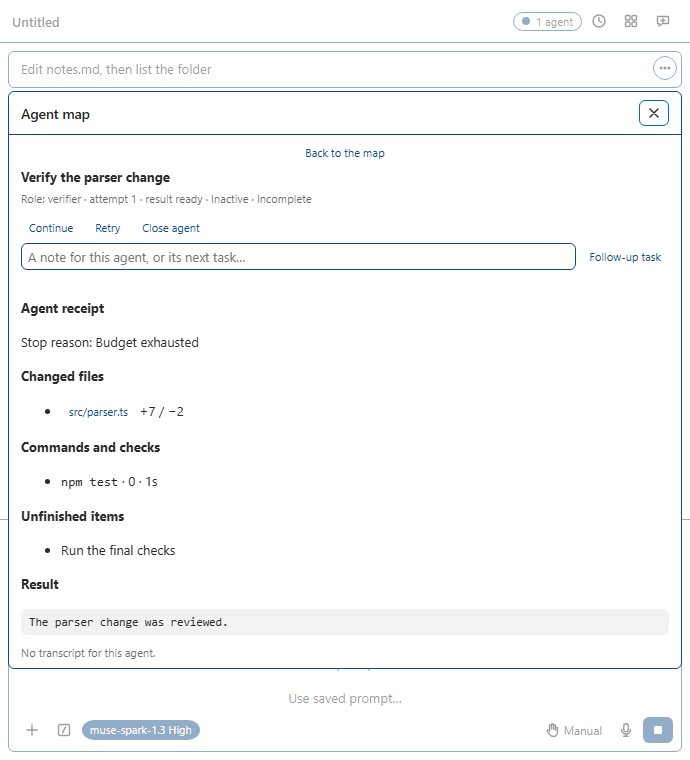

# M119 certification — agent activity, outcomes and receipts

Recorded 2026-10-06–07 on the Windows 11 rig, worktree
`C:/lanes/AGENTOUTCOME`, branch `feat/agent-outcomes`, base `aa4e3fa83`.
PLAN D101 and M119 were committed before implementation (`f3fb5056`).
Implementation is `93176c8f`; its unchanged pre-commit hooks passed ESLint,
Prettier and the redacted staged Gitleaks scan with no leaks.
No dependency, gate threshold, timeout, bundle cap or machine setting changed.
No live or paid model request was made. All new model responses are test fakes.

## Delivered behavior

| Brief item               | Result and evidence                                                                                                                                                                                                                                                                                                                                                                                                                                               |
| ------------------------ | ----------------------------------------------------------------------------------------------------------------------------------------------------------------------------------------------------------------------------------------------------------------------------------------------------------------------------------------------------------------------------------------------------------------------------------------------------------------- |
| Plan first               | D101 records the evidence and limits of all five sources; M119 records child-local task declarations and native recovery limits.                                                                                                                                                                                                                                                                                                                                  |
| Activity                 | Shared `agentActivity` supplies Active, Waiting with approval/input/queue/interruption/idle reason, or Inactive. The named output window is 5 seconds, refreshed by a mounted surface clock. Text accompanies the existing marks.                                                                                                                                                                                                                                 |
| Ended outcome            | Structured stop, worktree, task-list and final-check proof decide Complete, Incomplete, Failed, Cancelled or Ended, unverified. Budget, dirty private worktree, unfinished work and required checks missing have dedicated assertions. Neither final prose nor a normal native end certifies completion.                                                                                                                                                          |
| Continue                 | Model API keeps the same session, model, shared workspace and existing edits. A structured continuation note precedes the original objective byte-for-byte. Current permissions, fresh paid consent and budgets still apply. Plan mode refuses. The panel and ACP always ask the owner, including Bypass, and reject stale confirmation.                                                                                                                          |
| Retry                    | Owner control and ACP command ask first, then explicitly refuse without an isolated checkpoint. Every current backend either shares the workspace or has no captured child checkpoint. No workspace reset or fabricated fresh attempt occurs. A successful checkpoint-reset test is blocked by this backend capability, rather than represented by a fake implementation.                                                                                         |
| Native/workflow recovery | Ended native Continue and workflow/background recovery refuse with a reason. Native interrupted Resume retains its existing captured behavior. Successful ended-native preservation and workflow controls require accepted live captures, unavailable in this lane.                                                                                                                                                                                               |
| Attempt history          | Owned Model API attempts survive session serialization. Observed native/workflow attempts retain earlier outcomes and receipts; repeated snapshots preserve child-check evidence. Native history begins with what this host observed, since the CLI supplies no full attempt archive.                                                                                                                                                                             |
| Receipts                 | Lazy Agent map selection/disclosure shows redacted final text, stop reason, unfinished items, file links with added/removed counts, own commands/check outcomes, supplied exits and duration, and prior attempts. Each receipt caps strings at 16,384 characters and rows at 100; oversized or unavailable evidence is labelled honestly. Captured patch refs are read locally on selection, within a bounded page allowance.                                     |
| ACP / other editors      | `/agents`, `/agents receipt ID`, `/agents continue ID`, `/agents retry ID` use the same portable mapping, owned evidence and receipts. Read-only inspection also works while a model turn is active. Recovery uses an editor permission request; local inspection sends no model turn. ACP capability/refusal behavior applies in JetBrains, Visual Studio, Eclipse, Zed, Xcode and terminal editors using this agent. No new editor-specific API was introduced. |
| Localization / reference | All 14 real translations, feature catalog, CLI catalog, generated runtime reference and `docs/reference.md` updated. README describes evidence limits and commands.                                                                                                                                                                                                                                                                                               |
| Accessibility / visuals  | All ten activity/outcome scenes scan in light, dark, high-contrast dark and high-contrast light. Outcome text has polite live regions. Readiness requires the intended map/details view. Receipt fixtures exercise linked files and command rows. README Agent map screenshot regenerated.                                                                                                                                                                        |

## Captured wire and owned evidence

No new Muse Code wire field or RPC verb was invented. `agentEvidence`,
`agentWorkflowEvidence` and `changedFiles` are owned snapshot fields outside
`itemSnapshotFields`; a test injects a forged native completion record and
proves it is stripped before owned observation.

- M14/M18 subagent/control/history fields reuse the existing fixtures and
  [M18 record](m18.md), `scratchpad/live-subagents*.log`: allowed spawns cost
  10 model attempts, then 9 in the fully logged repeat; denied spawns cost 25. The inherited record describes the temporary delegation configuration
  but does not name its workspace. This lane adds no parser field to that
  capture and claims no new live receipt.
- M47 child ID, attempt, status and independently read optional fields reuse
  [M47's live capture](m47.md): empty `C:/muse-live-m47`, Muse Code 1.3.0,
  8 contributor attempts including the aborted capture. The existing child
  parser is shared between the reducer and local ACP listing; unknown values
  remain displayable.
- File counts reuse the [M4 captured patch-document schema](m4.md), already
  validated by `parsePatchFiles`, including Windows path normalization.
- Model API stops, request/tool-round budgets, tool exits, duration, task
  lists and shared-workspace attribution come from the owned harness.
  The existing parsed `response.incomplete` reason is reused. These are
  implementation records, not guessed provider response fields.

## Verification

All checks ran directly on the Windows 11 rig. Every Vitest invocation runs
complete files, at most three per invocation, with `--maxWorkers=3` and the
repository default timeouts. No tests are skipped or selected by name. The
latest passing run of each of these **19 distinct files totals 2,071 tests**;
repeated runs and intentional drill failures are excluded from that total.

| Complete files (unit unless specified)                                                                                                        | Tests passed |
| --------------------------------------------------------------------------------------------------------------------------------------------- | -----------: |
| `agentOutcome.test.ts`, `AgentMap.test.tsx`, `WorkflowRun.test.tsx`                                                                           |           42 |
| `conversationController.test.ts`, `acpAgent.test.ts`, `MuseCodeHost.test.ts`                                                                  |          787 |
| `modelApiHost.test.ts`, `modelApiTools.test.ts`, `sessionStore.test.ts`                                                                       |          672 |
| `uiState.test.ts`, `App.test.tsx`, `referenceGenerator.test.mjs`                                                                              |          388 |
| `l10n.test.ts`, `readmeShots.test.mjs`, `cliFeatures.test.ts`                                                                                 |           49 |
| `acpQuestionDeferral.test.ts`, `referenceEntry.test.ts`, `ReferencePage.test.tsx`, `test/e2e/museCode.e2e.test.ts` (split across invocations) |          133 |

| Check                                   | Result                                                                                                                                                                                                                                                                                                                      |
| --------------------------------------- | --------------------------------------------------------------------------------------------------------------------------------------------------------------------------------------------------------------------------------------------------------------------------------------------------------------------------- |
| `npm run typecheck`                     | All five host, webview, unit, e2e and integration projects passed on the final source.                                                                                                                                                                                                                                      |
| Changed-file ESLint, `--max-warnings=0` | Passed; changed-file checks include the final recovery-stamp and bounded-patch changes. Hooks repeat lint on staged source.                                                                                                                                                                                                 |
| Changed-file Prettier                   | Passed; final documentation is formatted and checked before commit.                                                                                                                                                                                                                                                         |
| `npm run deadcode`                      | Plain knip exited 0; two existing configuration hints, no dead-code finding.                                                                                                                                                                                                                                                |
| `npm run duplication`                   | 0 clones, unchanged zero threshold. Shared captured workflow parser and recovery-history test fixture remove two new duplicates.                                                                                                                                                                                            |
| `npm run check:l10n`                    | 14 tables, 0 problems.                                                                                                                                                                                                                                                                                                      |
| `npm run check:reference`               | Current: 56 features, 52 commands, 61 settings, 26 slash commands, 130 CLI entries; sharing reference matches catalog.                                                                                                                                                                                                      |
| `npm run check:host-api`                | 336 APIs, 34 VS Code importing files, 26 Node built-ins, 65 theme variables; 0 problems.                                                                                                                                                                                                                                    |
| `npm run build`                         | Final production build, all size caps, split checks, host globals and notices passed; 83 bundled packages.                                                                                                                                                                                                                  |
| Four-theme accessibility                | `node scripts/a11y.mjs` on all ten `agent-*` scenes plus `background-map`, `muse-workflow` and `muse-workflow-map`: 52 pages, 13 scenes, 0 violated rules, 0 undecided rules, 0 exempt findings, 0 missing results. Eight offscreen contrast nodes occur in the existing workflow scenes; all 40 new-state pages have none. |
| `npm run readme:shots -- --only agents` | `media/readme/agents.png` regenerated successfully and visually inspected.                                                                                                                                                                                                                                                  |
| Harness captures                        | Complete, incomplete and failed receipts rendered in all four themes. All four incomplete certification images and the README map were visually inspected.                                                                                                                                                                  |

The final production measurements retain the existing caps:

| Bundle / measured closure                |   KiB | Cap KiB |
| ---------------------------------------- | ----: | ------: |
| Activation `dist/extension.js`           | 451.6 |     600 |
| First chat `dist/conversation.js`        | 220.9 |     250 |
| Model API `dist/modelApi.js`             | 455.4 |     475 |
| ACP `dist/acp.js`                        | 847.4 |     850 |
| Checkpoint store                         |  77.0 |     225 |
| Webview startup including static imports | 736.9 |     900 |
| Agent map including its imports          |  17.7 |      25 |
| Original deferred aggregate              |  32.1 |      50 |

The rig/shared brief prohibits aggregate `npm run quality`, the full unit
suite, live calls and unlisted merges. The lead retains aggregate quality,
hosted editor execution and live preservation/checkpoint captures. This is
a scoped lane certification, not a new live-backend support claim. No packages
or system dependencies were installed; the repository's existing Husky was
initialized before the plan commit, and every commit uses the unchanged hooks.

## Gate-fire drills

Three final drills deliberately produced **11 failing assertions**. Every
mutated file was restored from saved bytes in `finally`, with its before/after
SHA-256 compared; complete restored test files then passed at default timeouts.
Logs are local ignored artifacts in `temp/`.

| Mutation                                                                                                                | Full-file failure result                                                                                                                                                                     | Restoration / normal result                                                                                                              |
| ----------------------------------------------------------------------------------------------------------------------- | -------------------------------------------------------------------------------------------------------------------------------------------------------------------------------------------- | ---------------------------------------------------------------------------------------------------------------------------------------- |
| Budget predicate `budget` → `normal` in `agentOutcome.ts`                                                               | `agentOutcome.test.ts`: exit 1, 5 failed / 14 passed (`outcome-drill-final.log`).                                                                                                            | SHA-256 `1274EB4F345F128CA54602ED5C357CFF8E7364854427A687FA35B16853AF8A66`; restored full file passed, latest expanded file 20/20.       |
| Retry refusal removed; receipt clipping removed; wire parser allowed owned evidence; owner-confirmation branch bypassed | Three full files: exit 1, 5 failed / 703 passed (`outcome-guards-drill.log`). Failures cover Retry refusal, bounded receipts, forged native proof and confirmation of both recovery actions. | All four files restored byte-exact; immediate restored run 708/708, later final recovery-stamp/controller/ACP run 710/710.               |
| Recovery stamp included advancing `durationMs`                                                                          | `agentOutcome.test.ts`: exit 1, 1 failed / 19 passed (`outcome-stamp-drill.log`).                                                                                                            | SHA-256 `3A9332214B9862062D10AC8FDF5E59B2EBE073BC8591688F20B306F83907D7B9`; immediate restored run 20/20 (`outcome-stamp-restored.log`). |

The four-file drill's restoration hashes describe the bytes at that drill;
subsequent reviewed recovery-stamp and invalid-patch changes are covered by
the final normal runs and gates:

| File                                              | SHA-256 at byte-exact restoration                                  |
| ------------------------------------------------- | ------------------------------------------------------------------ |
| `src/shared/agentEvents.ts`                       | `2BDD47C6997BB307EAC0BABFCAF431AD73B72E9424396DE0A021234BA2DB70DF` |
| `src/host/conversation/conversationController.ts` | `6E529ED7E1F81C288149004E4CB11BA42913DBDC8A4A179D683784B4DE9F4261` |
| `src/shared/agentRecovery.ts`                     | `13D8D830E55E469B4B34ACFC344379A96DB866840284EFD4D42BEFA632ECD43A` |
| `src/shared/agentReceipt.ts`                      | `753A63F43FAE1D03FAE22AF3353D8C443E87079D409EAFA0C01813FD21300ACF` |

## Visual receipts

