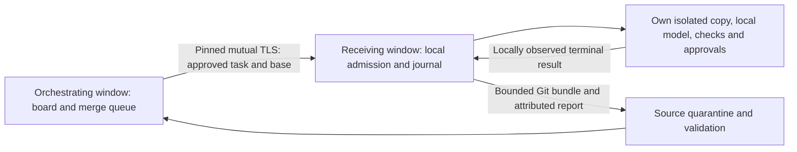

# M100 research — paired LAN devices and remote lane pools

Date: 2026-10-04 (America/Los_Angeles). Product: Muse Spark Code
(Unofficial). Status: **plan only**; D80 and M100 in `PLAN.md` are the
decisions. No listener, pairing protocol, device fleet or runtime security
claim is certified here. No live/paid model calls, credential access,
dependency installation, other-worktree edits, push, merge or rebase belonged
to the original planning lane, which changed only `PLAN.md` and this record.
The 2026-10-05 FIXM100 follow-up permits the review correction, an Unreleased
changelog entry and a local merge of the supplied `origin/main`; no fetch,
push or runtime implementation is authorized by that follow-up.

## 1. Request, inputs and number reservation

Owner, verbatim: "we should plan out multi device orchistration ie we have
the extension open on multiple devices on the same network and you can link
and orchistrate". The immediate use is his Windows PC, Kubuntu VM, Mac mini
and Windows 11 VM, previously coordinated by the lead over SSH. The plan
extends the existing product contracts rather than turning that SSH practice
into a second agent engine.

Read the rig brief and `_ctx/codex/common.md`, the repository's AGENTS.md,
the relevant architecture, decisions, milestone certification and gates in
PLAN, and the following local Git snapshots. The rig has no named main,
M95 or M96 branch refs; the current main-derived baseline and local
reflog/review snapshots supply their contents without fetching or touching
another checkout:

| Input                                                      | Revision inspected                                                               | Contract retained                                                                                                                                                             |
| ---------------------------------------------------------- | -------------------------------------------------------------------------------- | ----------------------------------------------------------------------------------------------------------------------------------------------------------------------------- |
| Main-derived lane baseline                                 | `2e341e4ccd598a66bc76cacc243d9b2ba572b8cb`                                       | D6 budgets, D13 trust, D48 consent, M77 confinement/snapshots, M82 accounting, §6.0/§7 gates                                                                                  |
| `feature/m95-byo-providers` snapshot recovered from reflog | `1ca53611334b5b197e2f0f8d3f474e61a01d5b65` (plan first introduced at `05e15893`) | D74/M95: ProviderRegistry/ProviderClient, qualified model references, origin-bound local credentials, capabilities/prices, Models & Agents panel                              |
| `feature/m96-agent-roles` round-3 snapshot, `rv/m96c3`     | `d6031832765ea0be48c7aca3ac2aa6cc0a4ae3cd`                                       | D75/M96/M96c: one window/one scheduler, roles and pools, sameModel/readiness, isolated copies, prelaunch journal, local retirement, exact-snapshot merge; M96d separate spike |
| M93 planning style                                         | `m93/a` PLAN, D72/M93                                                            | Ordered future lanes, explicit file/region ownership, acceptance/red-drill table and lead-owned aggregate certification                                                       |
| M99 number check                                           | `daebb312f313c432ca0d6129b37dfc5519858d7a`                                       | D79 already names M99                                                                                                                                                         |
| Second M96c review                                         | `_ctx/codex/RVM96C2.report.md`, reviewing `707b37ca`                             | Concrete counterexamples listed in §3 below                                                                                                                                   |

D80 and M100 are absent in the baseline and both required dependency
snapshots. D74/M95 and D75/M96 are already allocated; the D79/M99 snapshot
confirms the brief's next-number choice. Reserve **D80/M100**, leaving
D70–D79 to their existing lanes. The lead rechecks numbers and dependency
revisions on integration; this lane imports none of those branches' text or
code. M95/M96 remain planned dependencies, not facilities already on this
baseline. The missing-ref question was resolved through the local reflog.

## 2. Primary-source research

Sources below were opened on 2026-10-04 local time. Facts are paraphrased;
the M100 implications are design choices/inferences, not claims that those
products implement M100's protocol. No source code or media is vendored.

### VS Code Remote Tunnels

The host and client authenticate with the same GitHub or Microsoft account.
Connections go outbound through Azure, with an SSH channel over the tunnel;
VS Code does not open a network listener. A machine can be unregistered.
This is account-mediated remote editor access, not local peer pairing or
device-local agent scheduling. M100 borrows explicit enrollment and removal,
but chooses direct pinned LAN TLS to avoid a hosted rendezvous or another
account requirement. Tunnels could remain a user's independent way to reach
an editor; they are not an implicit M100 transport. [Remote Tunnels security and removal](https://code.visualstudio.com/docs/remote/tunnels#how-are-tunnels-secured)

### Syncthing

Syncthing's setup requires both devices to configure the other's device id;
sharing folders is a separate selection. This supports separating peer
identity from repository grants. [Mutual device configuration](https://docs.syncthing.net/intro/getting-started.html#configuring)

The device id derives from the certificate hash. Peers present certificates
in TLS and reject an unexpected id. Addresses can be static or discovered;
local discovery can be spoofed. M100 uses per-pair certificate pins and
manual addresses, treats discovery as an untrusted hint, and requires
offline public-invitation exchange plus bilateral fingerprint checks before
opening its authenticated listener. It does not copy Syncthing's file-sync
algorithm or enable automatic introductions. [Device ids and connection establishment](https://docs.syncthing.net/dev/device-ids.html)

Syncthing documents that discovery and relays can reveal device/network
metadata, and that local observers can recognize discovery announcements.
M100 keeps mDNS optional/off, advertisements minimal and scoped to the chosen
LAN, and adds no global discovery or relay. Even opaque advertisements and
TLS cannot hide the fact that two LAN addresses communicate. [Security and discovery privacy](https://docs.syncthing.net/users/security.html)

### Tailscale

Tailscale distinguishes machine identity from node authorization. Private
machine/node keys stay on the device; the control plane distributes public
node keys under policy, and peers use them for WireGuard connections.
M100 takes device-local key ownership and explicit policy from this design,
but adds neither a WireGuard implementation nor a Tailscale control plane.
A user's VPN is a possible later manually configured route, not an automatic
exception to pairing or repository approval. [Tailscale identity and keys](https://tailscale.com/docs/concepts/tailscale-identity)

Device approval lets an administrator admit or revoke a device independently
of user login; preapproved auth keys can bypass that manual step. M100 has
no preapproved enrollment token: authenticating a key does not grant task,
tool or billing authority. [Device approval](https://tailscale.com/docs/features/access-control/device-management/device-approval)

### Existing agent and runner fleets

Coder Agents runs the agent loop in its control plane, sends model requests
there, and executes tools through existing workspace connections. Templates
and workspace access are scoped to the prompting user; workspaces contain
no LLM keys. M100 borrows scoped execution and isolated workspaces, while
choosing to run the loop and keep billing credentials on each receiving
device. It does not centralize provider secrets or give a remote worker
control-plane authority. [Coder Agents architecture and isolation](https://coder.com/docs/ai-coder/agents)

GitHub's runner design exchanges a short-lived registration token for a
runner identity, encrypts job messages for that runner, and uses a job-scoped
OAuth token. This illustrates enrollment credentials versus lasting node
identity versus job authority. M100 uses local key pins and bounded task
grants rather than GitHub tokens or credential delivery.
[Runner authentication design](https://github.com/actions/runner/blob/main/docs/design/auth.md)

GitHub recommends ephemeral autoscaled runners, each assigned one job, to
reduce retained exposure. Its labels route work but user-supplied OS labels
are not independently validated. M100 reuses M96's isolated attempt copies,
attributes check evidence to the receiver/toolchain, and treats advertised
capabilities and reported success as peer claims, never proof of trustworthy
code or of a machine-wide lease. [Ephemeral runner lifecycle](https://docs.github.com/en/actions/reference/runners/self-hosted-runners),
[Runner labels](https://docs.github.com/en/actions/how-tos/manage-runners/self-hosted-runners/apply-labels)

### TLS and SecretStorage constraints

TLS 1.3 provides certificate authentication, but client authentication must
be requested; early data can replay effects. M100 requires both certificates,
waits for the authenticated handshake and disables early data and session
resumption in the first slice. Application retries still need durable
attempt idempotence; TLS does not make jobs exactly once. [TLS 1.3, authentication and replay](https://www.rfc-editor.org/rfc/rfc8446.html)

Node 20's TLS API exposes client-certificate requests, rejection of
unauthorized certificates and peer identity checks. These are implementation
inputs for the VS Code floor; certificate generation and exact pin validation
must be proved in lane 0/P/T on Node 20.18.3 and the current host, without
turning verification off. No certificate/QR/PAKE dependency is chosen or
installed in this research lane. [Node 20 TLS API](https://nodejs.org/docs/latest-v20.x/api/tls.html)

VS Code documents that secrets are encrypted and not synced across machines,
but remote extension SecretStorage persists on the **client**, even though
the extension can retrieve it remotely. Therefore "remote host" cannot be
assumed to mean "device-local key store". The initial M100 receiver supports
local desktop extension hosts only. Any later Remote SSH/Tunnels, container,
WSL or standalone receiver must establish execution/key placement without
copying a pair or provider private key to another device. [SecretStorage API](https://code.visualstudio.com/api/references/vscode-api#SecretStorage),
[Remote-extension secret placement](https://code.visualstudio.com/api/advanced-topics/remote-extensions#persisting-secrets)

### Routing and OS inbound permission (RVM100 correction)

RVM100 checked the platform documentation and confirmed a plan mismatch,
not a runtime defect: manual address entry bypasses discovery only. A route
to the receiver's chosen private address and explicitly authorized inbound
TCP access to its listening application/port are separate prerequisites.
Windows Defender Firewall can block inbound traffic by default; policy and
standard-user prompt restrictions can require administrator authorization.
A macOS application firewall can deny connections pending application
approval. Linux host firewall rules also require the intended inbound path
to be allowed. Setup cannot promise prompt-free or administrator-free access.
[Windows Firewall rules and standard-user prompts](https://learn.microsoft.com/en-us/windows/security/operating-system-security/network-security/windows-firewall/rules),
[macOS application firewall approval](https://support.apple.com/en-in/guide/mac-help/mh34041/mac).

Setup shows **Blocked or unreachable** when connection fails, with the actual
listening application, interface, address and TCP port. A timeout alone does
not diagnose a firewall denial. Recovery checks the selected route and
address/port, enabled receiver offer and OS permission/policy; the user
approves only the intended listener or asks an administrator for narrowly
scoped access, then retries the same paired identity. M100 never changes
firewall settings automatically. Failure/retry cannot release existing
attempt ownership or spending uncertainty; reconnect reconciles first.

Acceptance B/T transport and K/P/U installed setup cover standard-user/default-
firewall (no allow rule or unavailable prompt), explicit-deny and missing-route
cases separately from multicast-blocked success on an authorized routed
private path. K records the actual listening application/TCP port and OS
permission, policy and authorization requirements on Windows PC, Kubuntu VM,
Mac mini and Windows 11 VM, on the floor and current host. These remain
future implementation tests, not results of this documentation correction.

## 3. RVM96C2 lessons applied to distributed work

These are plan counterexamples, not M100 runtime bugs or executed drills.
M96's round-3 snapshot moved machine coordination to M96d; M100 preserves
that boundary. It cannot make endpoint availability into a safety oracle.

| Review finding                                                       | M100 rule and required future red drill                                                                                                                                                                              |
| -------------------------------------------------------------------- | -------------------------------------------------------------------------------------------------------------------------------------------------------------------------------------------------------------------- |
| 1: live endpoint can refuse; missing socket is not owner exit        | Freeze/saturate a live peer, remove an endpoint and advance timers: only reachability changes; attempt ownership/occupancy do not.                                                                                   |
| 2: spawn before registration leaves a surviving child                | Persist target admission and launch intent before spawn; crash at every boundary, including unconfirmed launch and detached descendant; retain uncertainty.                                                          |
| 3: a user can wrongly confirm a frozen writer stopped                | No distributed Hand off anyway or manual lock release; resume the frozen writer after a mistaken confirmation and prove no successor started. Landing stays solely with the source window.                           |
| 4: coarse start time/PID reuse is unsafe identity                    | No remote PID, ps timestamp, endpoint or second-hand process-exit proof is used to release local resources or to kill a peer process. Retirement is observed only by its own execution owner.                        |
| 5: cancellation/idle age does not finish a call                      | Long or cancellation-ignoring tools retain local resource leases; test a call beyond all idle thresholds.                                                                                                            |
| 6: parents holding every slot can deadlock children                  | Reuse M96c child-capacity admission; one slot and all-slots-held delegation fail before accepting an impossible wait. No remote worker holds a cross-device singleton.                                               |
| 7: reachability is not readiness; probes alter single-model behavior | Model readiness names the selected canonical model from explicit setup observations. Pairing alone neither loads the team nor adds conversation probes; zero-send/golden controls cover Solo and single-model cases. |
| 8: broken/unsupported state needs usable recovery                    | Show identity, local storage or protocol reason and repair path. An incompatible host, malformed journal or lost key refuses work; re-pair/upgrade never resets unresolved attempts.                                 |
| 9: totals without settlement ids can double-credit after reboot      | Durable dispatch ids, terminal outcomes and settlement tombstones outlive runtime folders. A lost settlement reply followed by reboot cannot refund twice. Unresolved debt never ages out.                           |
| 10–11: fallback merging/formatting can lose intent or checked bytes  | No new remote merger. Reuse M96c's strict JSON merge, intent preservation and final whole-tree/check identity. Returned branches are quarantined and reviewed; remote passes do not confer merge authority.          |

## 4. Authority, data flow and failure contract

The durable ordering is **source intent → target admission → target launch
intent → spawn → observed retirement → terminal artifact/settlement → source
acknowledgement**. Loss at any arrow cannot authorize another execution.
Duplicate request identities return the prior outcome; changed payload under
one identity refuses. Receiver-incarnation changes never silently adopt old
work. Durable state is owner-only and nonsync, separate from ephemeral socket
state; lane 0 specifies atomic persistence, bounded terminal retention and
tombstones before code. Storage exhaustion stops admissions rather than
discarding unresolved records. TLS resumption/reconnect does not restore a
grant removed since the original connection.

When the link drops, source tasks become paused/uncertain and admission
stops once loss is detected. A receiving loop pauses at its next controlled
boundary; an already dispatched request/command may continue. Slot and cost
reservations remain. Reconnect first reconciles the same attempt and settled
usage, then explicit Resume permits new work under current local consent.
Permanent loss can leave an attempt unresolved indefinitely. Unlink can
prevent future local contact immediately, but cannot remotely stop a sleeping
or malicious peer. These limits appear in setup/recovery, not just here.
An initial failed connect admits no work. A failed reconnect or setup retry
retains any already unresolved attempts, occupied slots and uncertain spend;
manual entry or later OS approval never proves retirement.

## 5. Threats, privacy and costs

| Threat                                                | Control and practical limit                                                                                                                                                                                                                                                                                                                                                  |
| ----------------------------------------------------- | ---------------------------------------------------------------------------------------------------------------------------------------------------------------------------------------------------------------------------------------------------------------------------------------------------------------------------------------------------------------------------- |
| LAN attacker, spoofed mDNS/DNS, interception          | Offline pin exchange, bilateral fingerprint comparison, mutual TLS, checked private interface/address and per-request grants. Discovery offers no authority; a LAN adversary can still deny service and observe traffic endpoints.                                                                                                                                           |
| Stolen QR/public pairing text or substituted identity | Public invitation alone cannot satisfy TLS private-key possession. Both screens must verify fingerprints; no numeric bearer code. A compromised private key requires unlink/re-pair; social approval of the wrong fingerprint remains a user risk.                                                                                                                           |
| Malicious authenticated device                        | Scoped repository/task APIs, no general shell/file/auth endpoint; output bounds/scrub, quarantine Git validation, source review and checks; no direct merge. A peer entrusted with code can read/retain it, forge its own check report or run its own software: TLS authenticates identity, not honesty. The no-duplicate crash/partition contract assumes honest receivers. |
| Permission or paid-use laundering                     | Effective policy is the intersection of both sides; receiver-local trust, protected paths, role tools, D48 gate and popup remain authoritative. Pairing, remote Bypass and an ordinary approval never become paid consent. Wider/forwarded grants are outside the first slice.                                                                                               |
| Confused repo, ref or snapshot                        | Both-side local mapping, approved base, bounded object/manifest validation in quarantine and only a task namespaced branch; imports run no repo hooks/filters. Exact final tree/check identity governs integration, including formatting.                                                                                                                                    |
| Secret or private-context spread                      | Pair/provider secrets never cross devices or reach children; no auth-file/env/history sync, ignored files excluded, tracked dirty snapshot preview, task-only context, no account labels/endpoints in offers or discovery. Scrubbing is defense in depth, not a promise to find all secrets hidden in user-approved code.                                                    |
| Sleep, crash, partition, old/stale/replayed result    | Prelaunch durable journals, attempt/incarnation identities, retained occupancy/debt and tombstones; no timeout-based release or reassignment, no endpoint/PID liveness oracle. Unproved descendants remain uncertain.                                                                                                                                                        |
| Flood, huge bundle, disk full or protocol mismatch    | Pre-parse connection/byte/queue/time caps, expanded-artifact/object limits, strict zod, explicit unsupported-state message; no automatic gate/limit downgrade or deletion of unresolved work.                                                                                                                                                                                |

Each receiving device owns its paid ledger, sign-ins, limits and invoices.
The source displays attributed known/estimated/uncertain usage and holds its
own routing reservations; it cannot mint refunds or remote budget headroom.
There is no global hard-cap claim across devices or shared vendor accounts.
Transport/discovery/setup use no model requests; writing/review tasks and
provider tools retain the executing device's existing price/consent rules.
No cloud analytics or account lookup is needed to pair. Deleting a pairing
removes local trust/key data, not an already copied repository on its peer;
working-copy/result cleanup follows M96's explicit retained-branch rules.

## 6. Scope, size, documentation and evidence

M100's lane/ownership, acceptance A–K, security review and certification
checklist are in PLAN. Check-only validates transport/admission first; role
lanes follow through M96, not a new engine. Optional mDNS and QR stay lazy;
copyable invitation text stays available without QR, and manual addresses
bypass discovery subject to routing and explicit inbound authorization.
Numeric PAKE, unattended services, remote
extension hosts, VPN/public routes, machine-wide coordination and approval
forwarding remain Q-M100. All implementation tunables belong in shared
constants; no arbitrary timeout is an authority to release work.

Existing size gates remain 600 KiB activation, 475 KiB Model API, 225 KiB
checkpoint store and 900 KiB webview main, plus every other D6 artifact cap.
Proposed `dist/devices.js` has a 100 KiB planning target only. Its measured
budget and allowed readers must be recorded before shipping, with a split
guard proving no TLS/QR/discovery/receiver code enters ordinary activation,
Model API or ACP bundles. Node's TLS/crypto are built-ins; any certificate,
QR or discovery dependency still needs exact pins, peer/audit review and
notices under AGENTS rule 9. No cap is increased by this documentation diff.

Implementation must update README (successfully run commands/settings and
pairing/recovery examples), PRIVACY (context/discovery), SECURITY (peer and
revocation limits), CHANGELOG, the host API record and `m100.md`. This lane's
explicit two-file scope leaves those delivery documents to lane I; it adds
no README command, runtime setting, string key, dependency or executable gate.
The full §6.0/§7 certification, including quality, coverage, installed-host
four-machine/floor checks and every acceptance red/restored proof, remains
open for implementation. Planned tests are not represented as passed.

### Independent review and FIXM100 scope

`RVM100.report.md` reviewed `5b7565c3df0fa304bfe875cb035495e8b498d274`
in three passes and passed with no P1. Its one P2, the unconditional manual-
address connectivity promise, is corrected in D80 and acceptance B/K as
specified above. The review has no remaining blocker; this correction does
not certify pairing, transport or remote execution.

Devices and mDNS off by default is a deliberate security exception to the
owner's enhancements-on ruling. Listening on the network and sending
repository context require an explicit local choice. This is visible in
M100's Status, not an implicit default change or a paid-use exception.

Lane 0 still settles certificate generation, trust-anchor/pin validation,
selection of multiple per-pair identities, protocol caps and durable
retention/replay before P/T/E. Accepted M95/M96/M96c contracts, exact joined-
tree aggregate gates and installed four-device/floor evidence remain
implementation prerequisites. Real-model/paid drills need their separate
authorization. No new executable test, dependency or runtime guard is added.

### Documentation-lane validation

Executed directly in `/home/randy/lanes/M100PLAN` on **Kubuntu**, one heavy
check at a time, on 2026-10-04 local time:

| Check                                         | Actual result                                                                                           |
| --------------------------------------------- | ------------------------------------------------------------------------------------------------------- |
| `npm run typecheck`                           | Exit 0; all five projects: host, webview, unit, e2e, integration                                        |
| `npm run deadcode`                            | Exit 0; existing configuration hint about `vendor/**` in knip's ignore, no change made                  |
| `npx jscpd`                                   | Exit 0; 833 source/test files, zero clones                                                              |
| `node scripts/check-l10n.mjs`                 | Exit 0; 14 tables, 120 manifest strings, 421 source files, zero problems                                |
| `npm run check:host-api`                      | Exit 0; 271 VS Code APIs, 18 importers, 23 Node built-ins, 59 theme variables, zero problems            |
| `npm run build`                               | Exit 0; all artifact caps, bundle splits/model-text readers, host globals and 83-package notices passed |
| Changed-source ESLint and owning Vitest files | Not applicable: only two Markdown files changed; no executable test or runtime guard added              |

Measured unchanged production artifacts: activation **552.6/600 KiB**,
Model API **426.3/475 KiB**, checkpoint store **109.1/225 KiB**, webview
main **860.0/900 KiB**, ACP **786.5/850 KiB**. There is no M100 bundle to
measure. The target in §6 is a future design target, not a budget raised
to make this build pass.

**Executed formatting red/restored drill:** after formatting both documents,
add two trailing spaces to PLAN's first heading, then run
`npx prettier --check /home/randy/lanes/M100PLAN/PLAN.md`. It reported PLAN
unformatted and exited **1**, as expected. Restore the saved bytes in
`finally`; the before and restored SHA-256 are both
`ecc1cf53061e1a9e479f81c34b4e1e6a871fc99ece7b93a8bf7da5cf55782579`.
This proves the existing documentation format gate fires, not any future
pairing/security guard. M100's runtime A–K drills remain unexecuted.

The rig brief forbids the full quality/unit run and main integration in
this lane; the lead owns those checks on the joined tree. That is a lane
boundary, recorded in PLAN §7, not a reduced product gate or a runtime
certification claim. Normal pre-commit hooks remain required: serial
lint-staged formatting followed by staged, redacted gitleaks.

**Final formatting/whitespace:** `npx prettier --check` on both documents
exited 0, and `git diff --cached --check` exited 0 with exactly the two
authorized paths staged.

**Local commit and hook remediation:** `c248cc7f` introduced the two-file
plan. Its ordinary `git commit` completed without invoking hooks: the rig's
existing `core.hooksPath=.husky/_` pointed to a missing generated launcher.
The lane restored the standard ignored local `.husky/_/pre-commit` launcher
and `h` from the installed Husky package, without changing the tracked hook,
Git configuration, machine/user settings or any gate. An explicit
`gitleaks git --redact --no-banner --log-opts='c248cc7f^..c248cc7f'`
then exited 0: one commit, approximately 55.63 KB scanned, no leaks. The
follow-up receipt commit uses the restored launcher and the repository's
unchanged `.husky/pre-commit`; its Git/hook output is the completion receipt.
History is preserved rather than amended. No push, merge or rebase occurred.

### FIXM100 correction checks (2026-10-05, Windows PC)

The follow-up changes only PLAN, this research record and CHANGELOG. The
existing quality gate's Markdown formatting check is Prettier; no separate
Markdown linter is configured. The installed Prettier CLI `--check` on the
three explicit paths exited 0, and `git diff --check` on those paths exited 0. CHANGELOG is excluded by the existing `.prettierignore`; its entry follows
the surrounding style and the whitespace check covers it. No ignore, gate,
threshold or source code changed.

**Fresh formatting red/restored drill:** insert two trailing spaces in this
record's first heading. The installed Prettier CLI `--check` exited **1**.
Restore the saved bytes in `finally`; before/restored SHA-256 matched:
`fccf5f4ef8a43432671dbe75f5809c2bdd177d0afdecedefd408aca22f6a68e2`.
The restored check exited **0**. This proves formatting only, not runtime
connectivity or a new executable guard.

This worktree also lacked the generated `.husky/_/pre-commit` launcher.
Restore the standard ignored launcher and `h` from the installed Husky
package with its ignored-directory marker, leaving tracked hooks and
`core.hooksPath=.husky/_` unchanged. Normal commits must visibly run serial
lint-staged and staged redacted gitleaks; no hook bypass is authorized.

The earlier Kubuntu build sizes and checks above belong to the original
planning snapshot. No build, typecheck, Vitest, full quality or live/paid
model run is made for this docs-only correction. The supplied local
`origin/main` is `a95f24cfa56fa75c85c8e09f04940f73edfa5a27`; the authorized
merge and final document checks follow the correction commit. No fetch or
push is performed.

**Correction commit and main integration:** `1edc4ead` ran the unchanged
normal hook: serial lint-staged formatting passed and staged redacted
gitleaks scanned approximately 19.06 KB with no leaks. The authorized merge
of the main ref above conflicted only at PLAN §7. Keep both the M100 planning/
FIXM100 notes and main's DEFLAKE2 gate record; CHANGELOG merged automatically
with both sides retained. No decision or milestone is renumbered. Compared
with supplied main, only PLAN, CHANGELOG and this record differ, all as text
additions; no main text or source change is discarded.

**Merged-document verification:** installed Prettier `--check` on PLAN,
this record, CHANGELOG and the incoming host API record exited **0** (the
existing CHANGELOG ignore still applies). `git diff --cached --check` and
the three-document whitespace check against main exited **0**.
`node scripts/check-host-api.mjs` exited **0** on Windows PC: 279 VS Code
APIs, 19 importers, 23 Node built-ins, 57 theme variables, zero problems.
The merge completion uses the same normal hooks; final Git/hook output is
the completion receipt. Full joined-tree quality and M100 runtime/four-device
certification remain with the lead and future implementation lanes.
