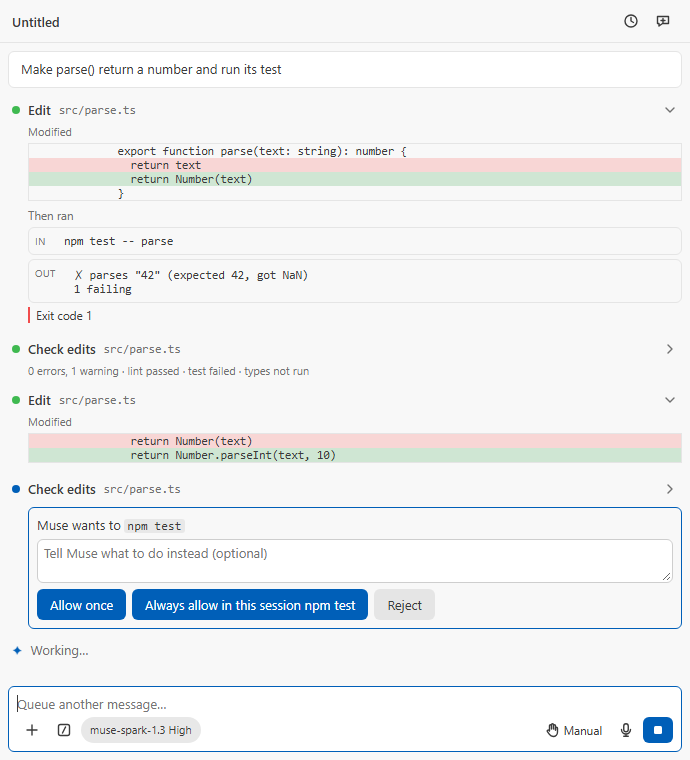

# M68: the verify loop

## Current-main verification (2026-09-30)

The integrated behavior and test candidate
`d10c6b4265c1c554c4c3c65357a8570726063642` passed fresh `npm ci` and
literal `npm run quality` on the Windows host, Windows 11 VM, Mac mini and
Kubuntu VM. Before/after staged-tree checks matched on every host. The host
first encountered a transient `EPERM` in an existing paid-grant rename;
all 22 owning tests passed under the same genuine short TEMP, followed by
the unchanged full gate exiting 0. The failed run is retained. No threshold,
timeout, rule, ignore or feature was disabled.

| Host          | Full quality                                 | Installed agent               | VS Code 1.99 / Node 20.18.3                    |
| ------------- | -------------------------------------------- | ----------------------------- | ---------------------------------------------- |
| Windows host  | 0; 3,436 tests passed, 27 skipped            | Build/package checked locally | The three rigs below exercise the actual floor |
| Windows 11 VM | 0; genuine short TEMP and junction contracts | 9 passed                      | 19 passed                                      |
| Mac mini      | 0; 3,426 tests passed, 37 skipped            | 9 passed                      | 19 passed                                      |
| Kubuntu VM    | 0; 3,426 tests passed, 37 skipped            | 9 passed                      | 19 passed                                      |

Each 19-test floor run includes the real TypeScript/JSON diagnostic and JSON
formatting cases, activation and the existing code-intelligence providers;
the packaged plan reader also ran on the actual Node 20 executable. The
installed ACP agent tarball SHA-256 was identical across rigs:
`18a147bc1204fcb36c027065680a593a255b64eae3b34d89e2f9c70ac0552ee4`.
Accessibility checked 360 pages and found no violations or missing results;
the eight pre-existing exemptions remain. Root independently inspected the
receipts, log digests, real runtime versions and source bindings. The
independent staged review accepted the alias, captured-owner, rename and
fixture repairs. Evidence is external under `platform-m68-d10c6b42` and
`m68-source-integration`; historical failures and proof below remain intact.

The staged scan initially flagged the host module's documented SHA-256
because its label resembled a credential label. Its bytes match the actual
source digest; the wording now names the algorithm explicitly. No ignore
was added. This completion record and label correction affect only this
document, which is excluded from the runtime packages. The final host gate
and staged scan are repeated on the documentation-complete candidate before
commit; the unchanged product retains the three rigs' bound runtime proof.
No new model or paid call was made in this verification.

## Resume integration preparation (2026-09-29)

The isolated `integrate/m68-resume-20260929` worktree joins original HEAD
`bf0d23058ab78a2308b8a2e1257419f2dd5bb3a9` with main
`c323dcc0d726e0f6a1c6522ebb4c6ea750b8ae91`, applies the original
ten-file workspace-edit repair, joins main `24ff09bc`'s M79 content and
then `f7db5715`'s PR51 tests/docs before verification. The original feature and resume worktrees
remain untouched. The saved binary repair patch is external, under
`muse-goal-evidence-20260929/m68-source-integration`, SHA-256
`6c8447c424a8d978c3bf0ba5a5622622cecd8130b9d64325c0c23aa7ac2da561`.

Source reconciliation preserves code intelligence and web fetch alongside
the verify loop, the required MCP signal and in-flight cancellation,
unsaved-file access, the Node 20.18 host target, and ACP credential isolation.
An automatic merge left the formatter's conditional writer calling an old
dependency; it now uses the same current unsaved-file predicate as ordinary
file tools. The existing workspace registry moves to
`core/verify/workspaceEdits.ts` with a structural observer, retaining its
behavior while staying separate from the lazy verify ledger. The manager
creates and injects it before its host loads. ACP managers keep their raw-cwd
session-store identity while sharing notices by an existing canonical
directory's native bigint device/inode identity; unreadable, non-directory
and unusable identities refuse setup. Runtime operations use the captured
canonical root; raw-cwd session records and store hashes stay intact. A
captured native identity guard checks both named and canonical roots at
cached-host access, mutations, commands and final native publication after
awaited staging. Neither a retargeted alias nor a replacement directory
silently rebinds an existing session or registry.

Rename begins every canonical/alias notice synchronously before rechecks,
records each successful write in the owning session's round, and releases
all notices in `finally`, including Stop and partial failure. The main's
first-write Stop guard remains. New test source covers held rename notices,
success and partial-write diagnostics, Stop cleanup, native directory aliases,
case-distinct directories where the filesystem provides them, and refused
workspace roots. The former live verify `case19` is now `case21`, preserving
M67's `case19` and M79's `case20`; historical captures below keep their names.
The old M68 shell-rule question is now Q12, preserving main's Q10/Q11.

M79 publication now brackets every checked create attempt with shared notices
and releases in `finally`. Only a true new-file result records an edit in its
captured live Model API owner; its recorder is captured from the validated
session object before plan lookup/confirmation and carried through the store,
so a same-id revival even before publication begins cannot become its owner.
A disposed/replaced owner is not counted as a
new unrelated conversation. Notifications do not load the lazy backend or
read its key. M79's owned-stage cleanup and M68's conditional atomic writer
are joined, retaining the immediate fingerprint/unsaved recheck.

**Early checks only:** the first host type check exited 0, then unit types
found four old diagnostics-tool test callers missing M69's required signal.
Those callers now supply it. A preceding CMD launcher syntax failure and two
new runtime-test fixture failures are retained separately; the held checkpoint
now targets the actual note writer and uses the shared existing dummy key.
They are findings, not deliberate red proofs. Fourteen scoped lint findings
and duplicated owner-revival setup were fixed without suppressions or gate changes.
Current early proof is below. Installed ACP/native rig controls and full quality are still pending.
Earlier evidence below belongs to its stated old trees. M77 winner application
still needs its actual code joined and bound to this registry. Final
current-main review and exact-tree gates remain open. No model or paid call
was made during this preparation.

### Frozen integrated behavior proof

Staged tree `1c3dbea959f5df12ce9df1aeb62add9ba6628504` contains main `f7db5715`
and M68's repaired source. The coordinator's normal merge remains pending;
no commit or merge was made for this proof. The external archive SHA-256 is
`73c6594de6c7793b3ce69d5b03265595b6e1cc2a4847bc3a439f13e8db4bb7e9`.
All mutation work ran in its disposable copy outside the checkout.

Host, unit, e2e and webview TypeScript checks, scoped ESLint and the normal
project duplication gate exited 0; duplication reported zero clones. The
earlier ten-suite focused run passed 250 tests with three existing skips,
plus 23 selected controller cases. After the recorder fix, the frozen tree's
bounded selectors passed **52 tests before and after all mutations**:
workspace/ledger 10, rename 4, runtime native aliases/refusals 4, manager
ownership/lazy admission 5, real plan publication 3, atomic/private-memory
publication 3, and controller plan/verify 23. The new aliases and directory
replacement tests used owned real Windows filesystem paths; the held writer
was the actual note publication, not an unrelated session-store write.

| Mutation                                     | Observed intended failure, exit 1                                                                 |
| -------------------------------------------- | ------------------------------------------------------------------------------------------------- |
| R89, per-session registry                    | New session formats during a pending config write                                                 |
| R90, missing begin notification              | Expected pending name true, received false                                                        |
| R91, reset clears pending notices            | Expected pending name true, received false                                                        |
| R92, completion omits version change         | Stale run became current                                                                          |
| R93, memory write bypasses notice            | Cached check grant answered instead of asking again                                               |
| R94, disposed ledger keeps notice            | Pending name remained after reset                                                                 |
| Rename omits successful-write callback       | Own diagnostics saw no files instead of written files                                             |
| Runtime owner fence omitted                  | Actual note became `changed` instead of staying `before A`                                        |
| Exclusive final publication fence omitted    | Private file published instead of refusal after awaited staging                                   |
| Atomic retry fence omitted                   | Target replaced instead of refusal after busy retry                                               |
| Private memory fence not forwarded           | Private note published instead of refusal                                                         |
| Plan begin notice omitted                    | Pending plan name absent                                                                          |
| Plan reports false after true creation       | Completion observed false instead of true                                                         |
| Manager records a false creation             | Owner received an invented edit                                                                   |
| Captured recorder resolves replacement by id | Replacement owner received old plan's edit, before/after begin cases                              |
| Lazy host gets a different registry          | Exact deliberate contract guard: `TypeError: new session did not join the shared ledger registry` |

The last failure is explicitly a contract-guard failure, **not an
AssertionError**. The initial assertion-only receipt stopped on it and is
preserved; validation accepted only that exact diagnostic, test/anchor and
mutated hash. No arbitrary crash was counted. All 30 proof log hashes and
all nine live production source hashes match the receipt, and all changed
bytes restored. The recorded source hashes include:

- Source digest for the host module (SHA-256): `33639c73a74ba9b87ef6fa818a2eec22469df1028b1ffa17f85a7c559e474380`.
- Runtime, registry, ledger, rename, plan store, manager, atomic and memory
  helpers: each full SHA-256 recorded in the same receipt.

Proof directory: `muse-goal-evidence-20260929/m68-source-integration`.
`current-drills-receipt.json` SHA-256:
`4c4285726749d23cc7386cc511e3dd9f71743c1dd77f8d1fb94e9d158b89791f`.
Restored selectors finished `2026-09-30T06:03:18Z`; model attempts and paid
calls were zero. `check-host-api.mjs --write` then exited 0 with 261 VS Code
APIs, 16 importing files, 23 Node built-ins and 57 theme variables; this
regenerated the required inventory, not its limits or host boundary policy.

The existing host/page-worker targets remain Node 20.18 and ACP remains Node 22. The changed production verify/runtime paths use no `Promise.withResolvers`
or `Array.fromAsync`; `toSorted` remains within Node 20's supported surface.
This is a source scan and local focused proof, not installed-floor or complete
cross-platform certification. Final docs/inventory changes do not change
the frozen behavior source. Full quality, installed ACP/real verify editor,
Windows floor and Windows/macOS/Linux native alias controls remain the
coordinator's required gates.

Recorded 2026-09-28 on branch `feature/m68-verify-loop`, from
`origin/plan/d49-competitive-program` at `2407109c` (main and the D49/D50
plan, PR #50). PLAN.md D49, milestone M68. Not pushed. Built as
`c62cb067`; `origin/main` (PR #50 merged, `ba82f432`) merged in as
`369028aa` with no conflicts; then one commit fixing every finding of the
three class reviews ("The M68 review" below). The sections before it
describe the milestone as it now stands.

## The request

PLAN.md M68: every edit is checked, and the model sees the result without
asking. After a tool round that edited files, the next request carries the
new diagnostics of those files, capped, with changes against the previous
round; an optional format on edit; check commands (`museSpark.checkCommands`,
machine-scoped) that run automatically after every edit round by the shell
tool's permission path, scoped to the changed files after `--`, with a time
cap, and that the model can run itself; `then_run` on `write_file` and
`edit_file` (SoL-Pi's Action Fusion); a bounded fix loop. On Muse Code:
diagnostics through the existing `mcp__ide__getDiagnostics`, and the
guidance to verify sent as `MODEL_TEXT` in the turn.

## What was built

- **Settings** (all machine-scoped, D15; `package.json`, `SETTING_DEFAULTS`,
  `MACHINE_SCOPED_SETTINGS`): `diagnosticsAfterEdits` (on),
  `checkCommands` (none; each `{ name, command, changedFiles?,
timeoutSeconds? }`, validated whole by `checkCommandsSchema`: at most 8,
  names unique, 1 to 600 s, 300 s unless set) and `formatOnEdit` (off).
- **The automatic step** (`ModelApiSession.verifyRound`). It runs after each
  round in which `write_file` or `edit_file` wrote a file (not the shell,
  the memory tools or an image), after the round's hooks and before the next
  request. It reads the diagnostics, then runs the checks, shows a **Check
  edits** row (`verify_edits`: the files, errors and warnings, and each
  check's outcome), and replays the whole as one user note behind
  `MODEL_TEXT.verifyLead`, which calls it tool data and not an instruction.
- **Diagnostics** (`src/core/verify/diagnosticsReport.ts`): errors and
  warnings only, each file's counts with "N new, M fixed since the previous
  check" (matched by severity, source and message, never line), at most 50
  listed. Unreadable diagnostics are said so, never reported clean; a file
  not read (no report, unsaved, not shown, past the round's first 8, code
  the editor runs, stopped) is "not checked" with the reason, counted on the
  row, and leaves the "N new" baseline alone. The baseline moves only once
  the note is in the conversation (`PendingReport.commit`).
- **One budget**: the note (diagnostics and every check) is at most
  `VERIFY_NOTE_MAX_CHARS` (64,000), shared equally; so is a `run_checks`
  result.
- **The editor side** (`src/host/editor/verifyEditor.ts`), see "What VS Code
  reports" below: each edited file that no editor shows opens beside the
  active editor in a tab of its own (not a preview) without focus, the loop
  waits for its server once it shows (4 s for a first report, 1.5 s of
  quiet, 10 s at most; a Stop ends it and skips every file left) and reads
  it, and the tabs it opened close after the batch unless the user changed
  them. One queue serves every caller, a batch at a time.
- **The permission path** (`authorizeCommand`), shared by the checks,
  `run_checks` and `then_run`: Restricted Mode refuses; the mode's shell
  verdict decides (Plan refuses, Bypass allows, Manual, Edit automatically
  and Auto ask); the card is the shell's own `shell` subject, so Edit
  automatically never answers it, and the PermissionRequest hook sees a
  shell call, its denial told apart from the user's Reject. "Always allow
  in this session" is keyed on the configured command without its paths,
  under the verify loop's own key (since PR #54's fourth round; before, it
  was the shell tool's key and also answered for the model's own shell call
  of that command line); it does not answer after the conversation, since
  the user's message,
  edited a file that decides what the command runs. A rejected check is not
  asked again until the user's next message; in Restricted Mode the
  automatic checks are left out.
- **The user's hooks** (`runVerifyCommand`): PreToolUse, PostToolUse and
  PostToolUseFailure see each check and `then_run` command as a call of the
  shell tool: a block is "a hook denied it" with its words, a rewrite's
  `command` runs instead (and keys the rule), an `ask` asks even in Bypass;
  a context or a reason follows the output, and `continue: false` ends the
  turn.
- **Commands** run through the shell tool's own `runShell` (a job object on
  Windows, M27), from the workspace root, under the check's cap; a scoped
  check gets `--` and each edited path that still exists, quoted for the
  shell (PowerShell or bash); a path starting with `-` or `@`, or holding a
  control character, and on Windows one holding `"`, `&`, `|`, `<`, `>`,
  `^`, `%` or `!`, keeps the check from running. A shell that cannot start
  is a failed check. A check the model ran since the round's last edit is
  not run again after the round, and nothing runs after the last round.
- **The fix loop**: three rounds in a row (`CHECK_FIX_MAX_ROUNDS`) whose
  checks failed or timed out stop the checks until the user's next message
  (a goal's wake keeps the count); the model is told to stop and say what
  still fails; the panel shows a warning notice. A passing round resets the
  count.
- **`run_checks`** (offered with the shell while checks are configured):
  the named checks (all by default) over the named paths (confined to the
  workspace, and existing) or the files edited since the user's message,
  with the same stop and rejections; a row with the same summary line.
- **`then_run`** (offered with the shell): after the edit and its format,
  the command takes the permission path above (a hook's forced question
  carries over), then runs only if the file's SHA-256 equals the
  fingerprint the edit left. The call keeps the edit's result and diff and
  adds the command's (`thenRun` on the item): the row shows **Then ran**
  with the command, its output and its exit or the reason it did not run.
  A Stop at its card keeps the edit's result. Reimplemented from the public
  description of Action Fusion; no SoL-Pi code was ported, so
  `scripts/third-party-notices.mjs` is unchanged (M73 remains the first
  milestone that may port).
- **Format on edit** (`formatAfterEdit`): `vscode.executeFormatDocumentProvider`
  once the document shows what the tool wrote (2 s to catch up, else
  skipped), within 5 s; the edits applied to the written text (BOM and CRLF
  kept), written back by the tool, the patch and the fingerprint taken
  after. A failed or overlapping formatter, a write-back that fails, or a
  formatter that does not answer in time leaves the edit as written and is
  logged.
- **Code the editor runs** (`src/core/verify/codeFiles.ts`): a linter's or
  formatter's JavaScript config, `package.json`, anything in `node_modules`
  is never shown or formatted, and once the conversation writes one nothing
  more is shown or formatted until the user's next message.
- **The instructions** gain "Checking your work", naming what arrives after
  edits, the checks, `run_checks` and `then_run` as they are offered.
- **Muse Code**: a second `<harness_note>` with each message, built by
  `verifyGuidance` from `MODEL_TEXT`: call `mcp__ide__getDiagnostics` on each
  edited file (only when the session got the `ide` server), and run the
  named checks (named only in a trusted workspace). The template AGENTS.md
  is unchanged; no skill is installed.
- **The `getDiagnostics` tool** (both backends): a request for one file now
  shows it and waits for its report first (`settleFile`), since otherwise it
  reports nothing for a file no editor shows; only a file inside the
  workspace by its real path and not code the editor runs, its wait ended
  when the MCP caller goes away, and "not checked" when no report came.
- **Strings**: 25 keys in `en.ts` and the 14 tables (20 in `c62cb067`, the
  record then said 21; 5 from the review), 7 manifest strings in the 15
  manifest tables (two reworded by the review); `check:l10n` 0 problems
  (`verifyErrors.one` is the same word in Spanish, allowed in
  `untranslated.json`).
- **Harness**: scenario `verify` (an edit with a failing `then_run`, a
  Check edits row with lint passed, test failed and types rejected, a
  second edit, and a second Check edits row asking for `npm test` again,
  never `types`): 

## What VS Code reports (measured)

The first integration run read nothing for a JSON file only opened with
`openTextDocument`. A probe in the Extension Development Host (VS Code
1.139.1, `--disable-extensions`, built-in servers) then gave, with a 25 s
first wait:

| File        | Shown in an editor | Result                             | Time      |
| ----------- | ------------------ | ---------------------------------- | --------- |
| shown1.ts   | yes (cold server)  | `Type 'string' is not assignable…` | 3,128 ms  |
| hidden.ts   | no (warm server)   | nothing                            | 25,003 ms |
| hidden.json | no                 | nothing                            | 25,012 ms |
| shown.json  | yes                | `Expected comma`                   | 1,555 ms  |

(The shown times include 1.5 s of quiet.) So the loop shows each file, and
the settle constants come from these numbers.

## Tests

- `verifyLoop.test.ts` (27), over the fake Model API with a fixture whose
  lint fails: the diagnostics and check results reach the next request and
  the row; nothing after a round without edits or without the loop;
  unreadable diagnostics; the fix loop stops at its limit, a passing round
  resets it, a new turn starts again; a shell that cannot start; the `-`
  path refused; Stop at a check card; **one test per mode**: Manual asks
  (after the edit's card), Auto asks, Bypass runs, Plan runs nothing
  (the edit refused, `run_checks` refused per check), Restricted Mode runs
  nothing and offers neither `run_checks` nor `then_run`; "Always allow in
  this session" (and the shell tool's same command); a rejected check not
  asked again; `run_checks` (offered with the names, whole project before
  edits, the turn's edits, named paths, and its refusals); `then_run` (one
  call two results, its card after the edit's, rejected, Restricted, Plan,
  the guard, the hash after format, Stop at its card, a failed edit);
  format on edit (on, off, a failing formatter); the instructions. The
  review added 20 (47 now): the user's hooks on then_run (a PreToolUse
  denial with its words, a rewrite, a rewrite without a command, an ask in
  Bypass, the edit's forced question carried over, PostToolUse context and
  reason after the output, a stop) and on the checks (a denial that is not
  a Reject, a stop), a PermissionRequest denial told from a Reject; the
  session rule asked again after a `package.json` edit and trusted again
  after the next message; `run_checks` keeping a Reject and the stop; no
  duplicate after `run_checks` or a then_run of a check's command; nothing
  after the last round (50 rounds); a goal's wake keeping the stop; the
  budget with 8 flooding checks; `@` and a Windows `&` refused; only
  existing files passed and a missing `run_checks` path refused; code the
  editor runs never shown or formatted, and nothing after it; at most 8
  files shown; "not checked" for no report; the baseline moving only on
  delivery; Stop while the servers are awaited; a failed format write-back.
- `verifyEditor.test.ts` (18), over the `vscode` mock: shown beside as its
  own tab without focus and the tabs closed (only those it opened, not ones
  the user changed, a failed close logged), the timers started after the
  show, a report during the show kept, the settle wait (first, quiet, cap),
  a Stop at once and for every file left, one caller at a time, Windows case
  folding, an already shown file not shown again, unsaved and unopenable
  files not read; `settleFile` (says whether a report came, never a link out,
  code the editor runs or no folder, stops with its caller); format on
  edit's options, BOM and CRLF, catching up, and every refusal (stale,
  dirty, changed, overlapping, slow, none, unchanged).
- `checkCommands.test.ts` (12, one skipped per platform): the schema, the
  command line, the refusals (`-`, `@`, control characters, and on Windows
  only the eight syntax characters), the time cap, the Muse Code note, and
  real round trips through Windows PowerShell 5.1 into `node.exe` and into
  a `.cmd` (bash elsewhere) proving each allowed tricky path (spaces, both
  quotes, `$`, `;`, `,`, `=`, parentheses, braces, non-ASCII) reaches the
  command as one argument after `--`.
- `diagnosticsReport.test.ts` (9: "not checked" reasons, commit, the
  budget clip), `codeFiles.test.ts` (4), `verifyRows.test.tsx` (10: the
  rows, "not checked", "Failed without an exit code", a hook's words, the
  then_run block, the reducer, the Markdown export of a run, a skip and the
  summary), `diagnostics.test.ts` (+2: a named file settled first, with the
  caller's stop; "not checked" when no report came), `mcp.test.ts` (+1: the
  caller's stop reaches the tool), `ideMcpServer.test.ts` (+1: a caller that
  goes away stops the call), `settings.test.ts` (+1),
  `conversationController.test.ts` (+2: the Muse Code note after the choice
  note, read per message; whether the session has the `ide` server).
- **Integration** (`test/integration/verifyEditor.test.ts`, inside VS Code
  1.139.1 and 1.125.0): hidden `.ts` and `.json` files shown and their errors
  read (5.8 s and 10.1 s, both files); `settleFile`; the JSON formatter. All
  13 integration tests pass on both versions. After the review the test
  also checks that the tabs the loop opened are gone. Its first run after
  the fixes **failed** on both versions at `settleFile`: the JSON server
  clears a file's diagnostics when its tab closes, so the diagnostics tool,
  which read VS Code's store after `settleFile` returned, would have
  answered "No diagnostics." for a broken file once the tab closed (a
  regression the tab cleanup introduced; the unit fakes could not show it).
  `settleFile` now returns the entries read while the file showed, and the
  tool answers with those (falling back to what VS Code holds for a file an
  editor already showed). Rerun: 13 of 13 on 1.139.1 and on 1.125.0 (the
  loop's two files 6.2 s and 6.6 s, the tool's file 1.7 s).

## Red drills

Each guard broken in place, its suite run, the exact bytes restored and
checked by SHA-256 (never git): 26 of 26 fired, 26 restored.

| Drill                                                         | Suite                     | Exit |
| ------------------------------------------------------------- | ------------------------- | ---- |
| D1 a path starting with `-` is refused                        | checkCommands             | 1    |
| D2 a path with a control character is refused                 | checkCommands             | 1    |
| D3 each changed path is quoted as one argument                | checkCommands             | 1    |
| D4 an automatic check asks wherever a shell command asks      | verifyLoop                | 1    |
| D5 Plan refuses checks and then_run                           | verifyLoop                | 1    |
| D6 Restricted Mode refuses a check or then_run command        | verifyLoop                | 1    |
| D7 Restricted Mode leaves the automatic checks out            | verifyLoop                | 1    |
| D8 the fix loop stops at its limit                            | verifyLoop                | 1    |
| D9 a passing round resets the fix loop                        | verifyLoop                | 1    |
| D10 then_run's guard skips a file changed after the edit      | verifyLoop                | 1    |
| D11 format on edit runs before then_run's hash is taken       | verifyLoop                | 1    |
| D12 a rejected check is not asked again in the turn           | verifyLoop                | 1    |
| D13 "always allow in this session" keys on the command        | verifyLoop                | 1    |
| D14 a Stop at the then_run card keeps the edit and its diff   | verifyLoop                | 1    |
| D15 unreadable diagnostics are said so, never reported clean  | verifyLoop                | 1    |
| D16 the diagnostics and check results reach the next request  | verifyLoop                | 1    |
| D17 then_run is not offered without the shell                 | verifyLoop                | 1    |
| D18 run_checks is not offered without the shell               | verifyLoop                | 1    |
| D19 Muse Code gets the verify guidance in the turn            | conversationController    | 1    |
| D20 checkCommands is machine-scoped                           | manifest                  | 1    |
| D21 the editor matches files case-insensitively on Windows    | verifyEditor              | 1    |
| D22 an edited file is shown beside                            | verifyEditor              | 1    |
| D23 format on edit refuses a document that never caught up    | verifyEditor              | 1    |
| D24 the diagnostics tool settles a file it is asked about     | diagnostics               | 1    |
| D25 every new string is in every table                        | `check:l10n`              | 1    |
| D26 the accessibility gate covers the new rows (error colour) | `a11y.mjs verify` (Light) | 1    |

D26 put the then_run failure line in the error colour: axe reported
`color-contrast` 3.15:1 in Light Modern; restored, the scenario passes in
all four themes.

After the tests were refactored to remove duplication (below), D8, D9 and
D14 were run again: all three fired and restored. The drill script and its
JSON results are `scratchpad/m68-drills.mjs`, `m68-drills-first.json`
(all 25) and `m68-drills.json` (the rerun); D26 is
`scratchpad/m68-a11y-drill.mjs`.

## Gate runs

- Run 1 failed at `duplication`: two clones in `verifyLoop.test.ts` (the
  N-round script and the stop-at-first-card steps). Factored into
  `scriptWriteRounds` and `stopAtFirstCard`; jscpd then found 0 clones.
- Run 2 failed at `build`: the bundle-split gate (M57) named
  `verifyLoop.ts` and `verifyTools.ts` as on neither list. Both are used
  only by the host and its tools, so they joined `LAZY_ONLY`;
  `dist/modelApi.js` carries all 22 lazy files and `dist/extension.js`
  none. Everything before `build` passed in that run: 2,604 unit tests
  (25 skipped), coverage 94.4 % statements, 89.73 % branches, 96.13 %
  functions, 94.36 % lines.
- Run 3: `quality:gates` passed whole: format, lint (JS, CSS,
  PSScriptAnalyzer 0), five typechecks, `check:l10n` 0 problems, knip,
  dpdm, jscpd 0 clones, 2,604 unit tests (coverage as above), build with its
  size, split, globals and notices gates, and `npm audit` 0 advisories.
  `test:a11y` found **0 violations** on 338 of 340 pages but exited 1:
  headless Chrome crashed ("Network service crashed") on two pages of
  existing scenarios, `composer-max` (light) and `markdown` (hc-light), on a
  machine running other worktrees' gates. Rerun alone, those two and
  `verify` gave 12 pages, 0 violations, 0 without a result. Because the
  failed step stopped the run, `security:secrets` (gitleaks: no leaks) and
  `security:sast` (semgrep: 287 rules, 422 files, 0 findings) were run on
  their own and passed. No single `npm run quality` exited 0 end to end.
- **After the review: `npm run quality` exited 0 end to end**, run alone on
  the machine through `scratchpad/one-gate.ps1` (no other gate running at
  its start; log `scratchpad/m68-quality-final.log`): format, lint (JS,
  CSS, PSScriptAnalyzer 0), five typechecks, `check:l10n` 0 problems, knip,
  dpdm, jscpd 0 clones, 2,647 unit tests passed (25 skipped) with coverage
  94.43 % statements, 89.78 % branches, 96.19 % functions, 94.4 % lines,
  build with its size, split, globals and notices gates, `npm audit` 0
  advisories, `test:a11y` 340 pages (85 scenarios, 4 themes) 0 violations
  and 0 without a result, gitleaks no leaks, semgrep 287 rules on 424 files
  0 findings. Before it, the pieces failed twice and were fixed: knip named
  `VERIFY_NOTE_MAX_CHARS` a duplicate export of `TOOL_OUTPUT_MAX_CHARS`
  (now its own value), and jscpd found two clones in the new loop tests
  (factored into `editThenTest`, and one test's rounds merged). The drills
  whose tests changed with that (R5, R6, R8, R9, R10, R12, R13, R21) were
  run again and fired (`m68-review-drills-rerun3.json`). The integration
  test (not part of `npm run quality`; CI's `quality:ci` runs it) passed
  13 of 13 on both VS Code versions, as above.

## Live checks

- **Model API** (`test/e2e/modelApi.live.e2e.test.ts` case19, contributor
  model `muse-spark-1.3-contributor`, an empty temporary workspace with
  `value.txt` and a `check.js` that fails while the file says BROKEN, the
  owner's key through `run-live-modelapi.ps1`, Auto mode with the answerer
  allowing each card once). Run twice (the first run's assertion looked at
  the wrong request and was fixed): **3 requests each, 6 model attempts in
  all**, about $0.0005 each, all HTTP 200. The model read the file, called
  `edit_file` with `then_run: node check.js` (passed, `CHECKOK value.txt`),
  the automatic check asked (two PowerShell cards, both allowed) and passed,
  and the request after the edit round ended `function_call_output`,
  `message:user`: Meta accepted the check note after the outputs and the new
  tool schemas (`then_run`, `run_checks` with an `enum` of names).
- **Muse Code**: not run. The note is a text part of `turn/start`, a shape
  captured long ago (the choice note rides the same way); what Muse Code does
  with it is model behaviour, and a Muse Code turn has cost about 31
  attempts. The `getDiagnostics` change is proven inside VS Code above.

## The M68 review

Three class reviewers went over `c62cb067`: 2 P1 and 18 P2 findings, 16
distinct (two of class 3 repeat class 1). All were fixed in one commit;
none was rejected. Two claims were checked before fixing:

- **C2-1 (P1), Windows argument passing: confirmed by a probe**
  (`scratchpad/m68-p1-probe.mjs`, Windows PowerShell 5.1 on this machine,
  the check line built by `checkCommandLine`):

  | Program and paths                                                         | What the program received           |
  | ------------------------------------------------------------------------- | ----------------------------------- |
  | `node.exe` with `a"` and `b --inject`                                     | `a b`, `--inject` (an option added) |
  | a `.cmd` with `x&echo.INJECTED`                                           | `x`, then `INJECTED` printed        |
  | a `.cmd` with `%OS%`                                                      | `Windows_NT`                        |
  | a `.cmd` with `a^b`                                                       | `ab`                                |
  | a `.cmd` with spaces, `'`, `’`, `$`, `;`, `,`, `=`, `()`, `{}`, non-ASCII | each path intact, one argument      |

  So on Windows a path holding `"`, `&`, `|`, `<`, `>`, `^`, `%` or `!` now
  refuses the check, as does a leading `@` anywhere, and only existing files
  are passed (a `run_checks` path that names nothing is an error). The
  session rule stays keyed on the configured command: with those refusals a
  path can no longer change what the command does, and after an edit to a
  file that decides what it runs the rule does not answer (C2-3). Both round
  trips (`node.exe` and a `.cmd`) are now tests.

- **C3-9, the key count: the reviewer was right.** `c62cb067` added 20
  keys to `en.ts` (2 tool labels, 3 summary words, 5 outcomes, 5 skips, 3
  then_run words, the stop notice, the export label), not 21.

| Finding                                                  | Fix                                                                                                                        | Test (drill)                                              |
| -------------------------------------------------------- | -------------------------------------------------------------------------------------------------------------------------- | --------------------------------------------------------- |
| C2-1 P1 Windows paths inject options/commands            | `WINDOWS_ARGUMENT_SYNTAX`, leading `@`, existing files only                                                                | checkCommands, loop (R1–R4)                               |
| C2-2 P1 then_run and checks skip the user's hooks        | `runVerifyCommand`: PreToolUse block, rewrite, ask; PostToolUse/Failure context, reason, stop                              | loop (R5–R10)                                             |
| C3-2 a hook's denial reads as the user's Reject          | `hookDenied` with the hook's words; Reject feedback kept                                                                   | loop (R11)                                                |
| C2-3 an edited `package.json` keeps the rule             | `canChangeWhatRuns`: rules ignored after such an edit until the user's message                                             | loop, codeFiles (R12, R13)                                |
| C1-3/C3-7 run_checks ignores the turn state; double runs | one `VerifyState`; checks run since the edit skipped; a then_run of a check's command covers it                            | loop (R14–R18)                                            |
| C1-5 checks after the last round                         | `isLastRound`                                                                                                              | loop (R19)                                                |
| C1-6 a goal's wake resets the fix loop                   | `VerifyState` per session, reset only by a user's message                                                                  | loop (R20)                                                |
| C3-6 no overall budget                                   | `VERIFY_NOTE_MAX_CHARS` shared by diagnostics and checks, and within `run_checks`                                          | loop (R21)                                                |
| C2-5 shown or formatted config runs as code              | `CODE_LOADING_FILE_PATTERNS`, `node_modules`; nothing more shown or formatted after one is written                         | loop (R22, R23)                                           |
| C1-2/C3-1 silence reads as clean; timers; baseline       | "not checked" with the reason; timers after the show; 4 s/1.5 s/10 s; at most 8 files; commit on delivery                  | report, loop, editor (R24–R26, R31)                       |
| C1-1 shared preview, Stop ignored                        | one queue for every caller; a Stop skips every file left; the host stops waiting; `settleFile` takes the MCP caller's stop | editor, loop, mcp, ideMcpServer (R27, R29, R32, R35, R36) |
| C1-4 tabs pile up, the user's preview replaced           | own tabs (`preview: false`), closed after the batch unless changed                                                         | editor, integration (R30)                                 |
| C2-4 getDiagnostics follows links out                    | `confineWorkspacePath` by real path, no code-loading file; "not checked" when no report                                    | editor, diagnostics (R33, R34, R40)                       |
| C3-5 a failed format write-back fails the edit           | caught, logged, the edit kept; a slow formatter logged                                                                     | loop (R28)                                                |
| C3-3 a crash reads "Stopped"                             | "Failed without an exit code"                                                                                              | rows (R38)                                                |
| C3-4 the export says "Then ran" for a skip               | a note with the reason; the summary line exported                                                                          | rows (R39)                                                |
| C3-8 the harness shows an impossible state               | scenario fixed (types rejected, test failed and asked again after a second edit), reshot, a11y 0                           | harness                                                   |
| C3-9 the note names getDiagnostics without `ide`         | `verifyGuidance(hasIdeServer)` from the controller's `ideSessions`; the forced question to then_run tested                 | controller (R37), loop                                    |

### The review's red drills

Each new guard broken in place, its suite run, the exact bytes restored and
checked by SHA-256 (never git), by `scratchpad/m68-review-drills.mjs`. The
first run (`m68-review-drills.log`): 37 of 39 fired, 39 of 39 restored.
**R7 and R29 did not fire**: no test gave a hook's rewrite a blank command
(only a missing one), and the queue test passed without the queue (the
first caller's show came first either way). Both tests were strengthened (a
rewrite of `"  "`; a first file held open while the second must not start)
and both drills then fired (`m68-review-drills.json`). R34's anchor moved
with the `settleFile` fix and R40 was added for it; R33, R34 and R40 were
run after that fix and fired (`m68-review-drills-rerun2.json`).

| Drill                                                                   | Suite                         | Exit      |
| ----------------------------------------------------------------------- | ----------------------------- | --------- |
| R1 Windows: `"` `&` `\|` `<` `>` `^` `%` `!` in a path refuse the check | checkCommands, verifyLoop     | 1         |
| R2 a path starting with `@` refuses the check                           | checkCommands, verifyLoop     | 1         |
| R3 automatic checks get only files that still exist                     | verifyLoop                    | 1         |
| R4 run_checks refuses a path that names no file                         | verifyLoop                    | 1         |
| R5 a PreToolUse block denies the command                                | verifyLoop                    | 1         |
| R6 a PreToolUse rewrite runs the rewritten command                      | verifyLoop                    | 1         |
| R7 a rewrite without a command is refused                               | verifyLoop                    | 0, then 1 |
| R8 a PreToolUse ask makes the command ask                               | verifyLoop                    | 1         |
| R9 a PostToolUse stop ends the turn                                     | verifyLoop                    | 1         |
| R10 a PostToolUse context reaches the model after the output            | verifyLoop                    | 1         |
| R11 a PermissionRequest hook's denial is not the user rejecting         | verifyLoop                    | 1         |
| R12 a session rule asks again after a command-defining edit             | verifyLoop                    | 1         |
| R13 `canChangeWhatRuns` holds for `package.json`                        | codeFiles, verifyLoop         | 1         |
| R14 run_checks honours the fix loop's stop                              | verifyLoop                    | 1         |
| R15 run_checks honours a Reject                                         | verifyLoop                    | 1         |
| R16 a Reject is remembered (automatic and run_checks)                   | verifyLoop                    | 1         |
| R17 a check run_checks ran since the edit is not run again              | verifyLoop                    | 1         |
| R18 a then_run of a check's command covers that check                   | verifyLoop                    | 1         |
| R19 nothing runs after the turn's last round                            | verifyLoop                    | 1         |
| R20 a goal's wake keeps the fix loop's count                            | verifyLoop                    | 1         |
| R21 one budget for the note                                             | verifyLoop                    | 1         |
| R22 nothing is shown once the turn wrote code the editor runs           | verifyLoop                    | 1         |
| R23 nothing is formatted once the turn wrote code the editor runs       | verifyLoop                    | 1         |
| R24 at most eight files are shown a round                               | verifyLoop                    | 1         |
| R25 a file not read is "not checked", never clean                       | diagnosticsReport, verifyLoop | 1         |
| R26 the baseline moves only once the model has the report               | verifyLoop                    | 1         |
| R27 a Stop ends the host's wait for the language servers                | verifyLoop                    | 1         |
| R28 a failed format write-back keeps the edit                           | verifyLoop                    | 1         |
| R29 one queue: a second caller waits for the first                      | verifyEditor                  | 0, then 1 |
| R30 the tabs the loop opened are closed                                 | verifyEditor                  | 1         |
| R31 the timers start once the file is shown                             | verifyEditor                  | 1         |
| R32 a Stop skips every file left                                        | verifyEditor                  | 1         |
| R33 getDiagnostics opens a file only inside the workspace by real path  | verifyEditor                  | 1         |
| R34 getDiagnostics says "not checked" for a file with no report         | diagnostics                   | 1         |
| R35 an MCP call gets its caller's stop                                  | mcp, ideMcpServer             | 1         |
| R36 the IDE server stops a call whose caller went away                  | ideMcpServer                  | 1         |
| R37 Muse Code is told of getDiagnostics only with the `ide` server      | conversationController        | 1         |
| R38 a then_run with no exit code failed; it was not stopped             | verifyRows                    | 1         |
| R39 the export says a then_run did not run                              | verifyRows                    | 1         |
| R40 getDiagnostics answers with what was read before the tab closed     | diagnostics                   | 1         |

The harness scenario was checked by `node scripts/a11y.mjs verify`: 4
pages (four themes), 0 violations, 0 without a result.

## The Codex review of PR #54

Codex found four more on `c61c8fac`; all fixed in one commit, with their
classes swept:

- **P1, a hook's stop left the later checks running.** `runChecks`, the one
  loop behind the automatic checks and `run_checks`, now ends as soon as a
  PostToolUse or PostToolUseFailure hook returned `continue: false`
  (`then_run` runs one command, and a stopped tool call already skips the
  round's later calls). Test: two checks and a stop after the first, for
  both the automatic step and `run_checks`, run one command each.
- **P2, a queued caller could not stop while waiting.** The editor queue
  races each caller's wait with its own stop: a stopped caller leaves at
  once ("not checked: stopped", or nothing read for `getDiagnostics`), and
  the next caller still waits for every one ahead of it.
- **P2, an already shown file's early report was missed.** A report can
  come after the write and before the wait starts, and showing a shown file
  brings no new one. The editor now logs when each file was last reported
  on (disposed with the extension): a report since the file's modification
  time counts, and with no new report a shown document that holds exactly
  what is on disk (not dirty) is read as it stands. An editor showing older
  text still reads "not checked".
- **P2, `run_checks` rounds without edits never counted.** The fix loop now
  counts every round's `run_checks`, edits or not, and after the last
  round too; three failing rounds in a row stop the checks as before. One
  earlier test relied on the old gap (a failing whole-project lint before
  the edit) and now lints clean there.

Drills (SHA-256 restore, `m68-codex-drills.json`, then
`m68-codex-drills-rerun.json`): R41 the stop ends the checks, R42 a waiting
caller stops, R44 an early report counts, R45 a shown file holding the disk
text is read, R46 edit-free `run_checks` rounds count all fired on the first
run; **R43 (the next caller still waits for every one ahead) did not**: the
test looked before the third caller could start. With a short wait added it
fired. The integration test was rerun on both VS Code versions:
13 of 13 on 1.139.1 and on 1.125.0. That commit (`1b29fca0`) was not put
through the full gate: its run was queued behind another worktree's when
the second round below arrived, and was stopped before it started.

## The Codex review of PR #54, second round: every act on a file

Codex found three more on `1b29fca0` (a format write-back over a change
made while the formatter ran; the automatic diagnostics acting on the
lexical path, which a retargeted link turns into another file; a reused
background tab left in front of the user's). Each fix closes its class: every
act on a file that M68 performs after an await now uses the path
confinement found at the edit (the real path, links and junctions resolved,
and the canonical workspace-relative name) and checks the file just before
acting.

| Site (act after an await)                                            | Path it acts on                                                                                             | Checked just before                                                                                                                                                                                                                                                                     | Drill         |
| -------------------------------------------------------------------- | ----------------------------------------------------------------------------------------------------------- | --------------------------------------------------------------------------------------------------------------------------------------------------------------------------------------------------------------------------------------------------------------------------------------- | ------------- |
| Format on edit: the formatter opens the document (`formatAfterEdit`) | `checkedAbsolute`, the real path the tool wrote                                                             | its real path unchanged; then the document's text equals what the tool wrote (`isCaughtUp`), and again after the formatter answered                                                                                                                                                     | R54           |
| Format on edit: the write-back (`formatWritten`)                     | `checkedAbsolute`, the write asserting that canonical path                                                  | the file's text equals what the edit wrote; else the formatted text is not written, the change stands, and it is logged                                                                                                                                                                 | R47           |
| `then_run`'s command (`isAsEdited`, the guard in `runVerifyCommand`) | `checkedAbsolute`, read asserting its canonical path                                                        | the file's SHA-256 equals what the edit left (after format), right after the hooks and the card, right before the command                                                                                                                                                               | D10, R47      |
| The automatic diagnostics: show (`settledDiagnostics`)               | `EditedFile.absolute` = `checkedAbsolute` (was the lexical path: R48)                                       | real path unchanged and SHA-256 equals the edit's fingerprint, before the document is opened; else "not checked: changed"                                                                                                                                                               | R48, R51, R53 |
| The automatic diagnostics: read                                      | the same                                                                                                    | the document has no unsaved changes, and again real path and fingerprint, before the diagnostics are read                                                                                                                                                                               | R52           |
| `getDiagnostics` (`settleFile`)                                      | `checkedAbsolute` from its own confinement                                                                  | real path unchanged before the open and before the read (no fingerprint: the model asks about a file as it is)                                                                                                                                                                          | R51, R52, R33 |
| A check's path arguments (automatic and `run_checks`)                | the canonical name (`EditedFile.relative`, was the name as given: R49)                                      | each name still resolves to the real path confinement gave it, just before the command; else "not run: the file changed". Content is not compared: an earlier check may fix a file (`--fix`), and a check reports on the file as it is; a changed file cannot make a check read another | R49, R50      |
| Showing a file in a group (issue 3)                                  | an existing tab outside the user's group is reused as it is (its preview state kept), else a new tab beside | afterwards, in each group where one of the loop's files was left in front, the tab that was in front before the batch is shown again as it was (text tabs; any other kind is logged)                                                                                                    | R55, R56      |

The editor side computes the fingerprint as the tools do
(`src/core/verify/fingerprint.ts`, shared: strict UTF-8, the byte-order mark
kept). Residual, recorded in PLAN §9: between the last check and the act
there is still a moment (no file-system compare-and-swap; an atomic rename
cannot be conditional), and a folder on the real path swapped for a link in
that moment is not caught.

Tests: the loop (a change made while the formatter ran is kept and
`then_run` skips; an edit through a link is read and checked by its real
path and canonical name; a check skips when its folder becomes a link); the
editor (a changed or moved file is never opened; a file that changes during
the wait is not read; `getDiagnostics` refuses a path retargeted after its
confinement; format on edit refuses a moved path; a background tab is shown
where it is with its preview state and the user's tab comes back). Drills
R47 to R56 all fired and were restored (`m68-codex2-drills.json`). The
integration test now hands the editor real paths, as confinement does, and
passed 13 of 13 on 1.139.1 and 1.125.0.

**For PR #32 (VS Code 1.99, Node 20):** M68's host code used
`Promise.withResolvers` (Node 22) in the editor queue; it is gone. No other
Node 22 API is in M68's code (scanned: `Array.fromAsync`, the new `Set`
methods, `Object.groupBy`, iterator helpers, `RegExp.escape`,
`Promise.try`). The VS Code APIs it uses all predate 1.99: `window.tabGroups`
with `TabInputText` and `close` (1.67), `showTextDocument` with
`viewColumn`/`preview`/`preserveFocus`, `languages.onDidChangeDiagnostics`
and `getDiagnostics`, `workspace.fs.stat`/`readFile`, `openTextDocument`,
and the `vscode.executeFormatDocumentProvider` command. The lint rule
`unicorn/prefer-promise-with-resolvers` asks for the Node 22 API; the queue
avoids resolvers altogether, so no suppression was needed.

`45f936cd`'s local full gate was stopped part way (at `test:unit`) when the
third round below arrived; it is not a result.

## The Codex review of PR #54, third round: a redesign

Codex found four more on `45f936cd`: the format write-back was a read then a
write, not a compare-and-swap (P1); a `then_run` of a configured check's
own command that failed did not count for the fix loop; a failing
`run_checks` before a later edit still counted against a round whose
automatic check passed; a steered message did not reset the verify state.
By the owner's rule for a third round, the two areas they come from were
redesigned rather than patched. `origin/main` (PR #49) was merged first
(`2ce7e4be`; two documentation conflicts, both sides kept).

**One conditional write** (`src/host/fsAtomic.ts`, `writeFileIfUnchanged`):
the same steps as every atomic write (temporary file, identity checks), and
immediately before each rename attempt the target's current bytes are read
and hashed as the tools hash text (`src/core/verify/fingerprint.ts`); a
target that no longer holds the expected text, or is gone, is left alone
(`changed`, nothing written, the temporary file removed). `ToolIo` carries
it as `writeFileIfUnchanged`, and format on edit's write-back is its only
writer in the verify loop (the edit tools' own writes are D27's, before
M68). **Residual**, recorded in PLAN §9: no file system offers a
conditional rename, so a change landing between that last read and the
rename (microseconds; nothing else runs between them) is still replaced.

**One ledger** (`src/core/backends/modelapi/verifyLedger.ts`,
`VerifyLedger`, one per session) replaces `VerifyState`, the turn's
`editedInRound`, `checksSinceEdit` and `roundCheckRuns`, the rejection set,
the stop flag and the fix-loop count:

- every edit advances a version (the project's, and that file's);
- every check that finished (automatic, `run_checks`, or a `then_run` whose
  command is a configured check's own) is recorded against the versions of
  what it covered (the files passed to it, or the whole project);
- a check is not run again automatically when a run of it is still on the
  latest version of everything the round's check would cover;
- a round's verdict reads only the runs since the previous verdict that are
  still current: failed if any failed or timed out, passed if all passed,
  nothing if none ran; the fix loop advances only on a failed verdict and
  resets on a passed one, and stops the checks at three;
- `reset()` (split in two by the review below) clears it all, called from every path that admits user input:
  a queued message when its turn starts, and each steered message when it
  is drained into the conversation; a goal's wake keeps it; a new turn
  drops what a stopped turn left for its round.

Tests: `verifyLedger.test.ts` (7: the latest-state verdict, per-file
coverage, the count and the stop, each run judged once, nothing recorded
for a check that did not run, the reset and a new turn, the code file);
the loop (a failing `then_run` of the check's command counts and the round
does not run the check again; a failing whole-project `run_checks` before
the round's edit does not count against its passing check; a steered
message after a Reject makes the check ask again), and the earlier loop
tests on the ledger (only the write-back failure test changed: it now
fails the conditional write); `fsAtomic.test.ts` (+2: only over
the expected text, and a change during the write stands, made while a
busy rename is retried).

Drills (`m68-ledger-drills.json`, then `m68-ledger-drills-rerun.json`):
R57 to R68 (the ledger's seven rules, the steer reset, the `then_run` and
check records, the conditional write's comparison, and format on edit's use
of it). **R62 (nothing recorded for a check that did not run) did not fire
at first**: no test separated a round of only skipped checks from a failed
one. The ledger test gained that case, and R62 then fired. The integration
test passed 13 of 13 on 1.139.1 and 1.125.0 locally. `e4b035a3` itself was
not gated: its Kubuntu run was still queued behind other gates when the
review below arrived, and was cancelled.

## The review of the redesign (`e4b035a3` against `2ce7e4be`)

One P1 and several P2s, all fixed in one commit:

- **P1, a steer re-enabled what the model had rewritten.** The steer reset
  also cleared the names the conversation wrote and the code file, so after
  the model rewrote `package.json`'s lint script (or wrote
  `eslint.config.js`) any steer, even "stop", let the session rule answer
  again and resumed showing and formatting. The ledger now has two resets:
  `resetForMessage` (everything) and `resetForSteer` (the fix loop, the
  rejections, the runs; what was written stays until the next message).
- **A verdict ignored failures judged earlier.** A round now passes only
  when no current run of any check failed; the latest run of each check
  over the same files counts, so a later passing run supersedes a failure,
  and a failure no edit has touched keeps counting.
- **`then_run` counted as a check it was not.** It ran under the shell's
  120 s cap without the changed files; it is recorded only for a check that
  takes no files, and a time-out only when the check's cap is the shell's.
- **Subagents' edits.** A subagent writes in its parent's workspace; its
  edits now advance the parent's version of the file and of the project
  (`noteOutsideEdit`). Tested in the ledger; the one line that calls it
  from a child session (`parentSession?.ledger.noteOutsideEdit`) has no
  loop test (the loop's harness has no subagents).
- **Where the reset happens.** A message resets the ledger only once it is
  admitted (after the start hooks and a UserPromptSubmit hook that did not
  block it), and neither reset runs in a subagent, whose messages come from
  its parent model. These two conditions are not covered by a test.
- **The write-back** re-checks unsaved changes in an editor before
  writing; its log names every case ("changed, replaced or removed"); the
  conditional write compares before it starts and never makes a folder
  again for a target that is gone; `MODEL_TEXT.fileChangedBeforeWrite` is
  gone (the refusal is internal).
- **The residual window is now described per platform** (`fsAtomic.ts`,
  PLAN §9, SECURITY): on POSIX the rename replaces the name at once, so a
  change saved in that moment is replaced and a program writing through a
  handle to the old file loses its change; on Windows a program holding
  the file open makes the rename wait and compare again, but a change saved
  and closed in that moment is replaced.
- **Hard links** are documented (the ledger keys files by real path).
- **Stale text** in PLAN, `ModelApiHost` and `runChecksCall`'s comments,
  and the CHANGELOG was brought up to date, and the earlier gate claim
  corrected (above).

Tests: `verifyLedger.test.ts` (11 now: + a stale-only round gives no
verdict, a steer keeps what was written, a failure no edit touched keeps
counting until a later run passes, an outside edit), the loop (+ a steer
after a `package.json` rewrite still asks, a `then_run` of a check that
takes files is not that check, the write-back leaves unsaved text alone),
`fsAtomic.test.ts` (+ a conditional write never makes a folder again).
This round touched no webview UI or harness scenario, so no a11y run.

Drills R57 to R75 fired and were restored on `6b2a5bfb`
(`m68-ledger2-drills.json`), and again, with R76 to R80 below, on the final
code (`m68-final-drills.json`; R62's anchor moved and it was rerun alone,
`m68-final-drills-r62.json`), each by one change in place:

| Drill                                                     | File              | What was broken                                       |
| --------------------------------------------------------- | ----------------- | ----------------------------------------------------- |
| R57 only runs on the latest state count                   | `verifyLedger.ts` | `isCurrent` returned true                             |
| R58 a verdict reads only the runs since the previous one  | `verifyLedger.ts` | `judgedUpTo` not advanced in `judgeRound`             |
| R59 a verdict drops the runs an edit made stale           | `verifyLedger.ts` | `isFresh` true for any run since the last verdict     |
| R60 the reset forgets rejections                          | `verifyLedger.ts` | `rejectedChecks.clear()` removed from `resetForSteer` |
| R61 a new turn drops a stopped turn's round               | `verifyLedger.ts` | `roundFiles.clear()` removed from `beginTurn`         |
| R62 what did not run is not recorded                      | `verifyLedger.ts` | the `isJudged` filter removed from `record`           |
| R63 a run over some files does not answer for others      | `verifyLedger.ts` | `isCovering` true for any files                       |
| R64 a steered message resets the ledger                   | `ModelApiHost.ts` | `resetForSteer` removed from `drainSteered`           |
| R65 a then_run of a check's command is a run of it        | `ModelApiHost.ts` | the `record` in `noteCheckCommandRun` removed         |
| R66 every check that ran is recorded                      | `ModelApiHost.ts` | the `record` in `runCheck` removed                    |
| R67 the conditional write compares before the rename      | `fsAtomic.ts`     | `assertUnchanged` removed from the rename's check     |
| R68 format on edit honours the conditional write          | `tools.ts`        | the `changed` answer ignored                          |
| R69 a steer keeps what the conversation wrote             | `ModelApiHost.ts` | `resetForSteer` replaced by `resetForMessage`         |
| R70 a failure no edit has touched still counts            | `verifyLedger.ts` | only the last run judged                              |
| R71 a later run of a check over the same files supersedes | `verifyLedger.ts` | every run kept apart                                  |
| R72 an edit someone else made advances the file's state   | `verifyLedger.ts` | `versions.set` removed from `noteOutsideEdit`         |
| R73 a then_run is not a run of a check that takes files   | `ModelApiHost.ts` | the `changedFiles` condition removed                  |
| R74 the write-back leaves text typed into an editor alone | `tools.ts`        | the `hasUnsavedChanges` check disabled                |
| R75 a conditional write never makes a folder again        | `fsAtomic.ts`     | `mkdir` run for conditional writes too                |
| R76 a run is recorded against the state it started on     | `verifyLedger.ts` | `record` took the state after the run                 |
| R77 what someone else wrote decides for this session too  | `verifyLedger.ts` | the written names not kept by `noteOutsideEdit`       |
| R78 a then_run's pass counts only under a long enough cap | `ModelApiHost.ts` | the cap condition on a pass removed                   |
| R79 the write-back sees unsaved text by the name given    | `tools.ts`        | only the real path asked                              |
| R80 the conditional write's last word before the rename   | `fsAtomic.ts`     | `isReplaceable` never asked                           |

### Grok's review of `6b2a5bfb` (against `2ce7e4be`)

Grok (Kubuntu rig, read-only) found one P1 and four P2s; all hold up in the
code and are fixed:

- **P1, a subagent's `package.json` or `eslint.config.js` did not count for
  its parent.** `noteOutsideEdit` now takes the file and its names, so the
  parent's session rule stops answering and its editor stops showing and
  formatting, as for its own edit.
- **A check's run was recorded against the state after it ran.** The state
  is now taken when the check starts (`snapshot`), so an edit a subagent
  made while it ran leaves the run behind.
- **A passing `then_run` counted for a check with a shorter cap.** A pass
  counts only when the check's cap is no shorter than the shell's; a
  time-out only when it is no longer.
- **The write-back asked about unsaved text only by the real path, and
  only before the write.** It asks by both the name given and the real
  path, first and again right before the rename (`isReplaceable`, the
  conditional write's last word).
- **The CHANGELOG** now says the `then_run` rule holds only for a check
  that takes no files.

Tests: the ledger (a run an edit overtook while it ran; what a subagent
wrote decides for the parent), the loop (a passing `then_run` of a check
with a 10 s cap is not that check; the write-back leaves unsaved text by
the linked name alone), `fsAtomic.test.ts` (the last word refuses the
rename). The subagent path's one call in `ModelApiHost`
(`parentSession?.ledger.noteOutsideEdit`) still has no loop test.

### The gate on `da70b80f`

`npm run quality` on the Kubuntu rig (Linux x86_64, `rig-gate.sh`, log
`scratchpad/rig-gate/logs/m68-final.log`) **exited 0**: format, lint (JS
and CSS; PSScriptAnalyzer is Windows-only and was skipped there), five
typechecks, `check:l10n` 0 problems, knip, dpdm, jscpd 0 clones, 2,863
unit tests passed (35 skipped) with coverage 94.47 % statements, 90.03 %
branches, 96.12 % functions, 94.44 % lines, the build with its budgets,
`npm audit` 0 advisories, `test:a11y` 340 pages 0 violations, gitleaks no
leaks, semgrep 287 rules on 430 files 0 findings. The integration test
(VS Code 1.139.1 and 1.125.0, 13 of 13 each) ran locally on Windows; this
round touched no webview UI or harness scenario. Only this section was
committed after the gate.

## PR #54, fourth Codex round: which files a command runs

Codex (thread on `src/core/verify/codeFiles.ts`) found one P1 on
`51c80e83`: `canChangeWhatRuns` split a check's command on whitespace, so
`node "scripts/my check.js"` became `scripts/my` and `check.js`; an edit
to that script did not stop the session rule, and an always-allowed check
ran the model-modified script without asking.

**Fix, conservative:** a command is split into words only when every word
is plain (letters, digits, `_ . / : + -`, and `=` between an option and its
value, split apart). Anything a shell could read otherwise (quotes, `\`,
`` ` ``, `$`, `%`, `@` and `,` for PowerShell, globs, braces, `~`, `!`,
`#`, `^`, parentheses, `;&|<>`) makes the words uncertain, and then **any**
edited file counts as changing what the command runs. An edited file whose
workspace-relative path (either slash form) occurs anywhere in the
command's text counts too. The cost: a session rule for a command with
shell syntax no longer answers once the conversation has edited anything
since the user's message.

**Siblings.** Every place M68 decides from a command's text which files it
runs goes through this one function (`VerifyLedger.changesWhatRuns`):
automatic checks, `run_checks` and `then_run`, all through
`authorizeCommand`. One sibling bug was found and fixed: the judgement was
computed on the command before a PreToolUse hook's rewrite, while the rule
was looked up by the rewritten command; it is now computed inside
`authorizeCommand` on the command the rule is keyed on. The `then_run`
guard compares the edited file's fingerprint, not the command's text, and
format on edit runs no command; neither needed a change.

Tests: `codeFiles.test.ts` (quoted, single-quoted and escaped script
paths, a Windows-style path, an option value, a path inside a word, and
twelve commands with shell syntax that count any edit), the loop (the
reported case: `node "scripts/my check.js"` allowed for the session asks
again after the script is edited; a `then_run` a hook rewrote to
`node scripts/t.js` asks again after that script is edited). Drills R81
(the uncertain rule), R82 (the text match) and R83 (the rule judged on
its key) fired and were restored (`m68-r4-drills.json`). R12's anchor is
gone with the ledger; R83 covers it.

### Grok's review of `a9f665b5`, and the owner's choice

Grok found two P1s beyond the thread (and one P2, a stale PLAN sentence,
fixed in `97f7963e`). The coordinator chose option B; `origin/main` (PR #56)
was merged first (`a70f5408`, the CHANGELOG conflict resolved keeping both
sides).

- **A rule that lapses while the command waits.** The rule was judged once;
  a subagent's edit while a check or `then_run` waited on its guard left the
  session rule standing. `authorizeThenGuard` (`verifyLoop.ts`) now judges
  again after the guard and, if the rule lapsed meanwhile, authorizes the
  command again (a card, or the mode's verdict) and guards it again before
  it runs; at most twice (`VERIFY_AUTHORIZE_ATTEMPTS`).
- **A check's grant answered for the model's own shell call.** A check card's
  "Always allow in this session" was stored under the shell tool's key, so
  after the model edited the script its own shell call of the same command
  ran without asking. The verify loop's grants now have their own key
  (`VERIFY_COMMAND_RULE_KEY`); the card and the hooks still show the shell
  tool. The earlier test that asserted the shared grant now asserts the
  opposite.
- **Not changed, by the owner's decision:** the shell tool's own session
  rules keep their pre-M68 behaviour (keyed on the exact command line,
  answering whatever the model edited). Whether they should lapse too is
  PLAN §3 Q12.

Tests: `verifyLedger.test.ts` (+2: authorized and guarded again when the
rule lapsed during the guard; a refusal the second time, one pass when
nothing lapsed, none extra when already lapsed, a failed guard), the loop
(the check's grant holds for the check and not for the shell call). Drills
R84 (the second authorization) and R85 (the separate key) fired and were
restored, with R81 to R83 again (`m68-r4b-drills.json`). The Kubuntu rig
gate on `f2d20a5b` exited 0 (2,863 unit tests passed in 187 files, a11y
340 pages 0 violations, gitleaks no leaks, semgrep 0 findings; logs
`m68-rig-r4b.log`), as did the one on `a9f665b5`.

### The review of `f2d20a5b`: Grok could not run; a Claude reviewer did

Grok Build answered every attempt with HTTP 402, "Grok Build usage balance
exhausted" (rig log `~/gates/reviews/m68-r4b.err`), and Codex was at its
usage limit, so one independent Claude reviewer agent (read-only, the
three classes, on `51c80e83..f2d20a5b` without the merge of `main`)
reviewed instead: 1 P1 and 3 P2s.

Fixed in this change:

- **P1, names a runtime resolves were missed.** A plain command that names
  a script without its extension (`node scripts/check`, PowerShell's
  `./scripts/check`), as a dotted module (`python -m tools.check`), or by
  its folder (`go run ./cmd/check` for `main.go`, `node .` for `index.js`,
  `python -m tools` for `__main__.py`) was taken as not naming the edited
  file, so the grant still answered. `canChangeWhatRuns` now matches those
  forms (`isNamedBy`, `ENTRY_FILE_STEMS`).
- **P2, the quoted-path test proved nothing about the trigger.** With a
  quoted command every edit lapses the rule, so the test now expects a
  card every round and says why; a new test with a plain command
  (`node scripts/check`) shows the rule answering for an unrelated edit
  and asking again once the script is edited.
- **P2, SECURITY.md and both directions.** SECURITY.md now states the
  separate key in both directions, the conservative judgement, the
  judgement after a hook's rewrite and again before the run; README and
  CHANGELOG state both directions.

Recorded for the owner, not in this change (they reach new areas):

The workspace-notification gap in the first bullet is closed by the
2026-09-29 review below; the other bullets retain their recorded scope.

- **A subagent's edit reaches the parent's ledger only after the file is
  written and formatted** (`noteEdited` runs after `perform()`), so for up
  to about 7 s a background subagent's edit of a script can be on disk
  before the parent's always-allowed check re-judges its rule; and a
  child's own grants never hear of the parent's or a sibling's edits.
  Fixing it means recording pending names before the write in every live
  session's ledger.
- **The two scopes look the same on the card** ("Always allow in this
  session: `npm run lint`" for the shell tool and for a check); a distinct
  label needs a new string in 15 tables.
- **The plain-word set is the same on every platform**: `@` and `,` are
  plain on bash but not PowerShell, so `npx @biomejs/biome check` counts as
  uncertain everywhere, and its grant lapses after any edit.
- Hardening, not a bug: `authorizeThenGuard` returns "may run" after its
  last attempt, which cannot be reached today; failing closed there would
  be safer.

Drills R86 (a path without its extension, rerun after a test was added:
the first run did not fire because the module form covered it), R87 (a
dotted module) and R88 (a folder's entry file) fired and were restored,
with R81 to R85 again (`m68-r4c-drills.json`, `m68-r4c-drills-r86.json`).

### Workspace write review, 2026-09-29

Source: `feature/m68-verify-loop`, base `bf0d2305`, in the existing Windows
worktree `muse-extension-m68`. Node 24.20.0, npm 11.19.0. No live or paid
requests. This closes the cross-session notification gap recorded above.

`WorkspaceEdits` in `verifyLedger.ts` belongs to one `ModelApiHost` and is
passed to every conversation and its children (spawned, adopted or forked).
Before an approved `write_file` or `edit_file` reaches its filesystem or
formatter, it synchronously notifies their ledgers. The pending names
survive user-message resets; newly created sessions inherit active notices.
Completion in `finally`, including an I/O failure, advances the file state
again, so runs started before or during the write cannot certify its final
state. Disposed sessions leave the registry. Successful edits still enter
only the writing session's automatic round; the fix loops stay separate.

Project `add_memory` and `edit_memory` writes notify the same ledgers when
confined inside the workspace; `add_memory` includes the `MEMORY.md` index.
Memory still schedules no automatic diagnostics or checks. There is no
rename tool on this branch. M67's multi-file `rename_symbol` must notify
this registry when the branches integrate. Shell writes, image writes and
external MCP writes retain the original M68 scope. The shell tool's own
session rules retain Q12's decision.

Tests extend the existing suites: three ledger regressions cover pending
names across resets, latest-state runs, overlapping config writes, new
sessions and disposal. Seven host regressions exercise the real session
and tool path over the fake API: both edit tools with a held formatter;
parent-to-child and child-to-parent/sibling grants after all three have
their own grants; a session opened during a held config write and its
failed-write cleanup; and a memory note and its index as named check inputs.
The earlier duplicated initial-edit fixture is shared without removing
assertions.

Drills ran in `temp/m68-workspace-drill-copy`, an isolated copy of source,
tests and configuration using the installed dependencies. Baseline and
each restored run: 10 selected regressions passed, 77 other tests skipped.
Each mutation exited 1 on the intended assertion; before/after source
SHA-256 values match in [the drill record](m68-workspace-review-drills.json).
Logs and the executed recipe are in `temp/m68-workspace-review/`.
After sharing the new tests' grant fixture to satisfy the duplication gate,
the six drills were rerun against that final fixture and restored again.
The final focused command (the loop, ledger, code-file and memory-tool
suites) exited 0: 97 tests passed in four files. Scoped ESLint exited 0;
host and unit TypeScript checks exited 0; `npm run duplication` exited 0
with no clones. These are focused checks, without coverage or integration.

| Drill | Mutation                                                  | Observed failure                                                                                      |
| ----- | --------------------------------------------------------- | ----------------------------------------------------------------------------------------------------- |
| R89   | Give each top-level session a separate workspace registry | A newly opened session formats during a pending config write; other conversations reuse a check grant |
| R90   | Delay registry notices until write completion             | Pending names missing; held-formatter check grants still answer                                       |
| R91   | Clear pending edits on a user's message                   | Pending names disappear after reset                                                                   |
| R92   | Omit the completion version change                        | A run taken during the write becomes current                                                          |
| R93   | Bypass memory-write notifications                         | A named note/index check reuses its grant                                                             |
| R94   | Leave a disposed ledger's pending notice behind           | Its pending names remain after reset                                                                  |

The full local quality gate and independent review of the integrated,
staged candidate remain the coordinator's next step. Earlier full gate
claims above belong to their earlier trees, not these edits.

## For the owner

### First current-main full-quality attempt

Root ran fresh `npm ci` and literal `npm run quality` on staged tree
`3cae7dbe37c0be9b72ac8ca81c1fe167c9be4df8`, with a genuine Windows
short-name TEMP/TMP. Installation exited 0. The quality gate stopped at
`format:check` on the exported fake account-digest constant in
`test/unit/helpers/fakeModelApi.ts`; later gates did not run. The failed
quality log has SHA-256
`35285df5cfd740e06b3d89cd4961265004ebc5ecf54e113843c222294d01ebb7`.
The exact helper was formatted with the existing Prettier command, changing
only line wrapping. All nine production-source fingerprints in the
red/restored receipt remained unchanged. The failed host receipt is retained
under external `m68-source-integration/host-quality-3cae7dbe.json`.
The three rigs had prepared owned directories but had not launched proof
for this tree. Full gates and installed/editor proofs remain pending on
the corrected candidate; no gate, ignore or threshold changed.

The corrected `33e961ea` candidate passed formatting but all four literal
quality runs stopped in ESLint on an obsolete optional-signal check in
`test/unit/ideMcpServer.test.ts`. The current MCP call contract requires
the AbortSignal; the fixture now asserts its actual runtime type before
holding the call for caller-disconnect cancellation. Host log SHA-256 is
`ddd868fbe6183c54a59097f94b99fd80386230218f97ab963f857ac6a995e1db`.
The three rig failures are retained alongside their identical-tree receipts;
no downstream installed/editor proof ran on this failed candidate. This
fixture repair leaves all production sources and the 16-mutant behavior
proof unchanged. The lint rule and every gate remain enabled.

The `ace18bee` host run reached the full covered unit suite: 220 files and
3,433 tests passed, but two held-writer tests and a later paid-grant test
failed in `acpRuntime.test.ts`. Under genuine Windows short-name TEMP/TMP,
its folder helper retained the short spelling while the runtime correctly
pinned native canonical paths. The fixture's held-write predicate therefore
never matched; the timed-out test left its spy active, causing recursive
calls in later tests. The helper now resolves each owned temporary folder
with `realpathSync.native`, retaining the separate real junction and
directory-replacement controls. Production and its 16-mutant proof are
unchanged; the whole runtime suite under actual short TEMP and the full
four-host gates require fresh results. The failed host quality log SHA-256
is `f19cd6f22118d23ac652b7d9d5a87df2826affda7f4ff9d8d2b52ac767511f67`.

After the helper correction, the entire runtime file passed **34/34** under
the host's genuine short-name TEMP/TMP, including both held-writer controls
and the following existing paid-grant test. Scoped ESLint for that file
also exited 0. The regression log SHA-256 is
`f955cab20d21b1dccf9344f3eee1d97b5a45eaf999be913dbc3570b18445696a`.
This focused result is not the full coverage/quality gate. The Mac's earlier
ACE clone failed before any gate because its disk filled; four positively
identified terminal checkouts' reproducible development dependencies were
removed while preserving source, lockfiles, evidence and packaged artifacts.
The cleanup freed about 1.65 GiB, with all four lockfile hashes and tracked
statuses unchanged. Fresh Mac transport and final four-host quality,
installed ACP, editor and floor proofs remain required.

- **Showing edited files.** Language servers report only on shown files, so
  the loop opens each edited file beside the active editor (its own tab, no
  focus) and closes the tabs it opened after the read. This still opens a
  side group while it reads (VS Code closes it with its last tab unless
  `workbench.editor.closeEmptyGroups` is off). The
  alternatives were the active group (text typed there could land in the
  agent's file) or no diagnostics for files no editor shows. Still open.
- **Upstream ask (not filed).** Automatic checks after Muse Code's own edits
  need an MSP signal, for example an event when a turn's edits are done (with
  the paths), or a completion hook on the edit tools. Draft for
  meta-models/muse-code-sdk: "Clients cannot run project checks after the
  agent edits files: MSP reports each edit item, but not when a round of
  edits is complete, so a client cannot run lint or tests between the edits
  and the model's next request. Could `muse serve` emit an event (or accept
  a client hook) after a tool round that wrote files, before the next model
  request, whose result the client can add to that request?"
- **Defaults.** Diagnostics after edits are on by default (they add the
  files' problems to the next request, and open tabs beside the editor);
  check commands and format on edit are off until set. Still open.
