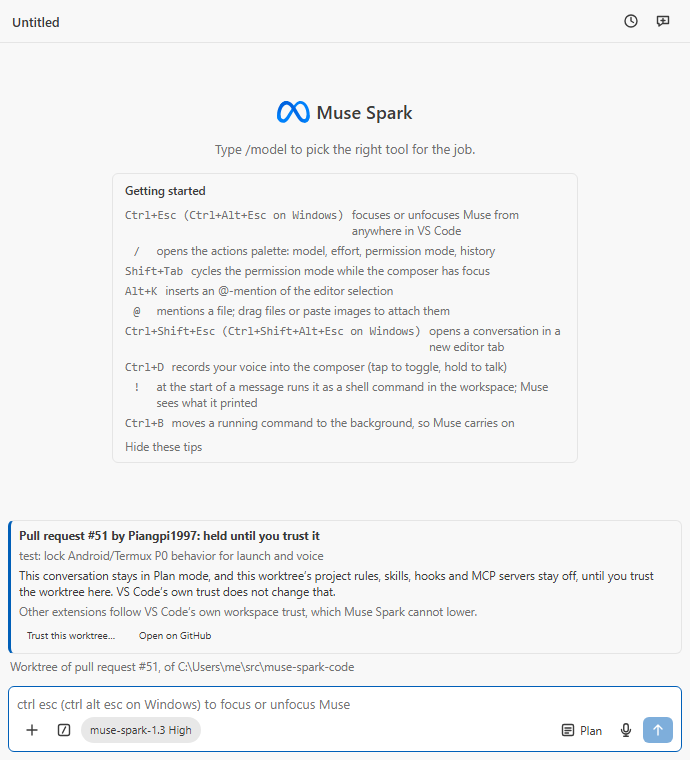
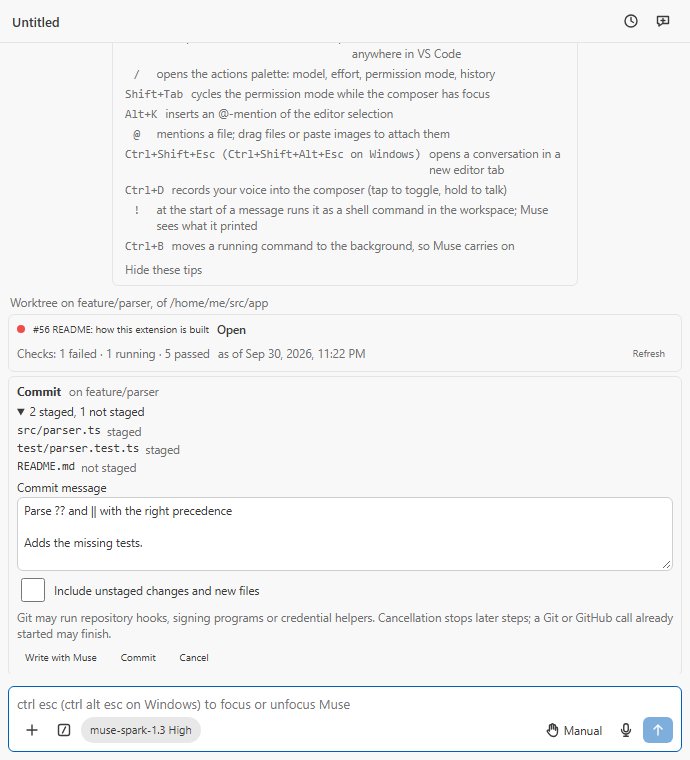
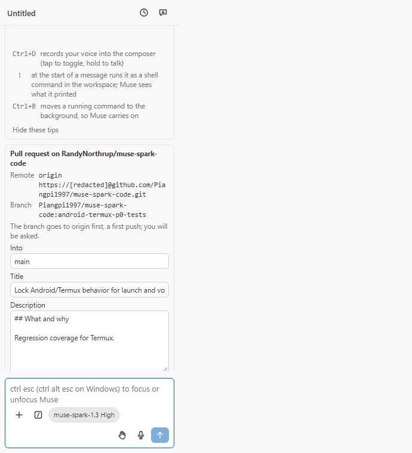

# M71: git and pull requests

Recorded 2026-09-28 on branch `feature/m71-git-prs`, from main `c42c4d5`.
PLAN.md D49 and M71.

## Resumed lane, 2026-09-30 — current source proof

Continued the existing dirty port at `1fd98aaf`. The prepared source tree
`754082e651`, archive manifest and restored PR32 handoff were read; no WIP
was restarted. The handoff's eleven findings concern the M72 correction
batch. Preserve its checkpoint/memory composition, final shell callback,
no-launch provenance and native canonical-root/long-path repairs when joining
the current candidate. The shared English build change is isolated in first
commit `28cd4876`; its runtime, packaging, sizes and five gate-fire records
are in [shared-ui-text.md](shared-ui-text.md).

Current-source findings and repairs:

| Finding                                                              | Repair                                                                                                               | Evidence                                                                                     |
| -------------------------------------------------------------------- | -------------------------------------------------------------------------------------------------------------------- | -------------------------------------------------------------------------------------------- |
| Push calls status after trust ends during checkpoint admission       | Check captured operation and owner before the first Git API entry inside admission                                   | conversationGit.test.ts fails before repair, then 62 cases pass                              |
| PR fetch and worktree checkout bypass checkpoint process admission   | Forward the existing window admission into checkout; recheck trust and physical owner inside both admitted callbacks | Four added regressions fail before repair; checkout and real-filesystem suites pass 39 cases |
| Portable controller's type import reaches vscode through Git adapter | Keep the surface and required method contract in the existing controller; adapter implements that injected contract  | Normal host-API gate first fails on the import chain, then passes with zero problems         |

Five typechecks pass on the repaired source. Windows Node 24.20.0 and npm
11.19.0 were observed. Tests use the real worktree short name
`C:\Users\Randy\Coding\MU26D9~1\temp\tests` for TEMP/TMP, so the genuine
8.3 compatibility test executes rather than skipping. A process-local Git
discovery ceiling at that fixture root prevents a non-repository test from
discovering the enclosing lane repository. No machine setting changed.
The complete pre-merge owning batch passed 824 tests in 29 files, zero skips,
including the existing Model API bundle runtime suite. The command ran all
28 changed unit-test files plus `test/unit/modelApiBundle.test.ts`; log:
`dist/lane-m71/owning-before-merge.log`.

### Current-source red drills

These receipts bind the admission/ownership source before the final unchanged
error-limit relocation. The relocated limit does not alter a drilled guard;
fresh final checks below cover the later source.

Normal complete owning test files ran for every mutation. Each green and
restored run exited 0; each semantic red exited 1. Every source file was
restored byte-exact in `finally`, with matching SHA-256. Logs and restoration
receipts are in this worktree's ignored `dist/lane-m71/`.

| Mutation                                          | Red failures | Intended failure                                                  |
| ------------------------------------------------- | -----------: | ----------------------------------------------------------------- |
| Remove push's first admitted current check        |            1 | status API call occurs after trust ends                           |
| Bypass PR fetch and checkout admission            |            4 | admission is never entered; fetch/checkout wrongly start          |
| Omit foreign-checkout configuration overrides     |            4 | required filter's native canary executes; override contract fails |
| Omit lexical-root physical identity check         |            5 | changed junction permits foreign API/native calls                 |
| Allow an observed owner loss to revive            |            1 | restored junction revives old consent                             |
| Use canonical basename for own-PR destination     |            1 | first.worktrees appears instead of own-alias.worktrees            |
| Honor VS Code trust while worktree remains held   |            1 | project configuration wrongly becomes available                   |
| Compare canonical API root against raw short root |            1 | genuine short/long positive refuses the same directory            |

Two initial drill-harness encoding failures and one incorrect diagnostic
label were corrected; their source edits were restored. They are setup
failures, not semantic red receipts. No production gate or assertion changed.
The installed feature-delivery package was located through its junction;
native stack inventory succeeded. Its separate ledger validator remains
deferred under the existing owner decision against another planning layer.

The POST 201/GET schema decision, GitHub `repo` scope and translated PR,
push and held terminology remain as recorded. No live capture, paid turn,
remote Git/GitHub write or publication occurred. Complete quality, independent
review, four-machine and actual editor/distribution gates remain with the
lead as required by `common.md`.

### Final joined-tree checks

Merge `7decc32c` contains current candidate `669e8301`. The join preserves
all fourteen locale tables and both controller fixture options. The escape
register keeps the current shell `startProcess` reason and M71's Git API
predicate row; the host record was regenerated from the joined source.
The hook/compiler caught the removed `displayRoot` local; Git now receives
M72's selected lexical `workspaceRoot`, while checkpoints alone use their
canonical root. That failed compiler log remains in the lane evidence.

All checks below exited 0 on the final joined source:

- `npm run typecheck`: all five projects.
- ESLint with `--max-warnings=0` over changed JavaScript/TypeScript files.
- Prettier `--check` over all changed supported files. The initial `npx`
  invocation exceeded Windows' shell command limit; invoking the same
  installed Prettier CLI through Node checked every path successfully.
- `npm run deadcode`, `npm run cycles`, `npx --no-install jscpd`: no dead
  code, cycles or clones.
- `npm run check:l10n`: fourteen tables, 103 manifest strings and 341 source
  files, zero problems. `npm run check:host-api`: zero problems.
- `npm run build`: every size, split, host-global and notice check passes.
- All 29 owning unit files: **826 passed, zero skipped**. Includes the real
  Git/filter/hook/junction fixtures, genuine short-name test, checkpoint
  command/worktree suites, controller and Model API bundle runtime.
- `node scripts/a11y.mjs git-held git-commit git-pr git-pr-narrow`: all
  sixteen pages across the four themes, zero violations, undecided rules,
  exemptions or missing results. Axe could not measure 68 scrolled/covered
  elements; this remains its documented limit.
- Final ACP tarball packed and installed with offline `npm ci`. The
  shared-table runtime check passed for the actual extension/Model API
  bundles and installed ACP `--help`. Tar listing and `vsce ls
--no-dependencies` both include `uiText.js`. The first GNU tar invocation
  misread the Windows drive colon; `--force-local` listed the same archive
  successfully. Tarball SHA256:
  `f16e838720b674398e19f3fcdd7074f6e3763afb80ae8583135e4126cd21a8cc`.

| Final production artifact |   KiB |         Cap KiB |
| ------------------------- | ----: | --------------: |
| extension.js              | 567.5 |             600 |
| modelApi.js               | 327.9 |             400 |
| checkpointStore.js        | 119.3 |             225 |
| uiText.js                 |  82.2 |             100 |
| planMarkdown.js           | 139.0 |             150 |
| searchWorker.js           |  15.2 |              50 |
| pageWorker.js             | 201.2 |             300 |
| webview/main.js           | 801.0 |             900 |
| webview/main.css          |  39.7 | no separate cap |
| acp.js                    | 719.4 |             850 |

Fresh `harness-shots` renders were independently inspected and replace
`m71-held.png`, `m71-commit.png` and `m71-pr-narrow.png`. The 300 px PR form
wraps its facts, keeps labelled fields within the panel and scrolls its
long body. The held card, consent text and composer remain readable. These
are fake-host browser screenshots, not a real VS Code activation receipt.

The final source is ready for the lead's independent review, complete
quality/coverage/security checks, real VS Code integration, four-machine
and hosted gates. No in-lane implementation blocker remains. Live successful
POST capture remains the previously accepted limitation; no new capture or
owner decision was substituted. Local logs are in `dist/lane-m71` and older
failed/historical receipts remain explicitly separate.

The final policy pass moved the existing `STDERR_SHOWN_CHARS = 1000` from
the Git adapter into shared constants, keeping its name, value and behavior.
Every serial source check above was rerun after that relocation: all pass,
including 826 tests with zero skips, and the sizes are unchanged. All five
bundles in the installed ACP tarball match the final production files
byte-for-byte; its runtime smoke passed again. The UI assets are unchanged.

## Previous-run checkpoint, 2026-09-30 — historical bounded verification

Recovered the existing index/working-copy port on `feature/m71-git-prs`,
starting at `1fd98aaf`, without resetting or reapplying the older WIP.
Read-only sources were the prepared M71 integration tree and the archived
M71 manifest; previous physical-owner and native-filter receipts remain
historical. Node 24.20.0, npm 11.19.0, Windows host. No dependency, existing
budget, timeout, threshold or rule level changed.

Initial checks: five typechecks passed; 811 tests passed in 28 owning files,
with one existing genuine short-TEMP test skipped in the long TEMP context.
The OS returned the real worktree alias `C:\Users\Randy\Coding\MU26D9~1`.
Running the admission and filesystem suites with that alias as TEMP passed
all 68 tests, including the short-name case (zero skips).

The push admission regression first failed with a real recorded `status`
API call after trust was revoked. The added current-operation check now
refuses that entry; the owning suite passes. The initial production build
failed at 648.4/600 KiB activation and 409.3/400 KiB Model API. Splitting the
existing immutable English fallback into `dist/uiText.js` removes duplicate
data; each bundle retains its own installed table and locale. The ACP
package copies that file. Production build now passes: activation 566.9,
Model API 327.8, checkpoint store 115.8, English table 82.1, plan reader
139.0, search worker 15.2, page worker 201.2, webview 800.9 and ACP 719.3 KiB.
The table has its own 100 KiB gate; all old budgets are unchanged.

Evidence logs live under this worktree's ignored `temp/m71-*.log`. Exact
restoration drills, final release-candidate join and owning gates are still
pending at this checkpoint. The lane brief explicitly forbids full quality,
network/live calls and publication; the lead must run full quality and
platform/installed review. The named PR32 handoff file is missing, so its
separate finding list remains unverified. The installed feature-delivery
skill has no supplemental scripts/docs; its structural validator is deferred.
Owner choices remain POST 201 parsed with the captured GET schema, `repo`
authentication scope, and the recorded translations of PR/push/held.

## Independent source repair, 2026-09-30 — bounded proof complete

### Alias destination and real short-name follow-up — bounded proof complete

Short-name review retains the existing async `canonicalPath` for owner
capture. The temporary native-port change is reverted after actual Host
evidence showed both async and native resolution expand the genuine alias.
The filesystem suite keeps its real short-TEMP/API-long root positive;
`systemPath` proves long spelling and `realpathSync` proves the actual alias,
without fake rewriting. Lean-source gates and meaningful owner,
sticky-loss and lexical-location drills passed below. No old-async defect or
native-to-old-async red is claimed, and no NTFS setting changes.

First Host tree `0eaa1230` completed a fresh exact-lock install and all five
typechecks. The 28-file owning suite passed 1,146 tests but failed the new
fixture's genuine-alias assertion: `mkdtemp` returned long spelling for its
child even though the runner proved a genuine short-TEMP alias. The fixture
now uses that owned TMP alias directly and retains the JavaScript/native
inequality assertion. No product guard, assertion or gate was weakened.
The failed receipt is preserved before the corrected fixture's fresh gates.

The follow-up `6ad0b6b8` still passed five types and 1,146 owning cases but
failed the assumed **async** realpath inequality. On Host Node 24.20.0,
`fs.promises.realpath` and `systemPath` both expand the genuine short path;
the existing runner's contrasting `javascript` value uses `realpathSync`.
The fixture now uses that synchronous API to prove the actual short alias
before accepting the API's long root. Both failed receipts remain intact.
These were fixture setup failures, not deliberate production mutants; they
are **not** counted as semantic reds. The old async implementation is not
confirmed defective on this runtime, so the unnecessary production change
is reverted before the next proof.

Corrected fixture tree `81dfcf76` passed all five types, **1,147 tests in 28
owning files** and all 14 localization tables. Scoped lint then caught one
void-expression test arrow; braces repair it without an ignore or waiver.
That failed receipt stays intact. The subsequent lean-source gates certify
only their exact source, preserving the positive fixtures and this repair.

After the frozen `5466687d` bounded proof, review restored the existing own-PR
destination semantics: the selected lexical workspace root names its sibling
folder and stored `repositoryRoot`; a separate captured canonical cwd handles
native Git. The complete physical-owner guards are unchanged. A real alias
positive fixture asserts the destination, original-root record and both
canonical native entries and passed on `81dfcf76`, then on lean `5e4956f2`.
Prior receipts certify their exact snapshots; root final gates remain open.

### Final lean Host proof

Exact source `5e4956f2bcd3353f553403eebc1778818ff80089` retains the
original async resolver and physical/sticky/consent guards. Owner module
SHA256 is again byte-identical to the earlier proof:
`34be33e28ca6b8c6ccb75dd4fdf55de9b177875b7719b4c45f81c8510e2ed9ca`.
On Host Windows Node 24.20.0 it passed **five typechecks, 135 affected tests
in 12 Git/alias files, owned lint, whole-repository duplication and all
14 localization tables**. The earlier fresh exact-lock install and installed
inventory were preserved; each source overlay checks predecessor, repaired
tree and clean before/after state. Normal receipt SHA256:
`f9cd6b5884bc84d6d6d2e2c32399de3c009f409ba00b37ecc8a115f28d13783d`.

GetShortPathNameW proved an owned genuine 8.3 TEMP alias without changing
NTFS. The short/long positive ran rather than skipped: its native API root
and captured canonical root agree, while sync realpath retains short
spelling. The own-PR positive preserves the lexical sibling folder and
stored `repositoryRoot` while both native entries use canonical cwd.

Four external-copy controls showed **green → red → restored green**:

| Control removed/changed                                                 | Observed failure                                                                                                    |
| ----------------------------------------------------------------------- | ------------------------------------------------------------------------------------------------------------------- |
| Own-PR location uses canonical basename                                 | Opened `first.worktrees/pr-51` instead of `own-alias.worktrees/pr-51`.                                              |
| Owner checks omit lexical root                                          | Actual changed-junction native/API admission assertions fail.                                                       |
| Sticky observed-loss return removed                                     | Restored link wrongly revives the old owner.                                                                        |
| API root compared to raw short name rather than captured canonical name | Genuine short/long positive throws `GitUnavailableError`; its baseline and restored runs each pass the actual case. |

Three-control receipt SHA256:
`dc2d61c4cdec0817a791558ab933571857354b37c1f93e9cd3c3126a5efcc4a0`.
Short-positive control receipt SHA256:
`61b52a4b31e662e0541bd5fd60b05ac15cde60a093bb3272337d9be2621cae15`.
Logs and restored hashes were independently read and checked. No canonical
source was mutated by a drill; no timeout/import failure counted as red.
The two mistaken fixture setup assertions are preserved and not counted.

Artifacts remain outside the checkout under
`%TEMP%/muse-goal-evidence-20260929/m71-currentmain-integration/host-native-0eaa1230`.
All owned workers/leases ended and the Host Windows slot was released.
Later docs-only edits are not the exact 5e49 proof tree. Latest-main
integration/ancestry, independent final review, root full quality, hosted CI
and installed/platform gates remain required; no Model API or credential-store
call, project commit, push or merge occurred during this proof.

### Main-bound checkpoint and physical-owner witness

Tree `57db24284b32cf61efa03f2684d8badad16fc6ea`, joined to main
`327094412dac315b1f8dcf971b014c6c69b27104`, passed five typechecks,
1,139 focused tests in 27 files, scoped lint, whole-repository duplication
and all 14 localization tables on the owned Windows fixture. Fourteen
semantic drills showed green → red → restored green in external disposable
source copies; their canonical source hashes were restored. These bounded
results are preliminary, not full quality or installed-host certification.

Independent native witness then held PR consent and retargeted a real
junction from repository A to B while cached HEAD/remotes/rootUri stayed
identical. The old implementation made three Git calls in B, wrote B's
`FETCH_HEAD` and opened its worktree. Witness receipt SHA256
`f74e5c33ef2cda1d8f969e09e58eb333486dd483f34ee73cb1962e90777fbc6b`
is retained beside the preceding successful checkpoint. That confirmed gap
requires repair; preceding green evidence does not certify physical ownership.

Repair tree `a2bcd5cabaa1dd0ac5dd444fcf59ea328b77a3de` binds physical
directory owners before repository lookup and validates the cached API root
against them. Original/canonical roots get fresh synchronous bigint identity
checks before API/native entry and after awaits, with sticky observed loss.
Native checkout uses the captured canonical cwd. Virtual adapters explicitly
inject test-only owners; production always captures the file system. Six
regressions cover real consent/native-entry junction changes, unchanged alias
checkout, sticky loss/restoration and API commit/push consent. Fresh bounded
Windows verification subsequently passed on the repaired fixture and final
entry audit, detailed below. Full quality and installed/platform gates remain
open.

### Final bounded physical-owner proof

Exact product tree `5466687dacdd1959da9e07774fb6b54e7f198373` passed
all five typechecks, **1,145 tests in 28 focused files**, scoped lint, all
14 localization tables and whole-repository duplication on Windows Node
24.21.0. It uses the previously fresh exact-lock installation (lock SHA256
`fe465a235f318b5c9e7557dead2ced3c1fb8a0803792a313def8898f37fa2f1e`)
and the proven native short-TEMP environment. Every overlay was bound to
its predecessor and repaired tree, with no unstaged/untracked source before
or after. Normal receipt SHA256:
`684a641f465f5ec58029dbf638c1c5cee5a1a3086374e32c130da89c728a4f62`.
Logs were copied back and their hashes independently checked.

The first physical repair's duplication gate caught one repeated test popup
recorder. Both native fixtures now share `checkoutNotices`; all assertions
remain. No ignore, threshold or rule changed. Final entry review also added
synchronous owner checks immediately before draft diff/log and before a log
failure can publish its fallback prompt.

Two new external-copy production drills each showed **green → red → restored
green**:

| Mutant                                                        | Actual red evidence                                                                                                                |
| ------------------------------------------------------------- | ---------------------------------------------------------------------------------------------------------------------------------- |
| Omit lexical-root identity check, checking only canonical cwd | Real junction consent/native-entry cases fail; a native worktree opens and API commit/push entry occurs despite the changed alias. |
| Remove sticky-loss return                                     | After real junction loss and restoration, the old owner returns true instead of remaining invalid.                                 |

Receipt SHA256:
`1b1ff381914d793c53f2501e4b286498ea1f8f9fb0a01b51cfee38992d810bd0`.
Every red is an assertion failure, not a timeout/import/transform failure.
Restored canonical owner source SHA256:
`34be33e28ca6b8c6ccb75dd4fdf55de9b177875b7719b4c45f81c8510e2ed9ca`.
The canonical checkout was never mutated by the drills. All workers ended;
the owned Windows slot and lease were released.

Evidence lives outside the checkout at
`%TEMP%/muse-goal-evidence-20260929/m71-currentmain-integration/main327-214ba2c0`.
Earlier successful 57db checkpoint, 14 semantic receipts, the confirmed native
ownership witness and intermediate failed duplication receipt remain intact.
These bounded results do **not** claim root's full quality, independent final
review, VS Code floor/latest installation, hosted CI or three-platform
certification. Later documentation-only edits require root's final gates too.

The newest source joins main `327094412dac315b1f8dcf971b014c6c69b27104`
(PR54) through the exact three-way content delta from `24ff09bc`. The early
old-main c316 snapshot, archive, binary patch and immutable blob inventory
remain under `snapshot-c3162098`. Its five typechecks, 768 focused tests
and 14 localization tables passed; two combined-guard lint errors were
repaired while retaining both checks around the picker await. Duplication
and semantic reds had not run. Those results do not certify this main join.
Current M68 Host/ToolIO/Plan-owner modules match main; the controller retains
captured original Plan recorders and M71 draft generations. No full host
class was copied across branches. Fresh main-bound evidence remains pending.

First early Windows tree `98d784034384817b8c954503a498040e2d402e40`
bound cleanly after a fresh exact-lock install and passed all five typechecks.
Its 23-file focused run passed 764 tests and failed one native clean positive
control: a clean-only required driver rejected the ordinary positive checkout
for lacking smudge. The fixture now permits that positive checkout, then
requires the real clean add. The negative clean lane also performs a real
safe add and checks raw indexed bytes/no marker. No assertion or gate was
waived; the failed receipt remains under `early-98d78403`. The repaired
source needs fresh focused and subsequent gate evidence before certification.

Repaired fixture tree `e44abef36720522b42c5634094015e49d9b6f172`
passed all five typechecks and all 765 tests in 23 files, including actual
absolute hook/filter positive and negative controls. Scoped lint then
reported 24 style/type-aware findings. They are repaired with current
await/ordering/narrowing conventions and the existing shell quote helper;
no rule or threshold changed. Source review also found subsection names
containing equals cannot be represented by `-c key=value`; these now refuse
before checkout without naming the key. Native/config-metadata regressions
and refreshed types/focused/lint/duplication/localization evidence are queued.

The current source starts from staged tree
`f9d676e5fa08320d7937d9497275e5be4b51834e` in
`muse-extension-m71-integrate`, preserving normal main `24ff09bc` and the
original native absolute-hook canary. The initial source-only handoff ran
no verifier; the early Windows results above supersede that status. No full
aggregate gate, model call or project commit has run during this repair.

Three concrete gaps are repaired in the existing owners:

- M32 read current project trust only before its first Git lookup. Worktree
  actions now check after pickers/confirmations and before every native Git
  entry, including forced discard. Closing activation also closes the
  existing project-trust callback. Native tests hold a base picker or dirty
  discard confirmation, revoke trust/ownership, and inspect actual branch,
  folder and uncommitted bytes.
- Foreign PR checkout suppressed only legacy checkout hooks. The existing
  bounded absolute Git runner now has a scoped untrusted-checkout lane:
  Git 2.36 or later, configuration names only, empty external filter
  commands/non-required passthrough, disabled discovered named hooks,
  fsmonitor, replacement objects and automatic maintenance. Final trust
  admission runs after metadata discovery, immediately before process entry.
  Ordinary commit/push Git keeps its existing program policy. Confirmation
  explains unfiltered stored content/LFS pointers and normal built-in
  conversions; accepting trust does not automatically rerun filters.
- Registry persistence previously used its existing-folder display view,
  dropping a PR record intentionally saved before native creation. Writes
  now serialize locally and use validated raw records; display filtering
  stays separate and explicit cleanup removes only its own folder record.
  Held publication tests inspect actual stored state across concurrent
  PR preparation/ordinary worktree writes, and verify the foreign hold stays.

The [Git attributes documentation](https://git-scm.com/docs/gitattributes)
describes missing/non-required filters as passthrough;
[Git convert.c](https://github.com/git/git/blob/master/convert.c) only starts
nonempty external commands. Empty clean/smudge/process command values
therefore skip executable filters. The [Git configuration documentation](https://git-scm.com/docs/git-config)
defines named hook disabling/event clearing and documents why boolean
fsmonitor controls require Git 2.36 or newer. These are source decisions,
not native receipts or a claim of byte-identical blobs after built-in
newline/ident/encoding conversion.

New native filter controls materialize exact PR program bytes at owned
absolute fixture paths. Each clean/smudge/process lane must prove
native execution through its marker, and the scoped foreign checkout must
create the useful held worktree with stored unfiltered content and no marker.
The process positive control intentionally fails its handshake after writing
its marker; successful protocol conversion is not claimed. The previous
absolute post-checkout positive/negative canaries remain required.

Queued semantic red drills: restore ordinary foreign checkout (actual
filter marker/required-filter failure assertion); remove current M32 trust
checks (actual branch creation or dirty-byte deletion); restore filtered
registry reads or unsynchronized writes (actual pending metadata lost).
Mutation source lives outside checkout; restore exact byte hashes and rerun
focused green before current-tree full quality and platform certification.
The earlier six valid red receipts and surviving relative-hook mutant
remain historical; none certifies these new repairs. Cross-process config
and filesystem changes can still race process entry, and an already-entered
Git operation cannot be retracted by a later trust change. No new filesystem
transaction, distributed registry lock or literal-blob publication claim
is made.

## The request

From finished work to an open pull request without leaving the panel (D49,
wave 2): a commit message for the conversation's changes, commit and push
through VS Code's Git, a pull request through VS Code's GitHub sign-in as a
draft or ready, its status linked to the conversation, a conversation in a
worktree, and "open a pull request in a conversation" that holds someone
else's code in Plan mode with its project configuration off until the user
trusts it in the extension's own card.

## What was built

- **The core** (`src/core/git/`, no `vscode`):
  - `pushPlan.ts` decides a push before anything runs. It refuses a detached
    HEAD, a branch behind its upstream, and a branch, upstream or remote name
    that starts with `+` or `-` or holds `:` or whitespace. A first push gets
    `-u`.
  - `github.ts` is the REST client: the account, a repository and its fork
    parent, a pull request, the open one for a branch, creation, and a
    commit's check runs and statuses. Every reply is parsed with a schema
    from the capture below, and the token is never logged.
  - `githubRemote.ts` reads the remote forms git accepts for github.com and
    masks an `https` user-info part.
  - `gitText.ts` holds the draft prompts and reads the replies back.
  - `pullRequestRef.ts` reads `51`, `#51` or a pull request's page and
    picks the remote to fetch from.
- **Worktrees** (`src/core/worktreeConversations.ts`, the piece M77 reuses):
  - Each worktree the extension makes is recorded in global state.
  - A pull request by someone else goes under
    `<globalStorage>/pr-worktrees/<n>-<digest>`.
  - A window is held when its folder, as given or resolved through links,
    is under that root. Only a record with `trustConfirmedAt` lets it go.
- **The host** (`src/host/git/`):
  - `gitExtension.ts` is the typed subset of VS Code's Git API version 1.
    Its `push` has three parameters, so no force mode can be passed.
  - `githubSession.ts` reads `vscode.authentication.getSession('github',
['repo'])`: `silent` for status, `createIfNone` when the user acts.
  - `ConversationGit` (one per conversation) runs the commit and pull
    request forms, the push modal, pull request creation and linking, the
    status reads, and the drafts.
  - `pullRequestCheckout.ts` fetches through the Git extension, checks the
    head commit, adds the worktree detached, and runs the card's trust
    confirmation.
  - `WindowHold.allowsProjectConfiguration` is the single rule every place
    that loads the project's configuration now reads:
    - Muse Code's `--trust-workspace`;
    - the Model API's rules, skills, hooks, MCP servers, memory and shell;
    - `muse skills` and `muse init`.
- **The controller.** A held window starts and stays in Plan (Modes menu,
  Shift+Tab and the setting are refused) and runs no `!` command.
  - A `sendMessage` with `gitDraft` adds the draft prompt as a second text
    part of the user's own turn.
  - The reply to that turn fills the form. A failed, cancelled or
    restart-ended turn gives the button back.
- **The panel.** `GitPanel.tsx` shows:
  - the held card, with **Trust this worktree…**, **Open on GitHub**, and
    the note that other extensions follow VS Code's trust;
  - the worktree line;
  - the pull request strip: state, checks, **Refresh** or
    **Sign in to GitHub**;
  - the commit and pull request forms.

  A palette group, **Git and pull requests**, holds `/commit`, `/push`, `/pr`
  and `/checkout-pr`. The command palette gains **Open a Pull Request in a
  Conversation…**.

- **Strings**: 134 keys in `en.ts` and all 14 UI tables (translated by three
  parallel agents, merged by script), one manifest title in all 15 manifest
  tables; `check:l10n` reports 0 problems.

## Wire evidence (AGENTS.md rule 13)

- **GitHub REST, captured 2026-09-28** with `gh api -i` against
  `RandyNorthrup/muse-spark-code`, API version `2022-11-28`. The captures
  are kept in `test/unit/helpers/githubCapture.ts` and are read-only; no
  model call was made.
  - `GET /user`.
  - `GET /repos/…` and its fork `Piangpi1997/muse-spark-code`, with its
    `parent`.
  - `GET /pulls/49` (merged), `/pulls/51` (open, by another account, from a
    fork) and `/pulls/56` (open, by the owner).
  - `GET /pulls?head=owner:branch&state=open`.
  - `GET /commits/{sha}/check-runs`: one run in progress; failed and
    skipped runs (`1ae3604f`); a cancelled run (`19e74b07`); and none (the
    fork's head, whose workflows awaited approval).
  - `GET /commits/{sha}/status`: none (`pending`, count 0), and a failing
    combined status (`microsoft/TypeScript` `df1a31e`).
  - `GET /pulls/999999`: 404.
  - `POST /pulls` refused twice with 422 before creating anything: an
    invalid head, and "A pull request already exists".
- **Not captured live: a successful `POST /pulls`.** Capturing one opens a
  real pull request, so it was not done. GitHub documents the 201 body as
  the same `pull-request` object as `GET /pulls/{n}`. The client parses it
  with the schema captured from that `GET`, and the fake GitHub answers
  creation with the captured `#56`. This is an owner decision (see the
  report): whether to capture one on a scratch repository.
- **VS Code's Git API** was read from `extensions/git/src/api/git.d.ts` at
  1.99.0 and 1.105.0; the members the extension calls are the same in both.
  `push`, `commit`, `fetch` and `log` were read in `git.ts`,
  `repository.ts` and `api1.ts` at 1.99.0. Integration tests run commit,
  push and log through the real API on VS Code 1.139.1 and on the 1.125.0
  floor.

## Tests

New suites (unit, vitest):

| File                             | Tests | What                                                                                                                                                                                                                          |
| -------------------------------- | ----- | ----------------------------------------------------------------------------------------------------------------------------------------------------------------------------------------------------------------------------- |
| `pushPlan.test.ts`               | 21    | fast-forward only; behind, `+`/`-`/`:` names and option-like remotes refused; first push with `-u`; remote choice                                                                                                             |
| `github.test.ts`                 | 14    | every call against the captured replies, the headers, 401/403/404/422/network, a reply of another shape refused, checks counted                                                                                               |
| `githubRemote.test.ts`           | 32    | the github.com remote forms, other hosts refused, user-info masked                                                                                                                                                            |
| `gitText.test.ts`                | 7     | prompts mark the repository's text as data in an unclosable fence, cut and counted; replies read and masked                                                                                                                   |
| `pullRequestRef.test.ts`         | 20    | numbers and pages read, the remote chosen                                                                                                                                                                                     |
| `worktreeConversations.test.ts`  | 12    | the hold by location in every spelling, only a confirmed trust lets go, the registry                                                                                                                                          |
| `conversationGit.test.ts`        | 34    | commit, push (asks, three arguments, refusals, a second press ignored), pull requests (form, existing, fork parent, masking, refusals), status and checks, Restricted Mode and the held window, drafts inside the user's turn |
| `pullRequestCheckout.test.ts`    | 9     | someone else's pull request held under storage, the user's own beside the repository, recorded before the folder, refusals, the card's confirmation                                                                           |
| `pullRequestCheckoutGit.test.ts` | 1     | real git: `pull/51/head` fetched and checked out detached into a folder that did not exist, no branch made                                                                                                                    |
| `gitState.test.ts`               | 6     | the webview's forms: drafts to the right form, done and failure, a clear                                                                                                                                                      |

Extended suites:

- `conversationController.test.ts` (5):
  - a held window's Plan mode, its `!` refusal and its release;
  - a draft's prompt part, the form filled from the reply;
  - the button given back after a restart or a refusal.
- `App.test.tsx` (4): the palette rows, both forms and the held card
  through the real webview.
- `museCodeBackendManager.test.ts` (1): `muse serve` without
  `--trust-workspace` while held, in a folder VS Code trusts.
- `modelApiTools.test.ts` (1): a conversation in a worktree cannot read,
  write or edit the main checkout beside it.
- `redact.test.ts` (8): GitHub tokens, private key blocks, AWS key ids,
  Slack tokens, and the near misses left alone.
- `paletteRegistry`, `manifest`, `worktreeCommands` (the new worktree is
  recorded), `worktreeFeatures` and `cliFeatures` were updated.

The integration suite gains `VS Code git extension API (M71)`: a temporary
repository with a local bare remote, a new file committed with `all` and no
post-commit command, pushed with three arguments, its upstream then set.
It passes on VS Code 1.139.1 and on the 1.125.0 floor: 11 passing on each.

The harness gains `git-held`, `git-commit`, `git-pr` and `git-pr-narrow`.
The accessibility gate reports 16 pages (4 scenarios × 4 themes), 0
violations. Screenshots:

## Live check

`run-live-modelapi.ps1 -Filter case19` ran `case19 git drafts` in the live
Model API sweep. It used `muse-spark-1.3-contributor` in an empty temporary
workspace.

- **Requests:** 2 model attempts, both `200`; est. $0.0008; 7,666 tokens in
  (3,313 cached), 1,638 out.
- **Commit message:** the model's reply was `"Fix precedence order of ?? and
|| in parser"`. `commitMessageFrom` read it as a subject of 44 characters.
- **Pull request:** the reply split into the title `"Fix precedence order
of ?? and || in parser"` and a 204-character description.

## Drills

Each guard was broken in place, its suites run, and the file restored
byte for byte (SHA-256 checked, never through git):

| Drill | What was broken                                                           | Result            |
| ----- | ------------------------------------------------------------------------- | ----------------- |
| F1    | A branch behind its upstream is pushed (force-push refusal)               | exit 1, 2 failed  |
| F2    | Any name counts as plain: `+main`, `-f`, `a:b` reach git                  | exit 1, 12 failed |
| F3    | A fourth, force argument is passed to the Git extension's `push`          | exit 1, 3 failed  |
| F4    | The push goes without the user's yes                                      | exit 1, 2 failed  |
| H1    | A held window's `muse serve` gets `--trust-workspace` when VS Code trusts | exit 1, 1 failed  |
| H2    | No window under the pull request root is held                             | exit 1, 8 failed  |
| H3    | A record not confirmed in the card (`isHeld: false`) lets the hold go     | exit 1, 1 failed  |
| H4    | A held conversation starts in the configured mode, not Plan               | exit 1, 1 failed  |
| H5    | A held conversation runs a `!` command                                    | exit 1, 1 failed  |
| R1    | git runs in Restricted Mode                                               | exit 1, 1 failed  |
| C1    | Credential-shaped text goes out unmasked                                  | exit 1, 3 failed  |
| C2    | GitHub tokens are no longer redacted                                      | exit 1, 6 failed  |
| G1    | A GitHub reply of another shape is taken                                  | exit 1, 1 failed  |
| G2    | The checkout's record is written after its folder, or not at all          | exit 1, 3 failed  |

## Gate

See the gate tail in the branch's report (rig: Kubuntu, `rig-gate.sh`).

## Resume review, 2026-09-29

### Current-main integration in progress

The isolated `integrate/m71-resume-20260929` worktree starts from original
WIP `cfa2bc68` and normally merges approved main `24ff09bc`. The original
checkout, its 37 changed tracked files, three new test files and existing
untracked `.vitest/` directory remain intact. An external binary patch and
per-file SHA256 inventory preserve that source before integration.

Readiness review found no unrelated ancestor feature payload in the M71
delta against its true `c42c4d5f` merge base. Twelve shared-file conflicts
were reconciled: current main's ACP, code intelligence, web fetch, plan
reader, Node 20 repairs and rules are retained; M71's Git controls, scenarios,
documentation and real-Git tests are added. The controller keeps M79's
`SendOutcome`, brief/todo rollback and attachment handling while binding
Git drafts to their generation identity and edited base. Three consent
keys are present in all 14 locale tables. Live test numbering now separates
M71's draft case 21 from main's code intelligence case 19 and plan case 20;
no live case has run during this integration.

This is implemented source awaiting verification, not a new passing gate.
The first isolated Windows VM compiler passed host and webview, then caught
two late-WIP agent-message fixtures with `id` instead of the canonical
`itemId` and required `status`; these fixtures were corrected. Further seam
review found M79 brief startup could replace a held PR's Plan ceiling, and
M32 worktree actions still used raw VS Code trust. Brief modes now retain
the hold; the existing project-trust callback gates worktree Git and new
M69 IDE web-fetch offering. Regressions and fresh proof remain pending on
the repaired tree; the earlier failed compiler receipt is preserved.
The native feature-delivery stack inventory succeeded. Its structured
ledger validator remains deferred under the existing owner decision below;
no parallel ledger or new design layer was introduced. Next: bounded types,
focused tests and real temporary Git regressions on an owned Windows VM
checkout, meaningful disposable red/restored-green drills, independent
review, then root's exact-tree full gates and hosted checks. Grok is
explicitly skipped per the owner's no-credit instruction.

Resumed unverified WIP `cfa2bc68` in `muse-extension-m71`. The existing
untracked `.vitest/` directory was preserved. The older Kubuntu gate on
`3af80e40` remains historical; it certifies neither that WIP nor the resumed
candidate. No dependency, threshold, timeout, rule level or ignore changed.

Readiness review used the existing D49/M71 contract, source, callers,
GitHub captures, host/webview tests and certification. The outcome and
permission rules were already settled, so this extends the existing
adapters and forms. The `feature_delivery` workflow's separate structured
ledger migration was not added: the owner requires the canonical plan and
existing work to continue without extra design layers. Its structural
validator is not claimed as passed; repository gates remain mandatory.

Three classes were reviewed in one pass; each concrete finding was mapped
to the existing responsibility and a regression:

| Class                             | Finding                                                                                                                                           | Existing code completed                                                                                                                                                                  | Evidence                                                                                               |
| --------------------------------- | ------------------------------------------------------------------------------------------------------------------------------------------------- | ---------------------------------------------------------------------------------------------------------------------------------------------------------------------------------------- | ------------------------------------------------------------------------------------------------------ |
| Concurrency and lifecycle         | Push consent could outlive HEAD, upstream, remote, trust or conversation changes. Cancel closed only the webview.                                 | `ConversationGit` checks immutable repository state and conversation lifetime across waits; Cancel invalidates the operation; busy fields freeze.                                        | Modal/picker race cases for HEAD, commit, upstream, remote, trust, session, cancellation and disposal. |
| Concurrency and lifecycle         | An old draft acknowledgement/failure could attach to a newer generation; the first session attachment must preserve the same conversation's form. | Generation identities are carried by the controller's send path; clear/switch invalidates while first attachment preserves the form.                                                     | First-session and old-acknowledgement regressions.                                                     |
| Concurrency and lifecycle         | Concurrent conversation-link writes could overwrite one another.                                                                                  | `PullRequestLinks` serializes its existing persistence writes and excludes inherited members; one checkout runs per window.                                                              | Delayed persistence and inherited-member cases.                                                        |
| Trust, boundaries and confinement | Creation rechecked only the PR head name, allowing a changed remote/fork destination to receive the previously confirmed body.                    | The host requires its own form and binds repository, remote, head and fork destination to it before push/POST. An ancestor repository outside the selected root is refused.              | Missing form, changed destination and changed fork-parent cases.                                       |
| Trust, boundaries and confinement | Checking that an approved old commit existed did not prove it was the fetched PR head.                                                            | Checkout compares `FETCH_HEAD` with GitHub's captured head and rechecks source trust/remotes after waits.                                                                                | Fake and real local-Git stale-head cases.                                                              |
| Trust, boundaries and confinement | A relative `core.hooksPath` could execute a PR's post-checkout hook before its trust card.                                                        | The existing worktree-add call disables checkout hooks with Git's null path for its platform.                                                                                            | Real local-Git fixture includes the PR hook and verifies its marker is absent.                         |
| Trust and privacy                 | Authentication provider error names and returned errors could identify an account or echo a token.                                                | Provider failures log fixed words; GitHub failure text masks the exact token and dynamic failure details stay in the panel.                                                              | Token-reader and GitHub-error regressions; existing path-log cases retained.                           |
| Failure paths, UI and docs        | The commit could include a changed index/diff/new file after its form was shown. Git diff omits untracked bytes.                                  | Final consent names message, branch and file scope, with hooks/signers/helpers disclosed. Current diffs and streamed new-file fingerprints are compared immediately before the API call. | Changed staged set/diff cases and actual same-length untracked-file edit, link and cancellation tests. |
| Failure paths, UI and docs        | Draft generation used the original base after the user edited it.                                                                                 | The validated internal message carries the edited base into the existing draft path; unsafe names are refused.                                                                           | Host prompt, webview and controller routing cases.                                                     |

The last completed focused checkpoint before the final fingerprint and
generation-identity edits was 174 passing tests across
`conversationGit.test.ts`, `pullRequestCheckout.test.ts`,
`pullRequestCheckoutGit.test.ts` and `App.test.tsx` on Windows. The checkout
cases exercised real temporary Git repositories, detached worktrees,
`FETCH_HEAD`, and a PR-supplied executable post-checkout hook. That result
is scoped to that earlier checkpoint, not the final tree. Localization then
passed all 14 tables (94 manifest strings, 251 source files).

Final focused checks and disposable source mutations are pending the
root agent's verification slot: PR #32's full gate is running alone to
avoid Windows process contention. No live remote push, PR creation, model
call, project commit or release was performed. Fresh latest-main
integration, independent review, `npm ci`, full `npm run quality`, staged
secret scanning and hosted platform checks remain required before merge.

Limits: the Git API does not support retracting an operation already
submitted. Rechecks stop later steps; a completed Git/GitHub side effect is
not undone. External tools may still change the repository after the final
check while Git itself runs. The GitHub successful-POST live capture and
all broader live/platform evidence remain as described above; nothing here
turns an old capture or gate into new certification.

## M71b independent review repair, 2026-10-01

This lane starts from clean `feature/m71-git-prs` at
`badbe5bb91112ddb4229c60b6591abd192ea532f`. Its authoritative inputs are
`M71b.md`, `common.md`, `RV71.report.md`, AGENTS.md, CLAUDE.md and PLAN.md M71.
The M71b prohibition on any branch merge overrides common.md's candidate-join
step. The lane forbids full quality and live/paid calls; the lead retains
those gates. Rig snapshot transfers use only the explicitly supplied runner.

Readiness review accepted all six findings. Existing trust records, first-folder
activation, the bounded Git runner, form generations, Git-extension fetch
admission and captured GitHub response parser are the canonical repair points.
No new dependency, host API, setting, UI component, bundle or architecture layer
is required. The feature-delivery package was resolved through its junction;
its native inventory succeeded. The prior owner decision to keep this canonical
plan without a parallel structured ledger remains in effect; its structured
validator is deferred, not passed. Observed local tools: Windows, Node 24.20.0,
npm 11.19.0, Git 2.52.0.windows.1, TypeScript 6.0.3.

The first verification checkpoint on Kubuntu had 127 passed
in six complete files, zero skips. Its native conditional-include fixture proves
that the source config omits the linked-worktree driver, the unguarded positive
control executes its marker, and guarded checkout leaves the marker absent.
The fixtures also cover root/nested attributes, attribute macros, shared info
attributes and effective global attributes without changing shared file bytes.
Initial test failures were an incomplete mock checkout argument list and the
old capitalization of the English commit-ID fallback; both fixtures now match
the required behavior. Drill startup/matcher errors are retained as harness
errors, never credited as semantic reds. Final receipts follow below.

### M71b semantic drills and native platform proof

All twelve production mutants below ran the same six complete owning files
on Kubuntu: `worktreeConversations.test.ts`, `conversationGit.test.ts`,
`github.test.ts`, `git.test.ts`, `pullRequestCheckoutGit.test.ts` and
`gitActivationWiring.test.ts`. Each baseline and restored run exited 0 with
127 tests, zero skips. Every mutant exited 1 for its named assertion; source
bytes were restored in `finally` and independently checked by SHA-256.
The fresh logs and mutation fingerprints are retained under `temp/m71b/`.
No tests were filtered, skipped, loosened or assigned a longer timeout.

| Drill             | Removed or broken behavior                                  | Regression test name                                                                                                                                                                      | Red / restored |
| ----------------- | ----------------------------------------------------------- | ----------------------------------------------------------------------------------------------------------------------------------------------------------------------------------------- | -------------- |
| R1-root           | Restore the old cross-root record search                    | `keeps each root held independently of trusted-root order (%s)` (both orders, both record orders, single roots)                                                                           | 1 / 0          |
| R1-first-folder   | Activation passes all folders again                         | `gives the window the folder as selected, and its own closing as its activation`                                                                                                          | 1 / 0          |
| R2-selectors      | Attribute-derived driver names are not added                | `disables destination-only conditional filters selected by foreign tree attributes and macros`; `disables filters from info and effective global attributes without changing their bytes` | 1 / 0          |
| R2-unsafe-name    | Remove the safe-name predicate                              | `refuses an unsafe filter selector driver"unsafe found only in the foreign tree`                                                                                                          | 1 / 0          |
| R3-retire         | Successful commit leaves epoch and pending generation alive | `retires the first commit form draft after a manual commit before opening second.ts`                                                                                                      | 1 / 0          |
| R3-form-instance  | Opening a new commit form keeps the old form identity       | `keys a pending generation to its form instance when another form opens`                                                                                                                  | 1 / 0          |
| R4-destination    | Compare against the push remote again                       | `compares a fork draft against upstream main, excluding commits from behind origin main`                                                                                                  | 1 / 0          |
| R4-admission      | Remove the final check before admitted fetch                | `starts no destination fetch when trust is lost during checkpoint admission`                                                                                                              | 1 / 0          |
| R5-completed-POST | Throw after GitHub has completed the POST                   | `reports a PR completed during Cancel as successful with its URL and stops linking`                                                                                                       | 1 / 0          |
| R6-HTTP           | Restore the English HTTP fallback                           | `localizes authored HTTP, schema and commit-ID failures using the installed German table`                                                                                                 | 1 / 0          |
| R6-schema         | Restore the English schema fallback                         | Same German-table test                                                                                                                                                                    | 1 / 0          |
| R6-commit-ID      | Restore the English commit-ID fallback                      | Same German-table test                                                                                                                                                                    | 1 / 0          |

The quoted-path regression also verifies that a pattern containing `filter=`
is not mistaken for an attribute. Fork regressions additionally prove refusal
without a destination fetch remote, admitted fetch of a missing base, and
refusal when the base still does not resolve after fetch.

The same six files passed on Mac mini and Windows 11 VM: 127 each, zero
skips. Initial platform runs used the fixture’s temp-directory spelling; positive
controls did not execute, so those runs were correctly failed. The repaired fixture derives Git's
absolute Git directory and uses case-insensitive gitdir matching only on
Windows. Both positive controls now execute all configured marker programs;
guarded checkout executes none. A portable Windows global-attributes filename
is used, while POSIX also exercises significant trailing spaces.
The new setup helper only shares the duplicated native canary configuration;
the duplication gate remains at zero.

After this fixture correction, the selector mutant was also run natively on
Mac mini: native marker absence assertions failed (owning run exit 1, three
failures), source
hash was restored exactly, and all 127 tests passed again (exit 0). A log
reader's Windows default-encoding error was a harness error; its UTF-8 repair
and fresh complete red/restored run are retained, not counted as product fixes.

| Drilled source                      | Exact SHA-256 after restoration                                    |
| ----------------------------------- | ------------------------------------------------------------------ |
| `src/core/worktreeConversations.ts` | `46eded42e7cdd435a1eb888736eed8dd908383c81392a3f9321ee2b0de63dae0` |
| `src/extension.ts`                  | `ef7a380f8e11b92310bf53dff65c0e3e985e6958af42a8d449e1dd50ad2f27af` |
| `src/host/git.ts`                   | `c6c75639cfc9b4d9512cef75c29fb736d0b2f73abb7810d67678c730a58d9d4a` |
| `src/host/git/conversationGit.ts`   | `9af5e778c305ef5380ab0fc65a82a2e9ec32c1a8faaff22eb53398732a17e07c` |
| `src/core/git/github.ts`            | `9e5b3126dad9b20ba6c249ec4fca7513e6358c79eae379fcd702f54231e9f342` |

Static gates and final production sizes are recorded below. These are bounded
lane proofs, not full quality/coverage/security, editor or release certification.
The independent review is accepted in full; finding 2's previously unconfirmed
native risk is now demonstrated by real positive controls and semantic mutants.

### Effective default global attributes, final source refinement

A native Windows probe returned `a.txt: filter: global-canary` with
`XDG_CONFIG_HOME` empty and the selector in `HOME/.config/git/attributes`.
The initial new parameterized variant collided with its configured variant's
folder; that fixture error is retained and is not a semantic red. After giving
each variant its own marker and worktree paths, the unfixed lookup executed
the marker (exit 1, `expected true to be false`). The runner now treats an
empty XDG value as unset, matching Git's actual default lookup.

The final six-file baseline is 128 tests, zero skips. The three current-source
filter mutants (selectors omitted, safe-name predicate omitted, empty-XDG
normalization omitted) each produced the intended assertion failure, exit 1,
then restored all 128 tests green, exit 0. Their receipts and exact before,
mutated and after hashes are in `temp/m71b/attributes-current-drills.json`.
The empty-XDG regression is
`disables filters from info and effective global attributes without changing their bytes (empty-XDG)`.
The earlier Git-runner hash/table above remains historical proof of the first
batch; the other four drilled source hashes still match the final source.

Final Git-runner restoration SHA-256: `8cd6fd29f589d7264096347cd00d0f9cc55370e94ffca4738d8c8a1cc13e22d1`.

The host-API gate correctly detected the two new standard-library import
counts. Its regenerated record changes only `node:fs/promises` 27 to 28 and
`node:path` 56 to 57; 269 VS Code APIs, 19 importing files, 23 Node built-ins
and 57 theme variables are unchanged. Its normal non-writing check remains
required. Initial lint violations and one fixture clone were fixed in code;
no rule level, ignore, threshold, timeout or gate was changed.

Final native-source results: Kubuntu, Mac mini and Windows 11 VM each passed
128 tests in all six owning files, zero skips. The native configured/default
attributes cases assert both marker absence before trust and actual marker
execution in positive controls, while preserving shared attribute bytes.
Thirteen distinct guard mutations are detected across the six findings;
selector/safe-name drills were refreshed on the final Git runner, with the
additional empty-XDG mutation, and the selector also has the native Mac repeat.
All restored runs passed and every drilled source restoration matched SHA-256.

### Final serial lane gates and sizes

All eight requested bounded checks exited 0 on the Windows host, serially:

- `npm run typecheck`: host, webview, unit, e2e and integration tsconfigs.
- Local `eslint --max-warnings=0` over all changed TypeScript files: no errors or warnings.
- Local `prettier --check` over all changed files: `All matched files use Prettier code style!`.
- `npm run deadcode`: `knip`, exit 0.
- Local `jscpd`: `Found 0 clones.` across 648 files; unchanged zero threshold.
- `npm run check:l10n`: `14 tables, 103 manifest strings, 341 source files; 0 problems`.
- `npm run check:host-api`: `269 VS Code APIs, 19 files importing vscode, 23 Node built-ins, 57 theme variables; 0 problem(s)`.
- `npm run build`: production compilation, size budgets, bundle split, host globals and 81 bundled-package notices all pass.

| Artifact           | KiB   | Cap KiB         |
| ------------------ | ----- | --------------- |
| extension.js       | 569.5 | 600             |
| modelApi.js        | 327.9 | 400             |
| planMarkdown.js    | 139.0 | 150             |
| checkpointStore.js | 119.3 | 225             |
| uiText.js          | 82.5  | 100             |
| searchWorker.js    | 15.2  | 50              |
| pageWorker.js      | 201.2 | 300             |
| webview/main.js    | 801.3 | 900             |
| webview/main.css   | 39.7  | No separate cap |
| acp.js             | 720.9 | 850             |

No gate, cap or dependency changed. No branch merge, public push, GitHub write,
live model call or paid call occurred. The rig runner's authorized snapshot
transfers are the only remote Git writes. The normal pre-commit checks remain
enabled; the commit invocation temporarily adds lint-staged's `--no-stash`
backup option to comply with the lane's no-stash rule, then restores the hook
byte-for-byte. This changes no check or threshold.

The lane has no remaining implementation blocker. The lead still owns fresh
independent review, joining the changing M72 candidate, full quality/coverage/
security, real editor and broader platform/hosted/release certification. No
review finding was rejected; native execution confirms finding 2's risk.
The separate structured-ledger validator remains deferred under the existing
owner decision; it is not reported as passing.

## Structural fix, review round 3 (RV71c), 2026-10-02

Inputs: `RV71.report.md`, `RV71c.report.md` (four P1, one P2, one P3 at
`34465e41`), the lead's decision to stop enumerating filter drivers, and
`common.md`'s rules (no `npm install`, no `git stash`, explicit `git add`,
no `--no-verify`, red drill with SHA-256). Vitest suites, typechecks and the
check scripts ran on the rigs; this Windows host ran only single-file
ESLint and Prettier.

### What changed

- **Held checkout without Git's checkout** (`src/host/git/heldCheckout.ts`,
  `src/core/git/heldTree.ts`). `ls-tree -r -z --full-tree --long <sha>` in
  the repository, refused whole when it must be; `worktree add
--no-checkout --detach`; `read-tree <sha>` in the new worktree (its own
  configuration's named hooks are found and switched off); then every file
  from one streamed `cat-file --batch`, raw, written with
  `createFileExclusively` (now also taking bytes) after
  `confineWorkspacePath` and a canonical-spelling check. All in the
  untrusted lane: no hooks, fsmonitor, replacement objects or maintenance.
  No Git runs in the worktree after its first foreign byte. A failure after
  the add runs `worktree remove --force` from the repository while trust
  holds (`--force` skips the status Git would otherwise run).
- **Refused before anything is created:** empty, `.` and `..` segments;
  `.git` in any case, with trailing dots or spaces, as `GIT~1`, or with
  HFS-ignorable characters; backslashes; undecodable names; on Windows,
  `<>:"|?*`, control characters, device names (superscript digits too) and
  trailing dots or spaces; names that fold alike (case and NFC on Windows
  and macOS), a file where a folder is and the same path twice everywhere;
  unknown modes; more than 20,000 entries or 250 MB.
- **Deleted:** the attribute parser, the `.gitattributes`/`info/attributes`/
  global-attributes discovery, the commit-shape check, every filter override
  of the untrusted lane, and their tests (the conditional-include,
  quoted-path, unsafe-selector and equals-name cases). RV71c findings 1, 2,
  3 and 6 have no code left to apply to. Hook-name overrides stay: they
  serve the add and the `read-tree`.
- **`createGitProcess` taker** (`GitProcessOptions.onStdout`). The first
  native run failed every held checkout with "did not give back the files":
  a scratch probe showed a child's `close` arrives while a paused taker is
  still working, and a pause does not stop chunks already read. Takes are
  now chained and the command settles after the chain.
- **RV71c 4:** `holdFor` lets the deepest record holding a root decide; a
  trusted parent never releases a held pull request below it.
- **RV71c 5:** reopening a commit or pull request form clears the webview's
  pending-generation marker (the host never fills a reopened form with the
  old draft), so Write with Muse is free again.
- Text: `openPullRequestUnfilteredDetail` rewritten, four new keys
  (`openPullRequestUnsafePath`, `openPullRequestPathCollision`,
  `openPullRequestTooLarge`, `openPullRequestUnreadable`), all 14 tables.
  Host-API record: `node:buffer` 24 → 25 files.

### Tests

New: `heldTree.test.ts` (55, pure listing rules on all three platforms),
`heldCheckout.test.ts` (11: fake Git over the real file system, plus the
real `cat-file` taker with a slow consumer). Rewritten natively in
`pullRequestCheckoutGit.test.ts`, every negative through the whole
production route with a Git-checkout positive control: filters defined only
by a linked-worktree conditional include and selected by the commit's
attributes, the same include setting `core.attributesFile`, info and
global attributes (configured and empty-XDG), required clean/smudge/process
drivers; plus link-as-file, submodule-as-folder, execute bit, a crafted
`.GIT/hooks/post-checkout` tree and a `README.md`/`readme.md` tree (refused
on Windows and macOS, both written on Linux). `worktreeConversations`,
`gitState`, `git`, `pullRequestCheckout` and `gitPhysicalOwner` updated.

Owning files (git, pullRequestCheckout, pullRequestCheckoutGit,
worktreeConversations, conversationGit, gitState, github,
gitActivationWiring, heldTree, heldCheckout, gitPhysicalOwner): 228 passed,
zero skipped, on Kubuntu, Mac mini and the Windows 11 VM.

### Red drills (Kubuntu; each restored byte for byte)

| Drill | Broken guard                                   | Failing test(s)                                                                                                                                         | Result                |
| ----- | ---------------------------------------------- | ------------------------------------------------------------------------------------------------------------------------------------------------------- | --------------------- |
| D1    | `--no-checkout` dropped (Git's checkout again) | conditional (tree attributes, destination attributes file), info/global (both), smudge, process: marker present, `expected true to be false`; 11 failed | 11 failed / 12 passed |
| D2    | `.git` forms allowed                           | `refuses %j on every platform` (12)                                                                                                                     | 12 failed             |
| D3    | folded spelling ignored                        | `refuses two spellings … (["Docs/a.md","docs/b.md"])`                                                                                                   | 1 failed              |
| D4    | limits one higher                              | `writes up to its limits and refuses one entry or one byte more`                                                                                        | 1 failed              |
| D5    | Windows names allowed                          | `refuses %j on Windows only` (20)                                                                                                                       | 20 failed             |
| D6    | answer header not compared                     | `refuses another size and removes the worktree`                                                                                                         | 1 failed              |
| D7    | canonical spelling not compared                | `refuses a link or junction on the way, leading inside the worktree …`                                                                                  | 1 failed              |
| D8    | file removed before the exclusive create       | `never writes over a file already there`                                                                                                                | 1 failed              |
| D9    | execute bit never set                          | `writes the commit as stored …`; native kinds test                                                                                                      | 2 failed              |
| D10   | submodule folder not made                      | same two                                                                                                                                                | 2 failed              |
| D11   | `read-tree` skipped                            | `fetches its head and adds a detached worktree …` (index); `writes the commit as stored …`                                                              | 2 failed              |
| D12   | taker not chained                              | `hands real cat-file answers to a slow taker …`                                                                                                         | 1 failed              |
| D13   | taker still fed after a failure                | same                                                                                                                                                    | 1 failed              |
| D14   | hook-name refusal removed                      | `refuses an unrepresentable hook name %j before running a complete held command` (2)                                                                    | 2 failed              |
| D15   | first containing record decides                | `keeps a pull request held below a trusted parent record, whatever their order (false)`                                                                 | 1 failed              |
| D16   | commit form keeps the old marker               | `frees Write with Muse when the commit form opens again …`                                                                                              | 1 failed              |
| D17   | PR form keeps the old marker                   | `frees Write with Muse when the pullRequest form opens again …`                                                                                         | 1 failed              |

Every drill exited 1 and its restored hash equalled the one before:

| File                                | SHA-256 before and after                                           |
| ----------------------------------- | ------------------------------------------------------------------ |
| `src/core/worktrees.ts`             | `5a39d459732016ff74fd442b986c1cee7e86e914008d95451f016adf8bff0252` |
| `src/core/git/heldTree.ts`          | `1acc6c1570cf397e9fdfce2465505e677b0c531356315e07afdc8c5a8e1398e8` |
| `src/host/git/heldCheckout.ts`      | `70717a5e51fe1bc27666aa742fb344444a4be7f5678e4580a09b7f17f2f7cba0` |
| `src/host/git.ts`                   | `4e2bdafcfe98280534c87e845f9bf753d22c052cb36fec73be9d4f75ef81e4d7` |
| `src/core/worktreeConversations.ts` | `666e23bf53c9d6928c971be3b237e126ba9571d641610a7bef11412bc67930a5` |
| `src/webview/state/gitState.ts`     | `7427eb9b500cd5a17727470ce557d9828a8850c72876cc18d74d39141bbf3f0d` |

### Limits, honestly

- After `read-tree` the index has no stat data. VS Code's own Git
  extension, when VS Code trusts the held folder, re-hashes every file on
  its first status through the user's clean filters; that is "other
  extensions follow VS Code's own trust", which the card already says.
  Before this change a fast checkout left the same files racily clean.
- Each file is created with a stage, an fsync and a hard link: a pull
  request near 20,000 files was not timed, and the `cat-file` process keeps
  the 5-minute worktree timeout while it is paced by the writes.
- A volume without hard links (FAT, exFAT) refuses the checkout, as the
  exclusive writer already did for plans and memory.
- Not run here: full `npm run quality`, the production build and its
  bundle budgets, the editor and the accessibility gate, hosted CI.
