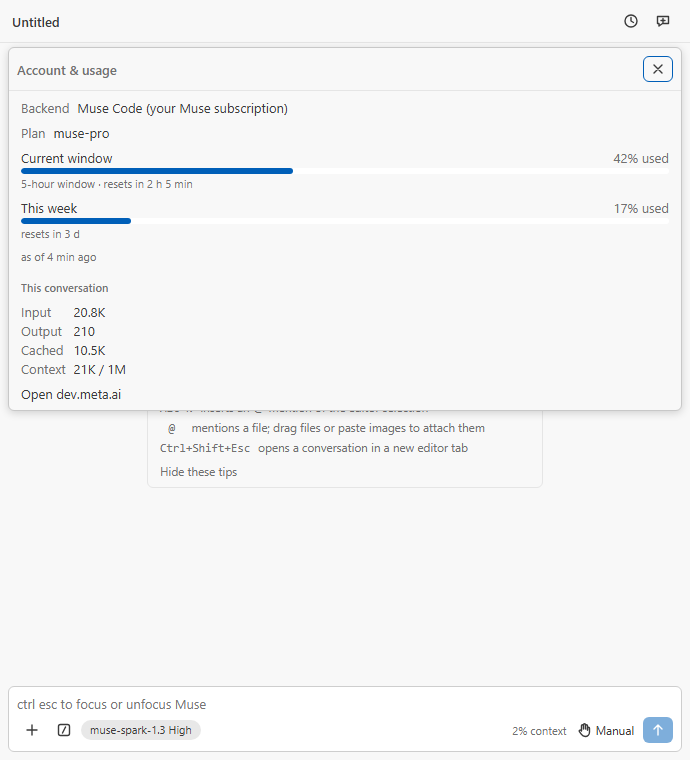
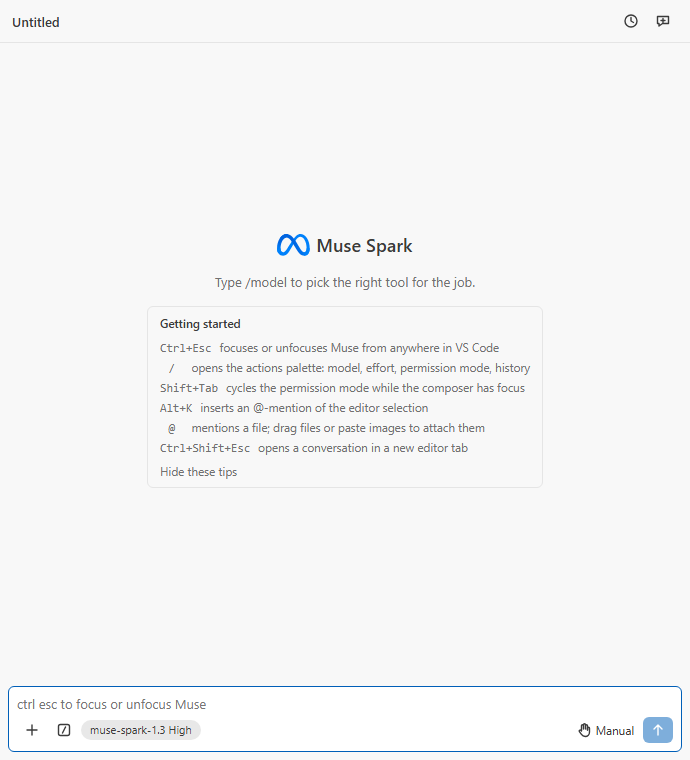

# M8 certification — account & usage, polish, packaging

Recorded 2026-09-22 on Windows 11 (Node 24.20.0, VS Code 1.138.0, Muse Code
1.3.0 signed in through the device-code flow, the owner's Muse Code
subscription active since this afternoon; no Model API key on the machine).

## Gate results

| Gate              | Result                                                                                                                                                      |
| ----------------- | ----------------------------------------------------------------------------------------------------------------------------------------------------------- |
| `npm run quality` | pass (exit 0 with semgrep on `PATH`; tail pasted in the commit message)                                                                                     |
| Unit tests        | 70 files, 671 tests; statements 97.1 %, branches 91.2 %, functions 96.6 %, lines 97.1 %                                                                     |
| Integration tests | 5 passing in VS Code stable 1.138.0 (`npm run test:integration`)                                                                                            |
| Bundles           | `dist/extension.js` 168.1 KiB (budget 600), `dist/searchWorker.js` 11.9 KiB (budget 50), `dist/webview/main.js` 576.4 KiB (budget 900), `main.css` 22.9 KiB |
| jscpd             | 0 clones (the Chrome finder moved to `scripts/lib/chrome.mjs`, shared by the screenshot and icon scripts)                                                   |
| knip / dpdm       | clean                                                                                                                                                       |
| semgrep           | 0 findings                                                                                                                                                  |
| gitleaks          | no leaks                                                                                                                                                    |
| `npm run package` | `muse-spark-code-0.1.0.vsix`, 13 files, 276.31 KB (two bundles, stylesheet, icons, package.json, README, CHANGELOG, LICENSE, PRIVACY)                       |
| Isolated install  | `code.cmd --extensions-dir <tmp> --user-data-dir <tmp> --install-extension` on the test VS Code 1.138.0 → `randynorthrup.muse-spark-code@0.1.0` listed      |
| New dependencies  | none                                                                                                                                                        |

## What the milestone rests on

- The SDK's `usage/read` result (`{ usage? }`, the member omitted until the
  host has observed a frame) and the `usage/changed` notification carry one
  `SubscriptionUsage` shape: `observedAtMs`, `tier` (verbatim), `window`
  (`usedPercent`, `resetsAtMs`, `windowDurationMins`) and `weekly`
  (`usedPercent`, `resetsAtMs`); percentages may exceed 100 (msp.d.ts, ADR
  32563). The M2 smoke had seen `usage/read` return `{}` on an account
  without a subscription.
- The Claude Code behaviour mirrored: the Account & usage entry under the
  `/` palette's Account & usage group, `/usage` and `/cost` as slash rows,
  usage bars with reset times, the onboarding checklist on the empty state
  with a "hide" that writes `hideOnboarding`, and screen-reader
  announcements of state changes.
- Voice dictation (Q4) is not shipped: the Web Speech API's
  `SpeechRecognition` fails with a `network` error inside Electron, which
  VS Code webviews run in (electron/electron#46143,
  WebAudio/web-speech-api#80). A microphone button would be dead for every
  user, so none is drawn.

## Live verification (`scratchpad/live-m8.log`)

Through the extension's own manager and controller against the real CLI,
in the empty workspace `C:\muse-live-ws`, with the expected cost stated
first (about 4 model calls, as the 12:04 no-key run):

```
usage/read before any turn: undefined
usageReport {"type":"usageReport","backend":"museCode"}
reply: "pong"
tokenUsage {"inputTokens":20719,"outputTokens":21,"cachedTokens":8561,"reasoningTokens":10}
usage/changed {"observedAtMs":1790108487971,"tier":"27681393394859588",
  "window":{"usedPercent":0,"resetsAtMs":1790126464000,"windowDurationMins":300},
  "weekly":{"usedPercent":0,"resetsAtMs":1790553600000}}
usageReport {... the same window ...}
usage/read after the turn: {... the same window ...}
```

The CLI's trace log for that process shows 4 `model.attempt.lifecycle`
admissions and `credential.status source="login"`: the turn ran on the
CLI's own sign-in, and the subscription window it reported afterwards is
what the dialog renders. The tier arrived as an opaque numeric id, which is
why `planLabel` shows "Muse Code subscription" for ids without letters.

## Unit coverage by module

| Module                   | Spec                           | What it pins                                                                                                                                                                                                                                                                                 |
| ------------------------ | ------------------------------ | -------------------------------------------------------------------------------------------------------------------------------------------------------------------------------------------------------------------------------------------------------------------------------------------- |
| `shared/usage`           | usage.test.ts                  | the SDK shape and the empty `usage/read` result; bar clamping (over-quota keeps its label); reset countdowns rounded up, "now" once passed; window length in hours or minutes; the plan label hiding opaque numeric tiers                                                                    |
| `MuseCodeHost`           | MuseCodeHost.test.ts           | `usage/read` parsed, absent before an observation; `usage/changed` delivered without a session, malformed shapes warned, unsubscribed listeners silent                                                                                                                                       |
| `ModelApiHost`           | modelApiHost.test.ts           | no window on the key backend; the usage stream never fires                                                                                                                                                                                                                                   |
| `ConversationController` | conversationController.test.ts | `readUsage` → `usageReport` with the backend and the window; `usage/changed` re-posts; one stream per host; disposal stops it; a host failure is a notice                                                                                                                                    |
| `shared/palette`         | paletteRegistry.test.ts        | the Account & usage row first in its group, `/usage` and `/cost` in the slash group, all opening the dialog; filtering by `/cost`                                                                                                                                                            |
| `webview/state/uiState`  | uiState.test.ts                | the last `usageReport` kept across a clear; announcements for finished / failed / stopped turns (not retractions), approvals with the tool label, questions, send failures, resumes, warnings and errors (not info), each with a growing sequence                                            |
| `UsageDialog`            | UsageDialog.test.tsx           | plan, both bars with `aria-label`s and reset times, over-quota fill, "as of"; token and context rows; the key-backend note and the "not reported yet" note; loading state; focus on the close button, Escape and click close; the dashboard link                                             |
| `App`                    | App.test.tsx                   | `/usage` opens the dialog under the header and asks the host, the report renders, Escape returns focus to the composer; the Account & usage row and `/cost`; the onboarding tips and "Hide these tips" → `hideOnboarding`, hidden after the setting broadcast; the polite hidden live region |
| (existing suites)        | —                              | every earlier spec still passes with the new state fields and the `AgentHost` additions                                                                                                                                                                                                      |

## Test-fire proofs (`scratchpad/prove-m8.sh`, 2026-09-22)

Each proof breaks one guarded line, runs the owning spec, restores the file
and reports `fired` (the spec failed) or `SILENT`. All 20 fired:

```
fired  usage/read result parsed, absent before an observation
fired  usage/changed reaches the usage listeners
fired  the controller re-posts usageReport on usage/changed
fired  a usage read failure becomes a notice
fired  the key backend reports no subscription window
fired  over-quota percent fills the bar without lying in the label
fired  reset times round up to whole minutes
fired  an opaque numeric tier id is not shown as the plan
fired  the Account & usage row opens the dialog
fired  /cost is a palette row
fired  opening the dialog asks the host for usage
fired  the dialog keeps the last usageReport
fired  the live region reads a finished turn
fired  informational notices are not read out
fired  approval announcements name the tool
fired  the live region is polite and hidden
fired  Hide these tips writes the setting through the host
fired  hideOnboarding removes the tips
fired  Escape closes the dialog
fired  the weekly bar shows the provider percent
```

## Visual check

Headless-Chrome shots of the webview behind the harness (`npm run
harness:shots usage` / `empty`):

-  — `/usage` from the palette: the
  Backend and Plan rows, the current 5-hour window at 42 % with its reset
  time, the week at 17 %, "as of 4 min ago", this conversation's tokens and
  context, the dashboard link; the dialog hangs from the header over the
  onboarding card.
-  — the
  six tips under the hint, "Hide these tips" beneath them.
- The Marketplace icon: `media/icon.png`, a spark on a dark tile rendered
  from `media/marketplace-icon.svg` (deliberately not Meta's logo; the
  activity-bar mask in `icon.svg` is unchanged).

## Owner's manual checks

- The Account & usage dialog in the dev host after one turn (the bars
  should match the dev.meta.ai Usage page, which now bills the
  subscription).
- `vsce publish` with the Marketplace PAT, when the owner decides to
  publish (Q8).

## Deferred, with reasons

- Voice dictation (above; PLAN.md Q4).
- A stored session log for Model API sessions (they live for the window;
  the panel says so). The owner runs the CLI backend and deleted the
  pay-as-you-go key on 2026-09-22.
- The Model API path's live turn: no key exists to run it with; the
  fake-server contract tests of M7 stand.
