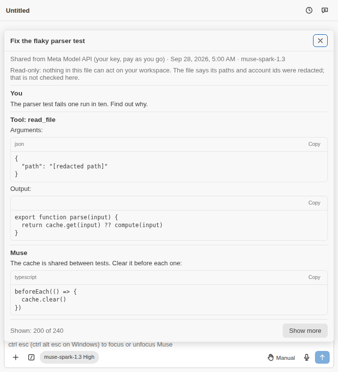

# M84: session export, import and share

## Current-main source preparation, 2026-09-30

The isolated `integrate/m84-resume-20260929` worktree normally merges
approved main `f7db5715` into original `c2eb4da2`, then applies the preserved
26-path repair draft. Original WIP and ignored artifacts remain untouched;
external exact binary patches and per-file SHA256 inventories retain that
source. Ten shared-file conflicts were reconciled. The Model API host's
49-line import/marker feature delta merged normally; no whole host or
evaluation harness was copied. Share views keep optional Insert/Apply
handlers while M79 keeps its plan rendering and lifecycle state.

The formerly external ACP seam is now applied to actual `src/acp/agent.ts`:
`loadSession` passes the persisted imported marker into adoption, which uses
the existing `untrustedStartMode` before advertised-mode matching and any
history replay. Ordinary new or resumed sessions retain configured modes.
Draft ACP cases cover safe imported load/resume, a prior explicit user
relaxation followed by a safe reload, and ordinary mode preservation. The
existing backend tests preserve the marker across forks and restarts; ACP
has no fork endpoint. These new ACP cases have not run.

### Approved M68 source join, 2026-09-30 — unverified

The preceding `1d155674` tree and exact index/merge state are preserved
externally before applying the `f7db5715` to approved main `32709441` delta.
Six conflicts retain both features: changelog and certification index,
share/verify harness presets, session summary/snapshot workspace roots plus
imported markers, both model-text blocks, and the common filesystem mock.
The current captured `sessionWorkspaceRoot` takes precedence while `imported`
persists independently. M68's actual filesystem ownership/fingerprints,
PlanStore owner notices, verify ports and canonical native fixtures remain.
The bounded descriptor/PDF cap, portable masks and ACP imported-mode-before-replay
seam are retained. No whole Model API host or evaluation harness was copied.
No verifier, formatter, browser, model or paid call ran during this source join.
The imported ACP, backend fork/restart and transfer drafts still require focused
tests and red/restored evidence, independent review and exact-tree full gates;
normal latest-main ancestry remains coordinator-owned.

Main already supplies M79's explicit fourth `readPickedFile` PDF-limit
argument. The bounded local picker uses it at the JSON cap; the redundant
old reader patch was discarded, preserving current descriptor/path checks.
Non-file providers fail explicitly with the translated refusal. Current
M79 atomic-file ownership code remains unchanged; M68 notice/lifetime
callbacks must be retained in the later dependency join.

This is source preparation, not a passing gate. No verifier, browser,
model or paid call ran. Next: independent review, transfer/picker/ACP
focused tests and meaningful red/restored proofs, then root's exact-tree
platform and hosted gates. Grok is explicitly skipped per the owner.

Recorded 2026-09-28 on branch `feature/m84-export`, from main `c42c4d5f`.
PLAN.md D49 ("Untrusted content"), M84.

## How it was built

A Muse Code instance (contributor model) drafted the milestone and left it
uncommitted; its sandbox blocked some checks, so none of its gate claims
were taken as run. Claude reviewed the draft as another model's first draft
and reworked it. What the review found in the draft:

- **Unknown fields were accepted.** The schema used `z.object`, which
  strips unknown keys; the draft's own "hostile file" test asserted that a
  file with `accountId`, `approvalMode` and `goal` parsed. There was no
  version message, no item cap, a size check only before the read, and a
  lossy UTF-8 decode.
- **Scrubbing missed fields.** Only listed text fields were scrubbed: the
  session name, the first prompt, todos, citations, attachment names and
  the opaque `children` and `modelVisibleContent` lists went out as they
  were. A home folder with a space (`C:\Users\Randy Northrup\…`) left the
  surname behind; `C:/…` paths and `file://` links were not redacted. The
  e-mail pattern was quadratic on a long run of word characters, so an
  export of a conversation with a large base64 blob would hang.
- **The preview was a counts-only modal**; the file was not shown, "Export
  with full paths" also kept e-mail addresses, and the suggested file name
  came from the unredacted title.
- **The import replayed the file's replay as it came**: assistant,
  developer-role, reasoning (with `encrypted_content`) and function-call
  items from an untrusted file, marked only by one leading note. The file
  chose the model and effort, and its turn and item ids were kept.
- **The forced mode did not hold.** The controller set Manual before the
  import succeeded (a failed import left the old session shown as Manual
  while it ran in its own mode), and a reload, resume or fork reopened the
  imported conversation in `museSpark.initialPermissionMode`.
- **The share view could act**: its code blocks kept Insert and Apply,
  which write into the editor from someone else's file.
- A scratch test and a `.tmp-vite/` folder were left in the tree, and there
  was no certification record.

## What was built

- **One format**, `muse-spark-session-export` version 1
  (`src/core/export/sessionTransfer.ts`), for export, import and share. It
  holds the history the Markdown export reads (`readSession`, both
  backends) with only the reader's fields (`portableItemFields`). The Model
  API replay, stored outputs, patches, child sessions and background and
  workflow handles stay out; the draft's `exportSnapshot` host method is
  gone.
- **Scrubbing** walks every string of the document except structural
  words and ids. `redactSecrets` and a 64-hex digest pattern run always. By
  default paths and e-mail addresses are redacted too: `file://` URIs, this
  machine's own roots (workspace folders and home, either separator, any
  case, to the path's end), then absolute POSIX, drive and UNC paths. The
  placeholders are English `MODEL_TEXT`, since the model reads them after
  an import. The result is parsed with the import's own schema, so a file
  this writes is one an import reads.
- **Linear-time patterns.** The e-mail pattern is bounded by RFC 5321's
  lengths, and `redact.ts`'s URL user-info scheme is bounded at 32
  characters; unbounded, 200,000 characters of `a.a.a…` took about 20 s.
- **Preview first** (`exportConversation.ts`, `cliFeatures.ts`): the
  redacted file opens as a read-only in-memory document (the tool-output
  scheme, never on disk), then a modal says how much was redacted and
  offers **Save redacted…**, **Save without redaction…** or close. The file
  name comes from the redacted title. A file past the import cap is not
  written (`tooLarge`, with a notice).
- **Every imported byte parsed** (`sessionImport.ts`, `parseSessionExport`):
  under 16 MiB before and after the read, strict UTF-8 (a BOM is dropped),
  the header named when it is another format or version, the schema with a
  20,000-item cap and an ISO 8601 date, then any field zod did not keep
  refuses the file with its path (`transcript[1].outputRef`).
- **Import** (`ModelApiHost.importSession`, Model API only):
  `sanitizeImportedSession` mints fresh session, turn and item ids (a turn
  starts at each user message), takes the caller's asking mode and the
  user's current model, the default effort, and no goal, todos, outputs,
  children or usage. Each imported turn reaches the model as one user-role
  message: a lead marking it untrusted (the first also carries the full
  note) and the turn's items as JSON. Nothing from the file reaches the
  model as its own reply, a tool call, reasoning or a developer message.
- **Asking every time.** The stored session keeps `imported: true`; a fork
  copies it; `SessionRecord.imported` carries it to the panel. `adopt`
  opens such a session in `untrustedStartMode`: the current mode when it
  already asks (Manual or Plan), else Manual, or Plan when the initial mode
  is Plan. That covers the import and every later resume, restore and
  fork; a notice says why. The restart-recovery path keeps the panel's own
  mode, which the user set.
- **Share view** (`ShareView.tsx`): the items render through the Markdown
  export's per-item sections (`transcriptItemMarkdown`), with the date
  through `formatDateTime` and a read-only line. `MarkdownView` and
  `CodeBlock` take Insert and Apply as optional; the share view passes
  neither. Links go through the host's http, https and mailto filter.
- **Commands.** Import Session and Open Share File run on the panel in
  view (`forActiveConversation`), as the other panel commands do. The
  picker is titled for what it is for.
- **Strings.** New and changed keys are in `en.ts` and all 14 tables with
  real translations; the two placeholders left the tables for `MODEL_TEXT`.
  `check:l10n`: 14 tables, 95 manifest strings, 0 problems.

## Tests

- `sessionTransfer.test.ts` (new, 15): default redaction; credentials and
  digests scrubbed from a full export; local roots with spaces, separators
  and case; commands, relative paths and web URLs kept, `file://` and UNC
  redacted; every nested string scrubbed and structural ids kept; live
  state left out and the file parsed back; message counts; the header's
  two refusals; unknown fields at five depths; shape, date and item cap;
  fresh ids and turn grouping; nothing privileged; each turn as user-role
  untrusted JSON with reasoning left out; names.
- `sessionImport.test.ts` (new, 5): the picker's title and filter, BOM,
  dismissal, the cap before and after the read, invalid UTF-8, the
  confirmation, a syntax error.
- `exportConversation.test.ts`: preview before write on both backends (the
  preview is the file written, byte for byte), full export only on request,
  nothing when closed, withheld and empty history, too many items, too many
  bytes, and a full file past the cap after a redacted one fit.
- `conversationController.test.ts`: the JSON export through the panel
  (file name from the redacted title); import in Manual on the user's model
  from Auto, Edit automatically and Bypass, and in Plan; reopening in
  another panel starting in Auto asks again until the user changes it;
  six refusals before any question; dismissed or declined imports nothing;
  Muse Code says so before any picker; the share file posted as read,
  untitled, broken and dismissed, with no session started.
- `modelApiHost.test.ts`: the saved session (imported, asking, the
  caller's model, the key's digest, no goal or outputs); the first request
  after an import carries only user-role messages, the imported turn with
  its lead; the mark survives a fork and a restart; no account, no import.
- `cliFeatures.test.ts`: preview then modal and its three answers, the JSON
  save, and the local roots. `App.test.tsx`: the share modal with Copy on
  every code block and no Insert, Apply or Send. `uiState.test.ts`,
  `paletteRegistry.test.ts`, `manifest.test.ts`: as drafted, updated.
  `redact.test.ts`: a long dotted run in linear time.
- The harness has a new `share` scenario; `node scripts/a11y.mjs share
markdown tools usage`: 16 pages, 0 rules violated.

_Port note, 2026-10-01: the `m84-share.png` capture did not survive the
port (its binary hunk has no content). Retake it with the harness `share`
scenario before release; the reference above stays until then._

## Drills

Each drill broke one guard in memory, ran its suites (each suite in its
own run), and restored the exact bytes, checked by SHA-256, never through
git (`drills-m84.mjs` in the session scratchpad). All 29 went red. An
earlier pass found two faults in the drills themselves, fixed before this
one: two suites ran under one `-t M84` filter, which skipped the suite that
sees S5, so S5 stayed green; and I5's test compared the whole picked file,
so its failure printed 16 MiB and the run was killed instead of failing
(it now compares the kind only).

| Drill | What was broken                                               | Result                                                                 |
| ----- | ------------------------------------------------------------- | ---------------------------------------------------------------------- |
| E1    | Credentials are no longer scrubbed                            | exit 1; sessionTransfer: 2 failed                                      |
| E2    | The key digest is no longer scrubbed                          | exit 1; sessionTransfer: 1 failed                                      |
| E3    | Absolute paths are no longer redacted by default              | exit 1; sessionTransfer: 3 failed                                      |
| E4    | This machine's own folders are no longer redacted             | exit 1; sessionTransfer: 1 failed; exportConversation: 1 failed        |
| E5    | Account ids (e-mail addresses) are no longer redacted         | exit 1; sessionTransfer: 2 failed                                      |
| E6    | Strings inside lists are no longer scrubbed                   | exit 1; sessionTransfer: 5 failed                                      |
| E7    | A live-state field (outputRef) enters the file                | exit 1; sessionTransfer: 3 failed                                      |
| E8    | The file name comes from the unredacted title                 | exit 1; conversationController: 1 failed                               |
| P1    | A closed preview still writes the file                        | exit 1; exportConversation: 1 failed; conversationController: 1 failed |
| P2    | The preview shows something other than the file written       | exit 1; exportConversation: 1 failed                                   |
| P3    | An export past the import cap is written                      | exit 1; exportConversation: 1 failed                                   |
| I1    | Unknown fields are accepted                                   | exit 1; sessionTransfer: 1 failed; conversationController: 1 failed    |
| I2    | Another format version is read                                | exit 1; sessionTransfer: 1 failed                                      |
| I3    | The transcript has no item cap                                | exit 1; sessionTransfer: 1 failed                                      |
| I4    | A file over the cap is read                                   | exit 1; sessionImport: 1 failed                                        |
| I5    | A file that grew past the cap after the size check is read    | exit 1; sessionImport: 1 failed                                        |
| I6    | Bytes that are not UTF-8 are read with replacement characters | exit 1; sessionImport: 1 failed                                        |
| S1    | The file's item ids are kept                                  | exit 1; sessionTransfer: 1 failed                                      |
| S2    | The file's model is used                                      | exit 1; sessionTransfer: 1 failed; modelApiHost: 1 failed              |
| S3    | Imported turns reach the model as developer messages          | exit 1; sessionTransfer: 1 failed; modelApiHost: 1 failed              |
| S4    | Imported turns are not marked untrusted                       | exit 1; sessionTransfer: 1 failed                                      |
| S5    | The caller's asking mode is not applied                       | exit 1; sessionTransfer: 1 failed; modelApiHost: 1 failed              |
| S6    | The session is not marked imported                            | exit 1; sessionTransfer: 1 failed; modelApiHost: 2 failed              |
| S7    | A fork loses the imported mark                                | exit 1; modelApiHost: 1 failed                                         |
| C1    | An imported session opens in the current mode                 | exit 1; conversationController: 2 failed                               |
| C2    | An import starts in the initial mode (Auto, Bypass)           | exit 1; conversationController: 2 failed                               |
| C3    | The controller hands the host the file's model                | exit 1; conversationController: 1 failed                               |
| V1    | The share view offers Insert and Apply                        | exit 1; App: 1 failed                                                  |
| R1    | The URL user-info scheme is unbounded again (quadratic)       | exit 1; redact: 1 failed                                               |

Port drill, 2026-10-01 (release-candidate tree): the `vscode` dialogs moved
to `transferDialogs.ts`, so the non-file-provider refusal was broken there on
purpose (`vscode-remote` accepted beside `file`): `transferDialogs`: 1
failed, then the exact bytes restored and 8 passed.

## Live check

None. No new wire shape: an imported turn is a user-role `input_text`
message, the shape the backend already sends for its own notes
(`noteItem`), and the request that carries it is checked against the fake
Model API. No paid call is involved.

## Gate

`npm run quality` on `ed49e75b`, on the Kubuntu rig (`rig-gate.sh kubuntu`,
label `m84-export`), exit 0:

- format, lint (`lint:ps` skips off Windows; CI's Windows job covers it),
  five TypeScript projects, `check:l10n` (14 tables, 95 manifest strings,
  0 problems), knip, dpdm (no cycle), jscpd (0 clones);
- vitest with coverage: 182 files passed and 2 skipped; 2,761 tests passed
  and 32 skipped; statements 94.38 %, branches 89.92 %;
- build and budgets: `dist/extension.js` 457.2 KiB of 600,
  `dist/modelApi.js` 314.3 KiB of 400, `dist/webview/main.js` 756.1 KiB of
  900; the bundle-split check passed; `npm audit`: 0 advisories;
- a11y: 340 pages (85 scenarios × 4 themes, `share` new), 0 rules violated;
- gitleaks: no leaks; Semgrep: 287 rules on 422 files, 0 findings.

Locally (Windows 11): the fast gates above before the commit, and
`npm run test:integration` (VS Code 1.125.0): 10 passing, the new commands
among those registered. The first commit attempt was stopped by gitleaks
on a synthetic key in a test; the test now takes it from
`test/unit/helpers/modelApiKeys.ts`.

## Completion review, 2026-09-29 — implemented, verification pending

Worktree `muse-extension-m84`, branch `feature/m84-export`, base
`c2eb4da2`. The earlier gate and drill receipts above describe their earlier
trees. This review found four remaining gaps: `transferInvalidField` lacked
all fourteen translated entries; JSON syntax errors returned parser text
that can quote the file; unknown field names were only control-stripped and
truncated; and ids/error labels skipped the export's credential scrub even
though their schema accepts arbitrary strings.

The translations now keep the `{field}` template in every table. Syntax
failures return the existing localized `transferNotAnExport` refusal.
Field diagnostics go through the existing credential/account/path scrub
before control replacement and the existing size cap. Export scrubbing
visits every string value. Ordinary UUIDs, protocol words and enum values
do not match those patterns and remain unchanged.

No identity format was introduced: portable files already exclude live
references, the share view's section key includes its position, and import
already remints every item and turn id. Added regressions check sensitive
ids/error labels in default and full export, normal UUID/enum preservation,
fresh unique imported ids, a hostile unknown-field key, and a syntax error
surrounding a synthetic key. Tests and red drills have not run yet; the
coordinator holds verification CPU for PR #32. No new UI layout changed.

Integration acceptance for PR #32 remains open: ACP adoption currently
advertises `options.initialMode`, then `matchAdvertised` sets that mode on
resume. It must honor M84's `loaded.record.imported` and reuse
`untrustedStartMode` before advertising/setting mode for imported
load/resume/fork. Normal new sessions keep the user's configured mode.
The root owns that cross-branch fix and its tests.

An external source handoff now targets `muse-extension-m69-integrate`
HEAD `ee4d3a96`, actual file `src/acp/agent.ts`: adoption receives
`loaded.record.imported` and selects `untrustedStartMode` before matching
backend mode or replaying history. Draft ACP cases cover load/resume,
explicit user relaxation followed by a safe reload, and ordinary
Auto/Bypass/Accept edits/Plan preservation. No ACP fork request was added;
the agent has no such endpoint. Join M84's existing real backend
fork/restart marker test with safe ACP load of that marked fork. Artifacts
live at `%TEMP%/muse-goal-evidence-20260929/m84-acp-import-integration.patch`
and `.md`. These drafts and their required red/restored drill are unverified.

### Bounded picker repair — source only

The import/share picker formerly sampled provider metadata and then called
`vscode.workspace.fs.readFile`, allocating all bytes before its second cap
check. It now uses the existing canonical-path checked `readPickedFile`
descriptor reader for local `file:` URIs. Its explicit PDF allowance is the
same 16 MiB JSON cap. Other providers receive `transferLocalFileOnly`,
translated in all fourteen UI tables; no empty success or unbounded fallback
is used. This optional fourth picker argument aligns with M79's existing
reader seam and must be preserved when the branches join.

Draft picker tests use actual temporary files and opened descriptors. They
hold sampled handle metadata while another writer grows or replaces the
selected file, refuse oversize and PDF-shaped input, preserve both original
and replacement source bytes, decode strict UTF-8/BOM, and assert that the
whole-file VS Code provider API is never called. Required red drills remove
the descriptor limit or restore the PDF widening, observe the specific
cap assertions fail, restore source and rerun. No tests, types, lint,
localization gate or red drill ran during this source phase.

Next: focused transfer/import and localization gates, mutation proofs for
each repaired guard using source copies outside the checkout, independent
review, then the staged integrated tree's full quality gate. No live or
paid call was made during this completion review.
