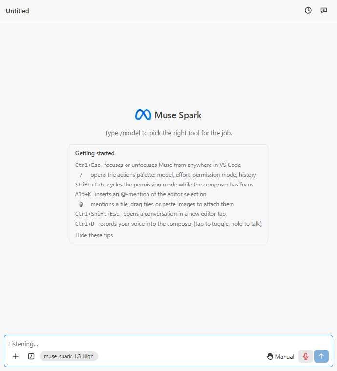

# M9 certification — voice dictation on the operating system's recogniser

Recorded 2026-09-22 on Windows 11 (Node 24.20.0, Windows PowerShell
5.1.26100, recogniser `MS-1033-80-DESK` en-US, VS Code 1.138.0). The
first Windows run was made from a Remote Desktop session, which exposes no
audio device (`waveInGetNumDevs` = 0), so the helper was driven with a
synthesised recording through the real recogniser; a real-microphone run
followed once the owner attached a webcam and sat at the console (below).

## Gate results

| Gate              | Result                                                                                                                                                                                                        |
| ----------------- | ------------------------------------------------------------------------------------------------------------------------------------------------------------------------------------------------------------- |
| `npm run quality` | pass (exit 0 with semgrep on `PATH`; tail in the commit message and `scratchpad/quality-m9.log`)                                                                                                              |
| Unit tests        | 74 files, 711 tests; statements 97.2 %, branches 91.4 %, functions 96.8 %, lines 97.2 %                                                                                                                       |
| Integration tests | 5 passing in VS Code stable 1.138.0 (`npm run test:integration`)                                                                                                                                              |
| Bundles           | `dist/extension.js` 174.9 KiB (budget 600), `dist/searchWorker.js` 12.8 KiB (budget 50), `dist/webview/main.js` 579.6 KiB (budget 900), `main.css` 23.3 KiB                                                   |
| `lint:ps`         | PSScriptAnalyzer (`PSGallery` settings) over `native/windows`: 0 findings; new gate, fired on a plural-noun function (below)                                                                                  |
| jscpd / knip      | 0 clones (the driver test's repeated warm-up became one `listening()` helper); knip clean                                                                                                                     |
| semgrep           | 0 findings after the `nosemgrep` row for the fixed helper spawn (PLAN.md §8); fired when the annotation was removed (below)                                                                                   |
| gitleaks          | no leaks (pre-commit hook and history scan)                                                                                                                                                                   |
| `npm run package` | `muse-spark-code-0.1.0.vsix`, 14 files, 282.34 KB: the M8 set plus `native/windows/dictate.ps1`. The macOS helper is absent from a Windows build by design; CI's `package` job produces the complete artifact |
| New dependencies  | none (Windows PowerShell 5.1 and `System.Speech` ship with Windows; Apple's Speech framework ships with macOS)                                                                                                |

## What the milestone rests on

- The owner's constraints (2026-09-22): no API cost (Meta's Voice
  Transcribe rejected), no third-party packages or engines, no OS
  shortcuts driven from the button; the button must produce text. Owner's
  platform decisions: the Windows API on Windows, the Apple Speech helper
  on macOS ("option 1"), Linux disabled for now ("option 1 ... until I
  think it over more").
- Windows: `System.Speech.Recognition.SpeechRecognitionEngine` with a
  `DictationGrammar` in Windows PowerShell 5.1 (the .NET Framework). In
  the sandbox `InstalledRecognizers()` lists `MS-1033-80-DESK` (en-US) and
  `SetInputToDefaultAudioDevice()` throws "Cannot find the requested data
  item" (no device), which the helper reports as an `error` line and exit
  code 2; the driver turns that into the notice "Voice dictation failed:
  No microphone is available to Windows speech recognition: …".
- PowerShell event handling: `Register-ObjectEvent -Action` blocks do not
  run while the pipeline is blocked in a .NET call, so the helper polls
  `Get-Event` between `Start-Sleep` ticks and reads stdin with
  `Stream.ReadAsync` (`Console.In.ReadLineAsync` is synchronous on the
  .NET Framework).
- macOS: `SFSpeechRecognizer.requestAuthorization` and
  `AVCaptureDevice.requestAccess(for: .audio)` need
  `NSSpeechRecognitionUsageDescription` / `NSMicrophoneUsageDescription`,
  embedded in the command-line binary's `__info_plist` section by
  `build.sh`. The prompts are attributed to the parent app (VS Code).
  `requiresOnDeviceRecognition` is set when
  `supportsOnDeviceRecognition` is true. Ending audio with nothing said
  yields `kAFAssistantErrorDomain` code 1110, treated as a normal stop.

## Live verification (sandbox, real recogniser, synthesised audio)

`System.Speech.Synthesis` spoke "open the settings file and fix the bug"
into a 130,982-byte WAV; the helper was started with `-InputWav` and driven
over stdin exactly as the driver does:

```
t=827ms  {"recognizer":"MS-1033-80-DESK","language":"en-US","type":"ready"}
         > start
t=862ms  {"type":"listening"}
t=1076ms {"confidence":0.464,"type":"text","text":"Although settings file in fix the bug"}
t=1124ms {"type":"stopped"}
         > quit
exit=0, stderr empty
```

The transcript is what the classic Windows engine makes of a synthetic
voice at 0.46 confidence: the pipeline is proven end to end, the accuracy
is the engine's (the owner was told it sits below Windows 11's voice
typing before choosing this path). Without `-InputWav` in the sandbox:

```
{"type":"error","reason":"No microphone is available to Windows speech recognition: Cannot find the requested data item, such as a data key or value."}
exit=2
```

## Live verification, Windows, real microphone (2026-09-22, later)

The owner attached a Logitech HD Pro Webcam C920 to the PC and logged in
at the console (the earlier "sandbox" reading was wrong: the session had
been Remote Desktop, `query session` → `rdp-tcp#0`, which hides the host's
audio devices; at the console `waveInGetNumDevs` = 12 and
`SetInputToDefaultAudioDevice()` succeeds). The helper ran on the default
microphone while `System.Speech.Synthesis` spoke the sentence through the
speakers, so the audio crossed the room acoustically
(`scratchpad/live-m9-windows-mic.log`):

```
t=12ms   {"recognizer":"MS-1033-80-DESK","language":"en-US","type":"ready"}
t=861ms  > start
t=861ms  {"type":"listening"}
t=6294ms tts: spoke in 3749 ms
t=9301ms > stop
t=9311ms {"confidence":0.198,"type":"text","text":"All his settings while in case of honor"}
t=9313ms {"confidence":0.349,"type":"text","text":"a"}
t=9397ms {"type":"stopped"}
exit=0, stderr empty
```

The real-microphone path is proven: capture, recognition and the
stop-with-phrase-in-flight all work on the device. The words are the
classic engine's reading of a synthetic voice through the air at 0.2
confidence ("settings" survived); a person speaking into the microphone
is the accuracy test that still needs a human, and Windows' Speech
Recognition training (Control Panel > Speech Recognition > Train your
computer) improves this engine for one voice.

## Live verification, macOS (the owner's Mac mini, 2026-09-22)

Intel Mac mini, macOS 15.7.4, Swift 6.1.2 command-line tools, the owner
logged in at its console, reached over key-based SSH. No microphone is
attached; the only input-capable device is Microsoft Teams' loopback
driver (`MSLoopbackDriverDevice_UID`, 48 kHz, 2 channels), which cannot
be a default input (`canBeDefaultDevice` = 0, and an aggregate over it
inherits that). `native/darwin/build.sh` built the universal, ad-hoc
signed binary with the embedded Info.plist in 93 s.

Runs, each launched inside the GUI login session (`open -a Terminal`)
because TCC cannot prompt an SSH process:

1. First launch: both permission prompts appeared on the mini's screen
   (attributed to Terminal), the owner allowed them, `ready` came back with
   `Apple Speech (on device)`, `en_US`; then `start` crashed the process
   with `EXC_BAD_ACCESS` in `Recording.start()` → AVFAudio →
   `objc_exception_throw` → libunwind: an Objective-C assertion the Swift
   code could not catch, on a Mac with no default input device.
2. With CoreAudio's default input checked first: a clean `error` line,
   "no audio input device is available (no default input device)", exit 2,
   no crash report.
3. With `--input-device MSLoopbackDriverDevice_UID`: past the device
   selection, `installTap` threw the same assertion; the stderr step
   markers showed the tap format (the node's cached 44.1 kHz output
   format) differing from the hardware input format (48 kHz).
4. Tapping with the hardware input format: `listening`, engine started,
   recognition task created; Apple ended it at once with "Speech
   recognition stopped: Siri and Dictation are disabled" (the mini has
   never had Dictation or Siri enabled), reported as an error line, exit 2,
   no crash. The `say` command had played "open the settings file and fix
   the bug" into the loopback device during the recording.

5. With Dictation enabled (the owner authorised `defaults write
com.apple.assistant.support "Dictation Enabled" -bool true` over SSH):
   `ready`, `listening`, `stopped`, exit 0, no crash report; the whole
   protocol and the permission, engine and recognition-task lifecycle
   run on real macOS. No `text` line: a level probe on the same loopback
   device during `say` captured 0 buffers in 5 s (the Teams driver's input
   side only runs for Teams), so no audio ever reached the recogniser.

Over SSH without a GUI session the helper reports the authorization
refusal as an error line (exit 2) rather than hanging on a prompt.

6. With a webcam (Logitech C920) attached as the default input and `say`
   through the mini's speakers: capture proven loud and clean (a level
   probe read peak 0.85, RMS 0.12; the helper's own meter 80 buffers at
   peak 0.85), protocol clean, exit 0, and Apple's on-device recogniser
   (then forced by the helper) answered with a **final result of 0
   characters**; letting Apple choose (now the default; `--on-device`
   forces the refusal) answered `kAFAssistantErrorDomain 203: Retry`.
   After the owner toggled
   Dictation off and on in System Settings (which fetched
   `UAF_Siri_Understanding`, 421 MB) and the speech daemons were
   restarted, the same. A file-based check (`SFSpeechURLRecognitionRequest`
   on a clean `say -o` recording, partial results on, both modes, no
   capture involved) reproduced it: the on-device task completed with no
   result at all and the server task never left "starting". Apple's
   recogniser is not serving on that Mac at the moment; the helper is not
   the variable.

7. With the recognition mode left to Apple (the helper's default from
   here on; the earlier forced on-device mode is behind `--on-device`)
   and the speech daemons restarted after the Dictation toggle, the same
   run returned a `text` line:

   ```
   {"language":"en_US","type":"ready","recognizer":"Apple Speech (on-device capable)"}
   {"type":"listening"}
   {"type":"text","text":"Bag"}
   {"type":"stopped"}
   exit=0
   step: recognition on device where installed, otherwise Apple's servers
   step: final result: 3 characters
   step: captured 79 buffers, peak level 0.8508204
   ```

   "Bag" is Apple's servers' reading of "...fix the bug" as heard by the
   webcam from the Mac mini's small built-in speaker across the room; the
   protocol, permissions, capture and recognition are proven end to end
   on macOS as on Windows. A person speaking into the webcam is the
   accuracy check that still needs a human.

## Test-fire proofs (`scratchpad/prove-m9.sh`, 2026-09-22)

Each proof breaks one guarded line, runs the owning suite or gate, restores
the file from the index and reports. All 10 fired, and the suites were green
again afterwards:

```
FIRED  dictationGesture: off-by-one hold threshold (exit 1)
FIRED  dictation driver: start lost before ready (exit 1)
FIRED  dictation driver: words leak into the log (exit 1)
FIRED  helperLocation: Linux claims a recogniser (exit 1)
FIRED  controller: phrase inserted without separator (exit 1)
FIRED  uiState: listening not announced (exit 1)
FIRED  Composer: Ctrl+D not default-prevented (exit 1)
FIRED  protocol: dictation action widened to string (typecheck) (exit 2)
FIRED  lint:ps: PSScriptAnalyzer finding (exit 1)
FIRED  semgrep: spawn without the annotation (exit 2)
OK     all dictation suites green after reverts (exit 0)
```

## Visual check

Headless-Chrome shot of the webview behind the harness (`npm run
harness:shots dictation`), whose host stub answers `dictation start` with
`starting` then `listening`:

-  — the mic in the right
  toolbar group, red, `aria-pressed`; the placeholder "Listening…"; the
  new `Ctrl+D` line in the Getting-started tips.

## Owner's manual checks

- Press F5, open the panel, tap the microphone (or press `Ctrl+D` with the
  composer focused), speak, tap again: the words should land in the
  composer within about a second of each pause, the first press taking
  about a second longer while the engine loads. Windows may first ask to
  let desktop apps use the microphone (Settings > Privacy & security >
  Microphone).
- On a Mac with a microphone and the CI-built `.vsix`: the first press
  prompts for the microphone and for speech recognition; after allowing
  both, the words appear when the button is released or tapped again.
  The helper's permission, engine and recognition lifecycle ran live on
  the owner's Mac mini (above); only the recognised text of real speech
  remains to be seen, which needs an input device plugged into a Mac.

## Deferred, with reasons

- Linux: no built-in recogniser exists; the owner will decide whether a
  user-configured command or (authorised) engine is wanted. The button is
  dimmed with that reason.
- Live partial results (words appearing while speaking): the Windows
  engine's `SpeechHypothesized` and Apple's partial results could feed
  them; Claude Code inserts on release, so parity does not need them.
- Language selection: the helper picks the display language's recogniser,
  then the locale's, then the first installed; a setting can follow if a
  user needs to override it.

## Clean Windows 11 install (the owner's WIN-11-VM, 2026-09-22, evening)

The published 0.1.0 was installed from the Marketplace on a clean Windows
11 VM (VS Code 1.130.0, system install) through `code.cmd
--install-extension RandyNorthrup.muse-spark-code` over SSH:

```
Error while installing extension randynorthrup.muse-spark-code: Can't install
'randynorthrup.muse-spark-code' extension because it is not compatible with
the current version of Visual Studio Code (version 1.130.0).
```

`engines.vscode` was `^1.134.0` only because 1.134.0 was the oldest recent
`@types/vscode` on the registry (PLAN A8); the tree typechecks against
1.125.0, so 0.1.1 lowers the floor to `^1.125.0`. Running the helper
script on that VM over SSH was not possible: Windows PowerShell launched
by sshd there never returns (stdin closed or not), and each attempt left
an unkillable `powershell.exe` in session 0 that only a reboot clears (six
of them, plus one locked log file under `%TEMP%`, reported to the owner).
With 0.1.1 (`engines.vscode ^1.125.0`) the CI-built package installed on
that same VM from the file, `code.cmd --install-extension
muse-spark-code-0.1.1.vsix` → "successfully installed",
`--list-extensions --show-versions` → `randynorthrup.muse-spark-code@0.1.1`,
both helpers present under the extension's `native/`, and
`--uninstall-extension` cleaned it up again (the VM was left as found).
