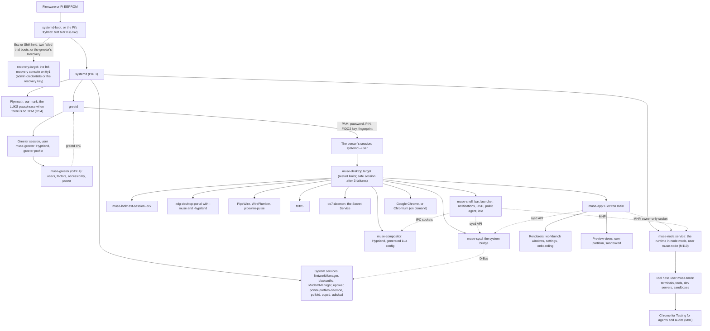
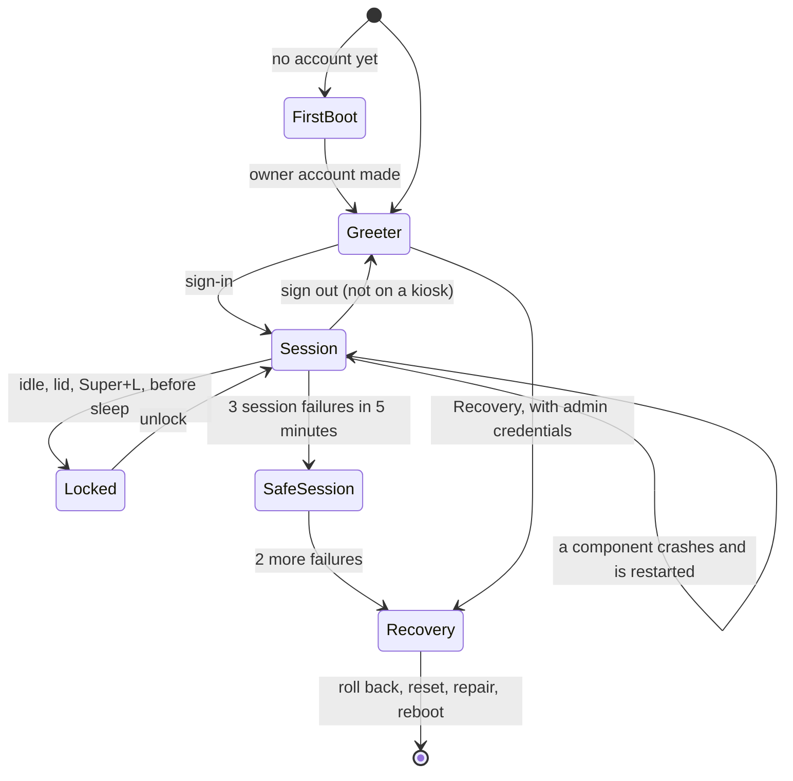
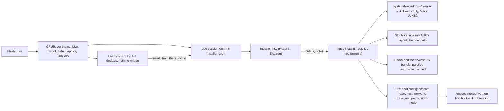

# Muse Desktop: research for D91 and M111 (2026-10-05)

The graphical host edition of Muse Node OS (D90.24, M110os). The machine boots
straight into our interface and nothing else. This file holds the research
behind PLAN.md D91 and M111, with a source and a date for each outside fact.
Facts checked on 2026-10-05 unless a section says otherwise. Nothing here is
built; no model was called and nothing was installed to write it.

## 0. The recommendations in one place

| Question            | Recommendation                                                                                                                                                                                                                                                                                                                                  | Section |
| ------------------- | ----------------------------------------------------------------------------------------------------------------------------------------------------------------------------------------------------------------------------------------------------------------------------------------------------------------------------------------------- | ------- |
| Compositor          | **Hyprland**, pinned (Debian trixie-backports 0.55.2 for amd64 and arm64 at OS1's snapshot date), driven only through our generated Lua config and its IPC, behind a `CompositorPort` so an own Smithay compositor can replace it later                                                                                                         | §2      |
| Shell surfaces      | **GTK 4 in Rust** (gtk4-rs, gtk4-layer-shell and gtk4-session-lock, all MIT), themed by the same token source compiled to GTK CSS; Quickshell (QML, LGPL-3.0) is the recorded alternative if lane 0's Orca spike fails on GTK                                                                                                                   | §3      |
| System bridge       | **`muse-sysd`**, one Rust user service on zbus (MIT): the only code that speaks to NetworkManager, BlueZ, ModemManager, UPower, logind, PipeWire and the other system services; one versioned socket API for the shell and the app                                                                                                              | §7      |
| Main app runtime    | **Electron**, pinned: it carries Chromium, the engine of the Chrome default and of every VS Code webview; Wayland-native by default since Electron 38; `WebContentsView` for preview tabs and `setDevToolsWebContents` for embedded DevTools                                                                                                    | §4      |
| Editor component    | **CodeMirror 6** (MIT), as D90.12 already chose for the node's web UI, with a minimap extension (`@replit/codemirror-minimap`, MIT, pinned, owned if it goes stale) and `@codemirror/merge` for diffs                                                                                                                                           | §5      |
| Session and greeter | **greetd** with our own GTK greeter running under Hyprland's greeter profile; systemd user units under `muse-desktop.target` with restart limits; a safe session, then a recovery console; no getty on any VT                                                                                                                                   | §6      |
| Lock screen         | ext-session-lock-v1 through gtk4-session-lock, with Hyprland's `allow_session_lock_restore`, so a crashed locker is restarted and the screen never unlocks by itself                                                                                                                                                                            | §6      |
| Secret Service      | **oo7-daemon** (Rust, MIT, Fedora 45's default), unlocked at login by its PAM module, for Chrome's passwords and Electron's `safeStorage`; M109's vault keeps its own slots                                                                                                                                                                     | §6      |
| Screen reader       | Orca over AT-SPI, plus the `org.freedesktop.a11y.KeyboardMonitor` interface that Hyprland lacks: an upstream pull request first, our pinned plugin until it lands                                                                                                                                                                               | §9      |
| Third-party apps    | None at first: no Flatpak, no app store; XWayland off by default with a switch for legacy tools                                                                                                                                                                                                                                                 | §8      |
| Web development     | One CDP engine for every preview target: the desktop's own preview tabs through Electron, and Chrome for Testing (M81's pinned store) for agents and for every other editor; Lighthouse always in a fresh Chrome for Testing                                                                                                                    | §12     |
| Tokens              | One source file (`design/tokens/muse.tokens.json`, W3C DTCG format) generated into CSS, GTK CSS, Rust, Hyprland Lua, Ink, xterm.js, CodeMirror, cursor and icon palettes, Plymouth and wallpapers; one `--ms-*` prefix                                                                                                                          | §13     |
| Installer           | Our own React flow on the live session (Anaconda's Web UI is the precedent), over a privileged Rust daemon (`muse-installd`) that runs systemd-repart, lays out OS2's RAUC slots, installs the boot path and downloads packs and updates during the install; GRUB's gfxmenu theme for the medium's boot menu                                    | §18     |
| Agent admin access  | A `muse-agent` system account that can only reach `muse-admind`, a root D-Bus helper with a typed action catalogue under M109's modes; default **Always allow** (the owner's), with tainted requests still asking, a never-allowed list, rate limits, a hash-chained audit, Stop and Lock admin; plain NOPASSWD sudo only as an explicit opt-in | §19     |
| Installer slideshow | One React gallery for the installer's progress step and M110's first-boot web setup, fed by the screenshot harness in every theme and language, with a freshness test                                                                                                                                                                           | §20     |

## 1. The owner's words, mapped

The owner, 2026-10-05 (verbatim in PLAN.md D91). Each phrase and where the
plan answers it:

| Phrase                                                                                    | Answer                                                                                     |
| ----------------------------------------------------------------------------------------- | ------------------------------------------------------------------------------------------ |
| "just our interface nothing more"                                                         | D91.1, D91.18: no other desktop, no app store, no foreign dialog; every visible pixel ours |
| "design all of the gui items custom and matching our theme ... from the bottom up"        | D91.4, D91.19 and the token pipeline (§13)                                                 |
| "a menu bar with wifi controller, bluetook ... cellular ... etc"                          | D91.8, §7                                                                                  |
| "custom mouse pointe and cursor etc"                                                      | D91.11 (pointer theme, text caret, terminal cursor)                                        |
| "custom login screen with optional gui interface with our branding"                       | D91.6: the graphical greeter, and a text greeter as the option                             |
| "similar feel to vscode ... chat stuff on the left ... collapsable sidebar ... icons"     | D91.13                                                                                     |
| "tabbed code/text editor with minimap"                                                    | D91.14, §5                                                                                 |
| "preview tabs will open here as a browser prieview"                                       | D91.14, D91.23, §12                                                                        |
| "multiple desktops as workspaces ... snap and fill the space automatically like hyprland" | D91.3, D91.15                                                                              |
| "you should not be able to quit the interface"                                            | D91.7: supervised session, no exit binding, no getty, recovery for admins only             |
| "a spolight style trigger ... overlay in the center of the screen ... app launcher"       | D91.9                                                                                      |

The same day the owner added: "same theme and a light and dark mode and all
of the same i18n and a11y and 011y" (D91.19–D91.22 and M111's lanes TH, IN,
AX and OB, which also serve M110's web UI and TUI); the first-run
questionnaire hosted in the desktop's onboarding (D91.17, M110t's TQ);
"i want web development to be a pleaent experience with popular view modes
that web developers commonly enjoy with live preview support etc" (D91.23,
M111w); a custom graphical installer with live boot or install, every step
automated, the user's name and password chosen there, the internet joined
in the installer so the questionnaire's downloads and the updates happen
with the install, and passwordless admin access for the orchestration agent
(D91.24, D91.25, M111i); and "the installer should have screenshots and tips
in a auto rotating gallery with info" (D91.24, lane IS).

## 2. The display stack

### 2.1 Candidates

| Compositor                | Licence      | Tiling                                                          | Animations               | Toolkit and language  | Layer shell, session lock | a11y keyboard monitor      | Packaged for Debian 13                   | Notes                                                                                     |
| ------------------------- | ------------ | --------------------------------------------------------------- | ------------------------ | --------------------- | ------------------------- | -------------------------- | ---------------------------------------- | ----------------------------------------------------------------------------------------- |
| **Hyprland**              | BSD-3-Clause | dynamic: dwindle, master, scrolling; user layouts in Lua (0.55) | bezier curves, per-event | own (Aquamarine), C++ | yes, yes                  | not found (§9)             | trixie-backports 0.55.2, amd64 and arm64 | Lua config since 0.55 (May 2026); GLES 3.0 floor since 0.50; permission system since 0.49 |
| niri                      | GPL-3.0      | scrollable columns on an endless strip; no automatic fill       | yes                      | Smithay, Rust         | yes, yes                  | **yes** (25.08)            | not checked                              | "opening a new window never resizes the others" (LWN): the opposite of fill               |
| Sway                      | MIT          | manual i3 splits                                                | none                     | wlroots, C            | yes, yes                  | not found                  | yes                                      | stable, but neither the feel nor the automatic fill the owner names                       |
| Wayfire                   | MIT          | floating; a simple-tile plugin                                  | yes (plugins)            | wlroots, C++          | yes                       | not found                  | yes                                      | Raspberry Pi OS's compositor until October 2024                                           |
| labwc                     | GPL-2.0      | none (stacking)                                                 | few                      | wlroots, C            | yes                       | not found                  | yes                                      | Raspberry Pi OS's default on every Pi since 2024-10-28                                    |
| cosmic-comp               | GPL-3.0      | automatic tiling                                                | yes                      | Smithay, Rust         | yes                       | in progress (COSMIC issue) | no                                       | bound to the COSMIC shell                                                                 |
| cage                      | MIT          | one full-screen client                                          | none                     | wlroots, C            | n/a                       | n/a                        | yes                                      | a kiosk; D90.26's local-screen option; fine for a greeter, not a desktop                  |
| Own compositor on Smithay | MIT (ours)   | anything                                                        | anything                 | Rust                  | ours                      | ours                       | ours                                     | full control; COSMIC's compositor took years; thousands of lane-hours                     |
| Own compositor on wlroots | MIT (ours)   | anything                                                        | anything                 | C                     | ours                      | ours                       | ours                                     | as above, in C                                                                            |

Sources: Hyprland's licence and its move off wlroots in 0.42 (Phoronix,
"Hyprland 0.42 Wayland Compositor Ditches Wlroots", and hypr.land/news,
"Hyprland is now fully independent!"); Hyprland 0.50's GLES 3.0 floor and
render scheduler (hypr.land/news/update50, July 2025; Phoronix "Hyprland 0.50
Released With New Render Scheduling, Drops Legacy Renderer"); Hyprland 0.55's
Lua configuration and Layout API (hypr.land/news/update55, 9 May 2026: "your
hyprlang config is now broken - it will still work, for a few releases"; the
Layout API works "globally, per-workspace, per-monitor"; ICC profiles per
output; FP16 colour-managed pipelines); Hyprland 0.49's permission system
(wiki.hypr.land/0.49.0/Configuring/Permissions: `ecosystem:enforce_permissions`,
`permission = regex, screencopy|plugin|keyboard, allow|ask|deny`, not reloaded
on the fly); Debian's packages (packages.debian.org, search "hyprland":
`hyprland` 0.55.2+ds-1~bpo13+1 in trixie-backports and 0.56.2+ds-3 in forky
and sid, amd64 and arm64; `hyprland-dev`, `xdg-desktop-portal-hyprland`
1.4.1 and `hyprland-protocols` 0.7.1 beside it); niri (github.com/niri-wm/niri,
GPL-3.0; LWN "A tour of the niri scrolling-tiling Wayland compositor"; niri
25.08 release notes for the KeyboardMonitor interface); Raspberry Pi OS's move
to labwc (Raspberry Pi news, 28 October 2024, via Tom's Hardware and
GamingOnLinux).

### 2.2 Why Hyprland, and what we take from it

- **It is the feel the owner named**, with no code of ours: dwindle and
  master layouts that fill the screen as windows open, workspaces per
  monitor, gestures, and the best animation system of the candidates.
- **BSD-3-Clause** puts nothing on our code, our config or a plugin of ours.
- **Both architectures are packaged** in Debian 13's backports at a recent
  version, which OS1's snapshot pinning (D90.24) can freeze. `hyprland-dev`
  sits beside it, so a plugin of ours builds against the exact headers.
- **Its Layout API** (0.55) lets us add our own layouts in configuration,
  without a plugin's unstable C++ ABI.
- **What we do not take:** its ecosystem apps (hyprlock, hypridle,
  hyprpaper, the welcome and update screens, the ANR dialog). Every surface
  is ours (§3). Its own UI is switched off: `misc:disable_hyprland_logo`,
  `misc:disable_splash_rendering`, `misc:enable_anr_dialog = false` (our
  shell shows its own "not responding" sheet from the IPC's events),
  `ecosystem:no_update_news`, `ecosystem:no_donation_nag`. A config error
  shows Hyprland's own error bar, so the generated config is verified in CI
  before it ships (`Hyprland --verify-config`, lane CP captures the flag on
  the pinned version) and never edited by hand on a box.
- **Its risks, and the answers:**
  - **Churn.** 0.55 replaced the configuration language; options are
    removed between minors (`dwindle:pseudotile`, `misc:vfr` moved).
    Answer: one version pinned per image; our config is generated, never
    hand-written; every bump runs the compositor gate (config verify, the
    screenshot suite, the IPC contract tests) before it ships.
  - **No screen-reader keyboard monitor** (§9). Answer: lane AX's upstream
    pull request, with our pinned plugin until it merges.
  - **Plugins' C++ ABI is unstable.** Answer: at most one plugin (the
    keyboard monitor), built against the pinned `hyprland-dev`, loaded only
    from our read-only path under `permission = ..., plugin, allow` with
    `enforce_permissions` on.
  - **Governance.** One project, one lead maintainer. Answer: the
    `CompositorPort` (below) keeps every caller off Hyprland's specifics, so
    an own Smithay compositor (or niri, should it gain a filling layout) can
    replace it without touching the shell or the app.
- **The `CompositorPort`.** One Rust trait and one TypeScript mirror:
  workspaces (list, switch, move a window, bind to a project), windows
  (list, focus, close, float, fullscreen, group), layouts (pick, ratios,
  gaps), monitors (list, arrange, scale, refresh, rotate, mirror), input
  (layouts, repeat, touchpad), events (window opened, closed, focused,
  title, urgent; workspace; monitor added and removed; screencast started),
  and health (ping latency, frame pacing). The Hyprland adapter speaks its
  two sockets: commands and JSON queries on `.socket.sock`, events as
  `EVENT>>DATA` lines on `.socket2.sock` (wiki.hypr.land/IPC).

### 2.3 The Pi's GPUs

- **Pi 4 (V3D 4.2):** OpenGL ES 3.1 conformant since January 2020 (Igalia,
  "Raspberry Pi 4 V3D driver gets OpenGL ES 3.1 conformance"; Hackster) and
  Vulkan 1.2 conformant since July 2022 (Raspberry Pi news, "Vulkan update:
  version 1.2 conformance for Raspberry Pi 4").
- **Pi 5 (V3D 7.1):** OpenGL ES 3.1 and conformant Vulkan 1.3 (Igalia's
  EOSS 2024 talk; Mesa 23.3 first support; Mesa 24.3 "Vulkan 1.3 conformance
  for V3DV", 9to5Linux).
- **So both clear Hyprland's GLES 3.0 floor.** Speed is the open question: a
  Gentoo forum thread is titled "Hyprland Raspberry Pi 5: Poor graphics
  performance" (its body needs a login, so it is not used as evidence).
  Answer: a **light profile** chosen by GPU class (blur and shadows off,
  shorter animations, direct scanout on), Hyprland 0.50's dynamic triple
  buffering ("much better frame-rates for under-powered devices"), and
  measured budgets in lane HW (M111's performance section).
- **Shipping.** OS1's mkosi recipes add a `desktop` profile on the same
  Debian 13 base. x86-64 and ARM64 UEFI take Debian's kernel and Mesa; the
  Pi images take Raspberry Pi's kernel and firmware with `vc4-kms-v3d`, as
  OS1 already does. Hyprland, its portal and protocols come from
  trixie-backports at the snapshot date. If backports falls behind a fix we
  need, lane IM builds that tag in CI from source with the same pins.

## 3. The shell's own surfaces

The bar, the launcher overlay, notifications, the OSD, the lock screen and
the greeter must be **layer-shell** surfaces (anchored, with an exclusive
zone, above full-screen windows where needed) or **session-lock** surfaces.
Electron cannot make either: it has no wlr-layer-shell support (Electron's
issue tracker has none implemented; frameworks that do, such as Flutter's
plugin, wrap gtk-layer-shell), and a lock screen that is an ordinary window
is not a lock (ext-session-lock-v1 makes the compositor keep the screen
blank if the locker dies).

| Option                                                           | For                                                                                                                                                                                       | Against                                                                                                                                |
| ---------------------------------------------------------------- | ----------------------------------------------------------------------------------------------------------------------------------------------------------------------------------------- | -------------------------------------------------------------------------------------------------------------------------------------- |
| **GTK 4 in Rust** (gtk4-rs, gtk4-layer-shell, gtk4-session-lock) | MIT; GTK's AT-SPI support is the one Orca is built against; GTK CSS reads our token CSS almost as-is; one Rust workspace with `muse-sysd`                                                 | no QML-style animation system (CSS transitions and GTK's own animations only); widgets are new code                                    |
| Quickshell (QML)                                                 | made for exactly these surfaces on Hyprland; services built in (Hyprland IPC, Pipewire, BlueZ, NetworkManager, UPower, Polkit, PAM, greetd, notifications, session lock); fluid animation | LGPL-3.0 (fine as a separate program); a small maintainer base; tokens as a generated QML singleton; Qt's AT-SPI less proven with Orca |
| Electron windows placed by Hyprland rules                        | the same React components as the app                                                                                                                                                      | no exclusive zone or overlay layer, spoofable by any window, no session lock; fragile                                                  |
| Web content in a GTK layer surface (WebKitGTK)                   | React components                                                                                                                                                                          | a second web engine with poor Linux performance (§4)                                                                                   |

Sources: gtk4-layer-shell's documentation (wmww.github.io/gtk4-layer-shell:
"support for both the Layer Shell and Session Lock Wayland protocols";
gtk4-session-lock needs gtk4-layer-shell 1.1.0 or later and the same `.so`);
Quickshell (quickshell.org/about, LGPL-3.0; the v0.3.0 module listing:
Quickshell.Bluetooth, .Networking, .Services.Greetd, .Services.Pam,
.Services.Pipewire, .Services.Polkit, .Services.UPower,
.Services.Notifications, .Wayland, .Hyprland; Fedora packages
quickshell-0.2.1).

**Recommendation: GTK 4 in Rust.** The owner's accessibility rule decides
it: GTK is the toolkit Orca is tested against, and GTK CSS is the closest
consumer of the token CSS. Lane 0's spike S2 puts one gtk4-layer-shell popup
and one Quickshell `PanelWindow` under the pinned Hyprland with Orca running,
and checks that Orca reads both and moves focus into both. If GTK fails and
Quickshell passes, M111 switches to Quickshell before lanes SH1 and SH2
start; the token, string and AT-SPI gates are written for either.

**Changed 2026-10-06 (the lead; D91's amendment to decision 4).** The shell's
surfaces (the bar, the launcher overlay, notifications and the OSD, the lock
screen and the greeter) move to **our own Qt 6 Quick (QML) application**, with
LayerShellQt for the layer-shell surfaces. Electron stays for the workbench,
Hyprland stays the compositor, and the compositor port is unchanged.

- **Why:** the owner's polish brief (D94: rounded corners, shadows,
  translucency, restrained animation) suits Qt Quick's GPU scene graph better
  than GTK 4's CSS, and polished Hyprland shells are commonly written in QML.
- **Not Quickshell:** it is read as a reference only (its services and its
  session-lock implementation); no dependency is taken.
- **What the packages say:** Debian 13 packages LayerShellQt 6.3.4
  (`layer-shell-qt`, the library under LGPL-2.0-or-later); Qt's own licensing
  page (Qt 6.12, read 2026-10-06) lists the GPL-only modules, which we avoid:
  Qt Qml Compiler, Qt Quick Timeline, Qt Lottie Animation, Qt Virtual
  Keyboard, Qt Wayland Compositor, Qt Quick 3D, Qt Graphs and the others it
  names. Qt's tools are GPL-3.0 with the Qt GPL exception 1.0. Lane 0 re-reads
  the page for the Qt version Debian 13 ships and records each module used.
- **Spike S2 changes accordingly:** a LayerShellQt popup and a Qt Quick
  session-lock surface under the pinned Hyprland with Orca running; Orca must
  read both and move focus into both. If it cannot, the lead decides again
  before SH1 starts, with GTK 4 (the table above) as the fallback.
- **Session lock:** LayerShellQt covers layer-shell only; ext-session-lock-v1
  is our own Qt Wayland client extension, generated from the protocol's XML.
- **Greeter:** greetd with our Qt Quick greeter; SDDM theming is the
  documented fallback.

## 4. The main app's runtime

| Option                                      | Engine               | For                                                                                                                                                                                                                                | Against                                                                                                                                                                                                                                      |
| ------------------------------------------- | -------------------- | ---------------------------------------------------------------------------------------------------------------------------------------------------------------------------------------------------------------------------------- | -------------------------------------------------------------------------------------------------------------------------------------------------------------------------------------------------------------------------------------------- |
| **Electron**                                | Chromium, bundled    | the engine of Chrome, VS Code's webviews and the companion page in Chrome: one rendering for every surface; Wayland-native by default since Electron 38; `WebContentsView`; embedded DevTools; `webContents.debugger` (CDP); fuses | about 100 MB download and a second Chromium beside Chrome on disk; a major every eight weeks, three supported at a time, so the desktop's update channel must keep pace                                                                      |
| Tauri                                       | WebKitGTK on Linux   | small; a Rust backend                                                                                                                                                                                                              | a different engine from Chrome and VS Code; reported 40 fps against Electron's 240 on the same Linux machine; blank windows on some NVIDIA setups; a CEF backend only begun (March 2025)                                                     |
| Chrome in `--app` mode plus a native helper | the installed Chrome | no second engine                                                                                                                                                                                                                   | Chrome is absent until the user accepts Google's terms (D90.26), so first boot would have no interface; no embedded browser views (sites refuse framing); Chrome's updates change the interface under us; M81's rule keeps automation off it |

Sources: Electron 38.0.0 release notes (electronjs.org/blog/electron-38-0:
"Electron now runs as a native Wayland app by default when launched in a
Wayland session"; `ELECTRON_OZONE_PLATFORM_HINT` removed); Electron's
`WebContentsView` replacing `BrowserView` (electron/electron PR #35658 and
#40759; Electron 30 docs); `webContents.setDevToolsWebContents`
(electronjs.org/docs/latest/api/web-contents); Tauri's Linux engine and its
performance reports (tauri-apps discussion #8524; Hacker News item 41565913;
tauri issue #14963 "Bundle chromium renderer"; v2.tauri.app "Linux Graphics
Issues").

**Recommendation: Electron.** Its main process stays thin: it is an MHP
client of the runtime (the node service, D90.1) over the owner-only socket,
a window and preview-view manager, and nothing else. No model client, no
credential, no tool runs in it. The renderer is the same React app as VS
Code's panel and the companion page, through a fourth `HostBridge`
(`desktop`), beside D84's three.

**Electron's hardening, all required:** `sandbox: true`,
`contextIsolation: true`, `nodeIntegration: false` everywhere; a preload
that exposes only the bridge's `post` and `messages`; the webview's CSP;
`@electron/fuses` with `RunAsNode`, `EnableNodeOptionsEnvironmentVariable`
and `EnableNodeCliInspectArguments` off and `OnlyLoadAppFromAsar` and
`EmbeddedAsarIntegrityValidation` on; a permission handler that refuses
camera, microphone, geolocation, notifications and HID unless our own UI
asked; navigation of app windows refused; preview tabs in their own
partition (§12).

**IME.** Chromium speaks text-input-v3 only with `--enable-wayland-ime`
(fcitx-im.org, "Using Fcitx 5 on Wayland"; swaywm/sway issue #8276), and some
Electron apps fail to pass it through. Lane IN captures that the pinned
Electron honours `--enable-wayland-ime --wayland-text-input-version=3` under
Hyprland with fcitx5, in a Chinese, a Japanese and a Korean table.

## 5. The editor

| Component    | Licence | Size                                                       | Minimap                                       | Accessibility                                                     | Phones          |
| ------------ | ------- | ---------------------------------------------------------- | --------------------------------------------- | ----------------------------------------------------------------- | --------------- |
| CodeMirror 6 | MIT     | basic setup about 373 KB minified, 119 KB gzipped (D90.12) | `@replit/codemirror-minimap` (MIT, 0.5.2)     | "works well with screen readers and keyboard-only users" (D90.12) | native editing  |
| Monaco       | MIT     | main chunk about 4.2 MB minified; workers (D90.12); 2–5 MB | built in (`minimap.size`, `renderCharacters`) | `accessibilitySupport` and VS Code's screen-reader mode           | "No" in its FAQ |

Sources: D90.12 and research `muse-node-2026-10-05.md` §3.2 for both
editors' sizes and FAQs; npm `@replit/codemirror-minimap` (MIT, version
0.5.2, last published about two years before this check); Monaco's API docs
for its minimap options; Monaco's "Accessibility Guide for Integrators".

**Recommendation: CodeMirror 6, one editor on every surface** (the node's web
UI, the desktop, the companion page). The desktop's disk is no constraint,
but the Pi's memory is, and two editors would be two sets of keymaps,
themes, accessibility work and bugs. The minimap package is pinned and owned:
if it stops matching CodeMirror's releases, lane ED forks it into
`src/webview/editor/minimap/` (MIT permits it) rather than dropping the
feature. The VS Code feel comes from the keymap (VS Code's default bindings,
`@codemirror/commands` plus our table), tabs with preview tabs (italic until
edited, as VS Code does), split editor groups, breadcrumbs, the command
palette (M38's) and quick open.

## 6. Session, greeter, lock and recovery

- **greetd** (GPL-3.0, a separate daemon): "a login manager daemon that does
  not have any user interface"; a greeter is any program that speaks its
  IPC over a Unix socket (man.sr.ht/~kennylevinsen/greetd; ArchWiki
  "Greetd"). The usual pairing runs a GTK greeter under `cage -s`. Ours runs
  under Hyprland with a greeter profile, so the cursor, the scaling, the
  multi-monitor layout and the animations are the session's.
  - `initial_session` gives a kiosk node its one automatic sign-in at boot.
  - The **text greeter** (the "optional" interface) is the M110 TUI's Ink
    code speaking the same IPC on tty1, for a machine with no GPU, a
    recovery boot or a user who prefers it.
- **Sign-in factors.** PAM: password; a PIN (pam's own, on a TPM-backed
  account where available); a FIDO2 security key through `pam_u2f` (Yubico,
  BSD-2-Clause); fingerprint through fprintd where a reader exists. At the
  OS login, "passkey" means a FIDO2 key or a TPM PIN; a phone's passkey over
  hybrid transport is a browser feature PAM does not offer, and the node's
  WebAuthn passkeys (M110 A1) are a separate, web sign-in.
- **The Secret Service.** Chrome keeps its passwords and cookie key in the
  Secret Service on Linux, and Electron's `safeStorage` does too; without one,
  Chromium falls back to a basic store. gnome-keyring unlocks from the login
  password only, so a FIDO2 or fingerprint sign-in would leave it locked and
  raise a GNOME-styled prompt. **oo7** is a Rust Secret Service provider
  (oo7-daemon 0.6.0, 21 February 2026, MIT, docs.rs), with a PAM module, a
  CLI and a Secret portal, and Fedora 45 makes it the default, migrating
  gnome-keyring's data and "enabling FIDO2 authentication secrets"
  (fedoraproject.org, "Changes/oo7 Secrets Service Provider"; ArchWiki
  "Oo7"). Its prompts are ours to theme (lane PT captures how its prompter is
  replaced). M109's vault uses the Secret Service only as its labelled
  OS-store slot (D89.2), beside its TPM slot, as it does on any Linux desktop.
- **Supervision.** systemd user units under `muse-desktop.target`:
  `muse-compositor`, `muse-sysd`, `muse-shell`, `muse-app`, the portals,
  PipeWire, fcitx5, oo7. Each has `Restart=always` with a start limit. The
  session launcher counts whole-session failures: three in five minutes
  start the **safe session** (default config, no user layouts or plugin,
  software rendering if the GPU is suspected); two more boot to **recovery**.
  Hyprland is started the way its wiki recommends for systemd sessions
  (uwsm's pattern); lane SS decides between adopting uwsm (MIT) pinned and a
  small launcher of ours.
- **Cannot quit.** No binding or menu item calls Hyprland's `exit`; its IPC
  sockets are the user's only (mode 0700 under `XDG_RUNTIME_DIR`), and the
  tools' user (`muse-tools`, D90.23) cannot reach them. **Sign out** returns
  to our greeter (not offered on a kiosk). `logind`'s `NAutoVTs=0` and
  `ReserveVT=0`, and no `getty@` or `autovt@` unit, so no VT shows a login
  prompt; the VT-switch chords are swallowed (lane SS captures Hyprland's
  handling on the pinned version). SysRq is limited to sync, remount
  read-only and reboot.
- **The lock screen** is ext-session-lock-v1 (gtk4-session-lock; gtklock 3.0
  moved to the protocol for the same reason). Hyprland's
  `misc:allow_session_lock_restore` lets the supervisor start a crashed
  locker again while the screen stays locked. Idle comes from ext-idle-notify;
  sleep takes a logind delay inhibitor so the screen locks before suspend.
- **Recovery.** A boot entry (systemd-boot on UEFI; a tryboot partition on
  the Pi, beside OS2's A/B slots) reached by holding Esc or Shift at boot, by
  two failed trial boots, or from the greeter's power menu after an
  administrator's credentials. It runs `recovery.target`: the Ink recovery
  console, which needs an administrator's credentials or the recovery key
  (OS4's), and offers: roll back to the other slot, reset the desktop's
  configuration, repair the network, export a diagnostics bundle, an
  audited administrator shell, and a factory reset after a typed
  confirmation. With Secure Boot off (Q-M110 item 6's default), anyone at the
  keyboard can boot other media, so recovery's credential rule protects the
  installed system's state, not the hardware.

## 7. The system services behind the menu bar and the settings app

| Area            | Service (D-Bus)                               | What `muse-sysd` does                                                                                                                                                                                                                                               |
| --------------- | --------------------------------------------- | ------------------------------------------------------------------------------------------------------------------------------------------------------------------------------------------------------------------------------------------------------------------- |
| Wi-Fi, Ethernet | NetworkManager                                | scan, connect (WPA2/WPA3 personal, 802.1X enterprise with certificates), hidden networks, forget, metered flag, MAC randomisation, hotspot; NetworkManager's **secret agent** (the one place passwords are asked); captive-portal state from its connectivity check |
| Bluetooth       | BlueZ (`org.bluez`)                           | discover, pair through our **pairing agent** (passkey confirm, PIN), trust, connect; audio (A2DP, HFP through PipeWire's BlueZ plugin), input devices, battery levels (`Battery1`), **PAN tethering** (`Network1` "nap" through NetworkManager)                     |
| Cellular        | ModemManager, NetworkManager's `gsm` settings | shown only when a modem exists: SIM PIN and PUK (`Sim.SendPin`, `SendPuk`), APN (the mobile-broadband-provider-info database first, then manual), signal and access technology, roaming, data on and off                                                            |
| VPN             | NetworkManager                                | WireGuard natively; OpenVPN and IPsec through their NetworkManager plugins; M110's overlay routes shown as connections                                                                                                                                              |
| Sound           | PipeWire and WirePlumber                      | devices in and out, volume per device and per stream, mute, the microphone-in-use indicator                                                                                                                                                                         |
| Power           | UPower, power-profiles-daemon, logind         | battery, time left, profiles, lid and button actions, suspend, hibernate where swap allows, inhibitors                                                                                                                                                              |
| Brightness      | logind `SetBrightness`; DDC/CI for monitors   | the backlight without root; external monitors over DDC where permitted; keyboard backlight through UPower                                                                                                                                                           |
| Displays        | the `CompositorPort`                          | arrangement, scale (fractional), refresh, rotation, mirroring, night light, ICC profiles (Hyprland 0.55)                                                                                                                                                            |
| Region, time    | locale1, timedate1, hostname1                 | language, formats, keyboard layouts, time zone, NTP, the machine's name                                                                                                                                                                                             |
| Storage         | udisks2                                       | removable media, mounted `nosuid,nodev,noexec`, eject; disk usage                                                                                                                                                                                                   |
| Printing        | CUPS (IPP)                                    | driverless IPP Everywhere printers; no cups-browsed (its 2024 remote-code-execution chain, CVE-2024-47176, came through its browsing)                                                                                                                               |
| Firmware        | fwupd                                         | offered only when the user turns it on: it contacts LVFS                                                                                                                                                                                                            |
| Admin prompts   | polkit                                        | the session's **polkit agent**, so an administrator's prompt is ours, themed, with the action's name                                                                                                                                                                |

Why one bridge: each agent (NetworkManager's secret agent, BlueZ's pairing
agent, the polkit agent) must have exactly one owner in the session, and the
menu bar and the settings app need the same state. Node's D-Bus libraries are
thin (the common one, `dbus-next`, last released in 2021); zbus is the Rust
standard. The bridge's API is a versioned JSON-RPC over an owner-only socket,
its schemas written once in zod (rule 7) and generated to JSON Schema and
Rust types, so both ends validate every frame.

## 8. Platform integration

- **xdg-desktop-portal.** Hyprland's portal (`xdg-desktop-portal-hyprland`
  1.4.1 in backports) serves ScreenCast, Screenshot and GlobalShortcuts. A
  portal backend of ours, `xdg-desktop-portal-muse`, serves FileChooser,
  AppChooser, Settings (`org.freedesktop.appearance`: color-scheme, contrast,
  accent, reduced motion), Account, Access, Print, Inhibit and Notification,
  so every dialog an app opens is ours. `portals.conf` picks the backend per
  interface.
- **Default applications.** `x-scheme-handler/http(s)` and `text/html` go to
  Chrome (or Chromium, D90.26); text and source files, folders, images and
  PDFs open in our app (PDFs and images in a preview tab).
- **XWayland** is off by default (`xwayland:enabled = false`): every app we
  ship is Wayland-native, and X11 clients can read each other's input. A
  setting turns it on for a legacy tool, and the bar shows an indicator while
  an X11 window is open.
- **Flatpak and an app store: not at first.** The owner wants "just our
  interface"; the apps are ours, Chrome (or Chromium) and the toolchain packs
  (M110t), which live in sandboxes, not on the host. Revisit only on the
  owner's word (Q-M111).
- **Clipboard and drag and drop** are Wayland's; clipboard history uses the
  data-control protocol, granted only to our shell.

## 9. Accessibility on Wayland

- **Orca** reads applications over AT-SPI. On Wayland no client sees another
  client's keys, so Orca's own commands (and typed-key echo) need the
  compositor to pass key events to it: the
  `org.freedesktop.a11y.KeyboardMonitor` D-Bus interface. Mutter 48 has it
  and KWin 6.4 was to (LWN, "Enhancing screen-reader functionality in modern
  GNOME", 17 June 2025); niri implements it since 25.08 (niri release notes;
  LWN 1036625). It was not found in Hyprland's documentation or releases on
  2026-10-05; lane 0 confirms against the pinned source.
- **Our answer:** lane AX writes the interface for Hyprland as an upstream
  pull request (the owner's "file upstream feature requests" ruling), and
  ships the same code as a pinned plugin until a release carries it. It is
  served only while the screen reader is on, and only to Orca's bus name, as
  an input monitor on the session bus is a keylogger otherwise (the
  chonkstep issue #218's warning).
- **Chromium and Electron build their accessibility tree only when an
  assistive technology is listening** (they watch `org.a11y.Status`'s
  `ScreenReaderEnabled`). The settings app's screen-reader switch sets it,
  and the AT-SPI tests set it.
- **Magnifier:** Hyprland's `cursor:zoom_factor` (a full-screen zoom that
  follows the pointer) and 0.55's pinch zoom; focus tracking for the
  magnifier is a follow-up lane AX records.
- **Sticky, slow and bounce keys:** XKB's AccessX controls; lane AX captures
  what the pinned Hyprland honours and implements the rest in the same
  plugin.
- **An on-screen keyboard** for touch screens and motor impairments: a
  layer-shell keyboard of ours on the input-method and virtual-keyboard
  protocols, after lane 0's spike.

## 10. Languages

- **The fifteen tables** (English and `l10n/ui.{cs,de,es,fr,hu,it,ja,ko,pl,pt-br,ru,tr,zh-cn,zh-tw}.json`)
  include no right-to-left language. The desktop is built RTL-ready anyway:
  CSS logical properties only (a stylelint rule), GTK's text direction, the
  bar and the workbench mirrored from the locale's direction, and a
  pseudo-RTL table in the harness so a mirrored layout is screenshot-tested.
  Adding Arabic or Hebrew is the owner's call (Q-M111).
- **Fonts:** a UI face and a monospace face under the OFL (lane AR chooses
  and records them), Noto Sans CJK for Chinese, Japanese and Korean, and Noto
  Color Emoji. A font-coverage gate shapes every string of every table with
  HarfBuzz and fails on a missing glyph.
- **Input methods:** fcitx5 (LGPL-2.1) with Pinyin (zh-cn), Chewing (zh-tw),
  Mozc (ja) and Hangul (ko), on input-method-v2 and text-input-v3.
- **Formats:** `Intl` in the web code; ICU4X (Unicode-3.0 licence) in Rust,
  reading the same locale, so a date reads the same in the bar and the app.

## 11. Observability

- **OpenTelemetry everywhere, kept on the box.** Rust surfaces use
  `opentelemetry` (Apache-2.0) crates; Electron's main process uses the Node
  SDK and its renderers the web SDK (each a rule 9 dependency, lazily
  loaded); the runtime already exports per D90.19 and M110 lane O.
- **The receiver is ours,** not the OpenTelemetry Collector: a small OTLP/HTTP
  receiver in the node service on an owner-only socket, writing bounded ring
  files under the data root (metrics at 10-second resolution for 7 days, then
  rolled up; logs 7 days or a size cap; traces sampled with every error
  kept, 3 days). The collector's contrib build is large for a Pi, and a
  receiver of ours reuses M102's rollup and M93's scrubber.
- **An on-box viewer:** the Diagnostics page in the app and the node's web UI
  (charts drawn like M102's, a log view, a trace waterfall, the health
  table). Export goes to the user's own OTLP endpoint only after they set it,
  over TLS, with its headers in the vault.
- **Crashes stay local:** systemd-coredump with size caps on the encrypted
  `/var`; Electron's `crashReporter` with `uploadToServer: false`; Rust panic
  hooks writing a structured record. Each is scrubbed by M93's second scrub
  before it is shown, and M93's **Report a problem** builds the bundle the
  user reviews file by file before anything is shared.
- **Health and readiness:** the node's `/livez` and `/readyz` (D90.19) gain
  desktop components: compositor IPC ping under 250 ms, shell surfaces
  mapped, the app's windows responsive, sysd connected to its services.
  OS2's trial boot is marked good only when the desktop is ready (or the
  greeter has painted, on a box nobody has signed in to).

## 12. Web development

### 12.1 What developers expect

The owner, 2026-10-05: "i want web development to be a pleaent experience
with popular view modes that web developers commonly enjoy with live
preview support etc". The common set, from the tools developers name:

- **VS Code's integrated browser** (experimental from 1.109, 4 February
  2026; Visual Studio Magazine, 25 February and 19 March 2026): Chromium tabs
  inside the editor, DevTools from its toolbar, **Add Element to Chat** (an
  element's HTML, CSS and screenshot), viewport, area and full-page
  screenshots, reload on save, and agent tools; it is built on CDP through
  js-debug's proxy (daily.dev, "Introducing VS Code's Integrated Browser").
  Its documentation (microsoft/vscode-docs, `docs/debugtest/integrated-browser.md`)
  describes no API for other extensions.
- **Responsive design tools:** Polypane (commercial) and Responsively App
  (AGPL-3.0, so a reference only, no code taken) show several synced
  viewports at once; Chrome's device toolbar has presets, rotation, DPR and
  throttling.
- **Component workshops:** Storybook (MIT; its dev server publishes the
  story list at `/index.json`) and Ladle (MIT, for React on Vite).
- **Audits:** axe-core (MPL-2.0, already this repository's accessibility
  gate) and Lighthouse (Apache-2.0).

### 12.2 One engine, many targets

Every tool in the preview speaks CDP to a **target**. The targets differ by
surface; the tools do not:

| Surface                     | The user's preview target                                                                                                                      | DevTools                                                                                                                        | Agents' target                          |
| --------------------------- | ---------------------------------------------------------------------------------------------------------------------------------------------- | ------------------------------------------------------------------------------------------------------------------------------- | --------------------------------------- |
| Muse Desktop                | an Electron `WebContentsView` in its own partition, CDP through `webContents.debugger`                                                         | Chromium's own, docked by `setDevToolsWebContents`                                                                              | Chrome for Testing in the sandbox (M81) |
| The node's web UI           | Chrome for Testing in the sandbox, streamed by `Page.startScreencast` with input forwarded; or an iframe on a separate origin for a quick look | `chrome-devtools-frontend` (BSD-3-Clause, npm, pinned to the CfT revision) served by the node, on CDP through the guarded proxy | the same                                |
| The companion page          | as the node's web UI, from the user's runtime                                                                                                  | as above                                                                                                                        | the same                                |
| VS Code family              | the screencast in a webview; VS Code's own integrated browser where a command exposes it (lane WD0 captures)                                   | the frontend in a webview                                                                                                       | the same                                |
| JetBrains (M104b)           | a JCEF browser (Chromium) with its DevTools; CDP through JCEF                                                                                  | JCEF's                                                                                                                          | the same                                |
| Visual Studio (M104c)       | WebView2 (Chromium), CDP through `CallDevToolsProtocolMethodAsync`                                                                             | WebView2's                                                                                                                      | the same                                |
| Eclipse, Zed, Xcode, others | the companion page                                                                                                                             | as the companion                                                                                                                | the same                                |

- **Agents never drive the user's preview or the user's Chrome** (D90.26's
  rule, M81's): an agent asked to look at a page opens the same address in a
  fresh Chrome for Testing profile in the sandbox. The user's preview tab can
  hold the user's sign-ins to their own app; an agent's view never does.
- **Lighthouse always runs in a fresh Chrome for Testing** in the sandbox,
  for clean, comparable scores, even from the user's toolbar. M81 pins the
  headless shell today; lane WA captures whether Lighthouse's user-flow API
  scores correctly on it or needs the full Chrome for Testing build from the
  same verified store.
- **The preview never shares an origin with our UI.** In the node's web UI
  and the companion, a proxied dev server lives on its own origin (its own
  port), framed with `sandbox` attributes, so a dev app's script cannot reach
  the node's pages or bearer.

### 12.3 Dev servers

| Framework              | Detected by                             | Default port | Start                                    |
| ---------------------- | --------------------------------------- | ------------ | ---------------------------------------- |
| Vite (React, Vue, ...) | `vite` dependency, `vite.config.*`      | 5173         | the `dev` script, `--port` a free port   |
| Next.js                | `next` dependency, `next.config.*`      | 3000         | `next dev -p`                            |
| Astro                  | `astro` dependency, `astro.config.*`    | 4321         | `astro dev --port`                       |
| SvelteKit              | `@sveltejs/kit`, `svelte.config.*`      | 5173         | `vite dev --port`                        |
| Angular                | `@angular/cli`, `angular.json`          | 4200         | `ng serve --port`                        |
| Nuxt                   | `nuxt` dependency                       | 3000         | `nuxt dev --port`                        |
| Remix / React Router   | `@react-router/dev` or `@remix-run/dev` | 5173         | the `dev` script                         |
| Storybook, Ladle       | `.storybook/`, `@ladle/react`           | 6006, 61000  | `storybook dev -p`, `ladle serve --port` |
| Plain static           | an `index.html` and no framework        | —            | our static server with live reload       |

Ports come from the server's own announcement line ("Local:
http://localhost:5173/") and are checked against the sockets the process tree
listens on. HMR is the framework's own WebSocket, which the node's preview
proxy passes. Our static server injects its live-reload script into what it
serves, never into the user's files.

## 13. The design system

### 13.1 Where the tokens are today

- `src/webview/styles.css` defines ten `--ms-*` custom properties (gap,
  radius, icon, control, chip, pill, button, column width, inset, gutter),
  used 149 times; `src/webview/whatsNew/whatsNew.css` three more. Two names
  collide with different values: `--ms-radius` is 6px in one file and 4px in
  the other.
- Every colour and font comes from 57 `--vscode-*` variables; only two hex
  values exist, as fallbacks.
- M61.3 and M104 lane D plan `src/webview/tokens.css` with about 61
  `--muse-*` colour and type tokens mapped once from VS Code's variables, so
  other hosts map their own. It is not built yet.
- The brand: the squiggle "m" in `media/marketplace-icon.svg` (one stroked
  path, a gradient from `#3d8bff` to `#0a5cff`, on a `#16181f` tile); the
  banner's background `#0f1117` to `#1b2033`, glow `#3b6cf6`, rule `#7fb2ff`.

### 13.2 One source

- `design/tokens/muse.tokens.json` in the W3C Design Tokens Community Group
  format: the **semantic names** (one `--ms-*` prefix for layout, colour,
  type, motion, elevation and focus; M104 lane D's `--muse-*` names, not yet
  built, become `--ms-*`), the **Muse palette** for hosts with no theme of
  their own (light, dark, high-contrast dark, high-contrast light), and the
  **VS Code mapping** (`--ms-fg: var(--vscode-foreground)`), so VS Code keeps
  following the user's VS Code theme.
- `scripts/build-tokens.mjs` writes every consumer: the webview's
  `tokens.css`; the desktop's and the node's palette CSS; GTK CSS; Rust
  constants; the Hyprland theme (borders, gaps, rounding, animation curves);
  the Ink TUI's colours; xterm.js and CodeMirror themes; the cursor and icon
  builds' palettes; Plymouth; wallpapers.
- `check:tokens` fails on a stale output and on any pair below WCAG 2.2 AA in
  any mode: 4.5:1 for text, 3:1 for large text, UI components and focus
  indicators.
- **Changed 2026-10-06:** the token source and its web generators move to
  D94 (M114 lane 0), which every surface consumes; M111's lane TH generates
  only the desktop's outputs from it (the QML theme in place of GTK CSS,
  Hyprland, Plymouth, GRUB, the pointer and icon palettes, the wallpapers).

### 13.3 Components to design

Shell: bar, workspace strip, quick settings, Wi-Fi, Bluetooth, cellular, VPN,
sound, power and brightness popovers, notification toast and centre, OSD,
launcher overlay with result rows, calculator row, polkit prompt, network and
pairing prompts, screenshot and recording toolbar, clipboard history, lock
screen, greeter (user picker, factor fields, accessibility menu, power menu,
language and keyboard pickers), safe-session banner, recovery console,
not-responding sheet, cursor set, icon set, Plymouth splash, wallpapers.

Workbench: activity rail, sidebar sections, editor tabs (pinned, preview,
dirty), editor group splits, minimap, breadcrumbs, preview toolbar (address,
device, zoom, DPR, rotate, emulation, audit, screenshot, inspect, open in
Chrome), multi-viewport grid, DevTools dock, bottom panel tabs, status strip,
onboarding steps and pack cards, settings app pages.

### 13.4 Motion

Durations as tokens (`--ms-motion-fast` 120 ms, `--ms-motion-base` 180 ms,
`--ms-motion-slow` 280 ms), one standard curve and one emphasised curve (the
status mark's `cubic-bezier(0.8, 0, 0.2, 1)` already in use), the same curves
fed to Hyprland's animation config. Under reduced motion every surface stops
animating: CSS `prefers-reduced-motion`, GTK's `gtk-enable-animations`, and
Hyprland's `animations:enabled = false`, all from the one setting.

### 13.5 The mockup plan

The lead produces the mockups as a design artifact before lanes SH1, SH2, WB
and ST start: the workbench at 1920×1080 and 1280×800 in light, dark and
high-contrast; the bar with every popover open; the launcher with each result
kind; the greeter and lock screen; a tiled workspace with the app, Chrome and
a terminal; the onboarding's pack list; the preview with the device toolbar
and the multi-viewport grid; the pseudo-RTL mirror. Each mockup names its
tokens, so lane 0's component contracts and the screenshot goldens start from
the same picture.

## 14. The session and process tree

## 15. Performance

The budgets in M111 are planning targets, measured by lanes HW and QA before
anything ships, and recorded as D6-style budgets.

- **Boot to greeter** is dominated by firmware and storage. The Pi 4's EEPROM
  and an SD card cost seconds that no code of ours saves, so the budgets are
  per device class and measured from power-on with a stopwatch rig and
  `systemd-analyze`, with the greeter's first painted frame as the end mark.
- **Memory on a 4 GB Pi 4** is the binding constraint: compositor, shell,
  bridge, portals and one Electron window must leave room for the node
  (D90's 200 MiB idle target on a Pi 5), a dev server and Chrome. A 2 GB Pi 4
  is a headless node only.
- **Video on the Pi 5** has hardware decode for HEVC only, so H.264 playback
  in Chrome and previews is software; this is said, not hidden.

## 16. Things the owner may be missing

1. **A screen reader needs the compositor's help on Wayland.** Hyprland has
   no keyboard monitor for Orca; without lane AX's work, Orca would read but
   its commands would not work.
2. **Chrome's saved passwords need a Secret Service.** With a FIDO2 or
   fingerprint sign-in, gnome-keyring stays locked; oo7 is the answer.
3. **A broken update or a crash loop must never brick the box:** the safe
   session, the recovery console, and A/B rollback that waits for the desktop
   to be ready, not only the node.
4. **Captive portals** (hotel and airport Wi-Fi), **enterprise Wi-Fi** with
   certificates, and **metered connections** that hold back big downloads.
5. **Administrator prompts** (polkit) must be ours, or system actions show a
   foreign dialog or fail silently.
6. **First boot happens on the screen**, before any account exists: language,
   keyboard, accessibility, network, the owner's account and factors, time
   zone, Chrome's terms, and the update channel.
7. **An on-screen keyboard** for touch screens and for people who cannot use
   a physical one.
8. **Night light and colour filters** (colour-blindness filters through a
   screen shader), and per-monitor ICC profiles.
9. **Privacy indicators** for the microphone, the camera and screen sharing,
   and notifications that show no content on the lock screen.
10. **Physical safety on a locked screen** (D83): when a maker device is
    attached, **Stop machine** is on the lock screen and the greeter and
    needs no sign-in; an approval is never answerable from a notification.
11. **Window overview and Alt+Tab**, and a key to move focus into the bar, so
    the shell is usable from the keyboard alone.
12. **An emoji and special-character picker**, and input methods for the
    Chinese, Japanese and Korean tables.
13. **Firmware updates** (fwupd), which talk to LVFS and so are opt-in.
14. **Printing's attack surface:** no cups-browsed.
15. **Removable media** mounted without exec or setuid, and phones (MTP).
16. **Hibernation** with encrypted swap and a TPM is fiddly; suspend is the
    default and hibernate only where it is proven.
17. **Several people on one box** waits for M110h (per-person sandboxes and
    vault namespaces); until then one owner account, plus a kiosk account.
18. **Electron's pace:** a major every eight weeks and security releases in
    between; the desktop's update channel must ship them promptly.
19. **Licences in About:** Hyprland's, Chromium's and Electron's notices,
    the fonts' OFL, every package's SBOM.
20. **The OS-login "passkey" is a FIDO2 key or a TPM PIN,** not a phone's
    passkey: PAM has no hybrid transport.
21. **Secure Boot keys** stay the owner's (Q-M110 item 6); until they exist,
    anyone with the box can boot other media.
22. **Webcams** for video calls in Chrome go through PipeWire's camera portal.
23. **Time zone detection** needs location, so it is opt-in; NTP is on.
24. **Backups of the person's own files**, beside M110 lane O's node backup.
25. **Web development needs trusted HTTPS on a phone** for the QR preview:
    the phone must have paired the node's certificate (M110 A1) or the node
    must hold an ACME certificate (M110e).
26. **Dual boot with Windows:** BitLocker volumes need their recovery key
    after the boot order changes, so the installer says so before it writes
    an EFI entry, and never resizes a BitLocker or FileVault volume.
27. **Accessibility from the very first screen:** a blind user must be able
    to start Orca from the boot menu and the installer by a key chord, before
    any setting exists.
28. **An offline install** (no network in the installer) must still finish;
    the packs and updates wait for first boot.
29. **A slow or metered link** turns the streamlined downloads into hours;
    the installer shows the total size first and can defer packs.
30. **Root for an agent is the largest single risk in the plan;** the taint
    rule, the never-allowed list, the audit and Lock admin are what keep the
    owner's "Always allow" from being a blank cheque.

## 17. Licences of what M111 would ship or run

| Component                                    | Licence                          | How it is used                                 |
| -------------------------------------------- | -------------------------------- | ---------------------------------------------- |
| Hyprland, xdg-desktop-portal-hyprland        | BSD-3-Clause                     | Debian package, unmodified; one plugin of ours |
| greetd                                       | GPL-3.0                          | Debian package, a separate daemon              |
| gtk4-rs, gtk4-layer-shell, gtk4-session-lock | MIT                              | linked into our Rust surfaces                  |
| GTK 4                                        | LGPL-2.1-or-later                | system library                                 |
| zbus                                         | MIT                              | linked into `muse-sysd`                        |
| ICU4X                                        | Unicode-3.0                      | linked                                         |
| opentelemetry (Rust, JS)                     | Apache-2.0                       | linked or bundled                              |
| Electron                                     | MIT (Chromium BSD-3 and others)  | bundled, notices in About                      |
| CodeMirror 6, `@codemirror/merge`            | MIT                              | bundled                                        |
| `@replit/codemirror-minimap`                 | MIT                              | bundled, pinned, forked if stale               |
| xterm.js                                     | MIT                              | bundled (M110 U2)                              |
| chrome-devtools-frontend                     | BSD-3-Clause                     | served locally, pinned to the CfT revision     |
| Lighthouse                                   | Apache-2.0                       | lazy, in the sandbox                           |
| axe-core                                     | MPL-2.0                          | already a dependency                           |
| pixelmatch (visual diff)                     | ISC                              | bundled                                        |
| oo7-daemon                                   | MIT                              | package or built pinned                        |
| pam_u2f                                      | BSD-2-Clause                     | Debian package                                 |
| fcitx5 and its engines                       | LGPL-2.1-or-later (engines vary) | Debian packages                                |
| Orca                                         | LGPL-2.1-or-later                | Debian package                                 |
| Plymouth                                     | GPL-2.0-or-later                 | Debian package, our theme                      |
| PipeWire, WirePlumber                        | MIT                              | Debian packages                                |
| NetworkManager, BlueZ, ModemManager, UPower  | GPL-2.0-or-later                 | Debian packages, separate daemons              |
| Fonts (UI, mono, Noto CJK, Noto Color Emoji) | OFL-1.1                          | packaged, notices in About                     |
| Quickshell (alternative only)                | LGPL-3.0                         | not shipped unless lane 0's spike picks it     |
| Responsively App                             | AGPL-3.0                         | reference only; no code                        |

`cargo deny` enforces the Rust side: MIT, Apache-2.0, BSD, ISC, Zlib and
Unicode for linked crates; anything else needs a PLAN record.

**Changed 2026-10-06 (§3's note).** The shell's surfaces are Qt 6 Quick, so
the GTK rows above apply only to the fallback. Added: Qt 6 (Core, Gui, DBus,
Network, Qml, Quick, Quick Controls, Quick Shapes, Svg, Wayland Client),
LGPL-3.0, dynamically linked from Debian's packages, with the source offer
recorded beside the image's source packages; LayerShellQt, LGPL-2.0-or-later;
Quickshell stays reference only. No GPL-only Qt module is linked.

## 18. The installer

The owner, 2026-10-05: "we need a custom gui installer and it needs to have
all of the steps fully automated the user plugs in the flash drive boots
into the image and chooses live boot or install. chossing install should
have a gui fully polished that matches our theme with each step easy and
automated with advanced options available for power users, they should
choose their username here and password and the orchistration agent will
need passwordless sudo or some type of key to have full admin access, the
user should bbe able to connect to the internet in the installer for the
questionaire so the downloads and installs can happen all streamlined with
the install including updates".

### 18.1 Precedents

| Installer                   | UI                                                         | Backend                                    | Licence  | Fit                                                                                                                        |
| --------------------------- | ---------------------------------------------------------- | ------------------------------------------ | -------- | -------------------------------------------------------------------------------------------------------------------------- |
| Anaconda Web UI (Fedora 42) | React and PatternFly in a local browser window, on Cockpit | Anaconda's D-Bus modules                   | GPL-2.0+ | the pattern we follow: a React flow over a privileged D-Bus backend, the default on Fedora Workstation's live ISO since 42 |
| Calamares                   | Qt and QML, a "branding" folder with a QML slideshow       | Python and C++ modules                     | GPL-3.0  | themable only within its widgets; our tokens, strings and a11y gates would not reach it                                    |
| Ubiquity / Subiquity        | GTK / a text UI                                            | Python                                     | GPL      | Ubuntu-specific                                                                                                            |
| systemd-repart and RAUC     | none                                                       | declarative partitions; signed slot images | LGPL-2.1 | the backend pieces D90.24 already chose                                                                                    |

Sources: Fedora Magazine and linuxiac on Fedora 42's Anaconda Web UI
("replacing its GTK-based interface with a web-based interface built using
React, PatternFly, and Cockpit components", live installations first);
Fedora Community Blog, "Anaconda WebUI: Progress Update and Roadmap";
Calamares's branding documentation; D90.24 for mkosi, systemd-repart and
RAUC.

### 18.2 The medium and its boot menu

- **One image per target, live and installer in one:** the x86-64 and ARM64
  UEFI ISOs (hybrid, so they write to a flash drive) and the Pi 4 and 5
  images. The live session is the full desktop, with nothing written to a
  disk and no persistence.
- **The boot menu:** systemd-boot has a text menu and no themes; GRUB's
  `gfxmenu` draws a themed menu with images, fonts and a timeout bar (GNU GRUB
  manual 2.14, "Theme file format"). So the medium boots GRUB with our theme:
  **Try Muse Desktop (live)**, **Install Muse Desktop**, **Safe graphics**,
  **Recovery** and **Firmware settings**. On ARM64 some UEFI firmware lacks
  the graphics GRUB's `gfxterm` needs (an Armbian forum report), so the menu
  falls back to its text form with the same entries. An installed system
  keeps OS2's boot path and adds its Recovery entry (§6).
- **The Pi has no firmware menu.** Its image boots straight into our
  graphical chooser (the same three choices) after Plymouth; Recovery comes
  from the chooser or from the key held at boot, read by the initrd.

### 18.3 The flow

Every step is easy by default and has an **Advanced** panel: language;
keyboard; accessibility (offered on the first screen, with Orca's key chord
working from the boot menu on); network (Ethernet, Wi-Fi, cellular, a
captive portal opened in a sandboxed view); disk (one-click "use this whole
disk", or manual partitioning; other systems detected from their boot
entries and file systems, BitLocker and FileVault volumes named, and a
warning before anything is touched); encryption (TPM-sealed by default where
a TPM exists, a passphrase otherwise, or none by the user's explicit
choice); the account (full name, user name, password with a strength meter
and a check against a local list of breached passwords; passkeys and FIDO2
keys are set up after first boot, from Settings or onboarding); host name;
time zone (from the network only if the user allows); the M110t
questionnaire with each pack's size; optional orchestrator pairing (M110a);
admin access for agents (§19); a summary; progress with the gallery (§20);
reboot.

### 18.4 The backend

- **`muse-installd`**, a Rust D-Bus system service on the live medium only,
  started by the installer and stopped with it. Only the live session's
  installer client may call it (polkit `org.muse.installer.*`, active local
  session).
- **What it does, in order:** probes disks and other systems; writes the
  partition definitions systemd-repart reads (ESP, A and B `/usr` with their
  dm-verity partitions, `/var` in LUKS2), from OS1's layouts; deploys the
  signed slot image into slot A (and an empty B) the way RAUC's slot layout
  expects; installs the boot path (systemd-boot and the EFI entries for
  RAUC's EFI backend; on the Pi, the FAT boot partition with `autoboot.txt`
  and `tryboot_a_b=1`, D90.24); enrols the encryption per the user's choice
  (the TPM binding is completed at first boot, when the installed boot chain
  is the one measured); writes the first-boot configuration (the account with
  a yescrypt hash, the host name, the time zone, NetworkManager keyfiles for
  the network joined in the installer, `profile.json` with the answers, the
  chosen packs, the update channel, the admin-access mode).
- **Downloads during the install:** the chosen packs (M110t's signed index
  and OCI layers) and the newest OS bundle and add-on index (OS2's channel),
  fetched in parallel with the disk work, resumable, every artifact verified
  against its signature and digest before use, under a disk and bandwidth
  budget, paused on a metered connection unless the user says go. The first
  boot then needs no download.
- **Rollback.** Nothing on a disk changes before the user confirms the
  summary. From then on every step is journalled; a failure before the
  partition write leaves the disk untouched, and after it, the daemon
  restores the saved partition table (for a dual-boot disk) or leaves the
  disk marked "incomplete install" and offers **Try again** or **Recovery**,
  never a half-booting system. A failed download is retried, and if it still
  fails the install completes and first boot offers it again.

### 18.5 Automation

- **An unattended install file** (`muse-install.yaml` or `.json`,
  zod-validated, versioned), for power users and fleets. It is optional, and
  is **signed with the user's own key** (`muse-installd key new` makes one;
  the medium carries the public half), so a file planted on a USB stick does
  nothing. It holds no plaintext password: a yescrypt hash or a one-time
  enrolment code; Wi-Fi keys are read once and deleted, as D90.24's seed is.
  The installer shows what the file will do and waits for one confirmation,
  unless the file sets `confirm: false` and is signed.
- **PXE and HTTP boot** are a later option, recorded and not planned in
  detail.

## 19. Admin access for the orchestration agent

The owner asked for "passwordless sudo or some type of key to have full
admin access". On an image-based system, admin work means `/etc` and `/var`
(network, users, services, firewall, mounts, time, add-ons, updates and
rollback, sandboxes) and root commands; `/usr` stays read-only under
dm-verity and changes only by signed updates (D90.24), which bounds what any
root process can do lastingly.

- **`muse-agent`**, a system account with no password, no shell login and no
  SSH. Its only privilege is to call `muse-admind`. The node service starts
  the agent's admin client as `muse-agent`; no sandbox, tool or terminal can
  (the tools' user, D90.23, cannot reach it).
- **`muse-admind`**, a root D-Bus system service with a typed action
  catalogue: `network.*`, `firewall.*`, `service.*`, `user.*` (never the
  owner's own factors), `mount.*`, `time.*`, `addon.*`, `pack.*`,
  `update.*` (check, stage, apply, roll back), `power.*`, `logs.read`, and
  `run` (a root command as an argv with a working folder and a timeout).
  Each request arrives from M109's broker with its minted binding (id,
  requester, canonical action and SHA-256, expiry, D89.7), which the helper
  checks before it acts.
- **Modes (M109's):** **Always allow** by default (the owner's preference),
  **Ask every time**, an **allowlist** (named actions and argv digests), or
  **Off**. Three things hold in every mode:
  - **Tainted requests ask** (D89.7): a request whose model call held a web
    page, a browser-check page, an outside MCP result or another author's
    issue text is the prompt-injection path to root, so it shows the card.
  - **The never-allowed list** is refused in every mode: wiping,
    repartitioning or reformatting a disk outside the installer; disabling,
    truncating or deleting the audit log, or journald settings that would
    drop it; changing `muse-admind`, its policy, its units, polkit rules,
    sudoers or PAM; removing the recovery entry, an RAUC slot or the update
    keys; enrolling or removing Secure Boot keys or the TPM policy; turning
    off the screen lock, Stop or Lock admin; reading the vault's or the
    Secret Service's files; giving any account admin rights; opening the
    firewall on a public interface.
  - **Rate limits:** at most `ADMIN_ACTIONS_PER_MINUTE` (20) and
    `ADMIN_ACTIONS_PER_HOUR` (200), and a smaller cap on service stops and
    user changes; beyond them, it asks.
- **The audit:** append-only and hash-chained like M109's, written by the
  helper as root, mirrored to a paired device of the owner's when one exists
  (M100), shown in **Settings › Admin access** and on the Agent map's rows:
  who asked (conversation, task, role), the action, its argv, the decision,
  the exit status and the time.
- **Stop and Lock admin.** **Stop everything** (D90's kill switch) ends every
  running admin action's process tree; **Lock admin**, in the bar, on the
  lock screen and in Settings, revokes the mode until the owner turns it back
  on with their factor. Screen lock pauses Ask cards; Always continues for
  unattended work only where M109's **Unattended allowed** flag is set.
- **The key.** The helper trusts requests signed by an Ed25519 key held in
  the vault as a first-party item (hardware slot, TPM-backed, D89.2), never
  shown to a model; the broker signs, the helper verifies.
- **Plain NOPASSWD sudo,** an explicit opt-in under Advanced: a sudoers
  drop-in for `muse-agent`. Before it is turned on the page says what it
  removes: the never-allowed list, the rate limits, the binding and the taint
  ask. sudo's own log is still kept, but root can erase it.
- **Threat model:**

| Threat                                                               | Mitigation                                                                                                          | Residual                                                                         |
| -------------------------------------------------------------------- | ------------------------------------------------------------------------------------------------------------------- | -------------------------------------------------------------------------------- |
| Prompt injection asks for root (a web page, an issue, an MCP result) | taint asks in every mode; the never list; rate limits; the audit; Stop and Lock admin                               | an untainted but wrong request under Always runs; the audit and rollback show it |
| A sandboxed tool or terminal reaches the helper                      | only `muse-agent`'s client may call it (polkit and the peer's credentials); the tools' user cannot start it         | none known                                                                       |
| A forged or replayed request                                         | the broker's binding (id, digest, expiry, single use) and the vault-held signing key                                | a compromised runtime process can mint requests until revoked                    |
| Root makes itself permanent                                          | `/usr` is dm-verity; the helper, its policy and the boot chain are on the never list; RAUC refuses unsigned bundles | `/etc` and `/var` changes persist until rolled back or reset                     |
| Root hides its tracks                                                | the audit on the never list, hash-chained and mirrored                                                              | with plain sudo, none of this holds                                              |
| A lost or stolen box                                                 | the disk is encrypted; Lock admin from another paired device (M110d's revocation); the screen lock                  | an unlocked, unattended session                                                  |

## 20. The installer's gallery

The owner, 2026-10-05: "the installer should have screenshots and tips in a
auto rotating gallery with info".

- **Content:** real screenshots of Muse Desktop (chat, the editor with a
  preview, the Agent map and Live peek, Connections, the usage page, Help),
  each with a short caption, and tips (the launcher, keyboard shortcuts, how
  agents ask for approval, what the questionnaire installed).
- **Behaviour:** a new slide every `INSTALLER_SLIDE_MS` (8 seconds); paused
  while hovered or focused; previous, next and dot controls; keyboard
  operable; the caption in a polite live region; focus never moves by itself;
  under reduced motion a crossfade becomes a cut and auto-advance stops.
  This follows WAI's carousel pattern, whose rotation must be pausable
  (WCAG 2.2 success criterion 2.2.2, Pause, Stop, Hide).
- **Localised and themed:** all fifteen tables; each screenshot rendered per
  theme (light, dark) and per language where text appears.
- **Never stale:** the screenshots come from the screenshot harness
  (`scripts/readme-shots.mjs`'s pipeline, extended with desktop scenes), and
  a test fails when a listed feature has no screenshot or its image is older
  than its scene's inputs.
- **One component:** the same React gallery shows in M110os's first-boot web
  setup (OS3).

## 21. Sources (checked 2026-10-05)

- Hyprland: hypr.land/news/update55 (9 May 2026); hypr.land/news/update50
  (July 2025); hypr.land/news/independentHyprland; Phoronix, "Hyprland 0.42
  Wayland Compositor Ditches Wlroots, Adds Explicit Sync Support" and
  "Hyprland 0.50 Released With New Render Scheduling, Drops Legacy Renderer";
  wiki.hypr.land/IPC; wiki.hypr.land/0.49.0/Configuring/Permissions;
  wiki.hypr.land "Config options" (misc, ecosystem); github.com/hyprwm/Hyprland
  discussion #13230 (building on Debian 13; backports 0.54.3 by May 2026).
- Debian: packages.debian.org search "hyprland"; linuxiac, "Debian 13 Stable
  Users Can Now Install Hyprland from Backports".
- hyprcursor: standards.hyprland.org/hyprcursor; hyprwm/hyprcursor
  `hyprcursor-util/README.md` (compiles, converts and packs hyprcursor and
  Xcursor themes; SVG and PNG shapes).
- niri: github.com/niri-wm/niri (GPL-3.0); release v25.08; LWN 1025866 and 1036625.
- Raspberry Pi: Igalia blog, 17 January 2020; raspberrypi.com, "Vulkan update:
  version 1.2 conformance for Raspberry Pi 4"; Phoronix, "Mesa Merges Initial
  OpenGL/Vulkan Support For Raspberry Pi 5's GPU"; 9to5Linux, "Mesa 24.3 ...
  Adds Vulkan 1.3 Conformance for V3DV"; Raspberry Pi OS labwc default
  (28 October 2024).
- Wayland shells: wmww.github.io/gtk4-layer-shell; github.com/Cu3PO42/gtk-session-lock;
  gtklock 3.0.0 release notes; quickshell.org/about and
  quickshell.org/docs/v0.3.0/types.
- greetd: man.sr.ht/~kennylevinsen/greetd; wiki.archlinux.org/title/Greetd.
- Electron: electronjs.org/blog/electron-38-0; electron/electron PRs #35658,
  #40759, #35630; electronjs.org/docs/latest/api/web-contents.
- Tauri: tauri-apps discussion #8524; news.ycombinator.com item 41565913;
  tauri-apps/tauri issue #14963; v2.tauri.app/develop/debug/linux-graphics.
- IME: fcitx-im.org/wiki/Using_Fcitx_5_on_Wayland; swaywm/sway issue #8276.
- Accessibility: LWN 1025127 (17 June 2025); niri 25.08; iconidentify/chonkstep
  issue #218; orca.gnome.org.
- Secret Service: docs.rs/crate/oo7-daemon (0.6.0, 21 February 2026, MIT);
  fedoraproject.org/wiki/Changes/oo7_Secrets_Service_Provider; ArchWiki "Oo7";
  planet.kde.org, "KWallet, SecretService, oo7: the story so far" (30 January
  2026).
- Editors: npmjs.com/package/@replit/codemirror-minimap; Monaco's typedoc
  (`IEditorOptions.minimap`); microsoft/monaco-editor wiki, "Accessibility
  Guide for Integrators"; D90.12 and `muse-node-2026-10-05.md` §3.2.
- Web development: visualstudiomagazine.com (25 February 2026; 19 March
  2026); github.com/microsoft/vscode-docs `docs/debugtest/integrated-browser.md`;
  daily.dev, "Introducing VS Code's Integrated Browser".
- Printing: CVE-2024-47176 (cups-browsed), September 2024.
- Installers: Fedora Magazine and linuxiac on Fedora 42's Anaconda Web UI;
  Fedora Community Blog, "Anaconda WebUI: Progress Update and Roadmap"; GNU
  GRUB manual 2.14 (gfxmenu, theme files); Armbian forum, "Should uefi-x86 /
  uefi-arm64 family set UEFI_GRUB_TERMINAL ..." (gfxterm on some arm64
  firmware); systemd-boot's text-only menu (Wikipedia, "Systemd-boot";
  CachyOS wiki, "Offered Boot Managers").
- Carousels: W3C WAI-ARIA Authoring Practices, Carousel pattern; WCAG 2.2
  success criterion 2.2.2 (Pause, Stop, Hide).
