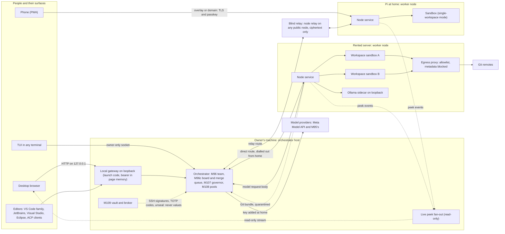
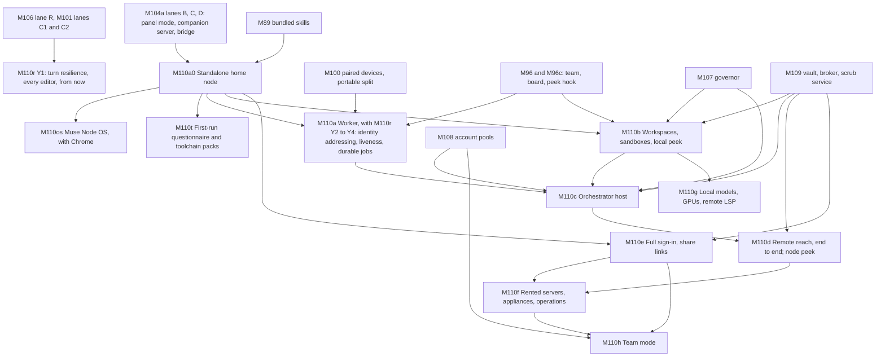

# Muse Node: a headless container node, its links, its web UI and terminal (2026-10-05)

Research for PLAN.md D90/M110. The owner (2026-10-05): "as a side quest i
would like to have a headless version of this that can be installed in/as a
container and is only a node for the orchestrator to use to code or whatever
… like a mini OS or something i guess. this should be planned but not yet
implimented … but i do want it fully planned and roadmapped out". Then: "and
the headless version i guess we should also be able to be an orchestrator
host as well with a web ui and terminal tui to access", "the web ui can likely
just be what we have currently but with a file explorer and some other suff in
there", and "plan it out better than i describe and suggest things i may be
missing or overlooking". Later the same day: "we should also plan this to
expand on our current multi device setup to expand it remotely so you can have
local talk to remote and install on a rented server etc we need the secure
password and user stuff and all of the other stuff to all be fully secure
e2e", and "is there a way for us to leverage web rtp or something so in the
agents map or tui we can view the chat and what the agent is outputting … it
should be like a link or command for each separate agent to basically peek at
the pipe read only". Then: "not gonna lie im so excited for the os i want to
start that asap as well i have some pcs around my house i would like to
install it on", and "i will be able to install this on bare bones x86 and
arm?" (§8).

## Method

- **Read-only.** No sign-in, account, credential or model call was used, and
  nothing was installed. The repository facts come from the source at
  `e9c4739f` and from the planning branches for M95, M96, M100, M102 and M104.
- **Five research passes** with web searches and fetches: containers and
  hosts (§1), security and end-to-end links (§2), web UI, terminal and editors
  (§3), licences and terms (§4), and bootable images (§8). The lead checked
  Google Chrome's terms and arm64 builds (§4.11) and browsers' WebAuthn rules
  for certificate errors (§2.5) directly. Where a fetch tool's summary could be wrong
  on something that matters, the raw page or source file was read instead
  (raw GitHub docs, the npm registry, the Docker Hub API). That caught one
  real error: a summary claimed WebAuthn allows an IP address as the relying
  party id, and the specification says the opposite (§2.5).
- **Quotes** came through a fetch tool's text extraction and are short. M110's
  lane 0 re-reads every source it relies on, and the terms in §4 are re-read
  before each release (D90.17).
- **Dates.** Each item gives the date the page shows, or "no date shown".
  Every page was read on 2026-10-05.
- **What a quote proves.** These are each vendor's own words as found that
  day. They are not legal advice.

## 1. Containers and hosts

### 1.1 Dev Containers

- `devcontainer.json` takes `image`, `build.dockerfile` or
  `dockerComposeFile`, with `features`, `mounts`, `runArgs` and
  `hostRequirements` (cpus, memory, storage, gpu). Lifecycle:
  `initializeCommand` runs "on the host machine during initialization"; in the
  container `onCreateCommand`, `updateContentCommand` and `postCreateCommand`
  run once, `postStartCommand` "each time the container is successfully
  started", `postAttachCommand` on each attach. —
  https://containers.dev/implementors/json_reference/ — no date shown.
  **For D90:** `initializeCommand` runs on the host, so the node runs it, if
  at all, inside the sandbox like every other hook, never in the node's
  process.
- `@devcontainers/cli` is MIT, 0.89.0 (published 2026-08-31), with `up`,
  `build`, `exec`, `run-user-commands` and `read-configuration`. It drives a
  Docker-compatible CLI (`--docker-path`), and `npm install -g` needs "Python
  and C/C++ installed to build one of the dependencies". —
  https://github.com/devcontainers/cli, https://registry.npmjs.org/@devcontainers/cli
  — no date shown on the README. containers.dev notes CodeSandbox "runs dev
  containers using rootless Podman instead of Docker" —
  https://containers.dev/supporting — no date shown.
- Features are OCI artifacts (`application/vnd.devcontainers`), so they pin by
  digest. — https://containers.dev/implementors/features-distribution/ — no
  date shown.

### 1.2 Multi-arch images and the Raspberry Pi

- An OCI image index is "a higher-level manifest which points to specific
  image manifests, ideal for one or more platforms". —
  https://github.com/opencontainers/image-spec/blob/main/image-index.md — no
  date shown.
- `docker buildx build --platform linux/amd64,linux/arm64` can use QEMU,
  native nodes or cross-compilation; QEMU "can be much slower than native
  builds". — https://docs.docker.com/build/building/multi-platform/ — no date
  shown.
- GitHub's arm64 runners became generally available for public repositories
  on 2025-08-07 (`ubuntu-24.04-arm`) —
  https://github.blog/changelog/2025-08-07-arm64-hosted-runners-for-public-repositories-are-now-generally-available/
  — and for private ones on 2026-01-29 (2 vCPU there, 4 in public
  repositories) —
  https://github.blog/changelog/2026-01-29-arm64-standard-runners-are-now-available-in-private-repositories/.
- Raspberry Pi OS (64-bit) runs on the 3B, 3B+, 3A+, 4B, 400, 5, 500, CM3–CM5
  and Zero 2 W; release dated 2026-09-15. —
  https://www.raspberrypi.com/software/operating-systems/. Docker Engine v28
  "will be the last major version to support Raspberry Pi OS 32-bit
  (armhf)". — https://docs.docker.com/engine/install/raspberry-pi-os/ — no
  date shown. **For D90:** arm64 only; the RAM floor, not the CPU, rules out
  the 3-series and the Zero 2 W.

### 1.3 Rootless Podman and Docker

- Rootless Docker "executes the Docker daemon and containers inside a user
  namespace", needs `newuidmap`/`newgidmap` and 65,536 subordinate ids. —
  https://docs.docker.com/engine/security/rootless/ — no date shown.
- Its `--cpus`, `--memory` and `--pids-limit` work "only when running with
  cgroup v2 and systemd"; other controllers need
  `Delegate=cpu cpuset io memory pids` in `user@.service.d/delegate.conf`. —
  https://docs.docker.com/engine/security/rootless/tips/ — no date shown.
- Rootless Docker does not support AppArmor, checkpoints or overlay
  networks; Ubuntu 24.04 and later restrict unprivileged user namespaces
  unless an AppArmor profile allows them. —
  https://docs.docker.com/engine/security/rootless/troubleshoot/ — no date
  shown.
- Rootless Podman uses pasta by default since 5.0; limits are "not supported
  on cgroups V1 rootless systems", and the fix for a permission error is the
  same `Delegate=` file. —
  https://github.com/containers/podman/blob/main/docs/tutorials/rootless_tutorial.md,
  https://docs.podman.io/en/latest/markdown/podman-run.1.html — no date shown.
- Quadlet turns `.container`, `.pod`, `.volume`, `.network` and `.kube` files
  into systemd units; rootless files live in `~/.config/containers/systemd/`.
  — https://docs.podman.io/en/latest/markdown/podman-systemd.unit.5.html — no
  date shown. It "has been merged into Podman 4.4" —
  https://www.redhat.com/en/blog/quadlet-podman — 2023-02-17.
- Podman's repository now redirects to `github.com/podman-container-tools/podman`;
  latest release v6.1.3 (2026-09-29). —
  https://github.com/podman-container-tools/podman/releases/tag/v6.1.3.

### 1.4 gVisor, Kata Containers, Firecracker

- gVisor is "an application kernel that implements a Linux-like interface";
  `runsc` "integrates with Docker and Kubernetes". — https://gvisor.dev/docs/
  — no date shown. Systrap is the default platform; KVM "runs best on bare
  metal". — https://gvisor.dev/docs/architecture_guide/platforms/ — no date
  shown. It runs on x86_64 and ARM64 with Linux 5.6+ —
  https://gvisor.dev/docs/user_guide/install/ — and `--nvproxy` runs "most
  CUDA applications" on chosen NVIDIA drivers —
  https://gvisor.dev/docs/user_guide/gpu/ — no date shown. Its costs fall on
  syscall-heavy and file-heavy work. —
  https://gvisor.dev/docs/architecture_guide/performance/.
- Kata needs "bare metal, or inside a VM that has nested virtualization
  enabled"; latest 4.2.0 (2026-09-15). —
  https://kata-containers.github.io/kata-containers/installation/ — no date
  shown.
- Firecracker starts a microVM in under 125 ms with under 5 MiB overhead. —
  https://firecracker-microvm.github.io/ — no date shown. **For D90:** VM
  isolation is an option where the host has KVM; the default stays rootless
  containers, which run on a Pi and in an LXC.

### 1.5 seccomp, AppArmor, Landlock, hardening flags

- Docker's default seccomp profile blocks about 44 of 300+ syscalls. —
  https://docs.docker.com/engine/security/seccomp/ — no date shown. Podman's
  defaults are `/usr/share/containers/seccomp.json` and `container-default`
  AppArmor; `read_only` is off by default. —
  https://raw.githubusercontent.com/containers/common/main/docs/containers.conf.5.md.
- `no-new-privileges` stops processes "gaining additional privileges through
  the execve(2) system call"; `--read-only` plus Podman's `--read-only-tmpfs`
  give a read-only root with tmpfs scratch. —
  https://docs.podman.io/en/latest/markdown/podman-run.1.html — no date shown.
- Landlock "empowers any process, including unprivileged ones, to securely
  restrict themselves"; ABI 4 added TCP bind and connect rules. —
  https://docs.kernel.org/userspace-api/landlock.html — August 2026. **For
  D90:** a candidate second fence for sandboxes on new kernels; not relied on.

### 1.6 Kubernetes and Helm

- StatefulSets give "stable, unique network identifiers" and "stable,
  persistent storage" through `volumeClaimTemplates`. —
  https://kubernetes.io/docs/concepts/workloads/controllers/statefulset/ —
  last modified 2026-08-23.
- RuntimeClass (stable since v1.20) selects a handler such as `runsc`. —
  https://kubernetes.io/docs/concepts/containers/runtime-class/ — last
  modified 2026-05-13.
- The "restricted" Pod Security Standard requires `runAsNonRoot`,
  `allowPrivilegeEscalation: false`, a `RuntimeDefault` or `Localhost`
  seccomp profile, and dropping `ALL` capabilities. —
  https://kubernetes.io/docs/concepts/security/pod-security-standards/ — last
  modified 2026-08-02.
- NetworkPolicy works on addresses and ports; its listed non-features include
  "Targeting of services by name", and without a controller it "will have no
  effect". — https://kubernetes.io/docs/concepts/services-networking/network-policies/
  — last modified 2026-04-14. **For D90:** hostname allowlists need the node's
  own egress proxy (D90.5).
- Helm 4 shipped 2025-11-12; the docs show 4.3.0. —
  https://www.cncf.io/announcements/2025/11/12/helm-marks-10-years-with-release-of-version-4/,
  https://helm.sh/docs/topics/charts/.

### 1.7 Proxmox VE

- In unprivileged containers "The root UID 0 inside the container is mapped
  to an unprivileged user outside"; `keyctl` "is required to use docker inside
  a container"; `nesting` "will expose procfs and sysfs contents of the host
  to the guest"; for "maximum isolation … nesting containers inside a Proxmox
  QEMU VM remains a recommended practice". —
  https://pve.proxmox.com/wiki/Linux_Container — last edited 2026-05-21.
- Proxmox VE 9.1 (2025-11-19) can "create LXC containers from OCI images";
  application containers are a technology preview. —
  https://www.proxmox.com/en/about/company-details/press-releases/proxmox-virtual-environment-9-1.

### 1.8 cloud-init

- Cloud-config begins with `#cloud-config` and takes `packages`, `users`,
  `write_files`, `runcmd`. — https://docs.cloud-init.io/en/latest/reference/examples.html
  — cloud-init 26.2 docs.
- AWS limits user data to 16 KB and runs it on first boot —
  https://docs.aws.amazon.com/AWSEC2/latest/UserGuide/user-data.html;
  DigitalOcean ("Last verified 23 Sep 2026") —
  https://docs.digitalocean.com/products/droplets/how-to/provide-user-data/;
  Hetzner (2025-03-06) — https://community.hetzner.com/tutorials/basic-cloud-config/;
  Vultr (2026-04-15) — https://docs.vultr.com/how-to-deploy-a-vultr-server-with-cloudinit-userdata;
  Akamai/Linode (2026-03-01) —
  https://techdocs.akamai.com/cloud-computing/docs/add-user-data-when-deploying-a-compute-instance.
  **For D90:** one cloud-config snippet covers the common providers; AWS's
  16 KB cap means the snippet fetches and verifies the installer rather than
  embedding it.

### 1.9 Base images

- Distroless holds "only your application and its runtime dependencies", no
  "package managers, shells"; Node images exist on Debian 13. —
  https://github.com/GoogleContainerTools/distroless — no date shown.
- Compressed amd64 sizes from the Docker Hub API: `node:24-trixie-slim`
  82.5 MB, `node:24-bookworm-slim` 80.8 MB (updated 2026-09-19),
  `node:24-alpine` 61.6 MB, `debian:trixie-slim` 29.8 MB. —
  `https://hub.docker.com/v2/repositories/library/node/tags/<tag>`.
- "Generally, applications written for Debian (glibc) will not run under
  Alpine (musl)"; musl builds of Node are "Experimental" on the v22, v24 and
  v26 branches. — https://github.com/nodejs/docker-node/blob/main/README.md
  (last commit 2026-08-31), https://github.com/nodejs/node/blob/main/BUILDING.md.
- Chainguard's standard images carry no shell or package manager; free use
  gets two tags. — https://edu.chainguard.dev/chainguard/containers/concepts/container-variants/
  — updated 2026-09-28. **For D90:** Debian slim, because agents need a shell
  and Muse Code needs glibc (§4.1).

### 1.10 GPUs and local models

- NVIDIA: the Container Toolkit with `--gpus all`, or CDI
  (`nvidia-ctk cdi generate`; Podman `--device nvidia.com/gpu=all`); toolkit
  v1.20.1 (2026-09-19). —
  https://docs.nvidia.com/datacenter/cloud-native/container-toolkit/latest/cdi-support.html.
- AMD ROCm: `--device /dev/kfd --device /dev/dri`. —
  https://rocm.docs.amd.com/projects/install-on-linux/en/latest/how-to/docker.html.
  Intel: `--device=/dev/dri`. — https://github.com/intel/oneapi-containers.
- Docker Desktop's GPU passthrough "is only available on Windows with the WSL
  2 backend". — https://docs.docker.com/desktop/features/gpu/. Ollama: "GPU
  acceleration is not available for Docker Desktop in macOS due to the lack of
  GPU passthrough and emulation". — https://docs.ollama.com/faq — no date
  shown.
- Podman's libkrun machine (now the default on macOS) offers a "virtualized
  GPU" translating Vulkan to Metal, with a patched Mesa in the container —
  https://podman-desktop.io/docs/podman/gpu; Red Hat measured a "40x
  improvement" with llama.cpp's Vulkan backend —
  https://developers.redhat.com/articles/2025/06/05/how-we-improved-ai-inference-macos-podman-containers
  (2025-06-05).
- Ollama's images: CPU, NVIDIA with `--gpus=all`, `:rocm` for AMD. —
  https://docs.ollama.com/docker. llama.cpp's server images carry `-cuda`,
  `-rocm`, `-vulkan` and `-intel` variants. —
  https://github.com/ggml-org/llama.cpp/blob/master/docs/docker.md.

### 1.11 systemd hardening

- `DynamicUser=` implies `ProtectSystem=strict`, `ProtectHome=read-only`,
  `PrivateTmp=`, `NoNewPrivileges=yes` and more; `RestrictAddressFamilies=`
  and `SystemCallFilter=` take allowlists. —
  https://man7.org/linux/man-pages/man5/systemd.exec.5.html — systemd 262,
  2026-08-04 (freedesktop.org refused the fetch).
- `MemoryHigh=` throttles, `MemoryMax=` is an "absolute limit", `CPUQuota=`
  maps to `cpu.max`. — https://man7.org/linux/man-pages/man5/systemd.resource-control.5.html.
- `systemd-analyze security` gives a 0.0–10.0 "exposure level" and takes
  `--threshold=`. — https://man7.org/linux/man-pages/man1/systemd-analyze.1.html.
  **For D90:** the installer's report and a gate (M110 gates).

### 1.12 Health checks and OpenTelemetry

- Kubernetes startup, liveness and readiness probes; readiness failure removes
  a pod from endpoints. —
  https://kubernetes.io/docs/concepts/configuration/liveness-readiness-startup-probes/
  — last modified 2026-06-30. Docker's `HEALTHCHECK` defaults to a 30-second
  interval and three retries. —
  https://raw.githubusercontent.com/moby/buildkit/master/frontend/dockerfile/docs/reference.md.
- OpenTelemetry JavaScript: traces and metrics "Stable", logs "Development". —
  https://opentelemetry.io/docs/languages/js/ — last modified 2026-02-21.
  OTLP over HTTP defaults to port 4318. —
  https://opentelemetry.io/docs/languages/sdk-configuration/otlp-exporter/ —
  last modified 2026-09-10. **For D90:** export is off by default and goes
  only to the user's own collector; logs wait for a stable SDK or use the
  node's own JSONL.

## 2. Security and end-to-end links

### 2.1 Noise and WireGuard

- Noise Revision 34 (2018-07-11): in IK the initiator already knows the
  responder's static key; in XX both are sent. IK's first payload has
  "forward secrecy for sender compromise only, vulnerable to replay";
  transport messages in both reach "strong forward secrecy". —
  https://noiseprotocol.org/noise.html.
- WireGuard is `Noise_IKpsk2_25519_ChaChaPoly_BLAKE2s`, with a 64-bit counter
  and "a window of roughly 2000 prior values". —
  https://www.wireguard.com/protocol/ — no date shown.
- JavaScript Noise: `@chainsafe/libp2p-noise` 17.0.0 (XX only, Apache-2.0 or
  MIT), `noise-handshake` 4.2.0 (Apache-2.0), `noise-protocol` 3.0.2 (stale).
  None mentions an audit. — https://github.com/ChainSafe/js-libp2p-noise,
  https://github.com/holepunchto/noise-handshake,
  https://github.com/emilbayes/noise-protocol — no date shown.
- **For D90.8:** Noise IK fits, but no audited JavaScript implementation
  exists, and Node's TLS is already the reviewed stack M100 uses.

### 2.2 TLS 1.3, pinning, QUIC

- RFC 8446: CertificateRequest when "certificate-based client authentication
  is desired"; for 0-RTT "There are no guarantees of non-replay between
  connections". — https://www.rfc-editor.org/rfc/rfc8446.html — August 2018.
- Node v26.10.0: TLS 1.3 is the default maximum; servers "may set
  `requestCert` to true"; the docs show no early-data API. —
  https://nodejs.org/api/tls.html. The `checkServerIdentity` example pins
  `sha256(cert.pubkey)`. — https://nodejs.org/api/https.html.
- `node:quic` is "Stability: 1.0 - Early development", behind
  `--experimental-quic`, which official binaries do not set (PR #62876, merged
  2026-05-19). — https://raw.githubusercontent.com/nodejs/node/main/doc/api/quic.md,
  https://github.com/nodejs/node/pull/62876.
- Node's v26.10.0 documentation index lists no WebRTC module. —
  https://nodejs.org/api/index.html (D90.22).

### 2.3 PAKE and short authentication strings

- SPAKE2 is RFC 9382 (September 2023, Informational). —
  https://www.rfc-editor.org/rfc/rfc9382.html. CPace is
  draft-irtf-cfrg-cpace-21, "Sent to the RFC Editor" (page updated
  2026-08-19). — https://datatracker.ietf.org/doc/draft-irtf-cfrg-cpace/.
  OPAQUE is RFC 9807 (July 2025). — https://www.rfc-editor.org/rfc/rfc9807.html.
- `@serenity-kit/opaque` 1.1.0 (MIT) wraps the audited opaque-ke in
  WebAssembly. — https://github.com/serenity-kit/opaque,
  https://github.com/facebook/opaque-ke. No audited JavaScript SPAKE2 or CPace
  was found; the `spake2` package calls itself unaudited. —
  https://www.npmjs.com/package/spake2 (through search; npm refused the
  fetch).
- Matrix `m.sas.v1`: the starter commits first, so "an attacker essentially
  only has one attempt… if we verify n bits, then an attacker has a 1 in 2^n
  chance"; emoji use 42 bits, decimal three 13-bit numbers. —
  https://spec.matrix.org/latest/client-server-api/ — spec v1.19. MSC4405
  (2026-01-20) proposes retiring emoji SAS for decimal. —
  https://github.com/matrix-org/matrix-spec-proposals/pull/4405.
- Signal compares a 60-digit number or a QR code (2016-11-17). —
  https://signal.org/blog/safety-number-updates/. Magic Wormhole uses SPAKE2
  so a malicious mailbox gets "only a single guess", and its relay carries
  messages "which are all encrypted". —
  https://magic-wormhole.readthedocs.io/en/latest/welcome.html.

### 2.4 Overlays, relays and tunnels: who sees plaintext

- Tailscale's DERP "blindly forwards already-encrypted traffic" (2026-01-21) —
  https://tailscale.com/kb/1232/derp-servers; every connection type is
  WireGuard end to end (2026-06-01) — https://tailscale.com/kb/1257/connection-types.
- "If Tailscale were malicious, and stealthily inserted new nodes… could send
  or receive traffic to your existing nodes in plaintext"; Tailnet Lock is the
  defence (2025-12-02). — https://tailscale.com/kb/1226/tailnet-lock.
- Headscale is "an open source, self-hosted implementation of the Tailscale
  control server", BSD-3-Clause. — https://github.com/juanfont/headscale.
- Funnel's "relay servers do not decrypt the traffic" (2026-01-20). —
  https://tailscale.com/kb/1223/funnel.
- Cloudflare Tunnel makes "outbound-only connections", and Cloudflare "must
  decrypt traffic in order to cache and filter". —
  https://developers.cloudflare.com/cloudflare-one/connections/connect-networks/
  (2026-08-04), https://developers.cloudflare.com/ssl/troubleshooting/faq/
  (2026-04-16).
- ngrok terminating TLS at the agent or upstream means "the ngrok cloud
  service can not see the payloads". —
  https://ngrok.com/docs/universal-gateway/tls-termination.
- **For D90.8:** our relay is like DERP or Funnel (ciphertext only); a tunnel
  that decrypts is never a route.

### 2.5 Web sign-in

- WebAuthn Level 3 is a W3C Recommendation, 25 August 2026. The relying party
  id is "a valid domain string"; "Only the domain format of host is allowed…
  in recognition of various issues with using direct IP address
  identification"; the API is `[SecureContext]`. —
  https://www.w3.org/TR/webauthn-3/.
- Secure contexts include https, `127.0.0.0/8`, `::1` and `localhost`;
  plain-HTTP LAN addresses are not. —
  https://developer.mozilla.org/en-US/docs/Web/Security/Secure_Contexts —
  2026-09-14.
- Let's Encrypt IP-address certificates became generally available on
  2026-01-15 and "must be short-lived" (160 hours). —
  https://letsencrypt.org/2026/01/15/6day-and-ip-general-availability.
- **Passkeys need a certificate the browser trusts.** Chrome, from M110:
  "Chrome will stop allowing WebAuthn requests on websites with TLS
  certificate errors", by the same criteria as the danger interstitial, to
  "prevent bad actors from generating valid assertions by mitm'ing users who
  may skip the interstitial" (a flag and the `AllowWebAuthnWithBrokenTlsCerts`
  enterprise policy override it). —
  https://lists.w3.org/Archives/Public/public-webauthn/2022Nov/0135.html —
  2022-11-24. Firefox 140 fixed CVE-2025-6433, where a page with a
  certificate exception could still ask for WebAuthn, "in violation of the
  WebAuthN spec which requires 'a secure transport established without
  errors'". — https://www.mozilla.org/en-US/security/advisories/mfsa2025-51/,
  https://bugzilla.mozilla.org/show_bug.cgi?id=1954033; Proxmox users saw
  self-signed WebAuthn logins stop on Firefox 140 —
  https://forum.proxmox.com/threads/login-mittels-webauthn-funktioniert-mit-firefox-bei-self-signed-zertifikat-nicht-mehr.168164/
  (2025-07-05). **For D90.23:** a LAN node's own certificate must be
  installed as trusted on each PC; clicking through a warning cannot work.
- SimpleWebAuthn: MIT, `@simplewebauthn/server` 14.0.3 (2026-09-25), Node 22+.
  — https://github.com/MasterKale/SimpleWebAuthn.
- OIDC Core 1.0 with errata set 2 (2023-12-15) —
  https://openid.net/specs/openid-connect-core-1_0.html; PKCE, RFC 7636 —
  https://www.rfc-editor.org/rfc/rfc7636; RFC 9700 (January 2025): "Public
  clients MUST use PKCE" — https://www.rfc-editor.org/rfc/rfc9700.html.
- TOTP, RFC 6238: "We RECOMMEND a default time-step size of 30 seconds" —
  https://www.rfc-editor.org/rfc/rfc6238; HOTP, RFC 4226 §7.3 recommends
  throttling — https://www.rfc-editor.org/rfc/rfc4226.
- OWASP: Argon2id at "a minimum configuration of 19 MiB of memory, an
  iteration count of 2, and 1 degree of parallelism"; scrypt N=2^17, r=8,
  p=1. — https://cheatsheetseries.owasp.org/cheatsheets/Password_Storage_Cheat_Sheet.html.
  RFC 9106's second recommended option is t=3, 64 MiB. —
  https://www.rfc-editor.org/rfc/rfc9106. Node's `crypto.argon2()` is "Added
  in: v24.7.0". — https://nodejs.org/api/crypto.html.
- OWASP CSRF: Fetch Metadata's `Sec-Fetch-Site` is "the primary signal", with
  origin verification as a "mandatory" fallback. —
  https://cheatsheetseries.owasp.org/cheatsheets/Cross-Site_Request_Forgery_Prevention_Cheat_Sheet.html.
  Credential stuffing: MFA "is by far the best defense". —
  https://cheatsheetseries.owasp.org/cheatsheets/Credential_Stuffing_Prevention_Cheat_Sheet.html.
- NIST SP 800-63B-4 (July 2025): a verifier "SHALL limit consecutive failed
  authentication attempts … to no more than 100". —
  https://pages.nist.gov/800-63-4/sp800-63b.html.

### 2.6 Hardware-backed keys

- tpm2-software provides tpm2-tss and tpm2-tools —
  https://tpm2-software.github.io/; `systemd-creds` derives keys from "the
  system's TPM2 chip" — https://www.freedesktop.org/software/systemd/man/latest/systemd-creds.html.
- The Secure Enclave "Works only with NIST P-256 elliptic curve keys" and
  "Can't encode preexisting keys". —
  https://developer.apple.com/documentation/security/protecting-keys-with-the-secure-enclave.
  Windows' Platform Crypto Provider "can create keys in the TPM" (2025-08-15).
  — https://learn.microsoft.com/en-us/windows/security/hardware-security/tpm/how-windows-uses-the-tpm.
  Android's StrongBox supports ECDSA P-256 (2026-03-06). —
  https://developer.android.com/privacy-and-security/keystore.
- `node:crypto` has no TPM, Secure Enclave, CNG or Keystore API; OpenSSL
  engines are deprecated in OpenSSL 3. — https://nodejs.org/api/crypto.html,
  https://nodejs.org/api/tls.html. **For D90.9:** the TPM seals the vault key
  through OS tools (D89); the TLS key itself is in memory until an OpenSSL TPM
  provider is qualified.
- Clouds' virtual TPMs (GCP Shielded VM, Azure Trusted Launch, AWS NitroTPM)
  were not researched here; lane 0 records which of the owner's candidate
  providers offer one (§7).

### 2.7 Replay and revocation

- Noise nonces are a 64-bit counter with no built-in replay window (§11.4). —
  https://noiseprotocol.org/noise.html. RFC 6479 describes an anti-replay
  bitmap window. — https://datatracker.ietf.org/doc/html/rfc6479.
- Let's Encrypt: "certificate revocation doesn't work very well", hence
  short-lived certificates (2025-01-16) —
  https://letsencrypt.org/2025/01/16/6-day-and-ip-certs; OCSP ended in 2025 —
  https://letsencrypt.org/2024/12/05/ending-ocsp. **For D90.9:** per-pair
  pins with rotation and a pushed revocation list, not a CA's revocation.

### 2.8 Supply chain

- cosign keyless: "Fulcio issues short-lived certificates binding an ephemeral
  key to an OpenID Connect identity"; verify with `--certificate-identity` and
  `--certificate-oidc-issuer https://token.actions.githubusercontent.com`. —
  https://docs.sigstore.dev/cosign/signing/overview/,
  https://raw.githubusercontent.com/sigstore/cosign/main/doc/cosign_verify.md.
- SLSA v1.2 (2025-11-24) adds a source track; build L2 is "Signed provenance,
  generated by a hosted build platform". —
  https://slsa.dev/blog/2025/11/announce-slsa-v1.2. GitHub's artifact
  attestations alone give "SLSA v1.0 Build Level 2"; L3 needs reusable
  workflows. — https://docs.github.com/en/actions/concepts/security/artifact-attestations.
  `gh attestation verify oci://…` checks them. —
  https://github.com/actions/attest-build-provenance.
- BuildKit adds `mode=min` provenance by default and takes `--sbom=true` and
  `--provenance=mode=max` (2026-07-30). —
  https://docs.docker.com/build/metadata/attestations/. SPDX's latest is
  3.0.1; CycloneDX 1.7 (2025-10-21) is ECMA-424. —
  https://spdx.github.io/spdx-spec/latest/, https://cyclonedx.org/specification/overview/.
  Syft and Grype are Apache-2.0. — https://github.com/anchore/syft,
  https://github.com/anchore/grype.
- TUF: clients "MUST NOT replace a metadata file with a version number less
  than the one currently trusted" (spec 1.0.36, 2026-08-05). —
  https://theupdateframework.github.io/specification/latest/. **For D90.15:**
  the update channel refuses a lower version and stale metadata.

### 2.9 Rented servers: hardening and what the provider sees

- Debian's unattended-upgrades installs security updates by default
  (2026-07-10) — https://wiki.debian.org/UnattendedUpgrades; Ubuntu installs
  it by default — https://ubuntu.com/server/docs/how-to/software/automatic-updates/;
  nftables is Debian's default framework (2026-10-04) —
  https://wiki.debian.org/nftables; ufw is "initially disabled" —
  https://ubuntu.com/server/docs/how-to/security/firewalls/.
- fail2ban (GPLv2+) "cannot eliminate the risk presented by weak
  authentication" — https://github.com/fail2ban/fail2ban; CrowdSec is MIT —
  https://github.com/crowdsecurity/crowdsec.
- sshd's defaults include `PasswordAuthentication yes` (2026-09-17). —
  https://man.openbsd.org/sshd_config. **For D90.20:** the installer checks
  and offers to switch it off.
- Without confidential disk encryption, Azure says data "may be accessible to
  the host" (2026-08-25) —
  https://learn.microsoft.com/en-us/azure/confidential-computing/confidential-vm-overview;
  TDX encrypts guest memory against the host — https://docs.kernel.org/arch/x86/tdx.html;
  SEV-SNP adds memory integrity — https://www.amd.com/en/developer/sev.html.
  AWS offers SEV-SNP on m6a, c6a and r6a in two regions at +10% —
  https://docs.aws.amazon.com/AWSEC2/latest/UserGuide/sev-snp.html; GCP has
  SEV, SEV-SNP and TDX machine types (2026-10-02) —
  https://docs.cloud.google.com/confidential-computing/confidential-vm/docs/supported-configurations.
  **For D90.14:** an ordinary rented server is assumed readable by its host.

### 2.10 mDNS

- ".local." names are "meaningful only on the link where they originate". —
  https://www.rfc-editor.org/rfc/rfc6762 (February 2013); DNS-SD over unicast
  takes configuration — https://www.rfc-editor.org/rfc/rfc6763. **For D90:**
  discovery stays a LAN convenience (D80.2); remote nodes are added by
  invitation.

## 3. Web UI, terminal and editors

### 3.1 xterm.js and node-pty

- xterm.js is MIT, "used by popular projects such as VS Code"; 6.0.0
  (2025-12-22) dropped the canvas renderer. —
  https://github.com/xtermjs/xterm.js, https://registry.npmjs.org/@xterm/xterm.
  `screenReaderMode` exposes elements "to support NVDA on Windows and
  VoiceOver on macOS". —
  https://xtermjs.org/docs/api/terminal/interfaces/iterminaloptions/.
- node-pty is MIT (Microsoft), 1.1.0 (2025-12-22), a native module with
  prebuilds only for Windows and macOS; its README: "We recommend launching
  the pty inside a container." — https://github.com/microsoft/node-pty,
  https://unpkg.com/node-pty@1.1.0/?meta.

### 3.2 Editors: CodeMirror 6 and Monaco

- Monaco is MIT; asked about mobile browsers its FAQ says "No."; language
  services "create web workers". — https://github.com/microsoft/monaco-editor.
  0.57.0 (2026-09-24): main chunk about 4.16 MB minified, 1.06 MB gzipped. —
  https://bundlephobia.com/api/size?package=monaco-editor@0.57.0.
- CodeMirror 6 is MIT; `codemirror` 6.0.2's basic setup is 373 KB minified,
  119 KB gzipped. — https://bundlephobia.com/api/size?package=codemirror@6.0.2.
  It "Works well with screen readers and keyboard-only users" and uses "the
  platform's native selection and editing features on phones". —
  https://codemirror.net/. Its GitHub repository is archived and development
  moved to code.haverbeke.berlin; npm releases continue (`@codemirror/view`
  6.43.13, 2026-09-22). — https://github.com/codemirror/dev.
- Sourcegraph cut its search page's JavaScript from 6 MB to 3.4 MB by leaving
  Monaco (2022-10-25). — https://sourcegraph.com/blog/migrating-monaco-codemirror.
  Replit: "Monaco did not support mobile" (2022-03-09). —
  https://replit.com/blog/codemirror.

### 3.3 Browser VS Code

- code-server: MIT, v4.140.0 (2026-10-01). "Never expose code-server directly
  to the internet without some form of authentication and encryption,
  otherwise someone can take over your machine via the terminal." One password
  or none; teams are pointed to Coder; it uses Open VSX because of the
  Marketplace terms. — https://github.com/coder/code-server,
  https://coder.com/docs/code-server/guide, https://coder.com/docs/code-server/FAQ.
- OpenVSCode Server: MIT, a connection token; without it "anyone can access
  the IDE using just the hostname and port". —
  https://github.com/gitpod-io/openvscode-server.
- VS Code Server: "hosting it as a service is not allowed" (updated
  2026-09-30). — https://code.visualstudio.com/docs/remote/vscode-server.
  Remote Tunnels go "via Microsoft dev tunnels" and need a GitHub or Microsoft
  account on both ends. — https://code.visualstudio.com/docs/remote/tunnels.

### 3.4 Remote workers and sandboxes: how others connect

- Coder: "clients and agents only make outbound HTTP/HTTPS and WebSocket
  connections to the Coder server", over WireGuard with STUN and DERP relays
  as the fallback. — https://coder.com/docs/admin/networking — no date shown.
- Cursor's self-hosted workers open "a long-lived outbound HTTPS connection":
  "No inbound ports, public IPs, or VPN tunnels" (launch 2026-03-25). —
  https://cursor.com/docs/cloud-agent/self-hosted,
  https://cursor.com/blog/self-hosted-cloud-agents.
- E2B: "Every E2B sandbox runs in its own Firecracker microVM with its own
  kernel." — https://e2b.dev/security. Daytona's sandboxes have "a dedicated
  kernel, filesystem, network stack". — https://www.daytona.io/docs/.
- **For D90.8:** workers that dial out are the established shape; D90 keeps
  it without a vendor's server in the middle.

### 3.5 Terminal UIs and screen readers

- Ink: MIT; 8.0.0 (2026-10-03) needs React 19.3 or later and Node 22 or later;
  used by Claude Code, Gemini CLI and GitHub Copilot CLI; "basic support for
  screen readers". — https://github.com/vadimdemedes/ink,
  https://registry.npmjs.org/ink. The repository pins React 19.3.0 and
  Node 22 or later.
- Gemini CLI's `--screen-reader` renders "plain-text" (2026-05-14). —
  https://geminicli.com/docs/cli/settings/. Claude Code's `--ax-screen-reader`
  prints "plain, linear text" with role labels, numbered menus and OSC 133
  marks. — https://code.claude.com/docs/en/accessibility. Codex's TUI moved to
  Rust and ratatui (2025-05-30). — https://github.com/openai/codex/discussions/1174.

### 3.6 Web terminal security

- OWASP: "Validate the `Origin` header on every handshake. Always use an
  explicit allowlist"; send the token in the first message rather than the
  URL; limit message size and rate. —
  https://cheatsheetseries.owasp.org/cheatsheets/WebSocket_Security_Cheat_Sheet.html.
- PortSwigger: cross-site WebSocket hijacking works when the handshake "relies
  solely on HTTP cookies". —
  https://portswigger.net/web-security/websockets/cross-site-websocket-hijacking.
- Prior art: ttyd (MIT; read-only by default, `--check-origin` opt-in) —
  https://github.com/tsl0922/ttyd; WeTTY (MIT) — https://github.com/butlerx/wetty;
  GoTTY's fork (MIT; writes off by default, cross-origin refused) —
  https://github.com/sorenisanerd/gotty.

### 3.7 Git and diff components

- isomorphic-git (MIT, no native modules) — https://github.com/isomorphic-git/isomorphic-git;
  diff2html (MIT) — https://github.com/rtfpessoa/diff2html; `@codemirror/merge`
  6.12.2 (MIT; split and unified views) — https://github.com/codemirror/merge.
  **For D90.12:** git stays the CLI in the sandbox (M71's routines);
  `@codemirror/merge` draws diffs.

### 3.8 File trees

- react-arborist 3.16.0 (MIT; virtualized, keyboard, ARIA) —
  https://github.com/jameskerr/react-arborist; `@headless-tree/react` 1.7.0
  (MIT; "Accessibility is ensured by default") —
  https://github.com/lukasbach/headless-tree.

### 3.9 ACP and LSP transports

- ACP: local agents use "JSON-RPC over stdio", and "Full support for remote
  agents is a work in progress". —
  https://agentclientprotocol.com/overview/introduction. Streamable HTTP is a
  "draft proposal in progress". — https://agentclientprotocol.com/protocol/transports.
- The remote transport RFD (Draft 2026-04-22, Active 2026-07-02): one `/acp`
  endpoint with Streamable HTTP and WebSocket; auth is "orthogonal"; Origin
  validation is deferred to "Phase 4 — Hardening". —
  https://agentclientprotocol.com/rfds/streamable-http-websocket-transport.
  `@agentclientprotocol/sdk` 1.7.0 (2026-10-02) ships experimental HTTP and
  WebSocket clients and a server. — https://registry.npmjs.org/@agentclientprotocol/sdk.
  The repository pins 1.5.0.
- LSP servers support "stdio, pipes, …" and sockets —
  https://microsoft.github.io/language-server-protocol/specifications/lsp/3.17/specification/;
  `@codemirror/lsp-client` 6.3.0 (MIT) has a pluggable transport with a
  WebSocket example — https://unpkg.com/@codemirror/lsp-client/README.md.

### 3.10 Live peek and WebRTC

The owner asked whether WebRTC could carry a read-only view of each agent's
stream. What the stream is decides it: text events (messages, tool calls,
command output, file changes, waiting approvals) that the harness already
has, for viewers who already reach the orchestrator through an authenticated
channel. WebRTC is built for media and peer-to-peer paths; it would need a
signalling service, STUN and usually TURN (a relay with its own trust model),
DTLS keys whose authenticity rests on that signalling, and, in Node, a native
module, since Node's documentation lists no WebRTC (§2.2). The fetch-based
event stream M104 lane C already authenticates (EventSource cannot send an
`Authorization` header) carries text with none of that, and the pair's
channel (D90.8) carries it from remote nodes. D90.22 records the design.

## 4. Licences and terms

### 4.1 Meta (Muse Code, the Model API)

- "Muse Code runs on macOS, Linux, and Windows from one codebase." —
  https://dev.meta.ai/docs/muse-code — no date shown. The product page says
  "Available for MacOS and Windows". — https://dev.meta.ai/products/muse-code.
- The installer (`curl -fsSL https://dev.meta.ai/install.sh | sh`) fetches
  `https://api.meta.ai/muse-launcher.sh`, which accepts `Linux:arm64|aarch64`
  and `Linux:x86_64|amd64` and stops elsewhere with "unsupported platform";
  neither script shows a licence prompt. — https://dev.meta.ai/install.sh,
  https://api.meta.ai/muse-launcher.sh — no date shown.
- The sandbox: "on Linux needs a working bubblewrap and a non-musl build.
  Without it, every sandboxed shell command aborts as an environment failure."
  `--yolo` disables "approval and the sandbox … use it only on trusted code in
  a disposable, isolated container". `muse exec` runs one prompt to
  completion. — https://dev.meta.ai/docs/muse-code/extending,
  https://dev.meta.ai/docs/muse-code/permissions — no date shown.
- Sign-in: browser sign-in, an API key (`META_API_KEY` or `muse auth set`), or
  `/login`; "An API key always takes priority over a browser sign-in"; "A
  pipeline has no browser, so provide META_API_KEY in the environment". No
  device-code flow is documented. — https://dev.meta.ai/docs/muse-code/auth.
- Subscriptions: "works only through the Muse Code CLI while signed in with
  your Meta Model API account"; "Any additional API keys you create … will be
  billed through pay-as-you-go"; plans Everyday $5, High $15 and Power $50 a
  month; no team plan named. —
  https://dev.meta.ai/docs/muse-code/subscriptions, https://dev.meta.ai/products/muse-code.
  "Limits apply per team, not per API key." —
  https://dev.meta.ai/docs/pricing-rate-limits.
- Meta Model API Terms of Service (last updated October 2, 2026),
  https://dev.meta.ai/legal/terms-of-service:
  - §3.1: "You may not share, sell, or transfer your Meta Model API key with
    any third party without our prior written permission."
  - §3.2: the subscription key "is for use only with the coding harness …
    and may not be used to access the Services outside the coding harness".
  - §10.1(i): no access "on behalf of any third party", and "you may not
    resell, or otherwise provide access to the Services … through any model
    aggregator, API gateway, proxy, or similar offering".
  - §10.1(xii) and (xiii): no evading rate limits; no consumption
    "inconsistent with legitimate end-user application use".
  - §1 and §10.1(xiv): Downloadable Materials are licensed "personal,
    non-transferable", and may not be "redistribute[d]" or made "available …
    to any third party". The terms do not name Muse Code; no separate CLI
    licence was found, while the SDK is MIT
    (https://github.com/meta-models/muse-code-sdk).
- Acceptable Use Policy (no date shown), https://dev.meta.ai/legal/acceptable-use-policy:
  agents may not "Circumvent, disable, or evade human review, monitoring, or
  other oversight controls", and consequential actions need "appropriate
  authorization, human oversight, review, and confirmation".
- **For D90.7 and D90.17:** no CLI in our images; one person per sign-in and
  key; the relay for one person only; approvals go to people; no `--yolo`.

### 4.2 Anthropic (Claude Code)

- "preinstalling or running Claude Code in your products or services (e.g. in
  hosted sandboxes or other agent infrastructure) requires agreeing to our
  Commercial Terms"; "The Claude Code binary must not be modified"; "Each end
  user must authenticate with their own" credentials; developers "may not
  collect, store, or intermediate Claude.ai credentials or session tokens". —
  https://code.claude.com/docs/en/legal-and-compliance — no date shown.
- The devcontainer reference installs it from Anthropic's feature or npm. —
  https://code.claude.com/docs/en/devcontainer. Consumer Terms (effective
  October 8, 2025) forbid automated access except with an API key, and
  sharing an account. — https://www.anthropic.com/legal/consumer-terms.

### 4.3 OpenAI Codex CLI

- Apache-2.0, with a Linux arm64 musl build. — https://github.com/openai/codex.
  `codex login --device-auth` (beta); "Treat `~/.codex/auth.json` like a
  password"; "Don't expose Codex execution in untrusted or public
  environments". — https://learn.chatgpt.com/docs/auth. OpenAI's Terms of Use
  refused the fetch (403); they are read in a browser before release.

### 4.4 Google Gemini CLI

- Apache-2.0. "Directly accessing the services powering Gemini CLI … using
  third-party software … is a violation of applicable terms and policies"
  (2026-04-10). — https://www.geminicli.com/docs/resources/tos-privacy.
  Headless uses cached credentials or `GEMINI_API_KEY` (2026-09-18). —
  https://geminicli.com/docs/get-started/authentication/. On the unpaid tier
  Google uses submitted content to improve its products (2026-04-28). —
  https://ai.google.dev/gemini-api/terms.

### 4.5 GitHub Copilot CLI

- Its licence allows reproducing "unmodified copies" inside an application
  with "material functionality beyond the Software itself". —
  https://github.com/github/copilot-cli/blob/main/LICENSE.md. Programmatic
  mode is documented for "scripts, CI/CD pipelines, and automation
  workflows". —
  https://docs.github.com/en/copilot/how-tos/copilot-cli/automate-copilot-cli/run-cli-programmatically.

### 4.6 Ollama, llama.cpp, Llama

- Ollama and llama.cpp are MIT. — https://github.com/ollama/ollama/blob/main/LICENSE,
  https://github.com/ggml-org/llama.cpp/blob/master/LICENSE.
- Llama 4 Community License (2025-04-05): above 700 million monthly active
  users "you must request a license"; distributors "prominently display
  'Built with Llama'" and ship the notice. —
  https://dev.meta.ai/llama/llama4/license/. Its use policy grants no
  multimodal rights to EU-domiciled individuals or companies. —
  https://dev.meta.ai/llama/llama4/use-policy/.

### 4.7 VS Code Server and the extension registries

- The VS Code Server licence: no "host, share, publish, rent or lease the
  software", nor "provide the software as a stand-alone offering or combine
  it with any of your applications for others to use". —
  https://code.visualstudio.com/license/server.
- Marketplace terms §2(b) (September 2025): "Marketplace Offerings are
  intended for use only with In-Scope Products and Services". —
  https://cdn.vsassets.io/v/M264_20251020.18/_content/Microsoft-Visual-Studio-Marketplace-Terms-of-Use.pdf.
  Open VSX charges no fees; its free tier is under 3 requests per second
  (2026-04-09). — https://www.eclipse.org/legal/open-vsx-registry-faq/,
  https://github.com/EclipseFdn/open-vsx.org/wiki/rate-limiting.

### 4.8 Docker, Podman and registries

- Docker Desktop is free for businesses under 250 employees and $10 million
  revenue; Docker Engine is Apache-2.0. —
  https://docs.docker.com/subscription/desktop-license/, https://docs.docker.com/engine/.
  Podman is Apache-2.0. — https://github.com/containers/podman.
- Docker Hub: unauthenticated pulls are limited to "100 per IPv4 address or
  IPv6 /64 subnet" per 6 hours. — https://docs.docker.com/docker-hub/usage/.

### 4.9 Hosting providers

- Hetzner Cloud forbids "The scanning of foreign networks or foreign IP
  addresses". — https://www.hetzner.com/legal/cloud-server/. DigitalOcean
  (2026-03-20) forbids probing others' systems and bypassing "safety
  mechanisms, guardrails, or usage restrictions implemented in artificial
  intelligence systems". — https://www.digitalocean.com/legal/acceptable-use-policy.

### 4.10 Must check before release

1. **Shipping `muse`.** §10.1(xiv) and the missing CLI licence: images ship
   without it; ask Meta in writing before ever bundling it (Q-M110).
2. **A subscription sign-in on a node without a browser.** Undocumented;
   capture it before any "use your subscription" claim.
3. **The model relay and team nodes** against §3.1 and §10.1(i) (Q-M110).
4. **bubblewrap in a rootless container**, on amd64 and arm64.
5. **Other vendors' sign-ins:** the node never holds Claude.ai, Gemini or
   ChatGPT tokens; hosting Claude Code needs the user's Commercial Terms.
6. **The browser editor:** CodeMirror, or code-server with Open VSX; never
   VS Code's server or Marketplace extensions.
7. **Llama weights:** none pulled by default; the licence, notice and EU
   exclusion shown when a user pulls one.
8. **Registry limits:** GHCR for our images; authenticated pulls for fleets.
9. **Oversight:** Meta's policy and the hosts' scanning bans: approvals to
   people, the audit log, egress limits.
10. **OpenAI's Terms of Use**, read in a browser.
11. **Meta's product page** contradicting the docs on Linux: an upstream docs
    request (the owner's upstream-request ruling).
12. **Google Chrome:** the Terms of Service clause and the signing key's
    fingerprint re-read; Chrome stays out of every image (§4.11).
13. **NVIDIA's driver licence:** the redistribution clause and the GeForce
    "datacenter deployment" clause re-read before the add-on ships (§8.7).

### 4.11 Google Chrome

- Google's Terms of Service (effective 30 July 2026): you may not "copy,
  modify, distribute, sell, or lease any part of our services or software";
  the licence for Google's downloadable software is "personal", "it doesn't
  extend to anyone else", and "non-assignable". —
  https://policies.google.com/terms. Chrome's own terms page (last modified
  30 September 2025) points to those terms and to the Google Chrome and
  ChromeOS Additional Terms of Service. — https://www.google.com/intl/en/chrome/terms/.
  **For D90.26:** Chrome is never in an image of ours; the user installs it.
- Google's Linux repositories: the signing key is
  `https://dl.google.com/linux/linux_signing_key.pub`, primary key
  fingerprint `EB4C 1BFD 4F04 2F6D DDCC EC91 7721 F63B D38B 4796`, "Google,
  Inc. (Linux Package Signing Authority)"; "Google's packages will
  automatically configure your package manager to verify product updates with
  the public signing key"; RPM packages have been signed with rotated
  subkeys since early 2023. — https://www.google.com/linuxrepositories/ — no
  date shown.
- Chrome for Linux arm64: Google's stable channel ships arm64 `.deb` and
  `.rpm` packages through the same repositories
  (`https://dl.google.com/linux/direct/google-chrome-stable_current_arm64.deb`),
  tested on a Raspberry Pi 5 with Ubuntu 26.04; the article notes no formal
  announcement and that Google's support listing appeared by 16 August. —
  https://www.omgubuntu.co.uk/2026/07/chrome-arm64-linux-available — updated
  2026-08-17. Earlier reporting of Google's plan for Q2 2026:
  https://www.phoronix.com/news/Google-Chrome-ARM64-Linux-Q2. Lane OS7
  re-checks this on Google's own download and support pages before release.
- Chrome for Testing: "linux-arm64 (supported since v153.0.8001.0)" —
  https://github.com/GoogleChromeLabs/chrome-for-testing; the stable channel,
  154.0.8037.92, lists chrome, chromedriver and chrome-headless-shell for
  linux-arm64 — https://googlechromelabs.github.io/chrome-for-testing/ —
  last updated 2026-10-06T02:32Z. **For D90.26:** M81's pinned automation
  build now exists for arm64 nodes and the Pi.
- Policies on Linux: Chrome reads JSON policy files from
  `/etc/opt/chrome/policies/managed/` (mandatory) and
  `/etc/opt/chrome/policies/recommended/` (recommended); Chromium from
  `/etc/chromium/policies/`. — https://www.chromium.org/administrators/linux-quick-start/
  — no date shown. Which folder Chrome for Testing reads is not documented on
  the pages read (§7).

## 5. Roles and data flow

Node roles and how data moves between them. Solid lines are requests; dotted
lines are results that carry no secret value. Every link between machines is
pinned mutual TLS 1.3, end to end, whatever route carries it (D90.8).

The phases and what each waits for (M110's roadmap):

## 6. Comparable products, and what we do differently

| Product                  | What it is (§3, §4)                                                                                                                                                                                                       | What D90 does differently                                                                                                                             |
| ------------------------ | ------------------------------------------------------------------------------------------------------------------------------------------------------------------------------------------------------------------------- | ----------------------------------------------------------------------------------------------------------------------------------------------------- |
| code-server              | MIT browser VS Code; one password or none; "never expose" it without auth and TLS; Open VSX; teams sent to Coder                                                                                                          | An agent node, not an IDE: our panel and CodeMirror, passkeys, no cookies, no terminal without step-up; code-server only as an optional pack          |
| OpenVSCode Server        | MIT fork of VS Code with a connection token                                                                                                                                                                               | Same as above; a token in a URL is never our credential                                                                                               |
| VS Code Server, Tunnels  | Proprietary; may not be hosted as a service; tunnels relay through Microsoft with a GitHub or Microsoft account                                                                                                           | Self-hosted; the relay is the user's own and sees only ciphertext                                                                                     |
| Coder                    | AGPL-3.0 platform; Terraform templates; agents dial out to a control plane; Tailscale-based networking with DERP; Coder Tasks deprecated in v2.36 for Coder Agents, which run "the agent loop in the Coder control plane" | No control plane of ours; the orchestrator is the user's own machine; MIT; multi-vendor agents and models; approvals go to people                     |
| Gitpod, now Ona          | Hosted environments; Gitpod became Ona ("mission control for software engineering agents"), which joined OpenAI (closed 2026-08-10)                                                                                       | Self-hosted only; no vendor account                                                                                                                   |
| Daytona                  | Sandboxes "for running AI-generated code"; the public repository archived, development private since June 2026                                                                                                            | Sandboxes are rootless containers on the user's own machine or server                                                                                 |
| GitHub Codespaces        | Hosted containers on VMs, configured by `devcontainer.json`                                                                                                                                                               | Honours the same `devcontainer.json`, on hardware the user owns or rents                                                                              |
| E2B                      | Apache-2.0; each sandbox a Firecracker microVM; hosted or self-hosted with Terraform                                                                                                                                      | Containers by default (they run on a Pi and in an LXC); gVisor or Kata where the host allows                                                          |
| OpenHands (Agent Canvas) | MIT; runs OpenHands, Claude Code, Codex, Gemini or any ACP agent; headless "always runs in 'always-approve' mode"                                                                                                         | Never always-approve: unattended runs keep D65's floor, and asks go to people or expire as refusals                                                   |
| Devin                    | Hosted sessions booted from snapshots; DevBoxes in a customer VPC for enterprises                                                                                                                                         | The user's own nodes, any vendor's model, keys kept at home                                                                                           |
| Cursor cloud agents      | Cloud VMs; self-hosted workers open "a long-lived outbound HTTPS connection" with "No inbound ports"; Cursor keeps "the agent loop, inference, and planning"                                                              | The same dial-out shape for workers (D90.8), but the agent loop and the keys stay on the user's own orchestrator, and every link is pinned end to end |

**In short:** no service of ours sits between the user's machines; links are
pinned and end to end with subtract-only revocation; secrets are used at home
and never travel; approvals go to people; every editor, the TUI and a phone
reach the same node; models from any vendor run under each vendor's terms;
it runs on a Pi; and any agent can be watched read-only.

## 7. Unverified, and what lane 0 captures

| Question                                                                                                                                                                     | Why it is open                                                                       | Capture                                                                                                               |
| ---------------------------------------------------------------------------------------------------------------------------------------------------------------------------- | ------------------------------------------------------------------------------------ | --------------------------------------------------------------------------------------------------------------------- |
| Does Muse Code's bubblewrap sandbox run inside a rootless container, and with which seccomp and AppArmor settings?                                                           | Meta documents only that it needs bubblewrap and glibc                               | On the Kubuntu VM and an arm64 host, in rootless Podman and rootless Docker; no model call                            |
| How does a Muse Code subscription sign in on a node with no browser?                                                                                                         | Meta documents browser sign-in, `/login` and an API key, and no device-code flow     | One sign-in through the local gateway's forwarded callback, or `ssh -L`; no turn                                      |
| Is Muse Code's CLI "Downloadable Materials" under §1 and §10.1(xiv)?                                                                                                         | The terms do not name it, and no CLI licence is published                            | The owner asks Meta (Q-M110)                                                                                          |
| Does a PTY through Podman's exec API behave on arm64 as on amd64?                                                                                                            | Not documented per architecture                                                      | One sandbox on each                                                                                                   |
| Which rigs and candidate providers expose a TPM 2.0 or vTPM, and does an OpenSSL TPM provider work under Node's TLS?                                                         | Not researched here                                                                  | `/dev/tpmrm0` on each rig; a provider's docs; a TLS handshake with a TPM-held key                                     |
| Does the virtual WebAuthn authenticator in M81's Chrome for Testing serve Playwright's sign-in drills?                                                                       | Documented for Chrome's DevTools protocol, not this build                            | One throwaway page                                                                                                    |
| OpenAI's Terms of Use                                                                                                                                                        | The pages refused the fetch tool                                                     | Read in a browser, signed out, tab closed                                                                             |
| Does each browser (Chrome, Edge, Firefox, Safari) on Windows, macOS and Linux accept a self-signed, non-CA server certificate installed as trusted, and then allow WebAuthn? | Not documented; the fallback is a one-time root with a name-constrained intermediate | On the rigs, with a throwaway node certificate; no model call                                                         |
| Does each OS resolve the host's `.local` name, and does a container's published port on Docker Desktop answer on the LAN?                                                    | Varies by OS and by Docker Desktop's networking                                      | The Windows PC and Win11 VM (Docker Desktop on WSL 2), the Mac mini (Docker Desktop), the Kubuntu VM (Docker, Podman) |
| Does a PTY run by the tool host as a second user work in a rootless container on Docker Desktop and Podman?                                                                  | Not documented for this split                                                        | One container on each                                                                                                 |
| Which policy folder does Chrome for Testing read on Linux, and does its CDP pipe work under the automation policy?                                                           | Not documented on the pages read                                                     | One sandbox with a planted policy file; no model call                                                                 |
| Does the image's systemd merge `/opt` from a system extension, as Chrome's add-on needs?                                                                                     | Not verified here                                                                    | One add-on on the built image                                                                                         |
| What error frame does Muse Code send when its model connection drops mid-turn, and what does an ACP agent send?                                                              | Needed for D90.25's continuation (rule 13)                                           | One short turn with the network cut, in an empty workspace, counted from the trace log                                |

## 8. Muse Node OS: images, updates, boot and hardware

### 8.1 Build tools

- **mkosi** v27.1 (2026-09-28), LGPL-2.1-or-later; "A fancy wrapper around
  `dnf --installroot`, `apt`, `pacman` and `zypper`", for Debian, Ubuntu,
  Fedora and others. Formats include disk, uki, esp, oci and sysext; disks
  are "generated using systemd-repart". `SourceDateEpoch=` clamps file times,
  `Snapshot=` downloads "packages from the given snapshot", `Seed=` fixes
  systemd-repart's seed. It builds UKIs, signs for Secure Boot
  (`SecureBootKey=`), signs verity partitions (`VerityKey=`), embeds a signed
  PCR policy (`SignExpectedPcr=`), and has a `sysupdate` verb. A foreign
  architecture needs "a user mode emulator" (qemu-user, binfmt). —
  https://github.com/systemd/mkosi/blob/main/mkosi/resources/man/mkosi.1.md,
  https://github.com/systemd/mkosi/releases — no date shown on the manual.
  Raspberry Pi: "AFAIK nobody from the maintainers has ever tried this". —
  https://github.com/systemd/mkosi/discussions/2103 — 2023-11-28.
- **Buildroot** builds "embedded Linux systems through cross-compilation",
  GPL-2.0-or-later; 2026.08 is stable (2026-09-04, end of life December
  2026), 2025.02.x is LTS to March 2028, and "Starting with version 2025.02,
  the LTS support has been extended to 3 years". It "is not meant to be a
  distribution", but ships rauc, swupdate and mender packages and Raspberry
  Pi 3, 4, 5 and Zero 2 W defconfigs; `BR2_REPRODUCIBLE` is "experimental". —
  https://buildroot.org/, https://buildroot.org/download.html,
  https://github.com/buildroot/buildroot/blob/master/board/raspberrypi/readme.txt.
- **Yocto:** Wrynose 6.0 is "Long Term Support (until April 2030)" (page
  modified 2026-09-10); "a steep learning curve"; a build host needs "At least
  140 Gbytes of free disk space" and "At least 32 Gbytes of RAM". —
  https://wiki.yoctoproject.org/wiki/Releases,
  https://docs.yoctoproject.org/overview-manual/yp-intro.html.
- **bootc:** "Transactional, in-place operating system updates using
  OCI/Docker container images"; "The CLI and API for bootc are now considered
  stable"; v1.16.13 (2026-09-15). Fedora's "Raspberry Pi bootc image builder
  support" is still pending. — https://bootc.dev/bootc/,
  https://github.com/fedora-iot/iot-distro/issues/53.
- **Ubuntu Core:** "an immutable and transaction-based version of Ubuntu"
  built from snaps; UC26 (14 May 2026) with "up to 15 years of security
  maintenance"; UC24 "added support for the Raspberry Pi 5". —
  https://documentation.ubuntu.com/core/.
- **debos** (Apache-2.0, v1.1.7, 2026-02-06) builds Debian images from YAML
  recipes in a fakemachine VM. — https://github.com/go-debos/debos.
- **Image-based precedents:** Flatcar's USR-A and USR-B "active/passive
  partitions" under dm-verity —
  https://www.flatcar.org/docs/latest/devguide/sdk-disk-partitions/; Talos
  (MPL-2.0), managed "via an API - there is no shell", with A/B upgrades and
  rollback — https://github.com/siderolabs/talos.
- Debian 13 ships `nodejs` 20.19.2, and Node 20 is past its end of life. —
  https://packages.debian.org/trixie/nodejs,
  https://nodejs.org/en/about/previous-releases.
- **For D90.24:** mkosi on Debian 13, for the reasons above, with the Pi boot
  files added by our own recipe.

### 8.2 Update systems

- **systemd-sysupdate** "implements file, directory, or partition based update
  schemes … in an A/B (or even: A/B/C …) style"; v262 (2026-09-22) marks it
  "experimental and subject to change at any given moment without notice";
  `Verify=` checks `SHA256SUMS.gpg`. —
  https://github.com/systemd/systemd/blob/v262/man/systemd-sysupdate.xml,
  https://github.com/systemd/systemd/blob/main/man/sysupdate.d.xml. Boot
  assessment counts tries in the boot entry's file name and reverts at zero.
  — https://systemd.io/AUTOMATIC_BOOT_ASSESSMENT/.
- **RAUC** (LGPL-2.1): A/B or recovery slots; bundles signed with "x.509
  certificates", keys on PKCS#11 tokens; barebox, U-Boot, GRUB, EFI and
  custom backends; HTTPS streaming and adaptive updates; v1.15.2
  (2026-03-27); Debian 13 ships 1.13. —
  https://rauc.readthedocs.io/en/latest/integration.html,
  https://packages.debian.org/trixie/rauc. Its Pi tryboot backend is pull
  request #1599, open since 2025-01-16, and a community backend exists. —
  https://github.com/rauc/rauc/pull/1599,
  https://github.com/Rtone/raspberrypi-firmware-rauc-bootloader-backend.
  Bootlin's Pi 5 design uses `autoboot.txt` and the `[boot_partition=N]`
  filter from rpi-eeprom 2025-03-10. —
  https://bootlin.com/blog/safe-updates-using-rauc-on-raspberry-pi-5/ —
  2025-05-13. A small project already combines Buildroot, RAUC A/B and Pi
  4/5 plus x86-64. — https://github.com/geekdojo/rasputin-os.
- **Others:** SWUpdate (GPLv2) —
  https://sbabic.github.io/swupdate/swupdate.html; Mender (Apache-2.0, hosted
  tiers from $34 a month) — https://mender.io/pricing; OSTree, "git for
  operating system binaries" — https://ostreedev.github.io/ostree/introduction/.
- **The Pi's tryboot:** "a crash or reset will cause the original config.txt
  file to be loaded"; "All Raspberry Pi models support tryboot, however, on
  Raspberry Pi 4 Model B revision 1.0 and 1.1 the EEPROM must not be write
  protected". `autoboot.txt` takes `[all]`, `[none]` and `[tryboot]` sections
  and `tryboot_a_b=1`. —
  https://www.raspberrypi.com/documentation/computers/raspberry-pi.html#fail-safe-os-updates-tryboot,
  https://www.raspberrypi.com/documentation/computers/config_txt.html#autoboot-txt
  — sources changed 2026-09-07 and 2026-09-21.
- **For D90.24:** RAUC, with a custom tryboot backend for the Pi.

### 8.3 Raspberry Pi boot

- The Pi boots from its EEPROM bootloader and `config.txt` on a FAT
  partition, with no native UEFI. —
  https://www.raspberrypi.com/documentation/computers/raspberry-pi.html.
  pftf/RPi4's UEFI firmware (v1.53, 2026-08-31) enforces a "3 GB RAM limit"
  by default — https://github.com/pftf/RPi4; the Pi 5 UEFI port's README says
  "This repository is no longer maintained" —
  https://github.com/worproject/rpi5-uefi.
- Raspberry Pi OS 64-bit (2026-09-15) is on "Debian version: 13 (trixie)",
  kernel 6.18. — https://www.raspberrypi.com/software/operating-systems/.
  raspi.debian.net: "RPi 5 only works with Debian 14 'Forky' (testing) or
  Sid", and "This site is not an official Debian project" (2026-01-28). —
  https://raspi.debian.net/. The Pi 5's IOMMU driver was still "undergoing
  code review" upstream in July 2026. —
  https://www.phoronix.com/news/Raspberry-Pi-5-IOMMU-Driver.
- The Pi 3B+ has "1GB LPDDR2 SDRAM", the 3A+ "512MB". —
  https://www.raspberrypi.com/products/raspberry-pi-3-model-b-plus/.

### 8.4 ARM64 UEFI and CI

- Arm SystemReady's band covers ACPI systems on which generic operating
  systems install unmodified. —
  https://www.arm.com/architecture/system-architectures/systemready-compliance-program.
  An Ampere Altra installed stock Ubuntu with "no custom DTBs". —
  https://www.jeffgeerling.com/blog/2023/testing-96-core-ampere-altra-developer-platform/
  (2023-04-21).
- Debian's `qemu-efi-aarch64` ships AAVMF firmware, "including Secure Boot". —
  https://packages.debian.org/trixie/all/qemu-efi-aarch64/filelist.
- KVM works on GitHub's x86-64 Linux runners after a udev rule —
  https://github.blog/changelog/2024-04-02-github-actions-hardware-accelerated-android-virtualization-now-available/;
  the request for KVM on arm64 runners was "Closed as not planned" —
  https://github.com/actions/runner-images/issues/14062.

### 8.5 Disk encryption

- systemd-cryptenroll (systemd 262) enrolls PKCS#11, FIDO2, TPM2, passwords
  and recovery keys; without `--tpm2-pcrs=` it binds no PCRs; signed
  policies come from systemd-measure or systemd-pcrlock; `--tpm2-with-pin`
  hardens the PIN with Argon2id. —
  https://man.archlinux.org/man/systemd-cryptenroll.1 (freedesktop.org
  refused the fetch).
- crypttab: `token-timeout=` defaults to 30 s, after which "authentication via
  password is attempted"; `headless=` never asks. —
  https://man.archlinux.org/man/crypttab.5.
- Clevis is "a pluggable framework for automated decryption", with tang, tpm2
  and sss pins (GPL-3.0) — https://github.com/latchset/clevis; Tang "never
  sees a single client key" and is stateless (GPL-3.0) —
  https://github.com/latchset/tang.

### 8.6 Secure Boot

- A Microsoft-signed shim is for organisations: legal and tax proof, an EV
  certificate, HSM-held keys, reproducible builds, SBAT and a review. —
  https://github.com/rhboot/shim-review.
- ukify builds UKIs, signs them with sbsign, pesign or systemd-sbsign, and
  signs PCR policies through systemd-measure. —
  https://man.archlinux.org/man/ukify.1.
- systemd-boot's `secure-boot-enroll` warns "this feature might soft-brick
  your device", auto-enrolls only in a VM by default, and advises keeping
  Microsoft's UEFI CA on real hardware. —
  https://github.com/systemd/systemd/blob/main/man/loader.conf.xml.
- Raspberry Pi secure boot: "Once secure-boot has been enabled by programming
  the one-time programmable (OTP) fuses, it cannot be disabled and a different
  key cannot be programmed." —
  https://github.com/raspberrypi/usbboot/blob/master/docs/secure-boot.md.

### 8.7 Hardware support

- NVIDIA on Debian is in non-free; Debian 13's 550 series "does **not**
  support Blackwell"; the open kernel flavour covers Turing and newer, and
  Maxwell, Pascal and Volta need the proprietary one; Secure Boot needs a
  machine owner key for the modules. — https://wiki.debian.org/NvidiaGraphicsDrivers.
- NVIDIA's open kernel modules are MIT or GPLv2 and "must be used with GSP
  firmware and user-space NVIDIA GPU driver components". —
  https://github.com/NVIDIA/open-gpu-kernel-modules.
- NVIDIA's Linux driver licence (2025-02-25) §1.1(d) allows distributing the
  software with OSI-licensed kernels if "the binary files thereof are not
  modified" and the agreement is provided; §2.8 says GeForce software "is not
  licensed for datacenter deployment". —
  https://www.nvidia.com/en-us/drivers/nvidia-license/linux/.
- AMD and Intel: in-kernel drivers, with `firmware-amd-graphics` ("radeon,
  amdgpu, amdxdna and r128") and `firmware-intel-graphics` ("i915 … and xe");
  `firmware-iwlwifi` for Intel Wi-Fi. —
  https://packages.debian.org/trixie/firmware-amd-graphics.
- Debian's official images have included non-free firmware since the 2022
  decision (bookworm onward). — https://wiki.debian.org/Firmware — modified
  2025-08-16. linux-firmware's files must be "redistributable to anyone,
  royalty-free". —
  https://gitlab.com/kernel-firmware/linux-firmware/-/blob/main/README.md.

### 8.8 Reproducible builds

- `SOURCE_DATE_EPOCH` "specifies the last modification of something, usually
  the source code". — https://reproducible-builds.org/docs/source-date-epoch/.
  snapshot.debian.org is "a wayback machine" for packages. —
  https://snapshot.debian.org/.
- Debian's live images: "The 13.2 images are not reproducible" (2026-05-18). —
  https://wiki.debian.org/ReproducibleInstalls/LiveImages. A 2024 mkosi test
  was not bit-for-bit identical, the differences being in the file system,
  the raw image and the partition table. —
  https://vdwaa.nl/mkosi-reproducible-images.html. Another project reports
  reproducible mkosi images after upstream patches. —
  https://github.com/edgelesssys/reproducible-mkosi.

### 8.9 First boot on the LAN: precedents

- Home Assistant OS: the first account made at `homeassistant.local:8123` "is
  an administrator account". —
  https://www.home-assistant.io/getting-started/onboarding/.
- Umbrel: "open http://umbrel.local … Choose a name and password" (updated
  2026-10-02). — https://umbrel.com/support/getting-started/setting-up-umbrel-home.
- TrueNAS can defer the admin password to the web UI. —
  https://www.truenas.com/docs/scale/gettingstarted/configure/firsttimelogin/.
- Talos: "the Talos maintenance API is unauthenticated by design — anyone with
  network access can apply a machine config". —
  https://docs.siderolabs.com/talos/v1.14/getting-started/getting-started.
- Raspberry Pi Imager writes cloud-init `meta-data`, `network-config` and
  `user-data` for trixie-based Raspberry Pi OS. —
  https://www.raspberrypi.com/news/cloud-init-on-raspberry-pi-os/ —
  2025-11-27.
- None of these precedents shows a one-time setup code on the console;
  D90.24 adds one.
