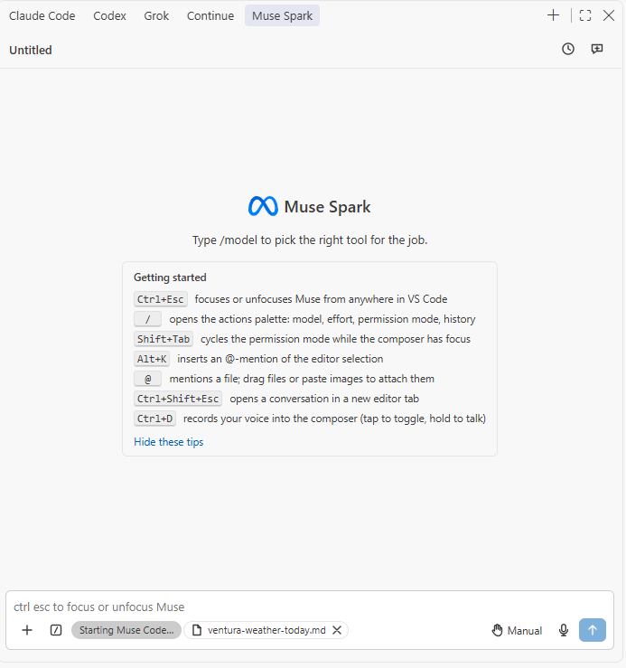

**Click the Muse Spark icon in the activity bar.**

A conversation can also open in an editor tab: `Ctrl+Shift+Alt+Escape` on Windows, `Cmd+Shift+Escape` on macOS, `Ctrl+Shift+Escape` on Linux. Each tab is its own conversation and comes back after a window reload. `Ctrl+Alt+Escape` on Windows, `Cmd+Escape` on macOS and `Ctrl+Escape` on Linux move the keyboard focus between the editor and the composer.

Windows keeps `Ctrl+Esc` for the Start menu and `Ctrl+Shift+Esc` for Task Manager, which is why its shortcuts add `Alt`.
