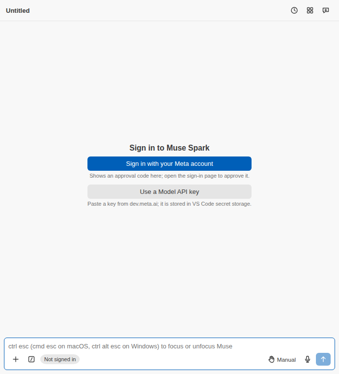

**No Muse subscription or Meta key? Bring your own model.**

**Start with your own model** opens the wizard at **Pick a provider**: choose OpenRouter, Anthropic, OpenAI, a local server or a custom one, enter the key in VS Code's password box, test it, pick models and save. The chosen model becomes the composer's model at once.

[Start with your own model](command:museSpark.startWithOwnModel)
