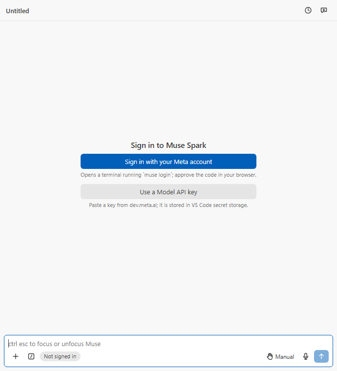

**Two ways in, never mixed.**

- **Sign in with your Meta account** opens a terminal running `muse login` from the Muse Code CLI and waits for the browser sign-in to finish. Work is billed to your Muse subscription.
- **Use a Model API key** takes a key from dev.meta.ai, keeps it in VS Code's secret storage and runs the extension's own tools, pay as you go. The key is never handed to the CLI.

**Muse Spark: Sign Out** in the Command Palette signs out of both.
