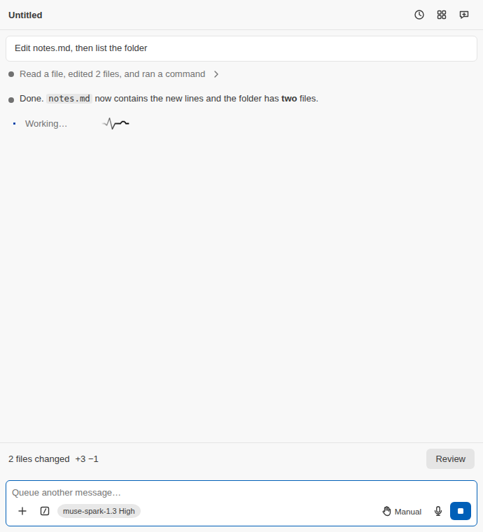

**Muse Spark reads your code, edits it and runs commands, under the permission mode you choose.**

The panel is a conversation with Meta's Muse Spark model. It reads files, makes edits you can review as diffs, runs shell commands under the permission mode you choose, and follows the workspace's `AGENTS.md` rules, skills and memory once the workspace is trusted.

Prefer the terminal? Run **Muse Spark: Open in Terminal** from the Command Palette for the Muse Code CLI's own interface.

[Enjoying Muse Spark Code? A star on GitHub helps other people find it.](https://github.com/RandyNorthrup/muse-spark-code)
